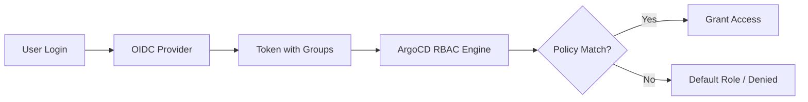

# How to Fix ArgoCD RBAC Permission Denied for SSO Users

Author: [nawazdhandala](https://github.com/nawazdhandala)

Tags: ArgoCD, GitOps, Kubernetes, RBAC, SSO

Description: Troubleshoot and fix ArgoCD RBAC permission denied errors for SSO users, including group mapping, policy configuration, and debugging techniques.

---

You configured SSO for ArgoCD, users can log in, but then they see "permission denied" everywhere. This is one of the most common issues teams face after setting up single sign-on with ArgoCD. The root cause is almost always a mismatch between how your identity provider sends group claims and how ArgoCD RBAC policies reference them.

Let me walk through the systematic debugging process and common fixes.

## Understanding the RBAC Flow

When an SSO user logs into ArgoCD, here is what happens:

1. The user authenticates through the OIDC/SAML provider
2. ArgoCD receives a token containing the user's identity and group memberships
3. ArgoCD matches the user's groups against the RBAC policies in the `argocd-rbac-cm` ConfigMap
4. If no policy matches, the user gets the default role (which is usually no access at all)



The permission denied error means step 4 failed - either the groups are not making it through, or the policies do not match.

## Step 1: Check What Groups ArgoCD Sees

The first thing to do is verify what group claims ArgoCD is actually receiving from your identity provider.

```bash
# Get the user info from ArgoCD
argocd account get-user-info --grpc-web

# Or check via the API
curl -s -H "Authorization: Bearer $ARGOCD_TOKEN" \
  https://argocd.example.com/api/v1/session/userinfo | jq
```

If the groups array is empty, the problem is in the OIDC configuration, not the RBAC policies.

## Step 2: Verify OIDC Group Claims

The most common reason groups are missing is that ArgoCD is not configured to request the right scopes or the groups claim name does not match.

Check your OIDC configuration in the `argocd-cm` ConfigMap.

```yaml
apiVersion: v1
kind: ConfigMap
metadata:
  name: argocd-cm
  namespace: argocd
data:
  url: https://argocd.example.com
  oidc.config: |
    name: Okta
    issuer: https://your-org.okta.com/oauth2/default
    clientID: 0oa1234567890abcdef
    clientSecret: $oidc.okta.clientSecret
    # Make sure you request the groups scope
    requestedScopes:
      - openid
      - profile
      - email
      - groups
    # This must match the claim name your IdP uses
    requestedIDTokenClaims:
      groups:
        essential: true
```

Different identity providers use different claim names for groups:

- **Okta**: `groups`
- **Azure AD**: `groups` (but returns Object IDs by default, not names)
- **Google Workspace**: `groups` (requires admin SDK API enabled)
- **Keycloak**: `groups` or `realm_access.roles`
- **Auth0**: custom claim like `https://your-app.com/groups`

## Step 3: Handle Azure AD Group Object IDs

Azure AD is particularly tricky because it returns group Object IDs instead of display names by default. Your RBAC policies reference group names, but ArgoCD receives UUIDs.

You have two options. First, use the Object IDs directly in your RBAC policies.

```csv
# argocd-rbac-cm - using Azure AD group Object IDs
p, role:dev-team, applications, get, */*, allow
p, role:dev-team, applications, sync, */*, allow
g, "xxxxxxxx-xxxx-xxxx-xxxx-xxxxxxxxxxxx", role:dev-team
```

Second, configure Azure AD to send group names instead of IDs by adding an optional claim for the groups in your App Registration token configuration.

## Step 4: Configure RBAC Policies

Once you have confirmed that groups are being received correctly, set up the RBAC policies in the `argocd-rbac-cm` ConfigMap.

```yaml
apiVersion: v1
kind: ConfigMap
metadata:
  name: argocd-rbac-cm
  namespace: argocd
data:
  # Default policy for authenticated users with no matching group
  policy.default: role:readonly

  # Scopes to check for group membership
  scopes: '[groups, email]'

  policy.csv: |
    # Define roles with specific permissions
    # Format: p, <role>, <resource>, <action>, <project>/<object>, <allow/deny>

    # Admin role - full access
    p, role:org-admin, applications, *, */*, allow
    p, role:org-admin, clusters, *, *, allow
    p, role:org-admin, repositories, *, *, allow
    p, role:org-admin, certificates, *, *, allow
    p, role:org-admin, accounts, *, *, allow
    p, role:org-admin, gpgkeys, *, *, allow
    p, role:org-admin, logs, get, */*, allow
    p, role:org-admin, exec, create, */*, allow

    # Developer role - can view and sync apps in dev project
    p, role:developer, applications, get, dev/*, allow
    p, role:developer, applications, sync, dev/*, allow
    p, role:developer, applications, action/*, dev/*, allow
    p, role:developer, logs, get, dev/*, allow

    # Viewer role - read-only access
    p, role:viewer, applications, get, */*, allow
    p, role:viewer, logs, get, */*, allow

    # Map groups to roles
    # Format: g, <group-name>, <role>
    g, platform-team, role:org-admin
    g, developers, role:developer
    g, stakeholders, role:viewer
```

## Step 5: Check the Scopes Configuration

A frequently overlooked setting is the `scopes` field in `argocd-rbac-cm`. This tells ArgoCD which token claims to use for RBAC evaluation.

```yaml
data:
  # Check multiple claim fields for group membership
  scopes: '[groups, email]'
```

If your identity provider sends groups under a non-standard claim name, you need to include that claim in the scopes list. For example, if Auth0 sends groups as `https://myapp.com/groups`, you need to configure the OIDC settings to map that to a standard claim.

## Step 6: Debug with ArgoCD Logs

When policies seem correct but access is still denied, check the ArgoCD server logs for RBAC evaluation details.

```bash
# Enable debug logging on the ArgoCD server
kubectl -n argocd patch configmap argocd-cmd-params-cm \
  -p '{"data": {"server.log.level": "debug"}}'

# Restart the server
kubectl -n argocd rollout restart deployment argocd-server

# Watch the logs for RBAC decisions
kubectl -n argocd logs -f deployment/argocd-server | grep -i "rbac\|denied\|enforce"
```

The debug logs show exactly what groups the user has and which policy rules are being evaluated. This is the fastest way to find mismatches.

## Step 7: Test Policies with the CLI

ArgoCD provides a built-in way to test RBAC policies before applying them.

```bash
# Test if a specific subject has access
argocd admin settings rbac validate \
  --policy-file policy.csv

# Check if a group has a specific permission
argocd admin settings rbac can role:developer get applications 'dev/*' \
  --policy-file policy.csv
```

## Common Gotchas and Fixes

**Case sensitivity**: Group names in RBAC policies are case-sensitive. If your IdP sends "Developers" but your policy says "developers", it will not match.

**Nested groups**: Most identity providers only send direct group memberships. If your user is in a nested group, that group may not appear in the token claims.

**Token size limits**: Azure AD has a limit of 200 groups per token. If the user is a member of more than 200 groups, Azure returns a link to the Graph API instead of the groups list. Consider using app roles or filtering groups in Azure AD.

**Project-level RBAC**: Remember that ArgoCD has both global RBAC (in `argocd-rbac-cm`) and project-level RBAC. If a user is allowed in global RBAC but the Application belongs to a Project with restrictive source repo or destination settings, they can still get denied.

```yaml
# Check project-level restrictions
apiVersion: argoproj.io/v1alpha1
kind: AppProject
metadata:
  name: dev
  namespace: argocd
spec:
  roles:
    - name: developer
      policies:
        - p, proj:dev:developer, applications, sync, dev/*, allow
      groups:
        - developers
  sourceRepos:
    - 'https://github.com/my-org/*'
  destinations:
    - namespace: 'dev-*'
      server: https://kubernetes.default.svc
```

**SSO session caching**: After changing RBAC policies, users may need to log out and log back in for the changes to take effect. ArgoCD caches the token information, and old tokens may not have the updated group memberships.

Getting RBAC right with SSO takes some trial and error, but the systematic approach of verifying groups first, then checking policies, and finally examining logs will get you to the root cause every time. Once configured correctly, the combination of SSO and RBAC gives you fine-grained access control that scales with your organization.
