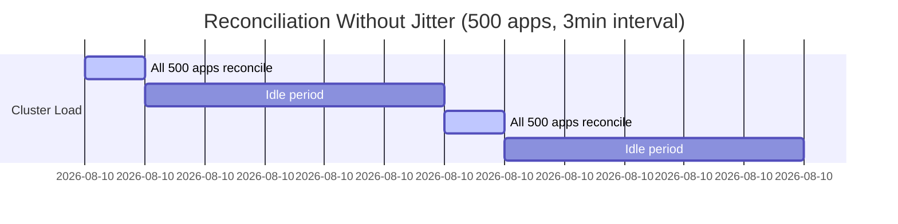
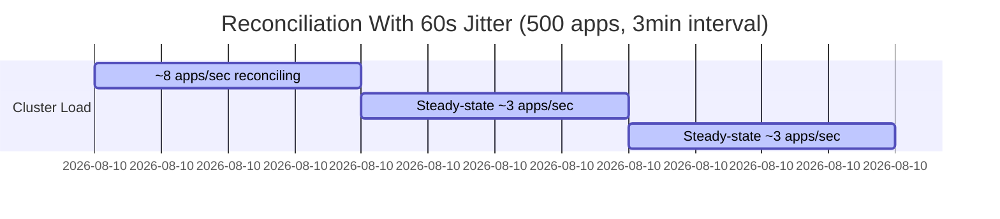
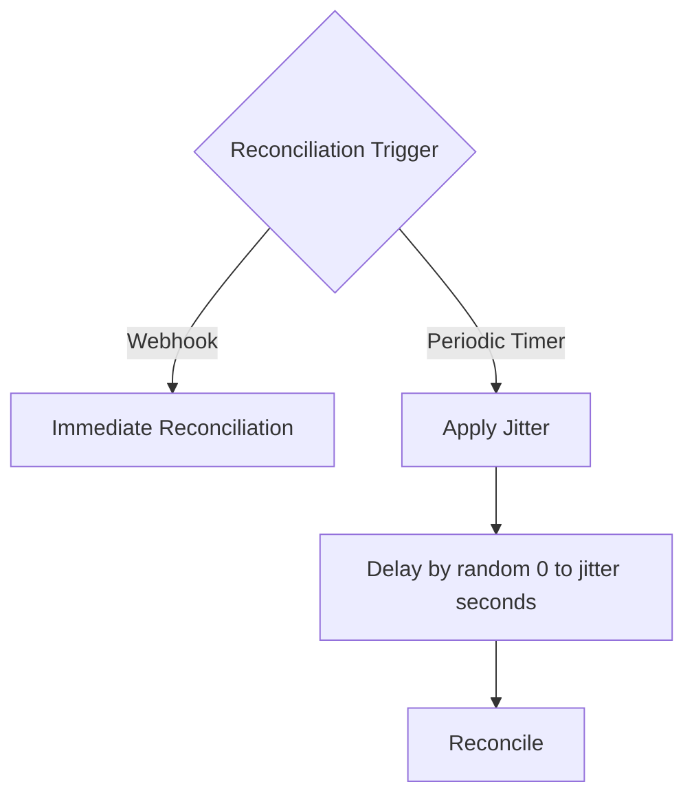

# How to Configure Reconciliation Jitter in ArgoCD

Author: [nawazdhandala](https://github.com/nawazdhandala)

Tags: ArgoCD, GitOps, Kubernetes, Performance, Configuration

Description: Learn how to configure reconciliation jitter in ArgoCD to spread reconciliation load over time and prevent thundering herd problems in large deployments.

---

When ArgoCD manages hundreds or thousands of applications, all applications tend to reconcile at roughly the same time. This creates a "thundering herd" effect where the application controller, repo server, and target cluster APIs all experience sudden load spikes every reconciliation interval. Reconciliation jitter solves this by adding a random delay to each application's reconciliation schedule, spreading the load evenly over time. This guide explains how jitter works, how to configure it, and how to choose the right settings.

## The Thundering Herd Problem

Without jitter, ArgoCD's reconciliation pattern looks like this:



This pattern causes problems:

- **Git provider rate limiting** - 500 simultaneous Git fetches can trigger rate limits
- **Kubernetes API server overload** - 500 concurrent list/get calls strain the API server
- **Repo server OOM** - Generating manifests for 500 apps simultaneously exceeds memory
- **Inconsistent latency** - Users experience slow ArgoCD during reconciliation bursts

With jitter, the load is distributed:



## Configuring Reconciliation Jitter

Jitter is configured in the `argocd-cmd-params-cm` ConfigMap:

```yaml
apiVersion: v1
kind: ConfigMap
metadata:
  name: argocd-cmd-params-cm
  namespace: argocd
data:
  # Add random jitter of 0 to 60 seconds to each reconciliation
  controller.reconciliation.jitter: "60"
```

This means each application's reconciliation will be delayed by a random amount between 0 and 60 seconds. An application with a 180-second reconciliation interval will actually reconcile somewhere between 180 and 240 seconds after its last reconciliation.

Apply the change and restart the controller:

```bash
kubectl apply -f argocd-cmd-params-cm.yaml
kubectl rollout restart statefulset argocd-application-controller -n argocd
```

## Choosing the Right Jitter Value

The ideal jitter value depends on your application count and reconciliation interval.

### Formula for Optimal Jitter

A good rule of thumb is:

```text
Optimal Jitter = Reconciliation Interval * (Number of Apps / Target Concurrent Reconciliations) / Number of Apps
```

Or simplified - set jitter to roughly 30-50% of your reconciliation interval:

| Applications | Reconciliation Interval | Recommended Jitter |
|-------------|------------------------|-------------------|
| < 50        | 180s                   | 0s (not needed)   |
| 50 - 200    | 180s                   | 30s               |
| 200 - 500   | 180s to 300s           | 60s               |
| 500 - 1000  | 300s to 600s           | 120s              |
| 1000+       | 600s                   | 180s              |

### Example: 500 Applications

```yaml
apiVersion: v1
kind: ConfigMap
metadata:
  name: argocd-cmd-params-cm
  namespace: argocd
data:
  controller.reconciliation.jitter: "120"
```

```yaml
apiVersion: v1
kind: ConfigMap
metadata:
  name: argocd-cm
  namespace: argocd
data:
  timeout.reconciliation: "300"
```

With these settings, 500 applications will reconcile within a 300 to 420-second window, spreading the load over approximately 7 minutes instead of all hitting simultaneously.

## How Jitter Interacts with Webhooks

When a Git webhook triggers a reconciliation, the jitter does NOT apply. Webhook-triggered reconciliations happen immediately. Jitter only affects the periodic polling reconciliation.

This means:

1. Webhook-triggered reconciliation: Immediate (no jitter)
2. Periodic reconciliation: Interval + random(0, jitter)



This is the ideal behavior because:

- Real changes from pushes are detected immediately
- Periodic checks for drift are spread out to avoid load spikes

## Jitter and Application Priority

Jitter applies equally to all applications. If you have critical applications that need faster reconciliation, use per-application overrides rather than reducing the global jitter:

```yaml
# Critical application with short reconciliation interval
apiVersion: argoproj.io/v1alpha1
kind: Application
metadata:
  name: payment-service
  annotations:
    # Override the global interval for this app
    argocd.argoproj.io/refresh: "60"
spec:
  # ...
```

The per-application refresh interval is also subject to jitter, but since the interval is shorter, the absolute jitter impact is smaller.

## Monitoring Jitter Effectiveness

After configuring jitter, verify that the load is actually spread out:

```bash
# Check reconciliation metrics over time
kubectl port-forward svc/argocd-application-controller-metrics -n argocd 8082:8082

# Look at the rate of reconciliations over time
curl -s http://localhost:8082/metrics | grep argocd_app_reconcile
```

Create a Grafana panel showing reconciliation rate:

```text
# PromQL: Rate of reconciliations per second
rate(argocd_app_reconcile_count[1m])
```

Without jitter, this graph shows sharp spikes every reconciliation interval. With proper jitter, the graph should be relatively flat.

You can also monitor the Git fetch rate:

```text
# PromQL: Rate of Git requests per second
rate(argocd_git_request_total[1m])
```

## Jitter in High Availability Setups

In HA configurations with multiple application controller replicas, jitter is applied per-shard. Each controller replica manages a subset of applications and applies jitter independently.

```yaml
# HA setup with sharding and jitter
apiVersion: apps/v1
kind: StatefulSet
metadata:
  name: argocd-application-controller
  namespace: argocd
spec:
  replicas: 3  # Three controller shards
```

With 3 shards and 600 applications, each shard manages approximately 200 applications. The jitter is applied within each shard, so the overall distribution is even more uniform.

## Common Mistakes with Jitter

### Setting Jitter Larger Than the Reconciliation Interval

```yaml
# BAD: Jitter larger than interval
timeout.reconciliation: "180"
controller.reconciliation.jitter: "300"
```

This causes some applications to reconcile between 180 and 480 seconds, which is highly variable and unpredictable. Keep jitter to at most 50% of the interval.

### Setting Jitter to 0 in Large Deployments

```yaml
# BAD for 500+ applications
controller.reconciliation.jitter: "0"
```

This guarantees thundering herd behavior. Always enable jitter for deployments with more than 50 applications.

### Forgetting to Apply After ConfigMap Change

```bash
# The controller does not automatically pick up cmd-params-cm changes
# You must restart the controller
kubectl rollout restart statefulset argocd-application-controller -n argocd
```

## Combining Jitter with Other Optimizations

Jitter works best when combined with other performance optimizations:

```yaml
# argocd-cm ConfigMap
apiVersion: v1
kind: ConfigMap
metadata:
  name: argocd-cm
  namespace: argocd
data:
  # Increase polling interval (webhooks handle immediate detection)
  timeout.reconciliation: "600"

---
# argocd-cmd-params-cm ConfigMap
apiVersion: v1
kind: ConfigMap
metadata:
  name: argocd-cmd-params-cm
  namespace: argocd
data:
  # Add 120s of jitter to spread the load
  controller.reconciliation.jitter: "120"

  # Limit concurrent manifest generation
  reposerver.parallelism.limit: "5"

  # Enable shallow Git clones
  reposerver.git.shallow.clone: "true"
```

For monitoring your ArgoCD reconciliation performance and verifying that jitter is effectively distributing load, [OneUptime](https://oneuptime.com) provides dashboards and alerts that track reconciliation patterns over time.

## Key Takeaways

- Jitter spreads reconciliation load over time to prevent thundering herd spikes
- Set jitter to 30-50% of your reconciliation interval
- Jitter does NOT affect webhook-triggered reconciliations (they remain immediate)
- Always enable jitter for deployments with more than 50 applications
- Monitor reconciliation rate graphs to verify jitter is effective
- Restart the application controller after changing jitter settings
- Combine jitter with webhooks, longer polling intervals, and repo server scaling for best results
