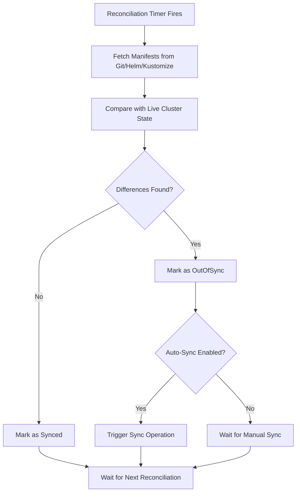

# How to Configure Reconciliation Timeout in ArgoCD

Author: [nawazdhandala](https://github.com/nawazdhandala)

Tags: ArgoCD, GitOps, Kubernetes, Performance, Configuration

Description: Learn how to configure and tune the reconciliation timeout in ArgoCD to balance responsiveness with cluster performance for your GitOps deployments.

---

ArgoCD's reconciliation loop is the heartbeat of your GitOps workflow. It periodically compares the desired state in Git with the live state in your cluster and triggers syncs when differences are found. The default reconciliation timeout is 3 minutes, meaning ArgoCD checks every application against its Git source at least once every 180 seconds. For many environments, this default needs tuning. This guide walks you through configuring the reconciliation timeout, understanding its impact, and choosing the right value for your setup.

## Understanding the Reconciliation Loop

The ArgoCD application controller runs a continuous reconciliation loop. For each application, it performs these steps:



The reconciliation timeout controls how often this loop runs for each application. It is not a sync timeout - it is the interval between checks.

## Configuring the Reconciliation Timeout

The primary setting is `timeout.reconciliation` in the `argocd-cm` ConfigMap:

```yaml
apiVersion: v1
kind: ConfigMap
metadata:
  name: argocd-cm
  namespace: argocd
data:
  # Default is 180 (3 minutes). Value is in seconds.
  timeout.reconciliation: "300"  # 5 minutes
```

Apply the change and restart the application controller:

```bash
# Apply the updated ConfigMap
kubectl apply -f argocd-cm.yaml

# The controller picks up config changes automatically,
# but you can restart for immediate effect
kubectl rollout restart deployment argocd-application-controller -n argocd
```

## Choosing the Right Timeout Value

The optimal timeout depends on your environment:

**Small clusters (under 50 applications)**

```yaml
# Faster reconciliation is fine with few applications
timeout.reconciliation: "120"  # 2 minutes
```

With fewer applications, the controller can handle frequent reconciliation without performance issues.

**Medium clusters (50 to 200 applications)**

```yaml
# Default is usually appropriate
timeout.reconciliation: "180"  # 3 minutes (default)
```

**Large clusters (200 to 1000 applications)**

```yaml
# Increase to reduce controller load
timeout.reconciliation: "300"  # 5 minutes
```

**Very large clusters (1000+ applications)**

```yaml
# Significantly increase and rely on webhooks for fast detection
timeout.reconciliation: "600"  # 10 minutes
```

At this scale, you should combine longer reconciliation intervals with Git webhooks for immediate detection of changes. See our guide on [using Git webhooks to speed up reconciliation](https://oneuptime.com/blog/post/2026-02-26-argocd-git-webhooks-speed-reconciliation/view).

## Per-Application Reconciliation Timeout

You can override the global timeout for individual applications using the `argocd.argoproj.io/refresh` annotation:

```yaml
apiVersion: argoproj.io/v1alpha1
kind: Application
metadata:
  name: critical-app
  namespace: argocd
  annotations:
    # This application reconciles every 60 seconds
    argocd.argoproj.io/refresh: "60"
spec:
  project: default
  source:
    repoURL: https://github.com/org/critical-app
    targetRevision: main
    path: manifests/
  destination:
    server: https://kubernetes.default.svc
    namespace: production
```

This is useful when you have a mix of critical and non-critical applications:

```yaml
# Critical payment service - check every minute
apiVersion: argoproj.io/v1alpha1
kind: Application
metadata:
  name: payment-service
  annotations:
    argocd.argoproj.io/refresh: "60"
---
# Internal documentation site - check every 10 minutes
apiVersion: argoproj.io/v1alpha1
kind: Application
metadata:
  name: docs-site
  annotations:
    argocd.argoproj.io/refresh: "600"
```

## Disabling Reconciliation Entirely

In some cases, you may want to disable automatic reconciliation for specific applications and rely entirely on manual syncs or webhook-triggered syncs.

```yaml
# Set timeout to 0 to disable periodic reconciliation
apiVersion: v1
kind: ConfigMap
metadata:
  name: argocd-cm
  namespace: argocd
data:
  timeout.reconciliation: "0"
```

Setting the timeout to `0` disables the periodic reconciliation entirely. Applications will only reconcile when:

- A Git webhook triggers a refresh
- You manually refresh or sync from the CLI or UI
- A hard refresh is requested via the API

This is an aggressive optimization that should only be used when you have reliable webhook delivery.

## Reconciliation Timeout vs Sync Timeout

These are two different settings that are often confused:

| Setting | Controls | Default |
|---------|----------|---------|
| `timeout.reconciliation` | How often ArgoCD checks for differences | 180s |
| `timeout.sync` | How long a sync operation can run | No limit |

The sync timeout is configured differently:

```yaml
# argocd-cm ConfigMap
apiVersion: v1
kind: ConfigMap
metadata:
  name: argocd-cm
  namespace: argocd
data:
  timeout.reconciliation: "300"  # How often to check
```

The sync operation timeout is set per-sync using retry options:

```yaml
apiVersion: argoproj.io/v1alpha1
kind: Application
spec:
  syncPolicy:
    retry:
      limit: 5
      backoff:
        duration: 5s
        factor: 2
        maxDuration: 3m
```

## Monitoring Reconciliation Performance

Track how long reconciliation takes and whether your timeout is appropriate:

```bash
# Check ArgoCD controller metrics for reconciliation duration
kubectl port-forward svc/argocd-application-controller-metrics -n argocd 8082:8082

# Then query the Prometheus endpoint
curl -s http://localhost:8082/metrics | grep argocd_app_reconcile
```

Key metrics to watch:

```
# Time spent on reconciliation per application
argocd_app_reconcile_duration_seconds_bucket
argocd_app_reconcile_duration_seconds_sum
argocd_app_reconcile_duration_seconds_count

# Number of reconciliation operations
argocd_app_reconcile_count
```

Set up Prometheus alerts for slow reconciliation:

```yaml
groups:
  - name: argocd-reconciliation
    rules:
      - alert: ArgocdSlowReconciliation
        expr: |
          histogram_quantile(0.99,
            rate(argocd_app_reconcile_duration_seconds_bucket[5m])
          ) > 120
        for: 10m
        labels:
          severity: warning
        annotations:
          summary: "ArgoCD reconciliation taking too long"
          description: "The 99th percentile reconciliation duration exceeds 2 minutes"
```

## Reconciliation and Resource Consumption

Shorter reconciliation intervals increase resource consumption on three components:

**Application Controller** - Runs the reconciliation loop. More frequent reconciliation means more CPU and memory usage.

**Repo Server** - Generates manifests for each reconciliation. More frequent checks mean more Git clones, Helm template renders, and Kustomize builds.

**Target Clusters** - Each reconciliation queries the cluster API for live state. More frequent checks mean more API calls.

```yaml
# If you shorten the interval, consider increasing controller resources
apiVersion: apps/v1
kind: Deployment
metadata:
  name: argocd-application-controller
  namespace: argocd
spec:
  template:
    spec:
      containers:
        - name: argocd-application-controller
          resources:
            requests:
              cpu: "1"
              memory: "1Gi"
            limits:
              cpu: "2"
              memory: "2Gi"
```

## Forcing Immediate Reconciliation

Regardless of the timeout setting, you can always force an immediate reconciliation:

```bash
# Soft refresh - uses cached manifests if available
argocd app get my-app --refresh

# Hard refresh - forces re-cloning Git and regenerating manifests
argocd app get my-app --hard-refresh

# Trigger reconciliation via the API
curl -X POST "https://argocd.example.com/api/v1/applications/my-app?refresh=hard" \
  -H "Authorization: Bearer $ARGOCD_TOKEN"
```

## Best Practices for Reconciliation Timeout

1. **Start with the default (180s)** and only adjust if you have a specific reason
2. **Use webhooks for fast detection** instead of lowering the timeout aggressively
3. **Monitor reconciliation duration** to ensure your timeout is longer than actual reconciliation time
4. **Use per-application overrides** for critical applications instead of lowering the global timeout
5. **Increase the timeout for large clusters** to reduce controller and API server load
6. **Never set to 0** unless you have reliable webhook infrastructure

For monitoring your ArgoCD reconciliation performance and alerting on drift, [OneUptime](https://oneuptime.com) provides end-to-end observability for your GitOps pipeline.

## Key Takeaways

- The reconciliation timeout controls how often ArgoCD checks for Git drift, not how long syncs can run
- Default is 180 seconds, which works for most small to medium deployments
- Increase the timeout for large clusters (300s to 600s) and use webhooks for fast detection
- Use per-application annotations to give critical applications shorter reconciliation intervals
- Monitor reconciliation duration metrics to ensure your timeout is appropriate
- Shorter intervals increase load on the controller, repo server, and target cluster APIs
