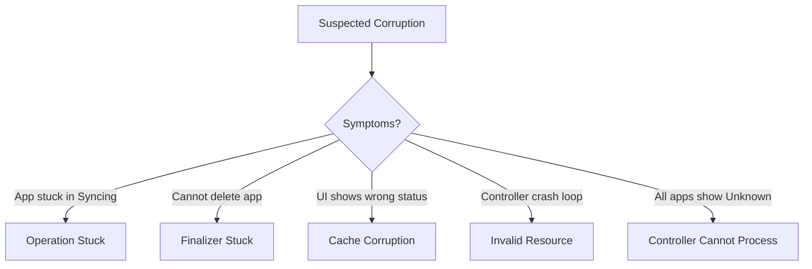

# How to Recover from Corrupted ArgoCD State

Author: [nawazdhandala](https://github.com/nawazdhandala)

Tags: ArgoCD, GitOps, Kubernetes, Recovery, Troubleshooting

Description: Learn how to recover ArgoCD from corrupted state including stuck applications, invalid resource data, broken finalizers, and inconsistent cache that prevent normal operation.

---

ArgoCD state corruption happens more often than you might think. Applications get stuck in impossible states, finalizers prevent deletion, the controller cannot process applications, or the cache becomes inconsistent with reality. Unlike a clean data loss scenario, corruption means the data exists but is wrong. This guide shows you how to identify and fix every type of state corruption.

## Identifying Corrupted State



## Corruption Type 1: Stuck Sync Operation

An application shows "Syncing" indefinitely and cannot be cancelled through the UI.

```bash
# Check the operation state
kubectl get application my-app -n argocd -o json | \
  jq '.status.operationState'

# Check if there is an active operation
kubectl get application my-app -n argocd -o json | \
  jq '.operation'
```

Fix: Remove the stuck operation:

```bash
# Terminate the operation by patching it out
kubectl patch application my-app -n argocd --type json \
  -p '[{"op": "remove", "path": "/operation"}]'

# If the operation is in status, reset it
kubectl patch application my-app -n argocd --type merge -p '{
  "status": {
    "operationState": null
  }
}'
```

If the patch fails due to validation:

```bash
# Force patch using strategic merge
kubectl patch application my-app -n argocd --type merge \
  --subresource status -p '{
    "status": {
      "operationState": {
        "phase": "Failed",
        "message": "Manually terminated due to corruption"
      }
    }
  }'
```

## Corruption Type 2: Stuck Finalizers

Applications cannot be deleted because finalizers prevent Kubernetes from removing them:

```bash
# Check finalizers
kubectl get application my-app -n argocd -o jsonpath='{.metadata.finalizers}'

# Output: ["resources-finalizer.argocd.argoproj.io"]
```

The ArgoCD resources finalizer ensures managed resources are cleaned up before the Application is deleted. If the controller cannot process the deletion (cluster unreachable, RBAC issues), the finalizer gets stuck.

```bash
# Option 1: Remove the finalizer (resources will be orphaned)
kubectl patch application my-app -n argocd --type json \
  -p '[{"op": "remove", "path": "/metadata/finalizers"}]'

# Option 2: Remove specific finalizer by index
kubectl patch application my-app -n argocd --type json \
  -p '[{"op": "remove", "path": "/metadata/finalizers/0"}]'

# The application will be deleted immediately after removing finalizers
```

For bulk finalizer removal (when many apps are stuck):

```bash
# Remove finalizers from all applications that are being deleted
kubectl get applications -n argocd -o json | \
  jq -r '.items[] | select(.metadata.deletionTimestamp != null) | .metadata.name' | \
  while read app; do
    echo "Removing finalizers from: $app"
    kubectl patch application "$app" -n argocd --type json \
      -p '[{"op": "remove", "path": "/metadata/finalizers"}]'
  done
```

## Corruption Type 3: Invalid Application Spec

The Application resource has invalid fields that cause the controller to error or skip it:

```bash
# Check for applications with conditions
kubectl get applications -n argocd -o json | \
  jq '.items[] | select(.status.conditions != null) | {
    name: .metadata.name,
    conditions: [.status.conditions[] | {type, message}]
  }'
```

Fix invalid specs by re-applying a corrected version:

```bash
# Export the current application
kubectl get application my-app -n argocd -o yaml > my-app-backup.yaml

# Edit the YAML to fix the invalid fields
# Common issues:
# - spec.source and spec.sources both set (mutually exclusive)
# - Invalid targetRevision
# - Non-existent project reference
# - Duplicate sync options

# Re-apply the corrected spec
kubectl apply -f my-app-fixed.yaml
```

## Corruption Type 4: Cache Inconsistency

The ArgoCD cache (Redis) shows different state than what actually exists in the cluster. Symptoms include the UI showing outdated status, or the diff showing changes that do not exist.

```bash
# Force a hard refresh for a specific application
argocd app get my-app --hard-refresh

# For all applications
for app in $(argocd app list -o name); do
  echo "Hard refreshing: $app"
  argocd app get "$app" --hard-refresh >/dev/null 2>&1
done
```

Nuclear option - flush the entire Redis cache:

```bash
# Flush Redis cache (causes temporary performance hit)
kubectl exec -n argocd deploy/argocd-redis -- redis-cli flushall

# Restart all components to rebuild cache
kubectl rollout restart deployment -n argocd \
  argocd-server argocd-application-controller argocd-repo-server
```

## Corruption Type 5: Controller Cannot Process Any Applications

If the controller is in a crash loop or all applications show "Unknown" health:

```bash
# Check controller logs for the root cause
kubectl logs -n argocd deploy/argocd-application-controller --tail=200 | \
  grep -E 'level=(error|fatal|panic)'

# Check if a specific application is causing the controller to crash
# Look for the application name in error logs
kubectl logs -n argocd deploy/argocd-application-controller --tail=500 | \
  grep "error" | grep -oP 'application.*?[,}\s]' | sort | uniq -c | sort -rn | head -10
```

If one poisoned application is crashing the controller:

```bash
# Temporarily exclude the problematic application
# Delete it and recreate it after fixing
kubectl delete application problematic-app -n argocd --cascade=orphan

# Restart the controller
kubectl rollout restart deployment argocd-application-controller -n argocd

# Wait for controller to stabilize
kubectl rollout status deployment argocd-application-controller -n argocd

# Recreate the application with fixed spec
kubectl apply -f fixed-application.yaml
```

## Corruption Type 6: Inconsistent Resource Tracking

ArgoCD tracks resources using labels or annotations. If these are manually modified or another tool changes them, ArgoCD gets confused:

```bash
# Check resource tracking labels on managed resources
kubectl get deployment my-deployment -n my-namespace -o jsonpath='{.metadata.labels}' | python3 -m json.tool

# Look for the ArgoCD tracking label
# app.kubernetes.io/instance: my-argocd-app
```

Fix tracking issues:

```bash
# Force ArgoCD to re-apply its tracking labels
argocd app sync my-app --force

# Or if that does not work, delete and re-sync
argocd app sync my-app --prune --force
```

## Corruption Type 7: Broken AppProject References

Applications reference a project that no longer exists:

```bash
# Find applications referencing non-existent projects
PROJECTS=$(kubectl get appprojects -n argocd -o jsonpath='{.items[*].metadata.name}')
kubectl get applications -n argocd -o json | \
  jq -r --arg projects "$PROJECTS" '.items[] | select(.spec.project as $p | ($projects | split(" ") | index($p)) == null) | "\(.metadata.name) references missing project: \(.spec.project)"'
```

Fix by recreating the project or updating the application:

```bash
# Option 1: Recreate the missing project
kubectl apply -f - <<EOF
apiVersion: argoproj.io/v1alpha1
kind: AppProject
metadata:
  name: missing-project
  namespace: argocd
spec:
  sourceRepos:
    - '*'
  destinations:
    - server: '*'
      namespace: '*'
  clusterResourceWhitelist:
    - group: '*'
      kind: '*'
EOF

# Option 2: Move application to default project
kubectl patch application my-app -n argocd --type merge -p '{
  "spec": {
    "project": "default"
  }
}'
```

## Full Recovery Procedure

When you suspect widespread corruption, follow this systematic recovery:

```bash
#!/bin/bash
# argocd-corruption-recovery.sh

NS="argocd"
echo "=== ArgoCD Corruption Recovery ==="

# Step 1: Assess the damage
echo -e "\n--- Step 1: Assessment ---"
echo "Total applications: $(kubectl get applications -n $NS --no-headers 2>/dev/null | wc -l)"
echo "Applications with conditions: $(kubectl get applications -n $NS -o json | jq '[.items[] | select(.status.conditions != null)] | length')"
echo "Applications being deleted: $(kubectl get applications -n $NS -o json | jq '[.items[] | select(.metadata.deletionTimestamp != null)] | length')"

# Step 2: Flush cache
echo -e "\n--- Step 2: Flushing cache ---"
kubectl exec -n $NS deploy/argocd-redis -- redis-cli flushall 2>/dev/null

# Step 3: Restart all components
echo -e "\n--- Step 3: Restarting components ---"
kubectl rollout restart deployment -n $NS \
  argocd-server argocd-application-controller argocd-repo-server argocd-dex-server

# Step 4: Wait for components to be ready
echo -e "\n--- Step 4: Waiting for components ---"
kubectl rollout status deployment argocd-server -n $NS --timeout=120s
kubectl rollout status deployment argocd-application-controller -n $NS --timeout=120s
kubectl rollout status deployment argocd-repo-server -n $NS --timeout=120s

# Step 5: Hard refresh all applications
echo -e "\n--- Step 5: Hard refreshing applications ---"
for app in $(kubectl get applications -n $NS -o jsonpath='{.items[*].metadata.name}'); do
  argocd app get "$app" --hard-refresh >/dev/null 2>&1
  echo "  Refreshed: $app"
done

# Step 6: Report
echo -e "\n--- Recovery Report ---"
echo "Applications synced: $(kubectl get applications -n $NS -o json | jq '[.items[] | select(.status.sync.status == "Synced")] | length')"
echo "Applications out of sync: $(kubectl get applications -n $NS -o json | jq '[.items[] | select(.status.sync.status == "OutOfSync")] | length')"
echo "Applications with errors: $(kubectl get applications -n $NS -o json | jq '[.items[] | select(.status.conditions != null)] | length')"

echo -e "\n=== Recovery complete ==="
```

## Summary

ArgoCD state corruption ranges from mild (cache inconsistency fixed by hard refresh) to severe (controller crash loops caused by poisoned applications). The recovery approach depends on the type of corruption: remove stuck operations and finalizers with kubectl patches, flush Redis for cache issues, and delete and recreate applications for invalid specs. Always maintain regular backups with `argocd admin export` so you have a clean state to restore from. For detecting state corruption early, monitor application conditions and controller error rates with [OneUptime](https://oneuptime.com).
