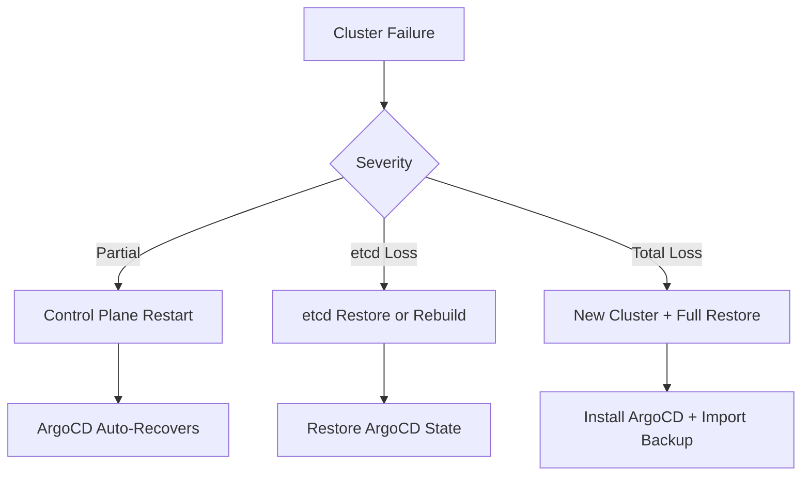

# How to Handle ArgoCD Recovery After Cluster Failure

Author: [nawazdhandala](https://github.com/nawazdhandala)

Tags: ArgoCD, GitOps, Kubernetes, Disaster Recovery, Cluster

Description: Learn how to recover ArgoCD after a Kubernetes cluster failure including reinstallation, state restoration, and managed application reconciliation.

---

A Kubernetes cluster failure is one of the most severe disaster scenarios for ArgoCD. Whether it is a control plane outage, etcd corruption, or a complete cluster loss, you need a clear recovery plan. The good news is that GitOps makes this recovery easier than traditional deployments - your source of truth is in Git, not in the cluster. You just need to get ArgoCD back up and pointed at the right repositories.

## Recovery Scenarios

The recovery approach depends on the severity of the failure:



### Scenario 1: Temporary Control Plane Outage

If the control plane goes down temporarily and comes back:

```bash
# Check if ArgoCD pods recovered
kubectl get pods -n argocd

# If pods are in CrashLoopBackOff, check logs
kubectl logs deployment/argocd-server -n argocd
kubectl logs statefulset/argocd-application-controller -n argocd
kubectl logs deployment/argocd-repo-server -n argocd

# Restart pods if they are stuck
kubectl rollout restart deployment -n argocd
kubectl rollout restart statefulset -n argocd
```

ArgoCD should auto-recover from temporary outages. The application controller will re-reconcile all applications once it is healthy.

### Scenario 2: etcd Corruption or Loss

If etcd data is corrupted or lost, all Kubernetes resources including ArgoCD state are affected:

```bash
# Option A: Restore etcd from etcd backup
# This restores ALL Kubernetes state, including ArgoCD
ETCDCTL_API=3 etcdctl snapshot restore /path/to/snapshot.db \
  --data-dir=/var/lib/etcd-restored

# Option B: Rebuild ArgoCD from backup (if etcd is rebuilt empty)
# See full rebuild steps below
```

### Scenario 3: Complete Cluster Loss

This is the worst case - the entire cluster is gone. Here is the full recovery procedure:

## Full Recovery Procedure

### Step 1: Provision a New Cluster

```bash
# Example: Create a new EKS cluster
eksctl create cluster \
  --name production-v2 \
  --region us-east-1 \
  --version 1.28 \
  --nodegroup-name workers \
  --node-type m5.xlarge \
  --nodes 3

# Or: Create a new GKE cluster
gcloud container clusters create production-v2 \
  --zone us-central1-a \
  --num-nodes 3 \
  --machine-type e2-standard-4
```

### Step 2: Install ArgoCD

Install the same version of ArgoCD that was running before the failure:

```bash
# Create the namespace
kubectl create namespace argocd

# Install ArgoCD (pin the version to match your backup)
kubectl apply -n argocd -f https://raw.githubusercontent.com/argoproj/argo-cd/v2.13.0/manifests/ha/install.yaml

# Wait for all components to be ready
kubectl wait --for=condition=available deployment --all -n argocd --timeout=180s

echo "ArgoCD installed. Proceeding with restoration..."
```

### Step 3: Retrieve Backup

```bash
# Download backup from S3
aws s3 cp s3://my-backups/argocd/latest-backup.tar.gz /tmp/

# Or from GCS
gsutil cp gs://my-backups/argocd/latest-backup.tar.gz /tmp/

# Extract
mkdir -p /tmp/argocd-restore
tar -xzf /tmp/latest-backup.tar.gz -C /tmp/argocd-restore
```

### Step 4: Restore ArgoCD Configuration

```bash
#!/bin/bash
# restore-after-cluster-failure.sh

BACKUP_DIR="/tmp/argocd-restore"
NAMESPACE="argocd"

echo "=== Restoring ArgoCD Configuration ==="

# Restore ConfigMaps
echo "Restoring ConfigMaps..."
for cm in argocd-cm argocd-rbac-cm argocd-cmd-params-cm \
           argocd-notifications-cm argocd-ssh-known-hosts-cm \
           argocd-tls-certs-cm; do
  if [ -f "$BACKUP_DIR/cm-${cm}.yaml" ]; then
    kubectl apply -f "$BACKUP_DIR/cm-${cm}.yaml" -n "$NAMESPACE"
    echo "  Restored: $cm"
  fi
done

# Restore Secrets
echo ""
echo "Restoring Secrets..."
for secret_file in "$BACKUP_DIR"/secrets-*.yaml; do
  if [ -f "$secret_file" ]; then
    # Clean metadata before applying
    python3 -c "
import yaml, sys
for doc in yaml.safe_load_all(open('$secret_file')):
    if doc is None:
        continue
    meta = doc.get('metadata', {})
    for f in ['resourceVersion', 'uid', 'creationTimestamp', 'managedFields']:
        meta.pop(f, None)
    print('---')
    print(yaml.dump(doc, default_flow_style=False))
" | kubectl apply -n "$NAMESPACE" -f -
    echo "  Restored: $(basename "$secret_file")"
  fi
done

# Restart ArgoCD to pick up config changes
echo ""
echo "Restarting ArgoCD..."
kubectl rollout restart deployment -n "$NAMESPACE"
kubectl rollout restart statefulset -n "$NAMESPACE"
kubectl wait --for=condition=available deployment --all -n "$NAMESPACE" --timeout=120s

echo "Configuration restored successfully"
```

### Step 5: Restore Projects and Applications

```bash
# Restore projects first (applications depend on them)
echo "Restoring Projects..."
if [ -f "$BACKUP_DIR/projects.yaml" ]; then
  python3 -c "
import yaml, sys
for doc in yaml.safe_load_all(open('$BACKUP_DIR/projects.yaml')):
    if doc is None:
        continue
    meta = doc.get('metadata', {})
    for f in ['resourceVersion', 'uid', 'creationTimestamp', 'managedFields']:
        meta.pop(f, None)
    doc.pop('status', None)
    print('---')
    print(yaml.dump(doc, default_flow_style=False))
" | kubectl apply -n argocd -f -
fi

# Restore applications
echo "Restoring Applications..."
if [ -f "$BACKUP_DIR/applications.yaml" ]; then
  python3 -c "
import yaml, sys
for doc in yaml.safe_load_all(open('$BACKUP_DIR/applications.yaml')):
    if doc is None:
        continue
    meta = doc.get('metadata', {})
    for f in ['resourceVersion', 'uid', 'creationTimestamp', 'managedFields']:
        meta.pop(f, None)
    doc.pop('status', None)
    doc.pop('operation', None)
    print('---')
    print(yaml.dump(doc, default_flow_style=False))
" | kubectl apply -n argocd -f -
fi
```

### Step 6: Update Cluster Credentials

If you are restoring to a new cluster, the in-cluster credentials (`https://kubernetes.default.svc`) will work automatically. However, any remote cluster connections need to be re-established:

```bash
# Re-add remote clusters
argocd cluster add staging-context --name staging
argocd cluster add production-context --name production

# Verify cluster connections
argocd cluster list
```

### Step 7: Trigger Reconciliation

After restoration, ArgoCD will automatically start reconciling applications. Monitor the progress:

```bash
# Watch application status
watch "kubectl get applications.argoproj.io -n argocd -o custom-columns=\
NAME:.metadata.name,\
SYNC:.status.sync.status,\
HEALTH:.status.health.status,\
MESSAGE:.status.conditions[0].message | head -30"

# Check for applications with errors
kubectl get applications.argoproj.io -n argocd -o json | \
  jq -r '.items[] | select(.status.conditions) |
    "\(.metadata.name): \(.status.conditions[0].message)"'
```

### Step 8: Force Sync All Applications

Some applications may not auto-sync. Force a sync for all of them:

```bash
#!/bin/bash
# force-sync-all.sh - Force sync all applications after recovery

echo "Force syncing all applications..."
APPS=$(argocd app list -o name 2>/dev/null)

for APP in $APPS; do
  echo "Syncing: $APP"
  argocd app sync "$APP" --async --force 2>/dev/null || \
    echo "  Warning: sync trigger failed for $APP"
  sleep 1  # Small delay to avoid overwhelming the server
done

echo ""
echo "All syncs triggered. Monitor with: argocd app list"
```

## Recovery Without a Backup

If you do not have an ArgoCD backup but your Git repositories are intact:

```bash
# 1. Install ArgoCD fresh
kubectl create namespace argocd
kubectl apply -n argocd -f https://raw.githubusercontent.com/argoproj/argo-cd/stable/manifests/install.yaml

# 2. Add your repositories
argocd repo add https://github.com/myorg/gitops-repo.git \
  --username git --password "$GIT_TOKEN"

# 3. Recreate projects (if you have them documented)
kubectl apply -f projects/ -n argocd

# 4. Recreate applications from your GitOps repo
# If you follow app-of-apps pattern, just create the root app
argocd app create root-app \
  --repo https://github.com/myorg/gitops-repo.git \
  --path apps \
  --dest-server https://kubernetes.default.svc \
  --dest-namespace argocd \
  --sync-policy automated

# The root app will recreate all other applications
```

## Post-Recovery Checklist

```bash
#!/bin/bash
# post-recovery-check.sh

echo "=== ArgoCD Post-Recovery Checklist ==="
echo ""

# 1. All pods running
echo "1. ArgoCD Pod Status:"
kubectl get pods -n argocd -o wide
echo ""

# 2. Application count
echo "2. Application Count:"
kubectl get applications.argoproj.io -n argocd --no-headers | wc -l
echo ""

# 3. Sync status
echo "3. Sync Status Summary:"
kubectl get applications.argoproj.io -n argocd -o json | \
  jq -r '.items[].status.sync.status' | sort | uniq -c
echo ""

# 4. Health status
echo "4. Health Status Summary:"
kubectl get applications.argoproj.io -n argocd -o json | \
  jq -r '.items[].status.health.status' | sort | uniq -c
echo ""

# 5. Repository connections
echo "5. Repository Connections:"
argocd repo list 2>/dev/null || echo "  (unable to list - check argocd CLI auth)"
echo ""

# 6. Cluster connections
echo "6. Cluster Connections:"
argocd cluster list 2>/dev/null || echo "  (unable to list - check argocd CLI auth)"
echo ""

# 7. Errors
echo "7. Applications with Errors:"
kubectl get applications.argoproj.io -n argocd -o json | \
  jq -r '.items[] | select(.status.conditions) |
    "  \(.metadata.name): \(.status.conditions[0].type)"'
```

Cluster failure recovery is stressful but manageable with the right preparation. The key takeaway: maintain regular backups, document your ArgoCD configuration, and practice recovery drills. With GitOps, your application manifests are safe in Git - you just need to restore the ArgoCD layer that ties everything together.
