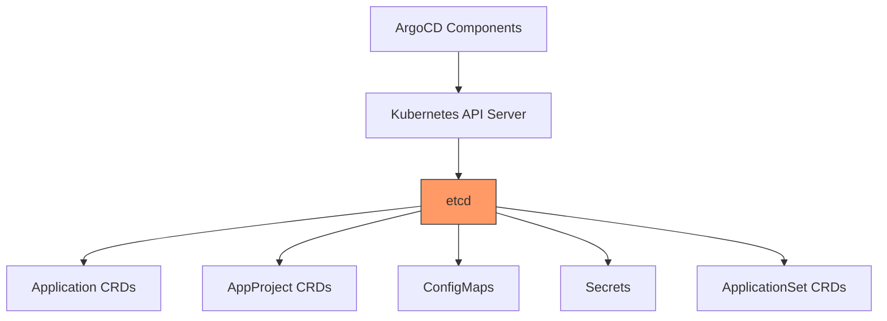
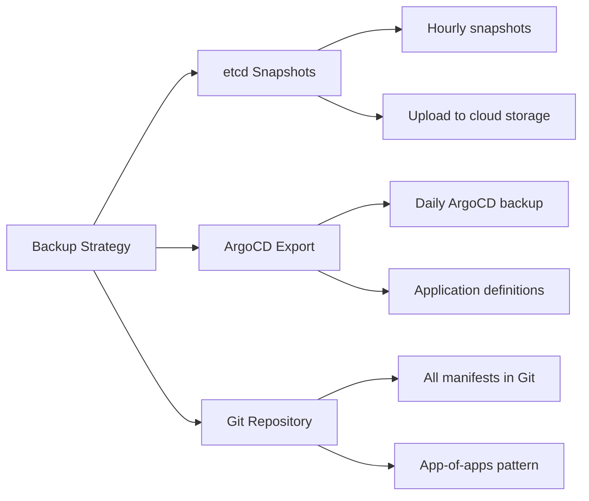

# How to Handle ArgoCD Recovery After etcd Corruption

Author: [nawazdhandala](https://github.com/nawazdhandala)

Tags: ArgoCD, GitOps, Kubernetes, etcd, Disaster Recovery

Description: Learn how to recover ArgoCD after etcd data corruption including diagnosis, etcd restoration, and ArgoCD state rebuild strategies.

---

etcd is the backbone of Kubernetes - it stores all cluster state including ArgoCD's applications, projects, and configuration. When etcd data becomes corrupted, it can bring your entire ArgoCD installation to a halt. Recovery depends on whether you have an etcd snapshot to restore from, or whether you need to rebuild ArgoCD state from scratch.

## Understanding etcd and ArgoCD

ArgoCD stores its state as standard Kubernetes resources:



When etcd is corrupted, any or all of these resources can be affected. The symptoms vary:

- ArgoCD UI shows no applications
- API server returns 500 errors
- Application controller logs show etcd connection errors
- Kubernetes objects are partially missing or inconsistent

## Diagnosing etcd Corruption

First, determine the extent of the damage:

```bash
# Check if etcd is running
kubectl get pods -n kube-system -l component=etcd

# Check etcd logs for corruption indicators
kubectl logs -n kube-system etcd-master-node --tail=100

# Common error messages indicating corruption:
# "mvcc: database space exceeded"
# "etcdserver: request timed out"
# "panic: unexpected partial uncommitted"
# "wal: crc mismatch"
# "snap: checksum mismatch"
```

### Check ArgoCD Resource State

```bash
# Try to list ArgoCD resources - failures indicate etcd issues
kubectl get applications.argoproj.io -n argocd 2>&1
kubectl get appprojects.argoproj.io -n argocd 2>&1
kubectl get configmaps -n argocd 2>&1

# If you get errors like:
# "etcdserver: mvcc: required revision has been compacted"
# "error: the server was unable to return a response"
# Then etcd data is compromised
```

## Recovery Path 1: Restore from etcd Snapshot

If you have etcd snapshots (and you should), this is the fastest recovery:

### Step 1: Stop the API Server

```bash
# On the control plane node, move the static pod manifests
sudo mv /etc/kubernetes/manifests/kube-apiserver.yaml /tmp/
sudo mv /etc/kubernetes/manifests/etcd.yaml /tmp/

# Wait for the pods to stop
sleep 10
```

### Step 2: Restore etcd from Snapshot

```bash
# Find your latest etcd snapshot
ls -la /var/backups/etcd/

# Restore from snapshot
sudo ETCDCTL_API=3 etcdctl snapshot restore /var/backups/etcd/snapshot.db \
  --data-dir=/var/lib/etcd-restored \
  --name=master \
  --initial-cluster=master=https://127.0.0.1:2380 \
  --initial-advertise-peer-urls=https://127.0.0.1:2380

# Replace the etcd data directory
sudo mv /var/lib/etcd /var/lib/etcd-corrupted
sudo mv /var/lib/etcd-restored /var/lib/etcd
sudo chown -R etcd:etcd /var/lib/etcd
```

### Step 3: Restart etcd and API Server

```bash
# Restore the static pod manifests
sudo mv /tmp/etcd.yaml /etc/kubernetes/manifests/
sudo mv /tmp/kube-apiserver.yaml /etc/kubernetes/manifests/

# Wait for everything to come back
sleep 30

# Verify the cluster is healthy
kubectl get nodes
kubectl get pods -n kube-system
```

### Step 4: Verify ArgoCD State

```bash
# Check if ArgoCD resources are intact
kubectl get applications.argoproj.io -n argocd
kubectl get appprojects.argoproj.io -n argocd
kubectl get pods -n argocd

# Restart ArgoCD to clear any stale caches
kubectl rollout restart deployment -n argocd
kubectl rollout restart statefulset -n argocd
```

## Recovery Path 2: Rebuild Without etcd Snapshot

If you do not have an etcd snapshot, you need to rebuild the cluster state. For ArgoCD, this means using your ArgoCD backups to restore the application definitions.

### Step 1: Defragment or Reset etcd

```bash
# Option A: Defragment etcd if it is running but degraded
ETCDCTL_API=3 etcdctl defrag \
  --endpoints=https://127.0.0.1:2379 \
  --cacert=/etc/kubernetes/pki/etcd/ca.crt \
  --cert=/etc/kubernetes/pki/etcd/server.crt \
  --key=/etc/kubernetes/pki/etcd/server.key

# Option B: If etcd is completely unrecoverable, reset it
# WARNING: This deletes ALL cluster state
sudo systemctl stop etcd
sudo rm -rf /var/lib/etcd/member
sudo systemctl start etcd
```

### Step 2: Reinstall ArgoCD if Needed

If the argocd namespace was lost:

```bash
# Create namespace
kubectl create namespace argocd

# Install ArgoCD
kubectl apply -n argocd \
  -f https://raw.githubusercontent.com/argoproj/argo-cd/v2.13.0/manifests/install.yaml

# Wait for pods to be ready
kubectl wait --for=condition=available deployment --all -n argocd --timeout=180s
```

### Step 3: Restore from ArgoCD Backup

```bash
# If you have an ArgoCD-level backup
argocd admin import -n argocd < /backups/argocd-backup.yaml
```

Or restore manually, following the same process described in our [ArgoCD Restore from Backup](https://oneuptime.com/blog/post/2026-02-26-argocd-restore-from-backup/view) guide.

### Step 4: Rebuild from Git (No ArgoCD Backup)

If you have neither etcd snapshot nor ArgoCD backup, you can still recover because your application manifests are in Git:

```bash
# Fresh ArgoCD install is already done from Step 2

# Reconfigure ArgoCD
kubectl apply -f - << 'EOF'
apiVersion: v1
kind: ConfigMap
metadata:
  name: argocd-cm
  namespace: argocd
data:
  url: https://argocd.example.com
  # Add your SSO config, etc.
EOF

# Re-add repositories
argocd repo add https://github.com/myorg/gitops-config.git \
  --username git --password "$GITHUB_TOKEN"

# If you use app-of-apps, recreate just the root app
argocd app create root-app \
  --repo https://github.com/myorg/gitops-config.git \
  --path bootstrap/apps \
  --dest-server https://kubernetes.default.svc \
  --dest-namespace argocd \
  --sync-policy automated

# The root app will recreate all child applications
echo "Root app created. ArgoCD will now recreate all applications from Git."
```

## Preventing etcd Corruption Impact

### Automated etcd Snapshots

Set up regular etcd snapshots to minimize data loss:

```bash
#!/bin/bash
# etcd-backup.sh - Run as a cron job every hour

BACKUP_DIR="/var/backups/etcd"
MAX_BACKUPS=24  # Keep 24 hours of backups

mkdir -p "$BACKUP_DIR"

# Create snapshot
ETCDCTL_API=3 etcdctl snapshot save \
  "$BACKUP_DIR/snapshot-$(date +%Y%m%d-%H%M).db" \
  --endpoints=https://127.0.0.1:2379 \
  --cacert=/etc/kubernetes/pki/etcd/ca.crt \
  --cert=/etc/kubernetes/pki/etcd/server.crt \
  --key=/etc/kubernetes/pki/etcd/server.key

# Verify the snapshot
ETCDCTL_API=3 etcdctl snapshot status \
  "$BACKUP_DIR/snapshot-$(date +%Y%m%d-%H%M).db" --write-out=table

# Clean old snapshots
ls -t "$BACKUP_DIR"/snapshot-*.db | tail -n +$((MAX_BACKUPS + 1)) | xargs rm -f 2>/dev/null

# Also upload to cloud storage
aws s3 cp "$BACKUP_DIR/snapshot-$(date +%Y%m%d-%H%M).db" \
  "s3://my-backups/etcd/" 2>/dev/null || true
```

Add the cron job:

```bash
# Run etcd backup every hour
echo "0 * * * * root /usr/local/bin/etcd-backup.sh" >> /etc/crontab
```

### Multi-Layer Backup Strategy

Do not rely on etcd snapshots alone. Maintain ArgoCD-level backups as well:



### etcd Health Monitoring

Monitor etcd health to catch issues early:

```bash
# Check etcd endpoint health
ETCDCTL_API=3 etcdctl endpoint health \
  --endpoints=https://127.0.0.1:2379 \
  --cacert=/etc/kubernetes/pki/etcd/ca.crt \
  --cert=/etc/kubernetes/pki/etcd/server.crt \
  --key=/etc/kubernetes/pki/etcd/server.key

# Check etcd database size
ETCDCTL_API=3 etcdctl endpoint status \
  --endpoints=https://127.0.0.1:2379 \
  --cacert=/etc/kubernetes/pki/etcd/ca.crt \
  --cert=/etc/kubernetes/pki/etcd/server.crt \
  --key=/etc/kubernetes/pki/etcd/server.key \
  --write-out=table
```

Consider using [OneUptime](https://oneuptime.com) to set up monitoring alerts for etcd health, database size, and latency to catch problems before they escalate to full corruption.

## Post-Recovery Actions

After recovering from etcd corruption:

1. **Investigate root cause** - Check if the corruption was caused by disk failures, out-of-space conditions, or power loss
2. **Verify all applications** - Run a full audit comparing expected vs actual applications
3. **Check sync status** - Ensure all applications eventually reach Synced/Healthy
4. **Update backup procedures** - If your backup was missing or outdated, improve the backup frequency
5. **Test recovery again** - Document and practice the recovery procedure

etcd corruption is a serious but recoverable event. The key to quick recovery is preparation: maintain regular etcd snapshots, keep ArgoCD-level backups, and document your recovery procedures. With GitOps, your application definitions live in Git, so even a complete data loss is recoverable.
