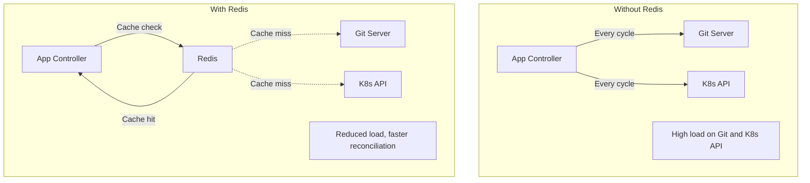
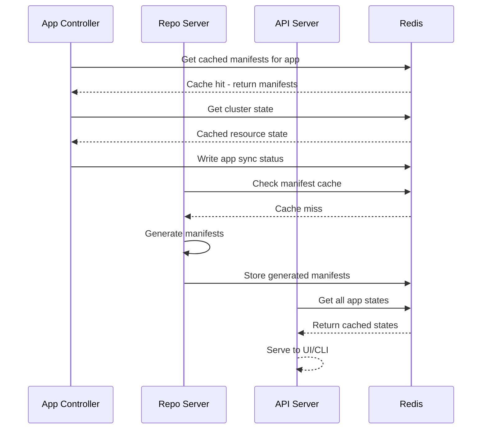

# Understanding ArgoCD's Redis Cache Layer

Author: [nawazdhandala](https://github.com/nawazdhandala)

Tags: ArgoCD, GitOps, Kubernetes, Redis, Caching

Description: A practical guide to understanding ArgoCD's Redis cache layer, what it stores, how it improves performance, and how to configure it for production.

---

Redis is one of the quieter components in ArgoCD, but it plays a critical role. Without it, ArgoCD would need to clone Git repositories and query the Kubernetes API on every reconciliation cycle, putting enormous load on both your Git server and your clusters. Redis acts as the shared memory that keeps everything fast.

This post explains what Redis stores, how it is used by each component, and how to configure it for production workloads.

## Why ArgoCD Needs Redis

ArgoCD's reconciliation loop runs continuously. For each Application, the controller needs to:

1. Get the latest commit SHA from the Git repository
2. Get the generated manifests for that commit
3. Get the live state of resources from the Kubernetes cluster
4. Compare the two and determine sync status

Without caching, managing 100 Applications would mean hitting your Git server hundreds of times per minute and making thousands of Kubernetes API calls. Redis eliminates most of this repeated work.



## What Redis Stores

Redis in ArgoCD caches several categories of data:

### Git Revision Cache

The most frequently accessed cache. For each tracked repository and branch, Redis stores the latest commit SHA. Instead of doing a `git ls-remote` on every reconciliation, the controller checks Redis first.

```
Key pattern: git-ls-remote|<repo-url>|<branch>
Value: commit SHA
TTL: configurable, default varies by polling interval
```

### Manifest Cache

After the Repo Server generates manifests for a specific commit, the result is cached in Redis. This is keyed by repository URL, commit SHA, path, and any parameters (Helm values, Kustomize options).

```
Key pattern: mfst|<repo-url>|<revision>|<path>|<params-hash>
Value: serialized manifest list
TTL: 24 hours by default
```

This cache means that if multiple Applications use the same repository and revision, the manifests are generated only once.

### Application State Cache

The controller caches the computed state of each Application - its sync status, health, resources, and conditions. This reduces the number of times the controller needs to recalculate everything from scratch.

### Cluster State Cache

The live state of resources in managed clusters is cached. The controller watches the Kubernetes API for changes (using informers) and updates the cache incrementally. This is the most memory-intensive cache, especially when managing many resources.

## How Each Component Uses Redis

**Application Controller** - the heaviest Redis user. It reads the manifest cache, writes application state, and reads/writes the cluster state cache. Most of its cache interactions are reads.

**API Server** - reads application state from Redis to serve UI and CLI requests quickly. When you open the ArgoCD dashboard and see all your applications, that data comes from Redis, not from recomputing everything on the fly.

**Repo Server** - writes manifest generation results to Redis and reads them on cache hits. The Repo Server also has its own in-memory cache, but Redis serves as the shared cache across Repo Server replicas.



## Default Redis Configuration

ArgoCD installs a single Redis instance as a Deployment:

```bash
# Check the Redis deployment
kubectl get deployment argocd-redis -n argocd

# Check the Redis service
kubectl get svc argocd-redis -n argocd
# NAME           TYPE        CLUSTER-IP      PORT(S)
# argocd-redis   ClusterIP   10.96.xxx.xxx   6379/TCP
```

The default deployment uses no persistence and no authentication. Redis data is stored in memory only, and if the Redis pod restarts, the cache is rebuilt.

This is actually fine for most setups because the cache is rebuilt quickly. The controller repopulates it during the next reconciliation cycle. You may notice a brief period of increased load on your Git server and Kubernetes API while the cache warms up, but it recovers within minutes.

## Configuring Redis for Production

For production environments, consider these configurations:

### Redis Authentication

Enable Redis authentication to prevent unauthorized access:

```yaml
# In the argocd-secret
apiVersion: v1
kind: Secret
metadata:
  name: argocd-secret
  namespace: argocd
stringData:
  redis.password: "your-secure-password"
```

Then configure ArgoCD components to use the password:

```yaml
# In argocd-cmd-params-cm
apiVersion: v1
kind: ConfigMap
metadata:
  name: argocd-cmd-params-cm
  namespace: argocd
data:
  redis.server: "argocd-redis:6379"
```

### Redis High Availability with Sentinel

For high availability, deploy Redis with Sentinel:

```yaml
# Configure ArgoCD to use Redis Sentinel
apiVersion: v1
kind: ConfigMap
metadata:
  name: argocd-cmd-params-cm
  namespace: argocd
data:
  redis.server: "argocd-redis-ha-haproxy:6379"
```

ArgoCD provides a Redis HA Helm chart configuration that deploys Redis with three replicas and three Sentinel instances. This ensures Redis remains available even if a node fails.

```bash
# Install ArgoCD with HA Redis using Helm
helm install argocd argo/argo-cd \
  --namespace argocd \
  --set redis-ha.enabled=true \
  --set redis.enabled=false
```

### External Redis

You can point ArgoCD to an external Redis instance (AWS ElastiCache, Azure Cache for Redis, Google Memorystore, or a self-managed Redis cluster):

```yaml
apiVersion: v1
kind: ConfigMap
metadata:
  name: argocd-cmd-params-cm
  namespace: argocd
data:
  redis.server: "my-redis-cluster.xxxxx.ng.0001.use1.cache.amazonaws.com:6379"
```

External Redis is useful when you want managed Redis with automatic failover, backups, and monitoring.

### TLS for Redis

Enable TLS when connecting to Redis, especially for external Redis instances:

```yaml
apiVersion: v1
kind: ConfigMap
metadata:
  name: argocd-cmd-params-cm
  namespace: argocd
data:
  redis.server: "redis.example.com:6380"
  redis.insecure: "false"
```

## Memory Sizing

Redis memory usage scales with:

- **Number of Applications** - each Application's state is cached
- **Number of managed resources** - the cluster state cache grows with resource count
- **Number of unique manifests** - generated manifest cache size

As a rough guide:

| Scale | Resources | Suggested Redis Memory |
|-------|-----------|----------------------|
| Small | Under 500 | 256 MB |
| Medium | 500 to 2000 | 512 MB to 1 GB |
| Large | 2000 to 10000 | 1 GB to 4 GB |
| Very Large | 10000+ | 4 GB+ |

Monitor actual usage and adjust:

```bash
# Check Redis memory usage
kubectl exec -it deploy/argocd-redis -n argocd -- redis-cli info memory

# Key metrics to check
# used_memory_human: actual memory used
# used_memory_peak_human: peak memory usage
# maxmemory: configured limit
```

## Cache Invalidation

ArgoCD handles cache invalidation automatically in most cases:

- **Git revision cache** - refreshed on every polling cycle (default 3 minutes) or webhook event
- **Manifest cache** - invalidated when the commit SHA changes
- **Cluster state cache** - updated via Kubernetes watch events (near real-time)
- **Application state** - recomputed on each reconciliation cycle

You can force cache invalidation manually:

```bash
# Hard refresh forces manifest cache invalidation for an application
argocd app get my-app --hard-refresh

# Flush the entire Redis cache (use with caution)
kubectl exec -it deploy/argocd-redis -n argocd -- redis-cli FLUSHALL
```

Flushing the entire cache causes a temporary spike in load as everything is regenerated. Use it only as a last resort for debugging.

## Monitoring Redis

Monitor Redis with Prometheus metrics or Redis's built-in monitoring:

```bash
# Redis INFO command provides comprehensive stats
kubectl exec -it deploy/argocd-redis -n argocd -- redis-cli info

# Check hit rate - a low hit rate means the cache is not effective
kubectl exec -it deploy/argocd-redis -n argocd -- redis-cli info stats | grep keyspace

# Monitor real-time commands (useful for debugging)
kubectl exec -it deploy/argocd-redis -n argocd -- redis-cli monitor
```

Key things to watch:
- **Memory usage** - ensure you are not hitting the memory limit
- **Evictions** - if Redis is evicting keys, it needs more memory
- **Connection count** - high connection counts might indicate a problem
- **Latency** - slow Redis responses slow down all of ArgoCD

## Troubleshooting

**Problem: ArgoCD is slow after Redis restart**

This is normal. The cache needs time to warm up. The controller will repopulate it during the next few reconciliation cycles. If this is a concern, use Redis persistence or Redis HA to minimize restarts.

**Problem: High memory usage in Redis**

Check which cache is consuming the most memory. The cluster state cache is usually the largest. If you manage many resources, increase Redis memory or consider sharding the Application Controller.

**Problem: Redis connection errors in ArgoCD logs**

Check that the Redis service is running and the connection details are correct. Verify network policies are not blocking the connection.

```bash
# Check Redis pod status
kubectl get pods -n argocd -l app.kubernetes.io/name=argocd-redis

# Test Redis connectivity from the controller
kubectl exec -it deploy/argocd-application-controller -n argocd -- redis-cli -h argocd-redis ping
```

## The Bottom Line

Redis is the glue that makes ArgoCD perform well at scale. It caches Git revisions, generated manifests, cluster state, and application status to minimize the load on your Git server and Kubernetes API. For small deployments, the default single-instance Redis works fine. For production, consider Redis HA or an external managed Redis service to ensure reliability. Monitor memory usage as you scale, and use hard refreshes sparingly to debug cache issues.
