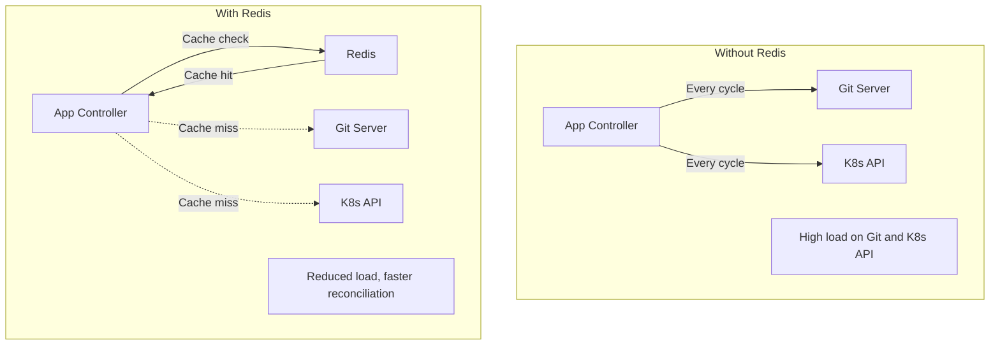
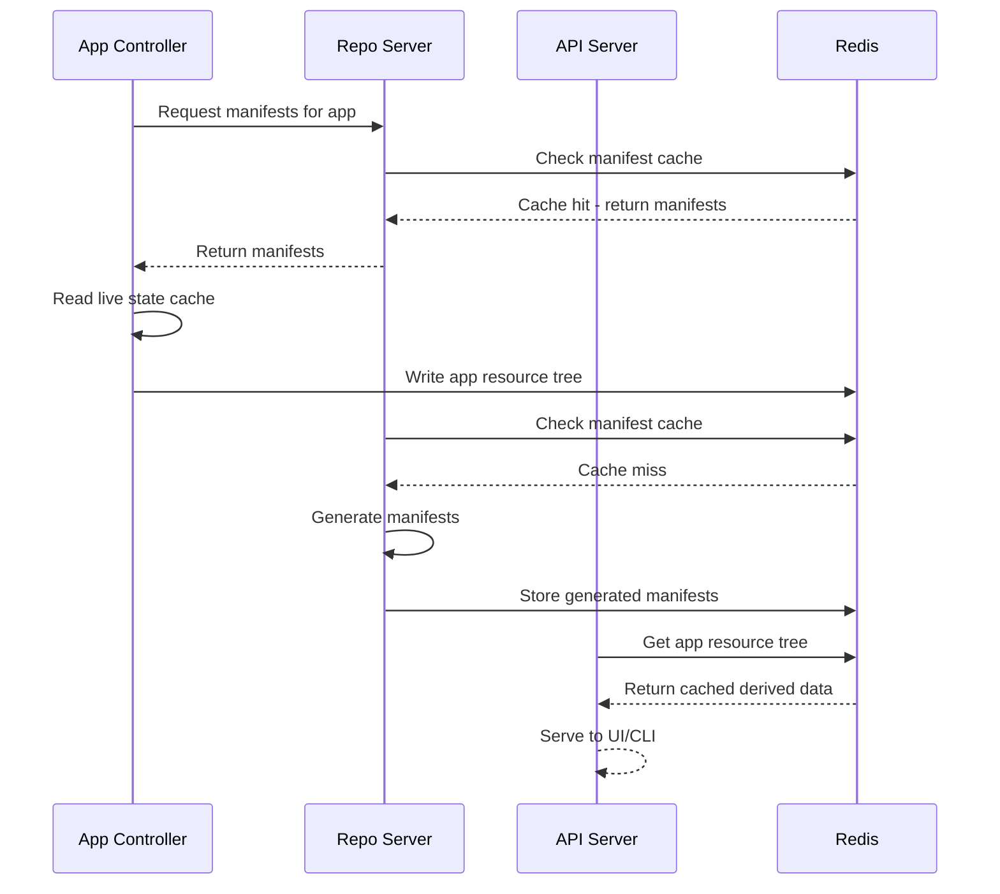

# Understanding ArgoCD's Redis Cache Layer

Author: [nawazdhandala](https://github.com/nawazdhandala)

Tags: ArgoCD, GitOps, Kubernetes, Redis, Caching

Description: A practical guide to understanding ArgoCD's Redis cache layer, what it stores, how it improves performance, and how to configure it for production.

---

Redis is one of the quieter components in ArgoCD, but it plays a critical role. Without its shared cache layer, ArgoCD would need to repeat more Git, manifest generation, and application state work on each reconciliation cycle, putting extra load on your Git server and your clusters. Redis acts as shared cache storage that keeps repeated work fast.

This post explains what Redis stores, how it is used by each component, and how to configure it for production workloads.

## Why ArgoCD Needs Redis

ArgoCD's reconciliation loop runs continuously. For each Application, the controller needs to:

1. Get the latest commit SHA from the Git repository
2. Get the generated manifests for that commit
3. Get the live state of resources from the Kubernetes cluster
4. Compare the two and determine sync status

Without caching, managing 100 Applications could mean repeated Git checks, manifest generation, and Kubernetes API reads. Redis, together with the controller's live cluster cache and the repo server's local Git cache, eliminates much of this repeated work.


```mermaid
graph TB
    subgraph Without Redis
        AC1[App Controller] -->|Every cycle| Git1[Git Server]
        AC1 -->|Every cycle| K8s1[K8s API]
        Note1[High load on Git and K8s API]
    end

    subgraph With Redis
        AC2[App Controller] -->|Cache check| Redis[Redis]
        Redis -->|Cache hit| AC2
        AC2 -.->|Cache miss| Git2[Git Server]
        AC2 -.->|Cache miss| K8s2[K8s API]
        Note2[Reduced load, faster reconciliation]
    end
```

## What Redis Stores

Redis in ArgoCD caches several categories of data:

### Git Revision Cache

The most frequently accessed repo cache. For each tracked repository, the repo server caches Git references returned by operations such as `git ls-remote`. Instead of resolving refs from the remote repository on every request, ArgoCD can reuse the cached refs until they expire.

```text
Key pattern: git-refs|<repo-url>
Value: serialized Git references
TTL: revision cache expiration, 3 minutes by default
```

### Manifest Cache

After the Repo Server generates manifests for a specific commit, the result is cached in Redis. This is keyed by repository URL, commit SHA, path, and any parameters (Helm values, Kustomize options).

```text
Key pattern: mfst|<tracking-key>|<app-name>|<revision>|<namespace>|<source-and-cluster-hash>|<source-integrity>
Value: serialized manifest list
TTL: repo cache expiration, 24 hours by default
```

This cache means repeated requests for the same Application source, resolved revision, cluster capabilities, namespace, and tracking settings can reuse generated manifests.

### Application State Cache

The controller writes derived application data such as resource trees and managed resource diffs to Redis. Application status and health are still stored on the Application Kubernetes resource, but Redis helps the API server serve expensive derived views without recalculating them from scratch.

### Cluster State Cache

The live state of resources in managed clusters is cached by the application controller's live state cache. The controller watches the Kubernetes API for changes and updates this cache incrementally. Redis stores application-derived data, but the live cluster resource cache itself is primarily maintained by the controller process.

## How Each Component Uses Redis

**Application Controller** - a heavy Redis user. It calls the repo server for manifest generation, writes derived application state such as resource trees and managed resources, and maintains its own live cluster cache from Kubernetes watch events.

**API Server** - reads Kubernetes Application objects and uses Redis-backed derived data such as application resource trees and managed resources to serve UI and CLI requests quickly.

**Repo Server** - writes manifest generation results, Git refs, and repository metadata to Redis and reads them on cache hits. The Repo Server also maintains local repository clones, while Redis serves as the shared cache across Repo Server replicas.


```mermaid
sequenceDiagram
    participant AC as App Controller
    participant RS as Repo Server
    participant API as API Server
    participant R as Redis

    AC->>RS: Request manifests for app
    RS->>R: Check manifest cache
    R-->>RS: Cache hit - return manifests
    RS-->>AC: Return manifests
    AC->>AC: Read live state cache
    AC->>R: Write app resource tree

    RS->>R: Check manifest cache
    R-->>RS: Cache miss
    RS->>RS: Generate manifests
    RS->>R: Store generated manifests

    API->>R: Get app resource tree
    R-->>API: Return cached derived data
    API-->>API: Serve to UI/CLI
```

## Default Redis Configuration

ArgoCD installs a single Redis instance as a Deployment:

```bash
# Check the Redis deployment

kubectl get deployment argocd-redis -n argocd

# Check the Redis service
kubectl get svc argocd-redis -n argocd
# NAME           TYPE        CLUSTER-IP      PORT(S)
# argocd-redis   ClusterIP   10.96.xxx.xxx   6379/TCP
```

The default deployment uses no persistence and uses Redis authentication. Recent ArgoCD installs create an `argocd-redis` Secret with an `auth` key and start Redis with `--requirepass`. Redis data is stored in memory only, and if the Redis pod restarts, the cache is rebuilt.

This is actually fine for most setups because the cache is rebuilt quickly. The controller repopulates it during the next reconciliation cycle. You may notice a brief period of increased load on your Git server and Kubernetes API while the cache warms up, but it recovers within minutes.

## Configuring Redis for Production

For production environments, consider these configurations:

### Redis Authentication

ArgoCD's built-in Redis is configured with authentication by default. If you manage the Redis password yourself, provide a Secret named `argocd-redis` with an `auth` key, and configure the Redis server itself to require the same password:

```yaml
# Secret consumed by ArgoCD components
apiVersion: v1
kind: Secret
metadata:
  name: argocd-redis
  namespace: argocd
stringData:
  auth: "your-secure-password"
```

Then configure the Redis endpoint as usual:

```yaml
# In argocd-cmd-params-cm
apiVersion: v1
kind: ConfigMap
metadata:
  name: argocd-cmd-params-cm
  namespace: argocd
data:
  redis.server: "argocd-redis:6379"
```

### Redis High Availability

For high availability, deploy Redis HA:

```yaml
# Configure ArgoCD to use the Redis HA endpoint
apiVersion: v1
kind: ConfigMap
metadata:
  name: argocd-cmd-params-cm
  namespace: argocd
data:
  redis.server: "argocd-redis-ha-haproxy:6379"
```

The Argo CD Helm chart provides a Redis HA configuration. The chart documentation recommends at least three worker nodes because Redis HA pods are spread across nodes.

```bash
# Install ArgoCD with HA Redis using Helm
helm install argocd argo/argo-cd \
  --namespace argocd \
  --set redis-ha.enabled=true
```

### External Redis

You can point ArgoCD to an external Redis instance (AWS ElastiCache, Azure Cache for Redis, Google Memorystore, or a self-managed Redis cluster):

```yaml
apiVersion: v1
kind: ConfigMap
metadata:
  name: argocd-cmd-params-cm
  namespace: argocd
data:
  redis.server: "my-redis-cluster.xxxxx.ng.0001.use1.cache.amazonaws.com:6379"
```

External Redis is useful when you want managed Redis with automatic failover, backups, and monitoring.

### TLS for Redis

Enable TLS when connecting to Redis, especially for external Redis instances. ArgoCD exposes this as component command-line flags such as `--redis-use-tls`, `--redis-ca-certificate`, and `--redis-insecure-skip-tls-verify`; these are not configured with a `redis.insecure` key in `argocd-cmd-params-cm`.

```bash
argocd-repo-server \
  --redis=redis.example.com:6380 \
  --redis-use-tls \
  --redis-ca-certificate=/etc/certs/redis/ca.crt
```

Use the equivalent Redis TLS flags on `argocd-server` and `argocd-application-controller` when those components connect to the same TLS-enabled Redis instance.

## Memory Sizing

Redis memory usage scales with:

- **Number of Applications** - each Application can have derived resource data cached
- **Number of managed resources** - derived application resource trees and managed resource data grow with resource count
- **Number of unique manifests** - generated manifest cache size

As a rough guide:

| Scale | Resources | Suggested Redis Memory |
|-------|-----------|----------------------|
| Small | Under 500 | 256 MB |
| Medium | 500 to 2000 | 512 MB to 1 GB |
| Large | 2000 to 10000 | 1 GB to 4 GB |
| Very Large | 10000+ | 4 GB+ |

Monitor actual usage and adjust:

```bash
# Check Redis memory usage
kubectl exec -it deploy/argocd-redis -n argocd -- sh -c 'redis-cli --no-auth-warning -a "$REDIS_PASSWORD" info memory'

# Key metrics to check
# used_memory_human: actual memory used
# used_memory_peak_human: peak memory usage
# maxmemory: configured limit
```

## Cache Invalidation

ArgoCD handles cache invalidation automatically in most cases:

- **Git revision cache** - expires after the revision cache duration, 3 minutes by default
- **Manifest cache** - keyed by resolved revision and source inputs, so a new commit uses a new cache entry
- **Cluster state cache** - updated via Kubernetes watch events (near real-time)
- **Application state** - recomputed on each reconciliation cycle

You can force cache invalidation manually:

```bash
# Hard refresh forces manifest cache invalidation for an application
argocd app get my-app --hard-refresh

# Flush the entire Redis cache (use with caution)
kubectl exec -it deploy/argocd-redis -n argocd -- sh -c 'redis-cli --no-auth-warning -a "$REDIS_PASSWORD" FLUSHALL'
```

Flushing the entire cache causes a temporary spike in load as everything is regenerated. Use it only as a last resort for debugging.

## Monitoring Redis

Monitor Redis with Prometheus metrics or Redis's built-in monitoring:

```bash
# Redis INFO command provides comprehensive stats
kubectl exec -it deploy/argocd-redis -n argocd -- sh -c 'redis-cli --no-auth-warning -a "$REDIS_PASSWORD" info'

# Check hit rate - a low hit rate means the cache is not effective
kubectl exec -it deploy/argocd-redis -n argocd -- sh -c 'redis-cli --no-auth-warning -a "$REDIS_PASSWORD" info stats | grep keyspace'

# Monitor real-time commands (useful for debugging)
kubectl exec -it deploy/argocd-redis -n argocd -- sh -c 'redis-cli --no-auth-warning -a "$REDIS_PASSWORD" monitor'
```

Key things to watch:
- **Memory usage** - ensure you are not hitting the memory limit
- **Evictions** - if Redis is evicting keys, it needs more memory
- **Connection count** - high connection counts might indicate a problem
- **Latency** - slow Redis responses slow down all of ArgoCD

## Troubleshooting

**Problem: ArgoCD is slow after Redis restart**

This is normal. The cache needs time to warm up. The controller will repopulate it during the next few reconciliation cycles. If this is a concern, use Redis persistence or Redis HA to minimize restarts.

**Problem: High memory usage in Redis**

Check Redis key sizes and application resource tree sizes. If you manage many resources, increase Redis memory and review application controller sharding and resource tracking settings.

**Problem: Redis connection errors in ArgoCD logs**

Check that the Redis service is running and the connection details are correct. Verify network policies are not blocking the connection.

```bash
# Check Redis pod status
kubectl get pods -n argocd -l app.kubernetes.io/name=argocd-redis

# Test Redis connectivity from the Redis pod
kubectl exec -it deploy/argocd-redis -n argocd -- sh -c 'redis-cli --no-auth-warning -a "$REDIS_PASSWORD" ping'
```

## The Bottom Line

Redis is the glue that makes ArgoCD perform well at scale. It caches Git references, generated manifests, repository metadata, and derived application data to minimize repeated work and reduce load on your Git server and Kubernetes API. For small deployments, the default single-instance Redis works fine. For production, consider Redis HA or an external managed Redis service to ensure reliability. Monitor memory usage as you scale, and use hard refreshes sparingly to debug cache issues.
