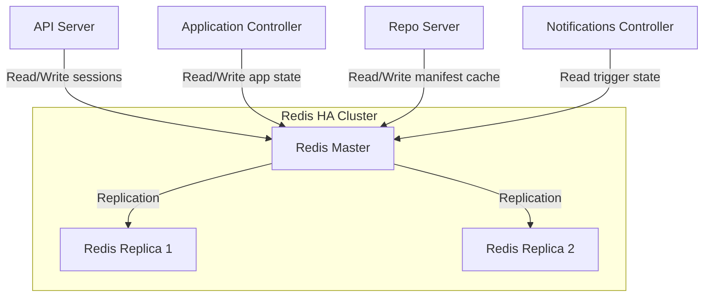
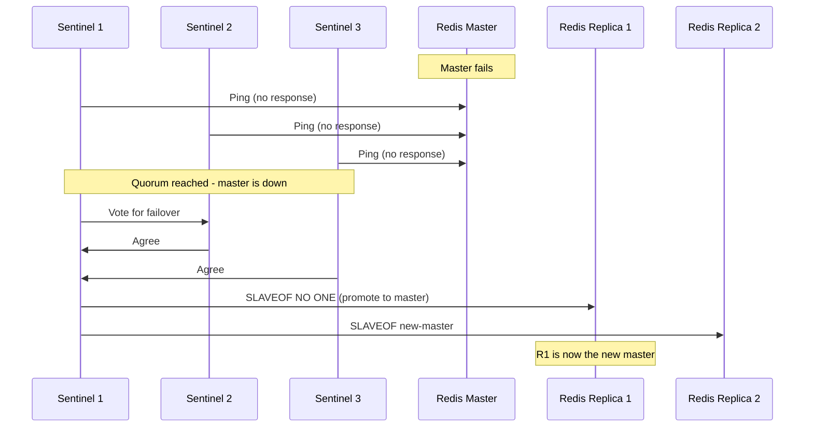

# How to Configure ArgoCD Redis in HA Mode

Author: [nawazdhandala](https://github.com/nawazdhandala)

Tags: ArgoCD, GitOps, Kubernetes, Redis, High Availability

Description: Learn how to configure Redis in high availability mode for ArgoCD, ensuring cache resilience with master-replica replication and automatic failover.

---

Redis serves as ArgoCD's caching layer, storing repository data, application manifests, and cluster information to avoid redundant Git operations and API calls. When Redis goes down in a standard installation, ArgoCD loses its cache and must rebuild everything from scratch, causing temporary performance degradation and potential sync delays. Running Redis in HA mode eliminates this single point of failure.

## How ArgoCD Uses Redis

Before configuring HA, understand what ArgoCD stores in Redis:

- **Git repository metadata**: Commit hashes, file listings, and resolved references
- **Rendered manifests**: Cached output from Helm template and Kustomize builds
- **Application state**: Sync status, health status, and resource trees
- **Cluster information**: API server versions, available resources
- **Session data**: User login sessions and tokens



If Redis is unavailable, ArgoCD continues to function but with increased latency since every request hits Git repositories and Kubernetes APIs directly instead of the cache.

## Redis HA with Sentinel

The most common HA approach for ArgoCD Redis is master-replica replication with Sentinel for automatic failover. Sentinel monitors the Redis master and promotes a replica to master if the master fails.

### Using Helm

The ArgoCD Helm chart includes built-in support for Redis HA:

```yaml
# argocd-ha-values.yaml

# Disable the default single-instance Redis
redis:
  enabled: false

# Enable Redis HA
redis-ha:
  enabled: true

  # Number of Redis instances (1 master + N-1 replicas)
  replicas: 3

  # Redis configuration
  redis:
    resources:
      requests:
        cpu: 200m
        memory: 256Mi
      limits:
        cpu: 500m
        memory: 512Mi
    config:
      # Maximum memory for caching
      maxmemory: 256mb
      maxmemory-policy: allkeys-lru
      # Disable persistence (ArgoCD can rebuild cache)
      save: ""

  # Sentinel configuration
  sentinel:
    enabled: true
    resources:
      requests:
        cpu: 100m
        memory: 128Mi
      limits:
        cpu: 200m
        memory: 256Mi
    config:
      # How long to wait before declaring master down
      down-after-milliseconds: 10000
      # How long to wait before starting failover
      failover-timeout: 30000
      # Minimum replicas that must agree master is down
      parallel-syncs: 1

  # HAProxy for routing connections to the current master
  haproxy:
    enabled: true
    replicas: 3
    resources:
      requests:
        cpu: 100m
        memory: 128Mi
      limits:
        cpu: 200m
        memory: 256Mi
    metrics:
      enabled: true

  # Spread Redis pods across nodes
  topologySpreadConstraints:
    - maxSkew: 1
      topologyKey: kubernetes.io/hostname
      whenUnsatisfiable: DoNotSchedule

  # Persistent storage for Redis data
  persistentVolume:
    enabled: true
    size: 10Gi
    storageClass: gp3
```

Install with Helm:

```bash
helm install argocd argo/argo-cd \
  --namespace argocd \
  --create-namespace \
  --values argocd-ha-values.yaml
```

### Using Official HA Manifests

The ArgoCD project provides HA manifests that include Redis Sentinel:

```bash
kubectl apply -n argocd \
  -f https://raw.githubusercontent.com/argoproj/argo-cd/stable/manifests/ha/install.yaml
```

This automatically deploys Redis with Sentinel and HAProxy.

## How Sentinel Failover Works



Key failover parameters:

- **down-after-milliseconds**: How long a master must be unreachable before Sentinel considers it down (default 10 seconds)
- **failover-timeout**: Maximum time for the entire failover process (default 30 seconds)
- **parallel-syncs**: How many replicas sync with the new master simultaneously during failover

## HAProxy Configuration

HAProxy sits in front of the Redis instances and routes connections to the current master. ArgoCD components connect to HAProxy instead of Redis directly:

```yaml
# HAProxy configuration (automatically managed by the Helm chart)
# This is what gets generated - shown for understanding

defaults
  mode tcp
  timeout connect 4s
  timeout server 30s
  timeout client 30s

frontend redis-frontend
  bind *:6379
  default_backend redis-backend

backend redis-backend
  option tcp-check
  tcp-check connect
  tcp-check send PING\r\n
  tcp-check expect string +PONG
  tcp-check send info\ replication\r\n
  tcp-check expect string role:master
  tcp-check send QUIT\r\n
  tcp-check expect string +OK
  server redis-0 argocd-redis-ha-server-0.argocd-redis-ha.argocd:6379 check inter 3s fall 3 rise 2
  server redis-1 argocd-redis-ha-server-1.argocd-redis-ha.argocd:6379 check inter 3s fall 3 rise 2
  server redis-2 argocd-redis-ha-server-2.argocd-redis-ha.argocd:6379 check inter 3s fall 3 rise 2
```

The health check queries each Redis instance and only routes traffic to the one reporting `role:master`.

## Verify Redis HA

After deployment, verify everything is working:

```bash
# Check Redis pods are running
kubectl get pods -n argocd -l app.kubernetes.io/name=argocd-redis-ha

# Check HAProxy pods
kubectl get pods -n argocd -l app.kubernetes.io/name=argocd-redis-ha-haproxy

# Verify Sentinel is tracking the master
kubectl exec -n argocd argocd-redis-ha-server-0 -c sentinel -- \
  redis-cli -p 26379 sentinel master mymaster

# Check replication status
kubectl exec -n argocd argocd-redis-ha-server-0 -c redis -- \
  redis-cli info replication

# Expected output includes:
# role:master (or role:slave)
# connected_slaves:2
```

## Test Failover

Simulate a master failure to verify HA works:

```bash
# Find the current master
kubectl exec -n argocd argocd-redis-ha-server-0 -c redis -- \
  redis-cli info replication | grep role

# If server-0 is the master, kill it
kubectl delete pod argocd-redis-ha-server-0 -n argocd

# Watch Sentinel elect a new master (within 10-30 seconds)
kubectl exec -n argocd argocd-redis-ha-server-1 -c sentinel -- \
  redis-cli -p 26379 sentinel master mymaster

# Verify ArgoCD still works
argocd app list
```

During failover, ArgoCD may experience brief cache misses (1-2 seconds), but operations should continue without errors.

## Persistence Configuration

Whether to enable Redis persistence depends on your priorities:

**Without persistence** (recommended for most ArgoCD deployments):

```yaml
redis-ha:
  redis:
    config:
      save: ""
      appendonly: "no"
  persistentVolume:
    enabled: false
```

ArgoCD can rebuild its entire cache from Git and Kubernetes APIs. Disabling persistence makes Redis faster and simpler.

**With persistence** (for very large deployments where cache rebuild is slow):

```yaml
redis-ha:
  redis:
    config:
      save: "900 1"  # Save if at least 1 key changed in 900 seconds
      appendonly: "no"
  persistentVolume:
    enabled: true
    size: 10Gi
```

## Memory Optimization

Configure Redis memory limits to prevent it from consuming too much cluster resources:

```yaml
redis-ha:
  redis:
    config:
      # Set maximum memory
      maxmemory: 512mb
      # Eviction policy - LRU works well for caches
      maxmemory-policy: allkeys-lru
      # Disable unused features
      notify-keyspace-events: ""
      # Optimize for cache workload
      lazyfree-lazy-eviction: "yes"
      lazyfree-lazy-expire: "yes"
```

## Monitoring Redis HA

Monitor Redis health with these commands and metrics:

```bash
# Check memory usage
kubectl exec -n argocd argocd-redis-ha-server-0 -c redis -- \
  redis-cli info memory

# Check connected clients
kubectl exec -n argocd argocd-redis-ha-server-0 -c redis -- \
  redis-cli info clients

# Check cache hit rate
kubectl exec -n argocd argocd-redis-ha-server-0 -c redis -- \
  redis-cli info stats | grep keyspace
```

For Prometheus monitoring, enable metrics export in the HAProxy:

```yaml
redis-ha:
  haproxy:
    metrics:
      enabled: true
  exporter:
    enabled: true
    resources:
      requests:
        cpu: 50m
        memory: 64Mi
```

Redis HA is a critical component of a production ArgoCD deployment. The Sentinel-based approach provides automatic failover with minimal configuration, and HAProxy ensures transparent routing to the current master. For comprehensive ArgoCD monitoring including Redis health, see our guide on [monitoring ArgoCD component health](https://oneuptime.com/blog/post/2026-02-26-argocd-monitor-component-health/view).
