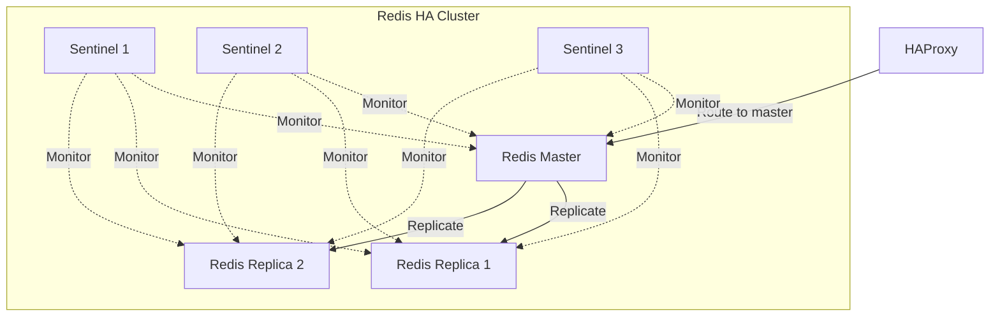

# How to Configure ArgoCD Redis Sentinel

Author: [nawazdhandala](https://github.com/nawazdhandala)

Tags: ArgoCD, GitOps, Kubernetes, Redis, Sentinel

Description: A detailed guide to configuring Redis Sentinel for ArgoCD automatic failover, including quorum settings, monitoring, and troubleshooting common Sentinel issues.

---

Redis Sentinel provides automatic failover for ArgoCD's Redis cache layer. When the Redis master fails, Sentinel detects the failure, selects a new master from the available replicas, and reconfigures the cluster automatically. This guide focuses specifically on Sentinel configuration, tuning, and troubleshooting for ArgoCD deployments.

## What Redis Sentinel Does

Sentinel runs as a separate process alongside each Redis instance. Its responsibilities include:

1. **Monitoring**: Continuously checking if master and replica instances are working
2. **Notification**: Alerting administrators or other systems when something goes wrong
3. **Automatic failover**: Promoting a replica to master when the master fails
4. **Configuration provider**: Serving as a source of authority for clients looking for the current master



## Sentinel Configuration Options

When using the ArgoCD Helm chart with redis-ha enabled, Sentinel configuration is passed through the values file:

```yaml
redis-ha:
  enabled: true
  replicas: 3

  sentinel:
    enabled: true

    config:
      # Time in milliseconds an instance must be unreachable
      # before Sentinel considers it as down
      down-after-milliseconds: 10000

      # Maximum time in milliseconds for the entire failover process
      failover-timeout: 30000

      # Number of replicas that can sync with the new master simultaneously
      # after a failover. Lower values reduce replication lag risk.
      parallel-syncs: 1

      # Quorum: minimum number of Sentinels that must agree
      # a master is down before triggering failover.
      # For 3 Sentinels, quorum of 2 is standard.
      # This is auto-calculated based on replica count.

    resources:
      requests:
        cpu: 100m
        memory: 128Mi
      limits:
        cpu: 300m
        memory: 256Mi
```

### Understanding Key Parameters

**down-after-milliseconds**: This is the time Sentinel waits before marking a master as subjectively down (SDOWN). If the majority of Sentinels agree, the master is marked as objectively down (ODOWN), and failover begins.

- Too low (e.g., 3000ms): May trigger false failovers during brief network hiccups
- Too high (e.g., 60000ms): Long downtime before failover starts
- Recommended for ArgoCD: 10000ms (10 seconds)

**failover-timeout**: Controls multiple timeouts in the failover process:

- Time to retry a failover after a previous attempt
- Time for a replica to reconfigure itself as a slave of the new master
- Time for all replicas to start replicating from the new master

**parallel-syncs**: During failover, replicas need to sync with the new master. Setting this to 1 means only one replica syncs at a time. Higher values speed up the failover but temporarily reduce the number of replicas serving read queries.

## Manual Sentinel Deployment

If you are not using the Helm chart, deploy Sentinel manually:

```yaml
# redis-sentinel-configmap.yaml
apiVersion: v1
kind: ConfigMap
metadata:
  name: redis-sentinel-config
  namespace: argocd
data:
  sentinel.conf: |
    port 26379
    dir /tmp

    # Monitor the Redis master named "mymaster"
    # The last number is the quorum (2 out of 3 Sentinels must agree)
    sentinel monitor mymaster argocd-redis-ha-server-0.argocd-redis-ha.argocd.svc.cluster.local 6379 2

    sentinel down-after-milliseconds mymaster 10000
    sentinel failover-timeout mymaster 30000
    sentinel parallel-syncs mymaster 1

    # Authentication (if Redis requires a password)
    # sentinel auth-pass mymaster your-redis-password
---
# redis-sentinel-statefulset.yaml
apiVersion: apps/v1
kind: StatefulSet
metadata:
  name: argocd-redis-sentinel
  namespace: argocd
spec:
  serviceName: argocd-redis-sentinel
  replicas: 3
  selector:
    matchLabels:
      app: argocd-redis-sentinel
  template:
    metadata:
      labels:
        app: argocd-redis-sentinel
    spec:
      containers:
        - name: sentinel
          image: redis:7-alpine
          command:
            - redis-sentinel
            - /etc/redis/sentinel.conf
          ports:
            - containerPort: 26379
              name: sentinel
          volumeMounts:
            - name: config
              mountPath: /etc/redis
          resources:
            requests:
              cpu: 100m
              memory: 128Mi
            limits:
              cpu: 200m
              memory: 256Mi
          livenessProbe:
            exec:
              command:
                - redis-cli
                - -p
                - "26379"
                - ping
            initialDelaySeconds: 15
            periodSeconds: 10
          readinessProbe:
            exec:
              command:
                - redis-cli
                - -p
                - "26379"
                - ping
            initialDelaySeconds: 5
            periodSeconds: 5
      volumes:
        - name: config
          configMap:
            name: redis-sentinel-config
      affinity:
        podAntiAffinity:
          requiredDuringSchedulingIgnoredDuringExecution:
            - labelSelector:
                matchLabels:
                  app: argocd-redis-sentinel
              topologyKey: kubernetes.io/hostname
```

## Querying Sentinel Status

Monitor Sentinel to understand the current cluster state:

```bash
# Connect to a Sentinel instance
kubectl exec -n argocd argocd-redis-ha-server-0 -c sentinel -- \
  redis-cli -p 26379

# Get master information
SENTINEL master mymaster

# Output includes:
# name: mymaster
# ip: 10.244.1.5
# port: 6379
# runid: ...
# flags: master
# num-slaves: 2
# num-other-sentinels: 2
# quorum: 2

# List all replicas
SENTINEL replicas mymaster

# List all Sentinels
SENTINEL sentinels mymaster

# Get the current master address
SENTINEL get-master-addr-by-name mymaster
```

Shell one-liner to check master:

```bash
kubectl exec -n argocd argocd-redis-ha-server-0 -c sentinel -- \
  redis-cli -p 26379 sentinel get-master-addr-by-name mymaster
```

## Forcing a Manual Failover

Sometimes you need to force a failover for maintenance:

```bash
# Force Sentinel to start a failover
kubectl exec -n argocd argocd-redis-ha-server-0 -c sentinel -- \
  redis-cli -p 26379 sentinel failover mymaster

# Watch the failover happen
kubectl exec -n argocd argocd-redis-ha-server-0 -c sentinel -- \
  redis-cli -p 26379 sentinel master mymaster
```

This is useful when you need to:
- Restart or upgrade the current master
- Move the master to a different node
- Test that failover works correctly

## Troubleshooting Sentinel Issues

### Problem: Sentinel Cannot Agree on Master

```bash
# Check if all Sentinels see the same master
for i in 0 1 2; do
  echo "Sentinel $i:"
  kubectl exec -n argocd argocd-redis-ha-server-$i -c sentinel -- \
    redis-cli -p 26379 sentinel get-master-addr-by-name mymaster
  echo "---"
done
```

If Sentinels disagree, reset them:

```bash
kubectl exec -n argocd argocd-redis-ha-server-0 -c sentinel -- \
  redis-cli -p 26379 sentinel reset mymaster
```

### Problem: Failover Keeps Triggering

If Sentinel keeps failing over (flapping), the master might be under memory pressure or the network is unstable:

```bash
# Check master health
kubectl exec -n argocd argocd-redis-ha-server-0 -c redis -- \
  redis-cli info memory

# Check for slow commands
kubectl exec -n argocd argocd-redis-ha-server-0 -c redis -- \
  redis-cli slowlog get 10

# Increase down-after-milliseconds if network is occasionally slow
kubectl exec -n argocd argocd-redis-ha-server-0 -c sentinel -- \
  redis-cli -p 26379 sentinel set mymaster down-after-milliseconds 15000
```

### Problem: Split Brain After Network Partition

If a network partition causes two masters:

```bash
# Check all instances for their role
for i in 0 1 2; do
  echo "Server $i:"
  kubectl exec -n argocd argocd-redis-ha-server-$i -c redis -- \
    redis-cli info replication | grep role
  echo "---"
done

# If you find two masters, reset Sentinel and force one to be a replica
kubectl exec -n argocd argocd-redis-ha-server-1 -c redis -- \
  redis-cli slaveof argocd-redis-ha-server-0.argocd-redis-ha.argocd 6379
```

### Problem: Sentinel Logs Show "No suitable replica"

This means Sentinel cannot find a replica eligible for promotion:

```bash
# Check replica health
kubectl exec -n argocd argocd-redis-ha-server-0 -c sentinel -- \
  redis-cli -p 26379 sentinel replicas mymaster

# Look for replicas marked as s_down or disconnected
# Verify replicas can reach the master
kubectl exec -n argocd argocd-redis-ha-server-1 -c redis -- \
  redis-cli info replication
```

## Monitoring Sentinel with Prometheus

Export Sentinel metrics for monitoring:

```yaml
# Prometheus scrape config for Sentinel
- job_name: 'redis-sentinel'
  static_configs:
    - targets:
        - 'argocd-redis-ha-server-0.argocd-redis-ha.argocd:9121'
        - 'argocd-redis-ha-server-1.argocd-redis-ha.argocd:9121'
        - 'argocd-redis-ha-server-2.argocd-redis-ha.argocd:9121'
```

Key alerts to configure:

```yaml
groups:
  - name: redis-sentinel
    rules:
      - alert: RedisSentinelMasterDown
        expr: redis_sentinel_master_status{status="ok"} == 0
        for: 1m
        labels:
          severity: critical
        annotations:
          summary: "Redis Sentinel reports master is down"

      - alert: RedisSentinelNotEnoughReplicas
        expr: redis_sentinel_master_slaves < 2
        for: 5m
        labels:
          severity: warning
        annotations:
          summary: "Redis master has fewer than 2 replicas"
```

Redis Sentinel is the standard approach for ArgoCD Redis HA. The default configuration works well for most deployments, but tuning the down-after-milliseconds and failover-timeout parameters helps match your specific latency and availability requirements. For broader ArgoCD monitoring, see our guide on [monitoring ArgoCD component health](https://oneuptime.com/blog/post/2026-02-26-argocd-monitor-component-health/view).
