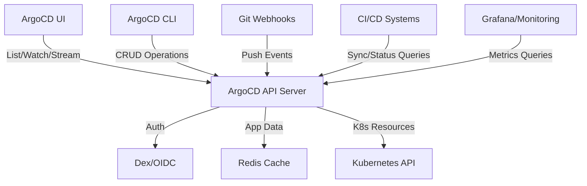

# How to Reduce ArgoCD API Server Load

Author: [nawazdhandala](https://github.com/nawazdhandala)

Tags: ArgoCD, GitOps, Kubernetes, Performance, Scaling

Description: Learn practical strategies to reduce load on the ArgoCD API server including request throttling, caching optimization, UI tuning, and architectural improvements.

---

The ArgoCD API server is the gateway for all user interactions - the UI, CLI, webhooks, and API integrations all go through it. As your ArgoCD deployment grows, the API server can become a bottleneck. Users see slow page loads, CLI commands time out, and webhook delivery fails. This guide covers the most effective ways to reduce API server load and keep it responsive under heavy usage.

## Understanding API Server Load Sources

The ArgoCD API server handles several types of requests:



The biggest load contributors are typically:

1. **UI users with many open tabs** - Each tab establishes a WebSocket stream
2. **CI/CD pipelines polling for sync status** - Frequent API calls from automation
3. **Large application lists** - Listing all applications with full details is expensive
4. **Git webhooks** - High-volume push events from busy repositories

## Strategy 1: Enable and Tune the Redis Cache

The API server uses Redis to cache application state. Ensure Redis is properly configured:

```yaml
# argocd-cmd-params-cm ConfigMap
apiVersion: v1
kind: ConfigMap
metadata:
  name: argocd-cmd-params-cm
  namespace: argocd
data:
  # API server cache expiration
  server.app.state.cache.expiration: "1h"

  # Connection pool size for Redis
  redis.server: "argocd-redis:6379"
```

If Redis is undersized, the API server falls back to Kubernetes API calls:

```yaml
# Scale Redis resources
apiVersion: apps/v1
kind: Deployment
metadata:
  name: argocd-redis
  namespace: argocd
spec:
  template:
    spec:
      containers:
        - name: redis
          resources:
            requests:
              cpu: "200m"
              memory: "256Mi"
            limits:
              cpu: "500m"
              memory: "512Mi"
```

## Strategy 2: Scale API Server Horizontally

The API server is stateless and can be scaled horizontally:

```yaml
apiVersion: apps/v1
kind: Deployment
metadata:
  name: argocd-server
  namespace: argocd
spec:
  replicas: 3  # Run multiple instances
  template:
    spec:
      containers:
        - name: argocd-server
          resources:
            requests:
              cpu: "500m"
              memory: "512Mi"
            limits:
              cpu: "2"
              memory: "1Gi"
```

Add a PodDisruptionBudget:

```yaml
apiVersion: policy/v1
kind: PodDisruptionBudget
metadata:
  name: argocd-server
  namespace: argocd
spec:
  minAvailable: 1
  selector:
    matchLabels:
      app.kubernetes.io/name: argocd-server
```

## Strategy 3: Optimize UI Settings

The ArgoCD UI is one of the largest load generators. Configure it to reduce server-side processing:

```yaml
# argocd-cmd-params-cm ConfigMap
apiVersion: v1
kind: ConfigMap
metadata:
  name: argocd-cmd-params-cm
  namespace: argocd
data:
  # Disable server-side rendering for large application trees
  server.disable.auth: "false"

  # Reduce the frequency of UI status updates
  server.status.cache.expiration: "1m"
```

Educate users on UI best practices:
- Close ArgoCD tabs when not actively using them
- Use filters to view specific applications instead of loading the full list
- Use the CLI for automation instead of the UI

## Strategy 4: Rate Limit API Requests

Protect the API server from excessive requests:

```yaml
# argocd-cmd-params-cm ConfigMap
apiVersion: v1
kind: ConfigMap
metadata:
  name: argocd-cmd-params-cm
  namespace: argocd
data:
  # Rate limit settings
  server.api.content.types: "application/json"
```

Use an ingress-level rate limit for external API access:

```yaml
apiVersion: networking.k8s.io/v1
kind: Ingress
metadata:
  name: argocd-server
  namespace: argocd
  annotations:
    nginx.ingress.kubernetes.io/limit-rps: "50"
    nginx.ingress.kubernetes.io/limit-burst-multiplier: "3"
    nginx.ingress.kubernetes.io/limit-connections: "100"
spec:
  rules:
    - host: argocd.example.com
      http:
        paths:
          - path: /
            pathType: Prefix
            backend:
              service:
                name: argocd-server
                port:
                  number: 443
```

## Strategy 5: Optimize CI/CD Integration

CI/CD pipelines that poll ArgoCD for sync status are a major load source. Replace polling with more efficient patterns:

### Use Webhooks Instead of Polling

Instead of polling `argocd app get` in a loop:

```bash
# BAD: Polling pattern
while true; do
  STATUS=$(argocd app get my-app -o json | jq -r '.status.sync.status')
  if [ "$STATUS" == "Synced" ]; then
    break
  fi
  sleep 5
done
```

Use the `argocd app wait` command which uses server-side streaming:

```bash
# GOOD: Wait with streaming (single connection)
argocd app wait my-app --sync --timeout 300
```

### Reduce API Calls in Pipelines

```bash
# BAD: Multiple API calls
argocd app sync my-app
argocd app get my-app  # Unnecessary - sync already returns status
argocd app resources my-app  # Only if needed

# GOOD: Minimal API calls
argocd app sync my-app --timeout 300
# The sync command waits for completion and returns status
```

## Strategy 6: Separate Webhook Traffic

If you receive heavy webhook traffic, route it through a separate API server instance:

```yaml
# Dedicated API server for webhooks
apiVersion: apps/v1
kind: Deployment
metadata:
  name: argocd-server-webhooks
  namespace: argocd
spec:
  replicas: 2
  selector:
    matchLabels:
      app.kubernetes.io/name: argocd-server-webhooks
  template:
    metadata:
      labels:
        app.kubernetes.io/name: argocd-server-webhooks
    spec:
      containers:
        - name: argocd-server
          image: quay.io/argoproj/argocd:v2.10.0
          command:
            - argocd-server
          resources:
            requests:
              cpu: "250m"
              memory: "256Mi"
---
apiVersion: v1
kind: Service
metadata:
  name: argocd-server-webhooks
  namespace: argocd
spec:
  selector:
    app.kubernetes.io/name: argocd-server-webhooks
  ports:
    - port: 443
      targetPort: 8080
---
# Route webhook traffic to the dedicated server
apiVersion: networking.k8s.io/v1
kind: Ingress
metadata:
  name: argocd-webhooks
spec:
  rules:
    - host: argocd-webhooks.example.com
      http:
        paths:
          - path: /api/webhook
            pathType: Exact
            backend:
              service:
                name: argocd-server-webhooks
                port:
                  number: 443
```

## Strategy 7: Use Read-Only Replicas

For monitoring and observability tools that only need read access:

```yaml
# Read-only API server instances
apiVersion: apps/v1
kind: Deployment
metadata:
  name: argocd-server-readonly
  namespace: argocd
spec:
  replicas: 2
  template:
    spec:
      containers:
        - name: argocd-server
          command:
            - argocd-server
            - --read-only
          resources:
            requests:
              cpu: "250m"
              memory: "256Mi"
```

## Monitoring API Server Load

Set up monitoring to track API server health:

```yaml
# Prometheus alert rules for API server
groups:
  - name: argocd-api-server
    rules:
      - alert: ArgocdAPIServerHighLatency
        expr: |
          histogram_quantile(0.99,
            rate(grpc_server_handling_seconds_bucket{grpc_service="application.ApplicationService"}[5m])
          ) > 5
        for: 10m
        labels:
          severity: warning
        annotations:
          summary: "ArgoCD API server response latency is high"

      - alert: ArgocdAPIServerHighErrorRate
        expr: |
          rate(grpc_server_handled_total{grpc_code!="OK",grpc_service="application.ApplicationService"}[5m])
          /
          rate(grpc_server_handled_total{grpc_service="application.ApplicationService"}[5m])
          > 0.05
        for: 5m
        labels:
          severity: warning
        annotations:
          summary: "ArgoCD API server error rate exceeds 5%"
```

```bash
# Quick health check
kubectl port-forward svc/argocd-server -n argocd 8080:443 &
curl -sk https://localhost:8080/api/v1/session/userinfo
```

For comprehensive API server monitoring and alerting, [OneUptime](https://oneuptime.com) provides real-time dashboards that track response times, error rates, and connection counts across your ArgoCD deployment.

## Key Takeaways

- Scale the API server horizontally since it is stateless
- Ensure Redis is properly sized to avoid cache misses
- Rate limit external API access through your ingress controller
- Replace CI/CD polling with `argocd app wait` for efficient streaming
- Separate webhook traffic from user traffic with dedicated instances
- Educate users to close unused UI tabs and use filters
- Monitor gRPC request latency and error rates for early warning
- Use read-only replicas for monitoring and observability integrations
