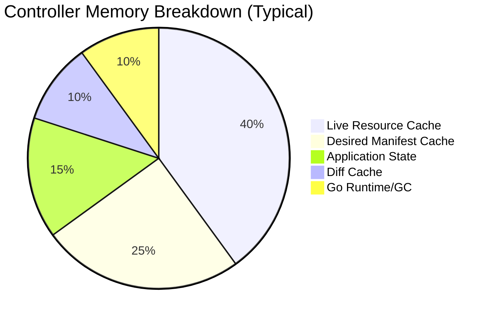

# How to Reduce ArgoCD Controller Memory Usage

Author: [nawazdhandala](https://github.com/nawazdhandala)

Tags: ArgoCD, GitOps, Kubernetes, Performance, Memory Optimization

Description: Learn practical techniques to reduce ArgoCD application controller memory consumption including sharding, resource exclusions, cache tuning, and garbage collection optimization.

---

The ArgoCD application controller is the most memory-hungry component in the ArgoCD stack. It keeps the state of all applications, their resources, and their manifests in memory. As your application count grows, so does memory consumption - often reaching several gigabytes. When the controller exceeds its memory limit, it gets OOMKilled, causing all applications to temporarily lose reconciliation. This guide covers practical techniques to reduce controller memory usage and prevent OOM situations.

## Understanding Controller Memory Usage

The controller's memory is consumed by several data structures:



Key factors that increase memory:

- **Number of applications** - Each application adds state overhead
- **Resources per application** - Applications with hundreds of resources consume more
- **Resource size** - Large ConfigMaps, Secrets, and CRDs take more memory
- **Cluster count** - Each cluster adds its own resource cache

## Technique 1: Enable Controller Sharding

Sharding splits applications across multiple controller replicas, distributing memory load:

```yaml
# Use StatefulSet-based sharding
apiVersion: apps/v1
kind: StatefulSet
metadata:
  name: argocd-application-controller
  namespace: argocd
spec:
  replicas: 3  # Three shards
  template:
    spec:
      containers:
        - name: argocd-application-controller
          env:
            - name: ARGOCD_CONTROLLER_REPLICAS
              value: "3"
          resources:
            requests:
              memory: "2Gi"
            limits:
              memory: "4Gi"
```

With 3 shards, each controller only manages roughly one-third of the applications, reducing per-instance memory by about 60%.

For dynamic cluster distribution sharding:

```yaml
# argocd-cmd-params-cm ConfigMap
apiVersion: v1
kind: ConfigMap
metadata:
  name: argocd-cmd-params-cm
  namespace: argocd
data:
  controller.sharding.algorithm: "round-robin"
```

## Technique 2: Exclude Unnecessary Resources

ArgoCD tracks all resources in namespaces where it manages applications. Many of these resources are not relevant to your applications:

```yaml
# argocd-cm ConfigMap
apiVersion: v1
kind: ConfigMap
metadata:
  name: argocd-cm
  namespace: argocd
data:
  resource.exclusions: |
    # Events are high-volume and not useful for GitOps tracking
    - apiGroups:
        - ""
      kinds:
        - Event
      clusters:
        - "*"
    - apiGroups:
        - "events.k8s.io"
      kinds:
        - Event
      clusters:
        - "*"
    # Endpoints are managed by Kubernetes, not GitOps
    - apiGroups:
        - ""
      kinds:
        - Endpoints
      clusters:
        - "*"
    # EndpointSlices (Kubernetes 1.21+)
    - apiGroups:
        - "discovery.k8s.io"
      kinds:
        - EndpointSlice
      clusters:
        - "*"
    # Pod metrics are transient
    - apiGroups:
        - "metrics.k8s.io"
      kinds:
        - "*"
      clusters:
        - "*"
    # Lease objects for leader election
    - apiGroups:
        - "coordination.k8s.io"
      kinds:
        - Lease
      clusters:
        - "*"
```

Each excluded resource type reduces the number of objects the controller tracks. In large clusters, excluding Events alone can save hundreds of megabytes.

## Technique 3: Tune Go Garbage Collection

The ArgoCD controller is a Go application. The Go garbage collector can be tuned:

```yaml
apiVersion: apps/v1
kind: Deployment
metadata:
  name: argocd-application-controller
  namespace: argocd
spec:
  template:
    spec:
      containers:
        - name: argocd-application-controller
          env:
            # GOGC controls GC frequency
            # Default is 100 (GC when heap doubles)
            # Lower values = more frequent GC = less peak memory
            - name: GOGC
              value: "50"

            # GOMEMLIMIT sets a soft memory limit for the Go runtime
            # Set to ~80% of your container memory limit
            - name: GOMEMLIMIT
              value: "3200MiB"  # If limit is 4Gi
```

`GOGC=50` means garbage collection triggers when the heap grows by 50% instead of 100%. This trades CPU for lower peak memory usage.

`GOMEMLIMIT` tells the Go runtime to aggressively collect garbage when approaching the limit, preventing OOM kills.

## Technique 4: Reduce Application Resource Count

Applications with hundreds of resources consume significantly more memory. Consider splitting them:

```bash
# Find applications with the most resources
argocd app list -o json | jq 'sort_by(.status.resources | length) | reverse | .[:10] | .[] | {name: .metadata.name, resources: (.status.resources | length)}'
```

If an application has 200+ resources, split it into logical components:

```yaml
# Before: One large application
apiVersion: argoproj.io/v1alpha1
kind: Application
metadata:
  name: big-platform
spec:
  source:
    path: platform/  # Contains everything

# After: Split into focused applications
---
apiVersion: argoproj.io/v1alpha1
kind: Application
metadata:
  name: platform-networking
spec:
  source:
    path: platform/networking/
---
apiVersion: argoproj.io/v1alpha1
kind: Application
metadata:
  name: platform-monitoring
spec:
  source:
    path: platform/monitoring/
---
apiVersion: argoproj.io/v1alpha1
kind: Application
metadata:
  name: platform-rbac
spec:
  source:
    path: platform/rbac/
```

## Technique 5: Limit Cluster Resource Tracking

By default, the controller watches all cluster-scoped resources. Limit this to only what you need:

```yaml
# In ArgoCD project, limit cluster resources
apiVersion: argoproj.io/v1alpha1
kind: AppProject
metadata:
  name: default
  namespace: argocd
spec:
  clusterResourceWhitelist:
    # Only track these cluster-scoped resources
    - group: ""
      kind: Namespace
    - group: rbac.authorization.k8s.io
      kind: ClusterRole
    - group: rbac.authorization.k8s.io
      kind: ClusterRoleBinding
  # Block everything else at the cluster level
  clusterResourceBlacklist:
    - group: "*"
      kind: "*"
```

## Technique 6: Optimize Redis Configuration

The controller uses Redis for caching. A well-configured Redis reduces what the controller keeps in its own memory:

```yaml
# External Redis with sufficient memory
apiVersion: v1
kind: ConfigMap
metadata:
  name: argocd-cmd-params-cm
  namespace: argocd
data:
  redis.server: "redis.argocd.svc.cluster.local:6379"
```

```yaml
# Redis with tuned settings
apiVersion: apps/v1
kind: Deployment
metadata:
  name: argocd-redis
spec:
  template:
    spec:
      containers:
        - name: redis
          args:
            - redis-server
            - --maxmemory
            - "1gb"
            - --maxmemory-policy
            - allkeys-lru
          resources:
            requests:
              memory: "1Gi"
            limits:
              memory: "1.5Gi"
```

## Technique 7: Increase Reconciliation Interval

Fewer reconciliations mean less data held in flight:

```yaml
apiVersion: v1
kind: ConfigMap
metadata:
  name: argocd-cm
  namespace: argocd
data:
  timeout.reconciliation: "600"  # 10 minutes instead of 3
```

Combined with webhooks, this significantly reduces controller work and memory churn.

## Monitoring Memory Usage

Set up alerts before OOM kills happen:

```yaml
groups:
  - name: argocd-controller-memory
    rules:
      - alert: ArgocdControllerHighMemory
        expr: |
          container_memory_working_set_bytes{
            namespace="argocd",
            container="argocd-application-controller"
          }
          /
          container_spec_memory_limit_bytes{
            namespace="argocd",
            container="argocd-application-controller"
          }
          > 0.8
        for: 10m
        labels:
          severity: warning
        annotations:
          summary: "ArgoCD controller using >80% of memory limit"

      - alert: ArgocdControllerOOMKill
        expr: |
          increase(kube_pod_container_status_restarts_total{
            namespace="argocd",
            container="argocd-application-controller"
          }[15m]) > 0
        labels:
          severity: critical
        annotations:
          summary: "ArgoCD controller restarted - possible OOM kill"
```

```bash
# Quick memory check
kubectl top pod -n argocd -l app.kubernetes.io/name=argocd-application-controller

# Detailed memory breakdown from Go runtime
kubectl port-forward -n argocd deployment/argocd-application-controller 6060:6060 &
curl -s http://localhost:6060/debug/pprof/heap > heap.prof
go tool pprof heap.prof
```

## Memory Optimization Checklist

| Optimization | Memory Savings | Effort |
|-------------|---------------|--------|
| Exclude Events/Endpoints | 10-30% | Low |
| Controller sharding | 50-70% per instance | Medium |
| GOGC tuning | 10-20% peak | Low |
| GOMEMLIMIT | Prevents OOM | Low |
| Split large applications | 20-40% | Medium |
| Limit cluster resources | 10-20% | Low |
| Increase reconciliation interval | 5-15% | Low |

For continuous monitoring of ArgoCD controller memory patterns and proactive alerting before OOM kills occur, [OneUptime](https://oneuptime.com) provides infrastructure monitoring that integrates with your Kubernetes metrics.

## Key Takeaways

- Exclude Events, Endpoints, and other non-GitOps resources to reduce tracking overhead
- Enable controller sharding to distribute memory across multiple instances
- Set `GOGC=50` and `GOMEMLIMIT` to optimize Go garbage collection
- Split applications with 200+ resources into smaller, focused applications
- Limit cluster-scoped resource tracking through project whitelists
- Monitor memory usage and set alerts at 80% of limits
- Increase reconciliation interval and rely on webhooks for change detection
