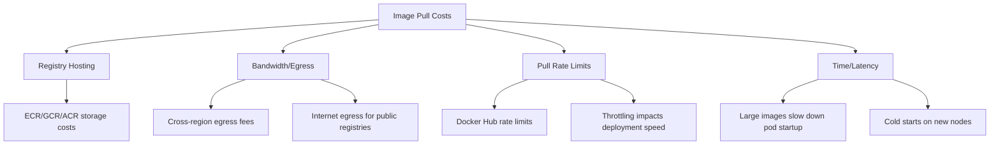

# How to Reduce Docker Image Pull Costs with ArgoCD

Author: [nawazdhandala](https://github.com/nawazdhandala)

Tags: ArgoCD, GitOps, Kubernetes, Container Registry, Cost Optimization

Description: Learn how to reduce container image pull costs and bandwidth in ArgoCD deployments using registry mirrors, caching proxies, and pull optimization strategies.

---

Every time ArgoCD syncs a deployment, Kubernetes pulls container images. If you are running hundreds of applications across multiple clusters, these pulls add up to significant costs and bandwidth. Docker Hub charges for pulls over the rate limit, cloud registry egress costs money, and cross-region pulls are slower and more expensive. Optimizing image pulls is one of those "boring" optimizations that can save thousands of dollars per month.

In this guide, I will show you practical strategies to reduce image pull costs in ArgoCD-managed clusters.

## Understanding Image Pull Costs

Image pull costs come from several sources.



A typical 500MB image pulled across 3 clusters with 10 nodes each, redeployed weekly, costs approximately 60GB of egress per month. At cloud egress rates, that is not trivial.

## Strategy 1: Use ImagePullPolicy Wisely

The default `imagePullPolicy` depends on the tag. For `latest` tags, it defaults to `Always`. For specific tags, it defaults to `IfNotPresent`. For cost optimization, use specific tags with `IfNotPresent` to leverage the node-level cache.

```yaml
# deployment.yaml managed by ArgoCD
spec:
  template:
    spec:
      containers:
        - name: app
          image: registry.myorg.com/app:v2.3.1  # Specific tag
          imagePullPolicy: IfNotPresent  # Use cached image if available
```

However, `IfNotPresent` means if someone pushes a different image with the same tag, nodes with the cached version will not pull the update. To get the best of both worlds, use image digests.

```yaml
image: registry.myorg.com/app@sha256:abc123...  # Immutable reference
imagePullPolicy: IfNotPresent  # Safe with digests - they're immutable
```

With digest references and `IfNotPresent`, you get both correctness and caching.

## Strategy 2: Deploy a Registry Mirror/Pull-Through Cache

A pull-through cache sits inside your cluster and caches images locally. Subsequent pulls for the same image come from the cache instead of the remote registry.

Deploy a registry mirror through ArgoCD.

```yaml
# registry-mirror.yaml
apiVersion: argoproj.io/v1alpha1
kind: Application
metadata:
  name: registry-mirror
  namespace: argocd
spec:
  project: platform
  source:
    repoURL: https://github.com/myorg/cluster-config.git
    path: registry-mirror
    targetRevision: main
  destination:
    server: https://kubernetes.default.svc
    namespace: registry-mirror
  syncPolicy:
    automated:
      selfHeal: true
    syncOptions:
      - CreateNamespace=true
```

The registry mirror deployment.

```yaml
# registry-mirror/deployment.yaml
apiVersion: apps/v1
kind: Deployment
metadata:
  name: registry-mirror
  namespace: registry-mirror
spec:
  replicas: 2
  selector:
    matchLabels:
      app: registry-mirror
  template:
    metadata:
      labels:
        app: registry-mirror
    spec:
      containers:
        - name: registry
          image: registry:2
          env:
            - name: REGISTRY_PROXY_REMOTEURL
              value: https://registry-1.docker.io
            - name: REGISTRY_STORAGE_DELETE_ENABLED
              value: "true"
            - name: REGISTRY_STORAGE_CACHE_BLOBDESCRIPTOR
              value: inmemory
          ports:
            - containerPort: 5000
          volumeMounts:
            - name: cache-storage
              mountPath: /var/lib/registry
          resources:
            requests:
              cpu: "100m"
              memory: "256Mi"
            limits:
              cpu: "500m"
              memory: "1Gi"
      volumes:
        - name: cache-storage
          persistentVolumeClaim:
            claimName: registry-mirror-cache
---
apiVersion: v1
kind: PersistentVolumeClaim
metadata:
  name: registry-mirror-cache
spec:
  accessModes:
    - ReadWriteOnce
  resources:
    requests:
      storage: 100Gi
---
apiVersion: v1
kind: Service
metadata:
  name: registry-mirror
spec:
  ports:
    - port: 5000
      targetPort: 5000
  selector:
    app: registry-mirror
```

Configure your nodes to use the mirror. For containerd, add to the containerd config.

```toml
# /etc/containerd/config.toml
[plugins."io.containerd.grpc.v1.cri".registry.mirrors."docker.io"]
  endpoint = ["http://registry-mirror.registry-mirror.svc.cluster.local:5000"]
```

## Strategy 3: Use Same-Region Registries

Pulling images from a registry in the same region as your cluster avoids egress charges.

```yaml
# Instead of pulling from a central registry across regions
image: us-east-1.ecr.aws/myorg/app:v1.0.0  # Cluster is in eu-west-1 - EXPENSIVE

# Use a regional replica
image: eu-west-1.ecr.aws/myorg/app:v1.0.0  # Same region as cluster - FREE internal transfer
```

For ECR, enable cross-region replication.

```yaml
# ecr-replication.yaml (deployed via ArgoCD using AWS resources)
# Configure ECR replication rules to replicate images
# to all regions where you have clusters
```

For GCR, use multi-region repositories (gcr.io, us.gcr.io, eu.gcr.io, asia.gcr.io).

## Strategy 4: Optimize Image Sizes

Smaller images pull faster and cost less to transfer.

```dockerfile
# Bad: 1.2GB image
FROM ubuntu:22.04
RUN apt-get update && apt-get install -y nodejs npm
COPY . /app
RUN npm install
CMD ["node", "/app/server.js"]

# Good: 150MB image
FROM node:20-alpine AS builder
WORKDIR /app
COPY package*.json ./
RUN npm ci --only=production

FROM node:20-alpine
WORKDIR /app
COPY --from=builder /app/node_modules ./node_modules
COPY . .
USER node
CMD ["node", "server.js"]
```

An 8x reduction in image size means 8x less bandwidth cost and dramatically faster pod startup.

## Strategy 5: Pre-Pull Images with DaemonSets

For frequently deployed images, pre-pull them to all nodes using a DaemonSet managed by ArgoCD.

```yaml
# image-prepuller.yaml
apiVersion: apps/v1
kind: DaemonSet
metadata:
  name: image-prepuller
  namespace: kube-system
spec:
  selector:
    matchLabels:
      app: image-prepuller
  template:
    metadata:
      labels:
        app: image-prepuller
    spec:
      initContainers:
        # List images you want pre-pulled on every node
        - name: pull-app-image
          image: registry.myorg.com/app:v2.3.1
          command: ["sh", "-c", "echo Image pulled"]
          resources:
            requests:
              cpu: "1m"
              memory: "1Mi"
        - name: pull-sidecar-image
          image: envoyproxy/envoy:v1.28.0
          command: ["sh", "-c", "echo Image pulled"]
          resources:
            requests:
              cpu: "1m"
              memory: "1Mi"
      containers:
        - name: pause
          image: gcr.io/google_containers/pause:3.9
          resources:
            requests:
              cpu: "1m"
              memory: "1Mi"
      tolerations:
        - operator: Exists  # Run on all nodes
```

Update this DaemonSet through ArgoCD before deploying new application versions. Use sync waves to ensure pre-pulling happens before the main deployment.

```yaml
metadata:
  annotations:
    argocd.argoproj.io/sync-wave: "-1"  # Pull images before main sync
```

## Strategy 6: Docker Hub Rate Limit Management

Docker Hub limits anonymous pulls to 100 per 6 hours and authenticated pulls to 200 per 6 hours. For ArgoCD clusters pulling many public images, this is easily exceeded.

Configure authenticated pulls for Docker Hub.

```yaml
# docker-hub-secret.yaml
apiVersion: v1
kind: Secret
metadata:
  name: dockerhub-credentials
type: kubernetes.io/dockerconfigjson
data:
  .dockerconfigjson: <base64-encoded-docker-config>
```

Use Kyverno to automatically inject the pull secret into all pods.

```yaml
# inject-pull-secret.yaml
apiVersion: kyverno.io/v1
kind: ClusterPolicy
metadata:
  name: inject-dockerhub-credentials
spec:
  rules:
    - name: add-pull-secret
      match:
        any:
          - resources:
              kinds:
                - Pod
      mutate:
        patchStrategicMerge:
          spec:
            imagePullSecrets:
              - name: dockerhub-credentials
```

Better yet, mirror frequently used Docker Hub images to your private registry and update your ArgoCD manifests to use the mirror.

## Monitoring Pull Costs

Track image pull metrics to measure optimization effectiveness.

```bash
# Check image sizes on nodes
kubectl get nodes -o json | jq '.items[].status.images[] |
  {names: .names[0], sizeBytes: .sizeBytes, sizeMB: (.sizeBytes / 1048576 | floor)}' | \
  jq -s 'sort_by(.sizeMB) | reverse | .[:10]'
```

## Conclusion

Reducing Docker image pull costs in ArgoCD environments combines several tactics: use specific tags with `IfNotPresent` policy for node-level caching, deploy registry mirrors for frequently pulled images, keep images in the same region as your clusters, optimize image sizes with multi-stage builds, and pre-pull critical images with DaemonSets. Each of these individually makes a difference, and together they can reduce pull-related costs and latency by 80% or more. Start by measuring your current pull volumes and costs, then apply optimizations starting with the highest-impact changes.
