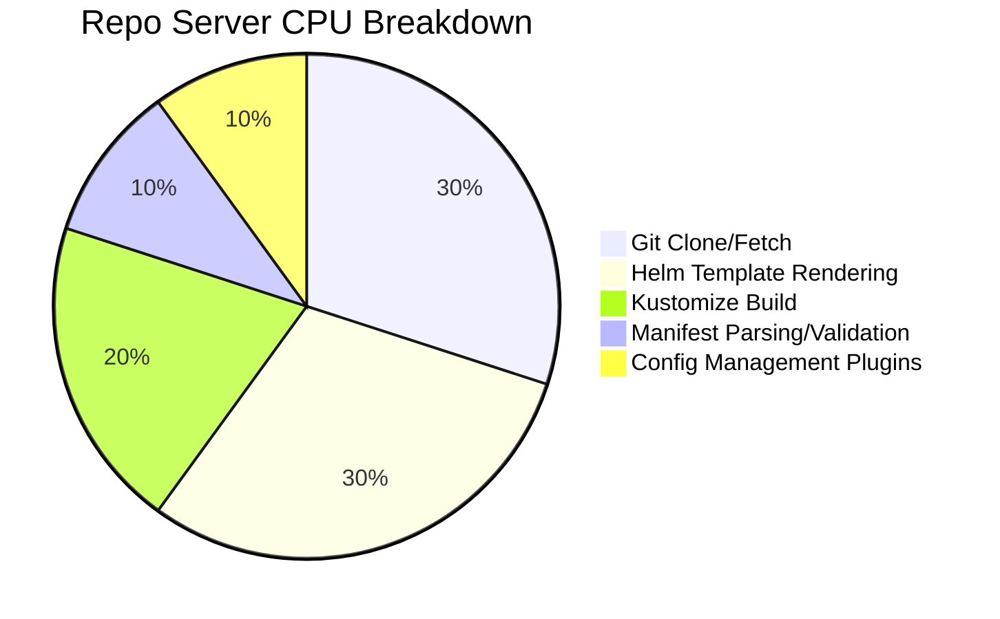

# How to Reduce ArgoCD Repo Server CPU Usage

Author: [nawazdhandala](https://github.com/nawazdhandala)

Tags: ArgoCD, GitOps, Kubernetes, Performance, CPU Optimization

Description: Learn practical techniques to reduce ArgoCD repo server CPU consumption including caching strategies, parallelism tuning, shallow clones, and manifest generation optimization.

---

The ArgoCD repo server is responsible for cloning Git repositories, rendering Helm templates, running Kustomize builds, and generating Kubernetes manifests. Each of these operations is CPU-intensive, and the repo server can easily become a bottleneck as your deployment scales. High CPU usage on the repo server slows down reconciliation, delays manifest generation, and can cause timeouts. This guide covers the most effective techniques to reduce repo server CPU consumption.

## Understanding Repo Server CPU Hotspots

The repo server's CPU is consumed by these operations:



Each reconciliation cycle triggers manifest generation, which means the repo server's CPU load scales linearly with the number of applications multiplied by reconciliation frequency.

## Technique 1: Enable Manifest Caching

The repo server caches generated manifests. If the Git commit hash has not changed since the last generation, it serves the cached result. Ensure caching is properly configured:

```yaml
# argocd-cmd-params-cm ConfigMap
apiVersion: v1
kind: ConfigMap
metadata:
  name: argocd-cmd-params-cm
  namespace: argocd
data:
  # Manifest cache expiration (default: 24h)
  reposerver.repo.cache.expiration: "48h"
```

Verify caching is working by checking cache hit rates:

```bash
# Port-forward the repo server metrics
kubectl port-forward svc/argocd-repo-server -n argocd 8084:8084 &

# Check cache metrics
curl -s http://localhost:8084/metrics | grep cache
```

A low cache hit rate means manifests are being regenerated unnecessarily.

## Technique 2: Enable Shallow Git Clones

Full Git clones download the entire history. Shallow clones only get the latest commit:

```yaml
# argocd-cmd-params-cm ConfigMap
apiVersion: v1
kind: ConfigMap
metadata:
  name: argocd-cmd-params-cm
  namespace: argocd
data:
  reposerver.git.shallow.clone: "true"
```

This reduces both CPU and I/O on the repo server. For a repository with 10,000 commits and 500MB of history, a shallow clone might only transfer 50MB.

## Technique 3: Limit Parallelism

By default, the repo server processes manifest generation requests in parallel without a limit. This can cause CPU spikes when many applications reconcile simultaneously:

```yaml
# argocd-cmd-params-cm ConfigMap
apiVersion: v1
kind: ConfigMap
metadata:
  name: argocd-cmd-params-cm
  namespace: argocd
data:
  # Limit concurrent manifest generation operations
  reposerver.parallelism.limit: "5"
```

Choose the parallelism limit based on your repo server's CPU allocation:

| Repo Server CPUs | Recommended Parallelism |
|------------------|------------------------|
| 1 CPU            | 2                      |
| 2 CPUs           | 4                      |
| 4 CPUs           | 6-8                    |
| 8 CPUs           | 10-15                  |

Setting this too low creates a queue and slows reconciliation. Setting it too high causes CPU contention and makes everything slower.

## Technique 4: Optimize Helm Template Rendering

Helm template rendering is one of the most CPU-intensive operations. Several optimizations help:

### Pin Chart Versions

```yaml
# Avoid: This requires fetching and parsing the chart index
apiVersion: argoproj.io/v1alpha1
kind: Application
spec:
  source:
    repoURL: https://charts.example.com
    chart: my-chart
    targetRevision: "*"  # Bad: resolves latest every time

# Good: Pin the version
spec:
  source:
    repoURL: https://charts.example.com
    chart: my-chart
    targetRevision: "1.2.3"  # Good: deterministic
```

### Reduce Values File Size

Large values files increase rendering time:

```yaml
# Break large values files into smaller, focused ones
spec:
  source:
    helm:
      valueFiles:
        - values-base.yaml       # Small, shared values
        - values-production.yaml  # Environment-specific overrides
```

### Pre-render Complex Templates

If you have Helm charts with heavy templating logic (loops over hundreds of items), consider pre-rendering to plain YAML and deploying that instead.

## Technique 5: Optimize Kustomize Builds

### Avoid Remote Bases

Remote Kustomize bases require Git fetches during build time:

```yaml
# Slow: Fetches remote base every build
resources:
  - https://github.com/org/base-repo//manifests?ref=main

# Fast: Use local copy (synced separately)
resources:
  - ../../base/manifests
```

### Reduce Overlay Complexity

```yaml
# Complex overlays with many patches increase build time
# Consolidate patches where possible
patches:
  - target:
      kind: Deployment
    patch: |
      - op: replace
        path: /spec/replicas
        value: 3
      - op: replace
        path: /spec/template/spec/containers/0/resources/limits/memory
        value: 512Mi
      # ... combine multiple changes into one patch
```

## Technique 6: Scale Repo Server Horizontally

If a single repo server cannot keep up, add more replicas:

```yaml
apiVersion: apps/v1
kind: Deployment
metadata:
  name: argocd-repo-server
  namespace: argocd
spec:
  replicas: 3
  template:
    spec:
      containers:
        - name: argocd-repo-server
          resources:
            requests:
              cpu: "2"
              memory: "2Gi"
            limits:
              cpu: "4"
              memory: "4Gi"
```

Each repo server replica has its own local clone cache, so it takes a warm-up period before caching becomes effective on new replicas.

## Technique 7: Use Persistent Volume for Repo Cache

By default, the repo server clones repositories into an emptyDir volume. This means every pod restart requires re-cloning all repositories:

```yaml
apiVersion: apps/v1
kind: Deployment
metadata:
  name: argocd-repo-server
  namespace: argocd
spec:
  template:
    spec:
      volumes:
        - name: repo-cache
          persistentVolumeClaim:
            claimName: argocd-repo-cache
      containers:
        - name: argocd-repo-server
          volumeMounts:
            - name: repo-cache
              mountPath: /tmp
---
apiVersion: v1
kind: PersistentVolumeClaim
metadata:
  name: argocd-repo-cache
  namespace: argocd
spec:
  accessModes:
    - ReadWriteOnce
  resources:
    requests:
      storage: 20Gi
  storageClassName: fast-ssd  # Use SSD for better I/O
```

With persistent storage, the repo server only needs to fetch incremental changes after a restart instead of full clones.

## Technique 8: Increase Reconciliation Interval

Reducing reconciliation frequency directly reduces repo server load:

```yaml
apiVersion: v1
kind: ConfigMap
metadata:
  name: argocd-cm
  namespace: argocd
data:
  timeout.reconciliation: "600"  # 10 minutes
```

Combined with Git webhooks for immediate change detection, this can reduce repo server CPU by 3x or more.

## Monitoring Repo Server CPU

Track CPU usage and identify optimization opportunities:

```bash
# Check current CPU usage
kubectl top pod -n argocd -l app.kubernetes.io/name=argocd-repo-server

# Check for queued requests (indicates CPU bottleneck)
curl -s http://localhost:8084/metrics | grep argocd_repo_pending_request_total

# Check Git operation duration
curl -s http://localhost:8084/metrics | grep argocd_git_request_duration_seconds
```

Set up alerts for high CPU:

```yaml
groups:
  - name: argocd-repo-server
    rules:
      - alert: ArgocdRepoServerHighCPU
        expr: |
          rate(container_cpu_usage_seconds_total{
            namespace="argocd",
            container="argocd-repo-server"
          }[5m]) > 0.9
        for: 15m
        labels:
          severity: warning
        annotations:
          summary: "ArgoCD repo server CPU usage is above 90%"

      - alert: ArgocdRepoServerQueueBacklog
        expr: |
          argocd_repo_pending_request_total > 10
        for: 5m
        labels:
          severity: warning
        annotations:
          summary: "ArgoCD repo server has queued manifest generation requests"
```

## CPU Optimization Summary

| Technique | CPU Reduction | Effort |
|-----------|--------------|--------|
| Manifest caching | 30-50% | Low |
| Shallow Git clones | 15-25% | Low |
| Parallelism limiting | Controls spikes | Low |
| Helm version pinning | 10-20% | Low |
| Avoid remote Kustomize bases | 20-30% | Medium |
| Scale horizontally | Distributes load | Medium |
| Persistent volume cache | 15-25% on restarts | Medium |
| Increase reconciliation interval | Linear reduction | Low |

For end-to-end monitoring of your ArgoCD repo server performance and CPU optimization tracking, [OneUptime](https://oneuptime.com) provides infrastructure observability that helps you identify and resolve performance bottlenecks.

## Key Takeaways

- Enable manifest caching and shallow Git clones as first-order optimizations
- Set parallelism limits based on available CPU to prevent spikes
- Pin Helm chart versions to avoid unnecessary index resolution
- Avoid remote Kustomize bases that require additional Git fetches
- Scale the repo server horizontally when single-instance optimization is not enough
- Use persistent volumes to preserve the Git clone cache across restarts
- Increase the reconciliation interval and rely on webhooks for change detection
- Monitor pending request count as the primary indicator of CPU saturation
