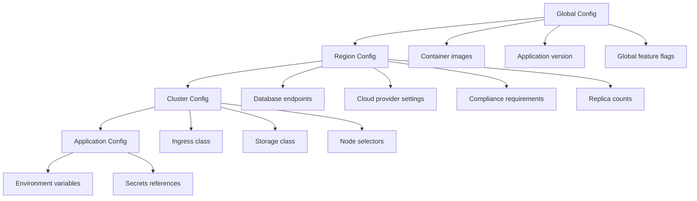

# How to Handle Region-Specific Configuration with ArgoCD

Author: [nawazdhandala](https://github.com/nawazdhandala)

Tags: ArgoCD, GitOps, Kubernetes, Multi-Region, Configuration Management

Description: Learn how to manage region-specific configurations in ArgoCD using Kustomize overlays, Helm values, and ApplicationSets for consistent multi-region deployments.

---

When deploying applications across multiple regions, configuration rarely stays identical. Different regions might need different database endpoints, cloud provider settings, compliance annotations, replica counts, or feature flags. ArgoCD provides several patterns for managing these regional differences while keeping your deployment DRY and maintainable.

This guide covers the strategies for handling region-specific configuration: Kustomize overlays, Helm value files, ApplicationSet templating, and external configuration sources.

## The Configuration Matrix

A typical multi-region application has configuration at multiple levels:



## Approach 1: Kustomize Overlays

Kustomize is the most natural way to handle regional configuration differences in ArgoCD.

### Repository Structure

```
deploy/
  base/
    kustomization.yaml
    deployment.yaml
    service.yaml
    configmap.yaml
    hpa.yaml
  overlays/
    us-east-1/
      kustomization.yaml
      config-patch.yaml
      hpa-patch.yaml
    us-west-2/
      kustomization.yaml
      config-patch.yaml
    eu-west-1/
      kustomization.yaml
      config-patch.yaml
      gdpr-patch.yaml
    ap-southeast-1/
      kustomization.yaml
      config-patch.yaml
```

### Base Configuration

```yaml
# deploy/base/kustomization.yaml
apiVersion: kustomize.config.k8s.io/v1beta1
kind: Kustomization
commonLabels:
  app: order-service
  managed-by: argocd
resources:
  - deployment.yaml
  - service.yaml
  - configmap.yaml
  - hpa.yaml
```

```yaml
# deploy/base/deployment.yaml
apiVersion: apps/v1
kind: Deployment
metadata:
  name: order-service
spec:
  selector:
    matchLabels:
      app: order-service
  template:
    metadata:
      labels:
        app: order-service
    spec:
      containers:
        - name: order-service
          image: registry.company.com/order-service:v2.1.0
          ports:
            - containerPort: 8080
          envFrom:
            - configMapRef:
                name: order-service-config
          resources:
            requests:
              cpu: 200m
              memory: 256Mi
            limits:
              cpu: "1"
              memory: 512Mi
```

```yaml
# deploy/base/configmap.yaml
apiVersion: v1
kind: ConfigMap
metadata:
  name: order-service-config
data:
  REGION: "default"
  LOG_LEVEL: "info"
  CACHE_TTL: "300"
  FEATURE_NEW_CHECKOUT: "false"
```

### Region Overlay - US East

```yaml
# deploy/overlays/us-east-1/kustomization.yaml
apiVersion: kustomize.config.k8s.io/v1beta1
kind: Kustomization
resources:
  - ../../base
patches:
  - path: config-patch.yaml
  - path: hpa-patch.yaml
configMapGenerator:
  - name: order-service-config
    behavior: merge
    literals:
      - REGION=us-east-1
      - DATABASE_HOST=orders-db.us-east-1.rds.amazonaws.com
      - CACHE_ENDPOINT=redis.us-east-1.cache.amazonaws.com:6379
      - CDN_BASE_URL=https://us-east-1.cdn.company.com
      - FEATURE_NEW_CHECKOUT=true
```

```yaml
# deploy/overlays/us-east-1/hpa-patch.yaml
apiVersion: autoscaling/v2
kind: HorizontalPodAutoscaler
metadata:
  name: order-service
spec:
  minReplicas: 5     # Higher traffic in US-East
  maxReplicas: 20
```

### Region Overlay - EU West (with GDPR)

```yaml
# deploy/overlays/eu-west-1/kustomization.yaml
apiVersion: kustomize.config.k8s.io/v1beta1
kind: Kustomization
resources:
  - ../../base
patches:
  - path: config-patch.yaml
  - path: gdpr-patch.yaml
configMapGenerator:
  - name: order-service-config
    behavior: merge
    literals:
      - REGION=eu-west-1
      - DATABASE_HOST=orders-db.eu-west-1.rds.amazonaws.com
      - CACHE_ENDPOINT=redis.eu-west-1.cache.amazonaws.com:6379
      - CDN_BASE_URL=https://eu-west-1.cdn.company.com
      - DATA_RESIDENCY=eu
      - GDPR_MODE=strict
      - LOG_RETENTION_DAYS=365
      - PII_ENCRYPTION=enabled
```

```yaml
# deploy/overlays/eu-west-1/gdpr-patch.yaml
apiVersion: apps/v1
kind: Deployment
metadata:
  name: order-service
  annotations:
    compliance.company.com/gdpr: "true"
    compliance.company.com/data-classification: "personal"
spec:
  template:
    metadata:
      annotations:
        compliance.company.com/gdpr: "true"
    spec:
      containers:
        - name: order-service
          env:
            - name: GDPR_CONSENT_REQUIRED
              value: "true"
            - name: DATA_EXPORT_ENABLED
              value: "true"
            - name: RIGHT_TO_ERASURE_ENABLED
              value: "true"
```

## Approach 2: Helm Value Files Per Region

If you use Helm, create region-specific value files:

```yaml
# charts/order-service/values.yaml (global defaults)
image:
  repository: registry.company.com/order-service
  tag: v2.1.0

replicaCount: 3

config:
  logLevel: info
  cacheTTL: 300
```

```yaml
# charts/order-service/values-us-east-1.yaml
replicaCount: 5

config:
  region: us-east-1
  databaseHost: orders-db.us-east-1.rds.amazonaws.com
  cacheEndpoint: redis.us-east-1.cache.amazonaws.com:6379
  featureNewCheckout: true
```

```yaml
# charts/order-service/values-eu-west-1.yaml
replicaCount: 3

config:
  region: eu-west-1
  databaseHost: orders-db.eu-west-1.rds.amazonaws.com
  cacheEndpoint: redis.eu-west-1.cache.amazonaws.com:6379
  dataResidency: eu
  gdprMode: strict
  logRetentionDays: 365

compliance:
  gdpr: true
  dataClassification: personal
```

Reference region-specific values in your ArgoCD Application:

```yaml
apiVersion: argoproj.io/v1alpha1
kind: Application
metadata:
  name: order-service-eu-west-1
spec:
  source:
    chart: order-service
    repoURL: https://charts.company.com
    targetRevision: 2.1.0
    helm:
      valueFiles:
        - values.yaml
        - values-eu-west-1.yaml
  destination:
    server: https://eu-west-1.k8s.company.com
    namespace: order-service
```

## Approach 3: ApplicationSet with Inline Values

Use the ApplicationSet Cluster Generator to inject region-specific values:

```yaml
# argocd/applicationsets/order-service.yaml
apiVersion: argoproj.io/v1alpha1
kind: ApplicationSet
metadata:
  name: order-service-global
  namespace: argocd
spec:
  generators:
    - clusters:
        selector:
          matchLabels:
            environment: production
        # Region-specific values from cluster labels
        values:
          replicaCount: "3"  # Default
    - clusters:
        selector:
          matchLabels:
            region: us-east-1
        values:
          replicaCount: "5"
          databaseHost: orders-db.us-east-1.rds.amazonaws.com
          cacheEndpoint: redis.us-east-1.cache.amazonaws.com:6379
          featureFlags: "new-checkout=true"
    - clusters:
        selector:
          matchLabels:
            region: eu-west-1
        values:
          replicaCount: "3"
          databaseHost: orders-db.eu-west-1.rds.amazonaws.com
          cacheEndpoint: redis.eu-west-1.cache.amazonaws.com:6379
          gdprMode: "strict"
          dataResidency: "eu"
  template:
    metadata:
      name: "order-service-{{name}}"
    spec:
      project: global-apps
      source:
        repoURL: https://github.com/company/order-service.git
        targetRevision: main
        path: deploy/base
        kustomize:
          commonAnnotations:
            region: "{{metadata.labels.region}}"
      destination:
        server: "{{server}}"
        namespace: order-service
```

## Approach 4: External Configuration with Config Management Plugins

For complex configuration that comes from external systems (Vault, AWS Parameter Store), use ArgoCD Config Management Plugins:

```yaml
# argocd-cm ConfigMap
apiVersion: v1
kind: ConfigMap
metadata:
  name: argocd-cm
  namespace: argocd
data:
  configManagementPlugins: |
    - name: region-config
      generate:
        command: ["/bin/bash", "-c"]
        args:
          - |
            # Fetch region-specific config from Parameter Store
            REGION=$(echo $ARGOCD_APP_PARAMETERS | jq -r '.region')

            # Get all parameters for this region
            aws ssm get-parameters-by-path \
              --path "/apps/$ARGOCD_APP_NAME/$REGION/" \
              --with-decryption \
              --output json | \
            python3 generate-manifests.py --region $REGION
```

## Configuration Validation

Validate that regional configurations are consistent:

```yaml
# .github/workflows/validate-regions.yaml
name: Validate Regional Configs
on:
  pull_request:
    paths:
      - "deploy/**"

jobs:
  validate:
    runs-on: ubuntu-latest
    strategy:
      matrix:
        region: [us-east-1, us-west-2, eu-west-1, ap-southeast-1]
    steps:
      - uses: actions/checkout@v4

      - name: Validate Kustomize overlay
        run: |
          kustomize build deploy/overlays/${{ matrix.region }} | \
            kubectl apply --dry-run=client -f -

      - name: Check required config
        run: |
          # Ensure every region has required config values
          CONFIG=$(kustomize build deploy/overlays/${{ matrix.region }} | \
            yq eval-all 'select(.kind == "ConfigMap" and .metadata.name == "order-service-config")' -)

          for KEY in REGION DATABASE_HOST CACHE_ENDPOINT; do
            if ! echo "$CONFIG" | grep -q "$KEY"; then
              echo "Missing required config key: $KEY in ${{ matrix.region }}"
              exit 1
            fi
          done
```

## Configuration Drift Detection

Monitor for configuration differences across regions that should not exist:

```yaml
# Monitor that all regions use the same application version
template.version-drift-alert: |
  webhook:
    monitoring:
      method: POST
      body: |
        {
          "alert": "version_drift",
          "application": "{{.app.metadata.name}}",
          "region": "{{index .app.metadata.labels "region"}}",
          "version": "{{.app.status.sync.revision}}"
        }
```

Use [OneUptime](https://oneuptime.com) to set up monitoring for configuration drift across regions, alerting when one region falls behind or has unexpected differences.

## Best Practices

1. **Keep the base lean**: The base should contain only configuration shared across all regions.

2. **Use environment variables over config files**: Environment variables are easier to override per region.

3. **Version region configs together**: Changes to regional config should go through the same PR as the base.

4. **Validate all regions in CI**: Every PR should validate all region overlays, not just the one being changed.

5. **Document region differences**: Maintain a table of what varies per region and why.

6. **Use secrets managers per region**: Each region should have its own secrets with region-local endpoints.

## Conclusion

Region-specific configuration is one of the most complex aspects of multi-region deployments. Kustomize overlays provide the cleanest separation of concerns, Helm value files work well for chart-based deployments, and ApplicationSet values handle simple overrides elegantly. The key principle is layering: keep global configuration in the base, regional differences in overlays, and validate everything in CI. This ensures that adding a new region is just adding a new overlay directory, not rewriting your deployment manifests.
