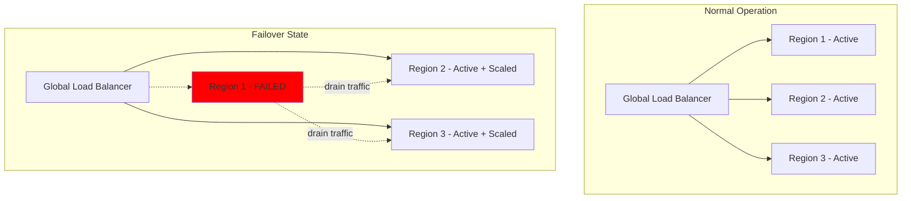
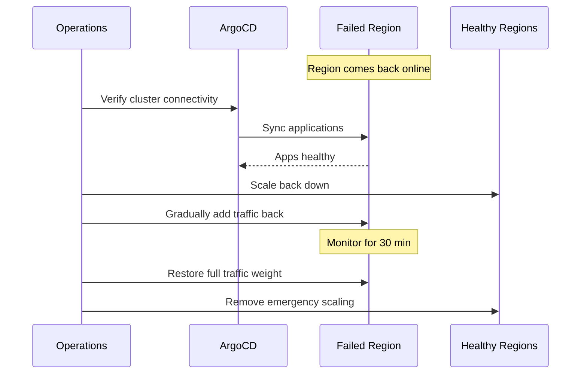

# How to Implement Regional Failover with ArgoCD

Author: [nawazdhandala](https://github.com/nawazdhandala)

Tags: ArgoCD, GitOps, Kubernetes, Disaster Recovery, Multi-Region

Description: Learn how to implement regional failover with ArgoCD for disaster recovery, including traffic shifting, standby promotion, and automated recovery procedures.

---

Regional failover is the process of shifting traffic and workloads from a failed region to a healthy one. When you manage multi-region deployments with ArgoCD, failover can be partially or fully automated through health monitoring, notification triggers, and GitOps-driven configuration changes. The goal is to minimize downtime when an entire region becomes unavailable.

This guide covers failover architecture, automation patterns, traffic management integration, and recovery procedures using ArgoCD.

## Failover Architecture



## Failover Strategies

There are three common patterns:

1. **Active-Active**: All regions serve traffic simultaneously. Failover means removing the failed region from the load balancer.
2. **Active-Passive**: One or more regions are on standby. Failover means promoting a standby region.
3. **Active-Active with Regional Priority**: All regions are active, but each has a primary set of users. Failover redistributes those users.

## Step 1: Health-Based Failover Detection

Configure ArgoCD Notifications to detect when a region's applications become unhealthy:

```yaml
# argocd-notifications-cm ConfigMap
apiVersion: v1
kind: ConfigMap
metadata:
  name: argocd-notifications-cm
  namespace: argocd
data:
  # Detect regional application failure
  trigger.on-region-failure: |
    - description: Application in a region has failed
      when: >-
        app.status.health.status == 'Degraded' and
        app.metadata.labels.region != '' and
        time.Now().Sub(time.Parse(app.status.reconciledAt)).Minutes() < 10
      send:
        - region-failure-webhook
        - region-failure-alert

  # Detect cluster connectivity failure
  trigger.on-cluster-unreachable: |
    - description: Cluster connection lost
      when: >-
        app.status.conditions != nil and
        app.status.conditions[0].type == 'ComparisonError' and
        app.metadata.labels.region != ''
      send:
        - cluster-unreachable-webhook

  template.region-failure-webhook: |
    webhook:
      failover-controller:
        method: POST
        body: |
          {
            "event": "region.failure",
            "region": "{{index .app.metadata.labels "region"}}",
            "application": "{{.app.metadata.name}}",
            "health_status": "{{.app.status.health.status}}",
            "health_message": "{{.app.status.health.message}}",
            "timestamp": "{{.app.status.reconciledAt}}"
          }

  template.cluster-unreachable-webhook: |
    webhook:
      failover-controller:
        method: POST
        body: |
          {
            "event": "cluster.unreachable",
            "region": "{{index .app.metadata.labels "region"}}",
            "application": "{{.app.metadata.name}}",
            "condition": "{{.app.status.conditions[0].message}}",
            "timestamp": "{{.app.status.reconciledAt}}"
          }

  template.region-failure-alert: |
    slack:
      channel: incident-response
      title: "REGION FAILURE: {{index .app.metadata.labels "region"}}"
      text: |
        *Region*: {{index .app.metadata.labels "region"}}
        *Application*: {{.app.metadata.name}}
        *Health*: {{.app.status.health.status}}
        *Message*: {{.app.status.health.message}}

        Failover procedures may be initiated automatically.
        Check the #incident-response channel for updates.
      color: "#FF0000"

  service.webhook.failover-controller: |
    url: https://failover-controller.platform.company.com/api/v1/events
    headers:
      - name: Content-Type
        value: application/json
      - name: Authorization
        value: $failover-controller-token
```

## Step 2: Build the Failover Controller

Create an automated failover controller that responds to regional failures:

```python
# failover-controller/controller.py
import time
import logging
from dataclasses import dataclass
from typing import Dict, List

logger = logging.getLogger(__name__)

@dataclass
class RegionStatus:
    region: str
    healthy_apps: int
    degraded_apps: int
    total_apps: int
    last_updated: float

class FailoverController:
    def __init__(self, argocd_client, dns_client, lb_client):
        self.argocd = argocd_client
        self.dns = dns_client
        self.lb = lb_client
        self.region_status: Dict[str, RegionStatus] = {}
        self.failover_threshold = 0.5  # 50% of apps degraded triggers failover
        self.cooldown_period = 300  # 5 minutes between failover actions

    def handle_event(self, event):
        """Process a region failure event."""
        region = event['region']
        event_type = event['event']

        if event_type == 'cluster.unreachable':
            # Cluster is unreachable - immediate failover
            logger.critical(f"Cluster unreachable in {region}")
            self.initiate_failover(region, reason="cluster_unreachable")

        elif event_type == 'region.failure':
            # Application degraded - check overall region health
            self.update_region_status(region)
            status = self.region_status.get(region)

            if status and status.degraded_apps / status.total_apps > self.failover_threshold:
                logger.warning(
                    f"Region {region} has {status.degraded_apps}/{status.total_apps} "
                    f"degraded apps - initiating failover"
                )
                self.initiate_failover(region, reason="high_degradation")

    def initiate_failover(self, failed_region: str, reason: str):
        """Execute failover from a failed region."""
        logger.info(f"Initiating failover from {failed_region}: {reason}")

        # Step 1: Remove region from global load balancer
        self.lb.drain_region(failed_region)
        logger.info(f"Draining traffic from {failed_region}")

        # Step 2: Scale up remaining regions
        healthy_regions = self.get_healthy_regions(exclude=failed_region)
        for region in healthy_regions:
            self.scale_up_region(region)

        # Step 3: Update DNS weights
        self.dns.update_weights(
            failed_region=failed_region,
            healthy_regions=healthy_regions
        )

        # Step 4: Notify teams
        self.notify_failover(failed_region, healthy_regions, reason)

    def scale_up_region(self, region: str):
        """Scale applications in a region to handle additional traffic."""
        apps = self.argocd.list_apps(labels=f"region={region}")
        for app in apps:
            # Get current HPA max and increase it
            current_max = app.get_hpa_max()
            new_max = int(current_max * 1.5)

            # Update through Git (GitOps way)
            self.update_git_config(
                app.name,
                region,
                {'hpa.maxReplicas': new_max}
            )

    def get_healthy_regions(self, exclude: str) -> List[str]:
        """Get list of healthy regions."""
        all_regions = ['us-east-1', 'us-west-2', 'eu-west-1', 'ap-southeast-1']
        return [r for r in all_regions if r != exclude]
```

## Step 3: DNS-Based Traffic Shifting

Use Route53 health checks (or equivalent) with ArgoCD-managed ExternalDNS:

```yaml
# deploy/overlays/us-east-1/dns-records.yaml
apiVersion: externaldns.k8s.io/v1alpha1
kind: DNSEndpoint
metadata:
  name: api-service-dns
  namespace: api-service
  annotations:
    external-dns.alpha.kubernetes.io/set-identifier: us-east-1
spec:
  endpoints:
    - dnsName: api.company.com
      recordType: A
      targets:
        - 10.0.1.100  # US-East ingress IP
      setIdentifier: us-east-1
      providerSpecific:
        - name: aws/weight
          value: "30"
        - name: aws/health-check-id
          value: "hc-us-east-1-api"
```

During failover, update the weight through Git:

```yaml
# Change weight to 0 to drain traffic
providerSpecific:
  - name: aws/weight
    value: "0"  # was 30
```

## Step 4: Standby Region Promotion (Active-Passive)

For active-passive setups, the standby region runs at minimal capacity. During failover, promote it:

```yaml
# deploy/overlays/eu-west-1-standby/kustomization.yaml
apiVersion: kustomize.config.k8s.io/v1beta1
kind: Kustomization
resources:
  - ../../base
patches:
  - target:
      kind: Deployment
    patch: |
      - op: replace
        path: /spec/replicas
        value: 1  # Minimal standby replicas
  - target:
      kind: HorizontalPodAutoscaler
    patch: |
      - op: replace
        path: /spec/minReplicas
        value: 1
      - op: replace
        path: /spec/maxReplicas
        value: 2
```

During failover, switch to the active overlay:

```yaml
# ArgoCD Application - switch path during failover
spec:
  source:
    path: deploy/overlays/eu-west-1  # was eu-west-1-standby
```

This can be automated through a PR that the failover controller creates:

```python
def promote_standby(self, region: str):
    """Promote a standby region to active."""
    # Create a PR to change the ArgoCD Application path
    self.git.create_branch(f"failover-promote-{region}")
    self.git.update_file(
        f"argocd/apps/{region}.yaml",
        old_path=f"deploy/overlays/{region}-standby",
        new_path=f"deploy/overlays/{region}"
    )
    # Auto-merge for emergency failover
    pr = self.git.create_pr(
        title=f"FAILOVER: Promote {region} to active",
        labels=["emergency", "auto-merge"]
    )
    self.git.merge_pr(pr)
```

## Step 5: Recovery Procedures

After the failed region is restored, follow these steps:



Create a recovery runbook as a series of Git operations:

```bash
#!/bin/bash
# recovery.sh - Regional recovery procedure

REGION=$1
echo "Starting recovery for region: $REGION"

# Step 1: Verify ArgoCD can reach the cluster
argocd cluster get $REGION --server argocd.company.com

# Step 2: Verify all apps in the region are synced
argocd app list --selector "region=$REGION" --output json | \
  jq '.[] | select(.status.sync.status != "Synced") | .metadata.name'

# Step 3: Force sync any out-of-sync apps
argocd app list --selector "region=$REGION" --output json | \
  jq -r '.[] | select(.status.sync.status != "Synced") | .metadata.name' | \
  while read app; do
    echo "Syncing $app..."
    argocd app sync $app --force
  done

# Step 4: Wait for health
echo "Waiting for all apps to become healthy..."
argocd app wait --selector "region=$REGION" --health --timeout 600

# Step 5: Gradually restore traffic (update DNS weights)
echo "Restoring traffic to $REGION at 10%..."
# Update Git with weight=10, let ArgoCD sync
sleep 300

echo "Restoring traffic to $REGION at 50%..."
# Update Git with weight=50
sleep 300

echo "Restoring full traffic to $REGION..."
# Update Git with original weight
```

## Step 6: Failover Testing

Regularly test your failover procedures with chaos engineering:

```yaml
# chaos/regional-failover-test.yaml
apiVersion: batch/v1
kind: CronJob
metadata:
  name: failover-drill
  namespace: chaos-engineering
spec:
  schedule: "0 10 1 * *"  # Monthly at 10 AM on the 1st
  jobTemplate:
    spec:
      template:
        spec:
          containers:
            - name: drill
              image: your-org/failover-drill:latest
              env:
                - name: TARGET_REGION
                  value: us-east-1
                - name: DRILL_DURATION
                  value: "30m"
                - name: DRY_RUN
                  value: "false"
              command:
                - /bin/bash
                - -c
                - |
                  echo "Starting failover drill for $TARGET_REGION"

                  # Simulate region failure by setting DNS weight to 0
                  ./simulate-failure.sh $TARGET_REGION

                  # Monitor that traffic shifts correctly
                  ./monitor-failover.sh $TARGET_REGION $DRILL_DURATION

                  # Restore region
                  ./restore-region.sh $TARGET_REGION

                  echo "Drill complete"
          restartPolicy: OnFailure
```

Monitor failover drills with [OneUptime](https://oneuptime.com) to verify that the failover process meets your RTO (Recovery Time Objective) targets.

## Conclusion

Regional failover with ArgoCD combines health monitoring, automated traffic management, and GitOps-driven configuration changes. The key is detection speed (how quickly you know a region is down), decision automation (when to trigger failover vs. wait for recovery), and recovery procedures (how to safely bring a region back). Use ArgoCD Notifications for detection, automate traffic shifting through DNS and load balancer APIs, and always test your failover procedures through regular drills. A failover system that has never been tested is a failover system that does not work.
