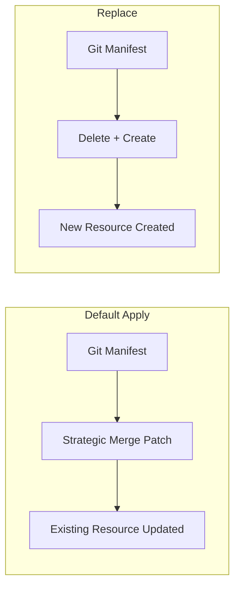

# How to Use the 'Replace' Sync Option in ArgoCD

Author: [nawazdhandala](https://github.com/nawazdhandala)

Tags: ArgoCD, GitOps, Kubernetes, Sync Operations

Description: Learn when and how to use the ArgoCD Replace sync option to force resource recreation instead of patching, solving immutable field errors and stuck deployments.

---

By default, ArgoCD uses `kubectl apply` to sync resources. This performs a strategic merge patch, updating only the fields that changed. But sometimes `apply` is not enough - certain Kubernetes fields are immutable and cannot be changed after creation. That is where the Replace sync option comes in. Replace deletes and recreates resources, which bypasses immutable field restrictions but comes with trade-offs you need to understand.

## What the Replace Sync Option Does

When you enable the Replace sync option, ArgoCD uses `kubectl replace` instead of `kubectl apply` for syncing resources. The difference is:

- **Apply** (default): Sends a patch to the Kubernetes API server that merges changes with the existing resource. Only changed fields are updated.
- **Replace**: Sends the entire resource definition to the Kubernetes API server, which replaces the existing resource completely. This can delete and recreate the resource.



## When to Use Replace

### Immutable Field Changes

The most common reason to use Replace is when you need to change an immutable field. Kubernetes marks certain fields as immutable - they cannot be modified after the resource is created.

Common immutable field errors:

```text
The Deployment "web" is invalid: spec.selector:
  Invalid value: field is immutable

The Service "web" is invalid: spec.clusterIP:
  field is immutable

The Job "migrate" is invalid: spec.template:
  field is immutable
```

When you hit these errors, `kubectl apply` will fail. Replace forces a recreation of the resource with the new field values.

### Stuck Resources

Sometimes resources get into a bad state where apply cannot reconcile them:

```text
# Resource has conflicting field managers
# Strategic merge patch cannot resolve the conflict
```

Replace clears the slate by recreating the resource.

### Service Type Changes

Changing a Service type (ClusterIP to LoadBalancer, or vice versa) often requires Replace because the Service spec changes significantly:

```yaml
# Before: ClusterIP service
spec:
  type: ClusterIP
  ports:
    - port: 80

# After: LoadBalancer service - may need Replace
spec:
  type: LoadBalancer
  ports:
    - port: 80
```

### Job Rerunning

Kubernetes Jobs are immutable after creation. If you need to update and rerun a Job, Replace deletes the old Job and creates a new one.

## How to Enable Replace

### Per-Application (Sync Option)

Add Replace as a sync option in your Application spec:

```yaml
apiVersion: argoproj.io/v1alpha1
kind: Application
metadata:
  name: my-app
  namespace: argocd
spec:
  source:
    repoURL: https://github.com/myorg/manifests.git
    targetRevision: main
    path: apps/my-app
  destination:
    server: https://kubernetes.default.svc
    namespace: my-app
  syncPolicy:
    syncOptions:
      - Replace=true  # Use replace for ALL resources in this app
```

### Per-Resource (Annotation)

For finer control, enable Replace on specific resources using an annotation:

```yaml
apiVersion: apps/v1
kind: Deployment
metadata:
  name: web
  annotations:
    argocd.argoproj.io/sync-options: Replace=true
spec:
  # ...
```

This is the recommended approach - apply Replace only to the specific resources that need it, rather than all resources in the application.

### During Manual Sync (CLI)

Use the `--force` flag during a manual sync to use replace:

```bash
# Force sync uses replace instead of apply
argocd app sync my-app --force
```

Note: `--force` in the CLI is equivalent to Replace. It replaces all resources, not just out-of-sync ones.

### During Manual Sync (UI)

In the ArgoCD UI sync dialog:
1. Click **SYNC**
2. Check the **Force** checkbox
3. Click **SYNCHRONIZE**

## The Trade-Offs

### Downtime Risk

Replace deletes the resource before creating a new one. For Deployments, this means:
- The old Deployment is deleted (including its ReplicaSets and Pods)
- A new Deployment is created
- New Pods are scheduled and started

During this window, there are no running Pods serving traffic. This causes downtime unless you have other safeguards (like multiple replicas being handled by a Deployment's rolling update strategy).

For Services, Replace means:
- The old Service is deleted (including its ClusterIP)
- A new Service is created with a **new** ClusterIP
- Any clients caching the old ClusterIP will fail

### Loss of Status and Runtime Data

When a resource is replaced:
- Status fields are reset
- Runtime annotations added by controllers are lost
- Kubernetes-assigned fields (like ClusterIP, NodePort) get new values
- ResourceVersion changes

### Increased API Server Load

Replace generates more API server activity than apply because it involves delete + create instead of a simple patch.

## Safe Replace Patterns

### Use Per-Resource Annotations

Instead of enabling Replace for the entire application, annotate only the resources that need it:

```yaml
# Only the Job uses Replace
apiVersion: batch/v1
kind: Job
metadata:
  name: db-migrate
  annotations:
    argocd.argoproj.io/sync-options: Replace=true
spec:
  template:
    spec:
      containers:
        - name: migrate
          image: myapp/migrate:v2.0
      restartPolicy: Never

---
# The Deployment uses default apply (no Replace)
apiVersion: apps/v1
kind: Deployment
metadata:
  name: web
  # No Replace annotation
spec:
  replicas: 3
  # ...
```

### Combine with Sync Waves

Use sync waves to ensure dependent resources are not affected by Replace:

```yaml
# Replace the Job first (wave 0)
apiVersion: batch/v1
kind: Job
metadata:
  name: db-migrate
  annotations:
    argocd.argoproj.io/sync-wave: "0"
    argocd.argoproj.io/sync-options: Replace=true
spec:
  # ...

---
# Then update the Deployment normally (wave 1)
apiVersion: apps/v1
kind: Deployment
metadata:
  name: web
  annotations:
    argocd.argoproj.io/sync-wave: "1"
spec:
  # ...
```

### Use ServerSideApply Instead

In many cases, server-side apply (`ServerSideApply=true`) is a better alternative to Replace. It handles field ownership conflicts more gracefully and does not cause downtime:

```yaml
syncPolicy:
  syncOptions:
    - ServerSideApply=true  # Try this before resorting to Replace
```

Server-side apply can resolve some immutable field conflicts that client-side apply cannot, without the destructive recreation that Replace causes.

## Troubleshooting Replace Issues

### Replace Fails with "not found"

If the resource does not exist yet, Replace will fail because there is nothing to replace. ArgoCD handles this by falling back to create, but if you see errors:

```bash
# Check if the resource exists
kubectl get deployment web -n my-app

# If it does not exist, the first sync should use apply (create)
# Replace only works for subsequent syncs
```

### Replace Causes Cascading Failures

If replacing a Service or ConfigMap breaks dependent Pods:

1. Check if Pods reference the Service by ClusterIP (they should use DNS instead)
2. Check if Pods mount ConfigMaps that get recreated with new resource versions
3. Consider whether Replace is truly necessary or if there is a less destructive option

### Replace Loop

If Replace causes a loop (resource is replaced, then detected as OutOfSync, replaced again):

1. Check if the resource has auto-generated fields that differ after recreation
2. Add those fields to `ignoreDifferences`
3. Consider using `ServerSideApply` instead of Replace

The Replace sync option is a powerful tool for handling immutable field changes and stuck resources, but it should be used surgically. Apply it to specific resources that need it, not as a blanket setting for all resources. And always consider whether server-side apply or a different approach might solve your problem without the downtime risk that Replace carries.
