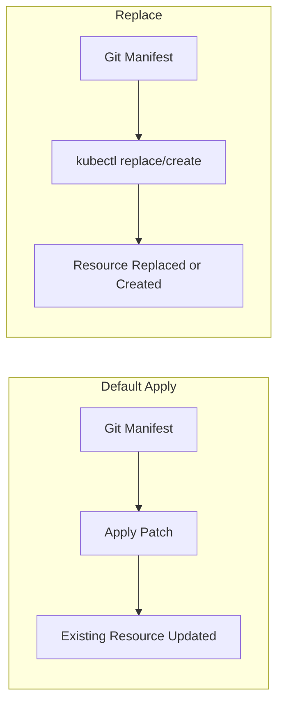

# How to Use the 'Replace' Sync Option in ArgoCD

Author: [nawazdhandala](https://github.com/nawazdhandala)

Tags: ArgoCD, GitOps, Kubernetes, Sync Operations

Description: Learn when and how to use the ArgoCD Replace sync option to force resource recreation instead of patching, solving immutable field errors and stuck deployments.

---

By default, ArgoCD uses `kubectl apply` to sync resources. This performs an apply patch, updating the live resource from the desired configuration. But sometimes `apply` is not enough - for example, very large resources can exceed the size limit of the `kubectl.kubernetes.io/last-applied-configuration` annotation, or you may need full-object update semantics. That is where the Replace sync option comes in. Replace uses `kubectl replace` or `kubectl create` instead of `kubectl apply`, with trade-offs you need to understand.

## What the Replace Sync Option Does

When you enable the Replace sync option, ArgoCD uses `kubectl replace` instead of `kubectl apply` for syncing resources. The difference is:

- **Apply** (default): Sends an apply patch to the Kubernetes API server that merges the desired configuration with the existing resource.
- **Replace**: Sends the entire resource definition to the Kubernetes API server using `kubectl replace`, or creates it if it does not exist. This is a full-object update, not a delete-and-create operation by itself.


```mermaid
flowchart LR
    subgraph Default Apply
        A1[Git Manifest] --> A2[Apply Patch]
        A2 --> A3[Existing Resource Updated]
    end
    subgraph Replace
        R1[Git Manifest] --> R2[kubectl replace/create]
        R2 --> R3[Resource Replaced or Created]
    end
```

## When to Use Replace

### Immutable Field Changes

One common reason people look at Replace is when they need to change an immutable field. Kubernetes marks certain fields as immutable - they cannot be modified after the resource is created.

Common immutable field errors:

```text
The Deployment "web" is invalid: spec.selector:
  Invalid value: field is immutable

The Service "web" is invalid: spec.clusterIP:
  field is immutable

The Job "migrate" is invalid: spec.template:
  field is immutable
```

When you hit these errors, `kubectl apply` will fail, and `kubectl replace` usually fails for the same reason because it is still an update to the existing object. To recreate the resource with new immutable field values in ArgoCD, use `Force=true,Replace=true` on that specific resource so ArgoCD deletes and creates it.

### Stuck Resources

Sometimes resources get into a bad state where apply cannot reconcile them:

```text
# Resource has conflicting field managers

# Strategic merge patch cannot resolve the conflict
```

Replace can help when you need a full-object update instead of apply's last-applied annotation behavior. If you truly need to clear the slate by deleting and recreating the resource, use `Force=true,Replace=true`.

### Service ClusterIP Changes

Changing a Service type, such as ClusterIP to LoadBalancer, is normally a supported update. Changing immutable Service fields such as `clusterIP` is different and requires recreating the Service:

```yaml
# Before: Service with one cluster IP
spec:
  type: ClusterIP
  clusterIP: 10.96.10.20
  ports:
    - port: 80

# After: Different cluster IP - requires recreation
spec:
  type: ClusterIP
  clusterIP: 10.96.10.30
  ports:
    - port: 80
```

### Job Rerunning

Several Job fields, including the pod template for a Job that is not suspended, are immutable after creation. If you need to update and rerun a Job on every sync, use `Force=true,Replace=true` so ArgoCD deletes the old Job and creates a new one.

## How to Enable Replace

### Per-Application (Sync Option)

Add Replace as a sync option in your Application spec:

```yaml
apiVersion: argoproj.io/v1alpha1
kind: Application
metadata:
  name: my-app
  namespace: argocd
spec:
  source:
    repoURL: https://github.com/myorg/manifests.git
    targetRevision: main
    path: apps/my-app
  destination:
    server: https://kubernetes.default.svc
    namespace: my-app
  syncPolicy:
    syncOptions:
      - Replace=true  # Use replace for ALL resources in this app
```

### Per-Resource (Annotation)

For finer control, enable Replace on specific resources using an annotation:

```yaml
apiVersion: apps/v1
kind: Deployment
metadata:
  name: web
  annotations:
    argocd.argoproj.io/sync-options: Replace=true
spec:
  # ...
```

This is the recommended approach - apply Replace only to the specific resources that need it, rather than all resources in the application.

### During Manual Sync (CLI)

Use the `--force` flag during a manual sync when you need a force apply:

```bash
# Force sync uses force apply
argocd app sync my-app --force
```

Note: `--force` in the CLI is not the same as `Replace=true`. `Replace=true` changes the apply operation to `kubectl replace/create`; destructive delete-and-create behavior is configured with `Force=true,Replace=true` on the target resource.

### During Manual Sync (UI)

In the ArgoCD UI sync dialog:
1. Click **SYNC**
2. Check the **Force** checkbox
3. Click **SYNCHRONIZE**

## The Trade-Offs

### Downtime Risk

Replace is a full-object update. It does not delete the resource before creating a new one unless it is combined with Force. With `Force=true,Replace=true`, a Deployment recreation means:
- The old Deployment is deleted (including its ReplicaSets and Pods)
- A new Deployment is created
- New Pods are scheduled and started

During this window, there may be no Pods from that Deployment serving traffic. This causes downtime unless you have other safeguards, such as another workload serving the same traffic while the Deployment is recreated.

For Services, `Force=true,Replace=true` means:
- The old Service is deleted (including its ClusterIP)
- A new Service is created, often with a **new** ClusterIP unless one is specified and available
- Any clients caching the old ClusterIP will fail

### Loss of Status and Runtime Data

When a resource is deleted and recreated:
- Status fields are reset
- Runtime annotations added by controllers are lost
- Kubernetes-assigned fields (like ClusterIP, NodePort) get new values
- ResourceVersion changes

### Increased API Server Load

Replace sends a full-resource update instead of an apply patch. If you combine it with Force, it generates more API server activity because it involves delete and create operations.

## Safe Replace Patterns

### Use Per-Resource Annotations

Instead of enabling Replace for the entire application, annotate only the resources that need it:

```yaml
# Only the Job uses Force and Replace
apiVersion: batch/v1
kind: Job
metadata:
  name: db-migrate
  annotations:
    argocd.argoproj.io/sync-options: Force=true,Replace=true
spec:
  template:
    spec:
      containers:
        - name: migrate
          image: myapp/migrate:v2.0
      restartPolicy: Never

---
# The Deployment uses default apply (no Replace)
apiVersion: apps/v1
kind: Deployment
metadata:
  name: web
  # No Replace annotation
spec:
  replicas: 3
  # ...
```

### Combine with Sync Waves

Use sync waves to control the order that resources are synced:

```yaml
# Recreate the Job first (wave 0)
apiVersion: batch/v1
kind: Job
metadata:
  name: db-migrate
  annotations:
    argocd.argoproj.io/sync-wave: "0"
    argocd.argoproj.io/sync-options: Force=true,Replace=true
spec:
  # ...

---
# Then update the Deployment normally (wave 1)
apiVersion: apps/v1
kind: Deployment
metadata:
  name: web
  annotations:
    argocd.argoproj.io/sync-wave: "1"
spec:
  # ...
```

### Use ServerSideApply Instead

In many cases, server-side apply (`ServerSideApply=true`) is a better alternative to Replace. It avoids the client-side last-applied annotation, handles field ownership more explicitly, and does not cause downtime:

```yaml
syncPolicy:
  syncOptions:
    - ServerSideApply=true  # Try this before resorting to Replace
```

Server-side apply does not bypass Kubernetes immutable field validation, but it can avoid some client-side apply and field ownership problems without the risks of deleting and recreating resources.

## Troubleshooting Replace Issues

### Replace Fails with "not found"

If the resource does not exist yet, `kubectl replace` would fail because there is nothing to replace. ArgoCD handles `Replace=true` by using `kubectl replace` or `kubectl create`, but if you see errors:

```bash
# Check if the resource exists
kubectl get deployment web -n my-app

# If it does not exist, ArgoCD should create it when Replace=true is set
```

### Replace Causes Cascading Failures

If recreating a Service or ConfigMap breaks dependent Pods:

1. Check if Pods reference the Service by ClusterIP (they should use DNS instead)
2. Check if Pods mount ConfigMaps that get recreated with new resource versions
3. Consider whether Replace is truly necessary or if there is a less destructive option

### Replace Loop

If Replace causes a loop (resource is updated, then detected as OutOfSync, updated again):

1. Check if the resource has auto-generated fields that differ after the update
2. Add those fields to `ignoreDifferences`
3. Consider using `ServerSideApply` instead of Replace

The Replace sync option is a powerful tool for full-object updates, but it should be used surgically. Apply it to specific resources that need it, not as a blanket setting for all resources. For immutable field changes or Jobs that must rerun on every sync, combine it with Force on that specific resource. And always consider whether server-side apply or a different approach might solve your problem without the downtime risk of deleting and recreating resources.
