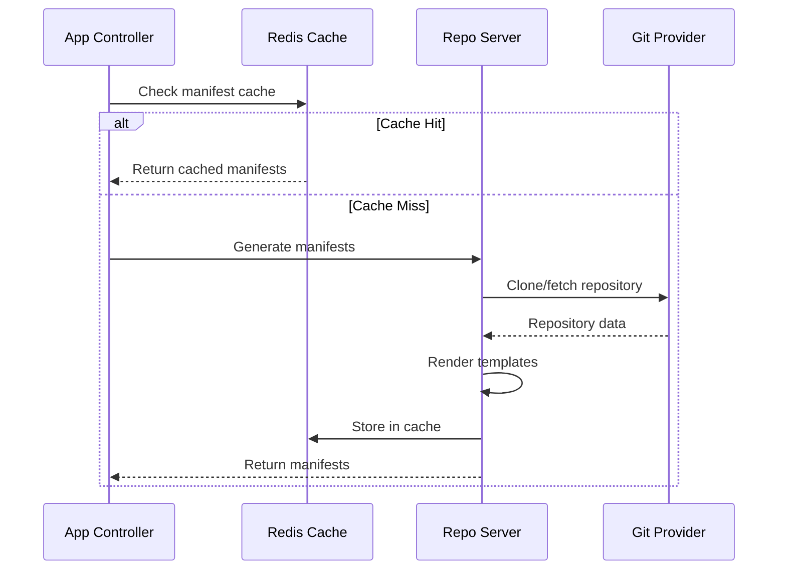

# How to Configure Repo Server Caching for Scale in ArgoCD

Author: [nawazdhandala](https://github.com/nawazdhandala)

Tags: ArgoCD, GitOps, Kubernetes, Performance, Caching

Description: Learn how to configure ArgoCD repo server caching to improve manifest generation performance at scale with Git caching, Helm chart caching, and Redis optimization.

---

The ArgoCD repo server is responsible for cloning Git repositories and generating Kubernetes manifests from Helm charts, Kustomize overlays, plain YAML, and other sources. At scale, it becomes one of the most resource-intensive components in the ArgoCD stack. Every application reconciliation triggers manifest generation, and without proper caching, the repo server clones repositories and renders templates from scratch repeatedly.

This guide covers how to configure repo server caching at every level to handle hundreds or thousands of applications efficiently.

## Understanding the Repo Server's Work

Every time ArgoCD reconciles an application, it asks the repo server to generate the manifests that represent the desired state. The repo server does this by:

1. Cloning or fetching the Git repository
2. Checking out the specified revision
3. Running the appropriate manifest generation tool (Helm template, Kustomize build, plain directory listing)
4. Returning the rendered manifests to the application controller

For a single application, this takes a few seconds. For 500 applications across 20 repositories, this creates enormous I/O and CPU pressure.



## Level 1: Git Repository Caching

The most impactful optimization is caching Git repositories locally on the repo server. By default, the repo server clones repositories into `/tmp`, which may be an ephemeral filesystem that gets cleared on pod restarts.

Configure a persistent or high-performance volume for the repo cache:

```yaml
apiVersion: apps/v1
kind: Deployment
metadata:
  name: argocd-repo-server
  namespace: argocd
spec:
  template:
    spec:
      containers:
      - name: argocd-repo-server
        volumeMounts:
        - name: repo-cache
          mountPath: /tmp
        env:
        # Repo server will reuse cached repos instead of re-cloning
        - name: ARGOCD_GIT_ATTEMPTS_COUNT
          value: "3"
      volumes:
      # Use emptyDir with sizeLimit for high-performance local storage
      - name: repo-cache
        emptyDir:
          sizeLimit: 20Gi
```

For high-performance caching, use a `hostPath` volume backed by an SSD or NVMe drive:

```yaml
volumes:
- name: repo-cache
  hostPath:
    path: /mnt/fast-ssd/argocd-repo-cache
    type: DirectoryOrCreate
```

The size you need depends on the total size of your Git repositories. A good estimate is 3x the total repository size to account for multiple branches and working copies.

## Level 2: Manifest Cache in Redis

ArgoCD caches generated manifests in Redis. When the same revision of an application is reconciled again, the cached manifests are returned directly without invoking the repo server at all.

Configure the cache expiration based on your reconciliation frequency:

```yaml
apiVersion: v1
kind: ConfigMap
metadata:
  name: argocd-cmd-params-cm
  namespace: argocd
data:
  # Cache manifests for 24 hours (default is 24h)
  reposerver.default.cache.expiration: "24h"

  # Timeout for repo server operations
  controller.repo.server.timeout.seconds: "300"
```

The cache key is based on the repository URL, revision, path, and generation parameters. This means a cache hit requires an exact match. If you frequently update repository branches, the cache hit rate will be lower.

## Level 3: Helm Chart Caching

If you use Helm charts extensively, caching the chart downloads saves significant time and bandwidth:

```yaml
apiVersion: apps/v1
kind: Deployment
metadata:
  name: argocd-repo-server
  namespace: argocd
spec:
  template:
    spec:
      containers:
      - name: argocd-repo-server
        env:
        # Cache Helm charts in a dedicated directory
        - name: HELM_CACHE_HOME
          value: /helm-cache
        - name: HELM_CONFIG_HOME
          value: /helm-config
        - name: HELM_DATA_HOME
          value: /helm-data
        volumeMounts:
        - name: helm-cache
          mountPath: /helm-cache
        - name: helm-config
          mountPath: /helm-config
        - name: helm-data
          mountPath: /helm-data
      volumes:
      - name: helm-cache
        emptyDir:
          sizeLimit: 5Gi
      - name: helm-config
        emptyDir:
          sizeLimit: 1Gi
      - name: helm-data
        emptyDir:
          sizeLimit: 5Gi
```

For charts pulled from OCI registries, this cache prevents repeated downloads of the same chart version.

## Level 4: Parallelism Configuration

The repo server has a parallelism limit that controls how many concurrent manifest generation requests it processes. The default is conservative:

```yaml
apiVersion: v1
kind: ConfigMap
metadata:
  name: argocd-cmd-params-cm
  namespace: argocd
data:
  # Increase parallelism for more concurrent operations
  reposerver.parallelism.limit: "20"
```

Set this based on the repo server's CPU allocation. Each concurrent operation uses roughly 0.1 to 0.5 CPU cores depending on the complexity of the manifest generation. With 4 CPU cores, 20 concurrent operations is a reasonable limit.

## Level 5: Horizontal Scaling

For large deployments, run multiple repo server replicas behind the service:

```yaml
apiVersion: apps/v1
kind: Deployment
metadata:
  name: argocd-repo-server
  namespace: argocd
spec:
  replicas: 5
  template:
    spec:
      containers:
      - name: argocd-repo-server
        resources:
          requests:
            cpu: "2"
            memory: "4Gi"
          limits:
            cpu: "4"
            memory: "8Gi"
      # Use pod anti-affinity to spread replicas
      affinity:
        podAntiAffinity:
          preferredDuringSchedulingIgnoredDuringExecution:
          - weight: 100
            podAffinityTerm:
              labelSelector:
                matchExpressions:
                - key: app.kubernetes.io/name
                  operator: In
                  values:
                  - argocd-repo-server
              topologyKey: kubernetes.io/hostname
```

Anti-affinity ensures replicas land on different nodes, which distributes I/O load across the cluster's storage subsystem.

## Level 6: Repository Deduplication

If the same repository is used by many applications (common with monorepos), the repo server can end up cloning it multiple times concurrently. Request deduplication helps:

```yaml
apiVersion: v1
kind: ConfigMap
metadata:
  name: argocd-cmd-params-cm
  namespace: argocd
data:
  # Enable request coalescing for identical repo operations
  reposerver.enable.git.submodule: "false"
```

The repo server automatically deduplicates concurrent requests for the same repository and revision. However, different revisions or paths within the same repo will trigger separate operations.

## Monitoring Cache Effectiveness

You need to track cache hit rates to know if your caching configuration is working. The repo server exposes Prometheus metrics:

```bash
# Key metrics to monitor
# Cache hit rate for manifest generation
argocd_git_request_total{request_type="fetch"}
argocd_git_request_total{request_type="ls-remote"}

# Repo server request duration
argocd_repo_server_request_duration_seconds_bucket

# Active repo server operations
argocd_repo_server_active_operations
```

Create a Grafana dashboard that shows:

```text
# Cache hit ratio
rate(argocd_redis_request_total{hit="true"}[5m]) /
rate(argocd_redis_request_total[5m])
```

A healthy cache hit rate for a stable environment should be above 80%. If you see rates below 50%, investigate whether applications are being reconciled with rapidly changing revisions.

## Tuning for Specific Workloads

### Heavy Helm Usage

If most of your applications use Helm, increase the template execution timeout and consider pre-pulling charts:

```yaml
env:
- name: ARGOCD_EXEC_TIMEOUT
  value: "300s"
- name: HELM_CACHE_HOME
  value: /helm-cache
```

### Large Monorepos

For organizations using a single large Git repository, ensure the repo cache volume is large enough to hold the complete repository with working copies:

```yaml
volumes:
- name: repo-cache
  emptyDir:
    sizeLimit: 50Gi  # Adjust based on repo size
```

### Many Small Repositories

If you have hundreds of small repositories, the bottleneck is typically the number of concurrent Git operations rather than disk space. Increase parallelism and replica count accordingly.

For monitoring the health and performance of your repo server at scale, consider setting up alerts with [OneUptime](https://oneuptime.com/blog/post/2026-02-26-argocd-alerts-degraded-applications/view) to catch performance degradation before it impacts deployment velocity.

## Summary

Repo server caching operates at multiple levels: Git repository caching on disk, manifest caching in Redis, and Helm chart caching. For optimal performance, configure all three levels, tune parallelism based on CPU resources, scale horizontally with pod anti-affinity, and monitor cache hit rates. The combination of these optimizations can reduce manifest generation time from minutes to milliseconds for cache-hit scenarios, which is critical when managing hundreds of applications at scale.
