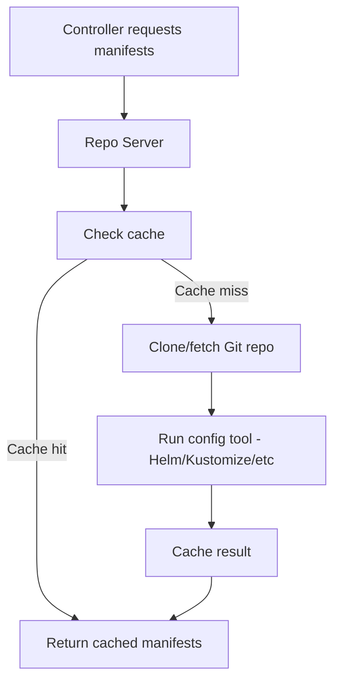

# How to Configure ArgoCD Repo Server Environment Variables

Author: [nawazdhandala](https://github.com/nawazdhandala)

Tags: ArgoCD, GitOps, Kubernetes, Repo Server, Performance Tuning

Description: Learn how to configure ArgoCD repo server environment variables to optimize manifest generation, Git operations, caching, and resource usage for production deployments.

---

The ArgoCD repo server is responsible for cloning Git repositories, rendering manifests (Helm, Kustomize, Jsonnet), and caching the results. It is the most resource-intensive component when dealing with large repositories or complex manifest generation. Tuning its environment variables directly impacts how fast your applications reconcile and how much memory and CPU the repo server consumes.

This guide covers the key environment variables for the repo server and how to configure them for different workload sizes.

## How the Repo Server Works

When ArgoCD needs to check or sync an application, the flow is:



Environment variables control each step: Git operations, manifest generation, caching, and parallelism.

## Setting Environment Variables

Use the `argocd-cmd-params-cm` ConfigMap:

```yaml
apiVersion: v1
kind: ConfigMap
metadata:
  name: argocd-cmd-params-cm
  namespace: argocd
data:
  reposerver.log.level: "info"
  reposerver.parallelism.limit: "0"
```

Or set directly on the Deployment:

```yaml
apiVersion: apps/v1
kind: Deployment
metadata:
  name: argocd-repo-server
  namespace: argocd
spec:
  template:
    spec:
      containers:
        - name: argocd-repo-server
          env:
            - name: ARGOCD_REPO_SERVER_PARALLELISM_LIMIT
              value: "10"
```

## Parallelism and Concurrency

### Manifest Generation Parallelism

The most important tuning parameter. Controls how many manifest generation requests the repo server handles simultaneously:

```yaml
data:
  # Max concurrent manifest generation requests
  # Default: 0 (unlimited)
  reposerver.parallelism.limit: "10"
```

Setting this too high causes memory spikes when multiple large Helm charts render simultaneously. Setting it too low creates a bottleneck:

| Application Count | Recommended Parallelism |
|---|---|
| Under 50 | 0 (unlimited) |
| 50 to 200 | 10 |
| 200 to 500 | 20 |
| 500+ | 30 to 50 |

Monitor the repo server to find the right value for your workload:

```bash
# Check repo server CPU and memory
kubectl top pods -n argocd -l app.kubernetes.io/name=argocd-repo-server

# Check for queued requests
kubectl logs -n argocd deployment/argocd-repo-server | grep -i "queue\|waiting"
```

## Git Configuration

### Git Request Timeout

```yaml
data:
  # Timeout for Git operations in seconds (default: 90)
  reposerver.git.request.timeout: "120"
```

Increase this for large repositories or slow network connections.

### Git Fetch Retry

```yaml
env:
  # Number of retries for Git fetch operations
  - name: ARGOCD_GIT_ATTEMPTS_COUNT
    value: "3"
```

### Git Credential Caching

```yaml
env:
  # Cache Git credentials in memory
  - name: GIT_CREDENTIAL_CACHE_TIMEOUT
    value: "3600"    # Cache for 1 hour
```

### Git LFS Support

```yaml
env:
  # Enable Git LFS
  - name: ARGOCD_GIT_LFS_ENABLED
    value: "true"
```

## Logging Configuration

```yaml
data:
  # Log level: debug, info, warn, error
  reposerver.log.level: "info"

  # Log format: text or json
  reposerver.log.format: "json"
```

Use `json` format for production with log aggregation:

```yaml
data:
  reposerver.log.format: "json"
  reposerver.log.level: "info"
```

## Exec Timeout

Controls the timeout for config management tool execution (Helm template, kustomize build, etc.):

```yaml
data:
  # Timeout for tool execution in seconds (default: 90)
  reposerver.exec.timeout: "180"
```

Increase this if you have:
- Complex Helm charts with many dependencies
- Large Kustomize bases with remote resources
- Custom plugins that take time to generate manifests

## TLS Configuration

```yaml
data:
  # Disable TLS on the repo server (when using service mesh or internal network)
  reposerver.disable.tls: "false"

  # TLS certificate files
  reposerver.tls.cert: "/app/config/reposerver/tls/tls.crt"
  reposerver.tls.key: "/app/config/reposerver/tls/tls.key"
```

## Custom Environment Variables for Plugins

Pass custom environment variables that Config Management Plugins can access:

```yaml
apiVersion: apps/v1
kind: Deployment
metadata:
  name: argocd-repo-server
  namespace: argocd
spec:
  template:
    spec:
      containers:
        - name: argocd-repo-server
          env:
            # Custom variables for plugins (must start with ARGOCD_ENV_)
            - name: ARGOCD_ENV_CLUSTER_NAME
              value: "production-east"
            - name: ARGOCD_ENV_REGION
              value: "us-east-1"
            - name: ARGOCD_ENV_REGISTRY_URL
              value: "123456789.dkr.ecr.us-east-1.amazonaws.com"

            # Variables for Helm plugins
            - name: HELM_CACHE_HOME
              value: "/tmp/helm-cache"
            - name: HELM_CONFIG_HOME
              value: "/tmp/helm-config"
            - name: HELM_DATA_HOME
              value: "/tmp/helm-data"
```

The `ARGOCD_ENV_` prefixed variables are available to all config management tools during manifest generation. See [How to Use Build Environment in Custom Plugins](https://oneuptime.com/blog/post/2026-02-26-argocd-build-environment-custom-plugins/view) for detailed usage.

## Proxy Configuration

For repo servers that need to access Git through a proxy:

```yaml
env:
  # HTTP proxy for Git operations
  - name: HTTP_PROXY
    value: "http://proxy.example.com:3128"
  - name: HTTPS_PROXY
    value: "http://proxy.example.com:3128"
  - name: NO_PROXY
    value: "argocd-server,argocd-application-controller,kubernetes.default.svc"
```

## Volume Configuration

The repo server uses temporary storage for Git clones and manifest rendering. Configure the volume size:

```yaml
apiVersion: apps/v1
kind: Deployment
metadata:
  name: argocd-repo-server
spec:
  template:
    spec:
      containers:
        - name: argocd-repo-server
          volumeMounts:
            - name: tmp
              mountPath: /tmp
      volumes:
        - name: tmp
          emptyDir:
            sizeLimit: 10Gi    # Increase for large repos
```

For very large repositories, consider using a PersistentVolumeClaim:

```yaml
volumes:
  - name: tmp
    persistentVolumeClaim:
      claimName: argocd-repo-server-tmp
```

## Scaling the Repo Server

For production with many applications, scale the repo server horizontally:

```yaml
apiVersion: apps/v1
kind: Deployment
metadata:
  name: argocd-repo-server
spec:
  replicas: 3    # Scale to multiple replicas
  template:
    spec:
      containers:
        - name: argocd-repo-server
          resources:
            requests:
              cpu: "1"
              memory: 2Gi
            limits:
              cpu: "2"
              memory: 4Gi
```

Each replica handles manifest generation independently. The controller distributes requests across replicas.

## Production Configuration Example

Complete production configuration for a medium-scale deployment:

```yaml
apiVersion: v1
kind: ConfigMap
metadata:
  name: argocd-cmd-params-cm
  namespace: argocd
data:
  # Logging
  reposerver.log.level: "info"
  reposerver.log.format: "json"

  # Parallelism
  reposerver.parallelism.limit: "20"

  # Timeouts
  reposerver.exec.timeout: "180"
  reposerver.git.request.timeout: "120"
```

```yaml
apiVersion: apps/v1
kind: Deployment
metadata:
  name: argocd-repo-server
spec:
  replicas: 2
  template:
    spec:
      containers:
        - name: argocd-repo-server
          resources:
            requests:
              cpu: "1"
              memory: 2Gi
            limits:
              cpu: "2"
              memory: 4Gi
          env:
            - name: ARGOCD_GIT_ATTEMPTS_COUNT
              value: "3"
            - name: ARGOCD_ENV_CLUSTER_NAME
              value: "production"
            - name: HELM_CACHE_HOME
              value: "/tmp/helm-cache"
            - name: HELM_CONFIG_HOME
              value: "/tmp/helm-config"
            - name: HELM_DATA_HOME
              value: "/tmp/helm-data"
```

## Monitoring Repo Server Health

Key metrics to watch:

```promql
# Manifest generation duration
argocd_repo_server_manifest_generation_duration_seconds

# Git fetch duration
argocd_repo_server_git_request_duration_seconds

# Active manifest generation requests
argocd_repo_server_active_manifests_requests

# Cache hits vs misses
argocd_repo_server_cache_hit_total
argocd_repo_server_cache_miss_total
```

```bash
# Check repo server resource usage
kubectl top pods -n argocd -l app.kubernetes.io/name=argocd-repo-server

# Check for OOMKilled events
kubectl get events -n argocd --field-selector reason=OOMKilled

# View repo server logs for errors
kubectl logs -n argocd deployment/argocd-repo-server --tail=100
```

## Troubleshooting Common Issues

**Out of memory during Helm rendering:** Increase memory limits and reduce parallelism:

```yaml
resources:
  limits:
    memory: 8Gi
reposerver.parallelism.limit: "5"
```

**Slow manifest generation:** Check for large Git repos and increase the exec timeout. Consider using Git sparse checkout or splitting large repos.

**Git authentication failures:** Verify proxy settings and credential caching. Check the repo server logs for specific errors:

```bash
kubectl logs -n argocd deployment/argocd-repo-server | grep -i "auth\|credential\|denied"
```

## Summary

The ArgoCD repo server handles the heavy lifting of Git operations and manifest generation. Tuning its environment variables - particularly parallelism limits, timeouts, and resource allocation - is essential for production performance. Start with the parallelism limit based on your application count, set appropriate timeouts for your repository sizes, and scale horizontally when a single replica is not enough. Monitor the key metrics to identify bottlenecks and adjust configuration as your deployment footprint grows.
