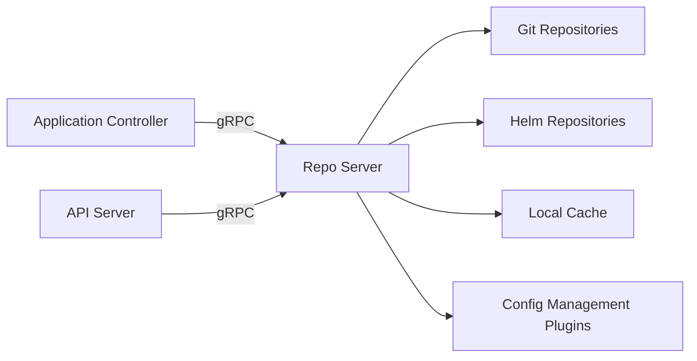

# What Is the ArgoCD Repo Server and How Does It Work?

Author: [nawazdhandala](https://github.com/nawazdhandala)

Tags: ArgoCD, GitOps, Kubernetes, Configuration Management

Description: A practical guide to the ArgoCD Repo Server explaining how it clones repositories, generates manifests, handles caching, and how to troubleshoot and scale it.

---

The ArgoCD Repo Server is the component responsible for turning your Git repositories into Kubernetes manifests. It is the bridge between your source code and what ArgoCD actually deploys to the cluster. Every time ArgoCD needs to know what should be deployed, it asks the Repo Server.

This post explains exactly what the Repo Server does, how it generates manifests, how its caching works, and how to troubleshoot and scale it for production use.

## What the Repo Server Does

The Repo Server has three main jobs:

1. **Cloning Git repositories** - it pulls source code from your Git repos (GitHub, GitLab, Bitbucket, or any Git server)
2. **Generating Kubernetes manifests** - it runs Helm, Kustomize, or reads plain YAML to produce the final manifests
3. **Caching results** - it stores both the cloned repos and the generated manifests to avoid repeating work

When either the Application Controller or the API Server needs to know the desired state for an application, they make a gRPC call to the Repo Server. The Repo Server fetches the repository, generates the manifests, and returns them.



## Manifest Generation Pipeline

When the Repo Server receives a request for manifests, it follows this pipeline:

**Step 1: Check the cache.** Before doing any work, the Repo Server checks if it already has manifests cached for this exact combination of repository URL, revision (commit SHA), path, and parameters. If it does, it returns the cached result immediately.

**Step 2: Clone or update the repository.** If the cache miss occurs, the Repo Server clones the repository (or does a git fetch if it already has a local clone). It checks out the requested revision.

**Step 3: Detect the configuration tool.** The Repo Server looks at the files in the application path to determine which tool to use:
- If there is a `Chart.yaml` file, it uses Helm
- If there is a `kustomization.yaml` file, it uses Kustomize
- If there are only YAML/JSON files, it reads them directly
- If a Config Management Plugin is configured, it uses that

**Step 4: Generate manifests.** The Repo Server runs the appropriate tool:

For Helm applications:
```bash
# What the Repo Server runs internally for Helm apps
helm template <release-name> <chart-path> \
  --namespace <target-namespace> \
  --values values.yaml \
  --set key=value
```

For Kustomize applications:
```bash
# What the Repo Server runs internally for Kustomize apps
kustomize build <path>
```

For plain YAML:
```bash
# Simply reads and concatenates all YAML/JSON files in the path
```

**Step 5: Return and cache.** The generated manifests are returned to the caller and stored in the cache for future requests.

## Repository Cloning and Caching

The Repo Server maintains a local clone of each Git repository on disk. This avoids cloning from scratch on every request.

```bash
# Repos are stored in the Repo Server's data volume
# Default path: /tmp/_argocd-repo

# You can see the cloned repos by exec-ing into the pod
kubectl exec -it deploy/argocd-repo-server -n argocd -- ls /tmp/_argocd-repo
```

When a new revision is requested, the Repo Server does a `git fetch` to get the latest commits and then checks out the requested commit. This is much faster than a full clone.

The manifest cache is keyed by:
- Repository URL
- Revision (commit SHA, not branch name - branches are resolved to SHAs first)
- Path within the repository
- Helm values, parameters, and other tool-specific inputs

This means the same commit will produce cached results even if the branch pointer moves, as long as the commit SHA matches.

## Scaling the Repo Server

The Repo Server is stateless and can be scaled horizontally by increasing the replica count:

```yaml
# Scale the Repo Server for better performance
apiVersion: apps/v1
kind: Deployment
metadata:
  name: argocd-repo-server
  namespace: argocd
spec:
  replicas: 3
  template:
    spec:
      containers:
      - name: argocd-repo-server
        resources:
          requests:
            cpu: 500m
            memory: 512Mi
          limits:
            cpu: "2"
            memory: 1Gi
```

Each replica maintains its own independent cache. This means when you first scale up, new replicas will need to clone repositories and generate manifests from scratch. After a few reconciliation cycles, the caches will be warm.

**When to scale up:**
- Manifest generation is slow (check repo server logs for timing)
- You use many Helm charts with complex templates
- You have many repositories with large histories
- The repo server CPU is consistently high

## Parallelism Settings

The Repo Server has configurable parallelism for manifest generation:

```yaml
# In the argocd-cmd-params-cm ConfigMap
apiVersion: v1
kind: ConfigMap
metadata:
  name: argocd-cmd-params-cm
  namespace: argocd
data:
  # Max number of concurrent manifest generation requests
  reposerver.parallelism.limit: "10"
```

Each manifest generation request forks a process (Helm, Kustomize, etc.), so high parallelism means more CPU and memory usage. Set this based on your server's resources.

## Config Management Plugins

When Helm and Kustomize are not enough, you can extend the Repo Server with Config Management Plugins (CMPs). These let you use any tool to generate manifests - Jsonnet, CUE, custom scripts, or anything that outputs Kubernetes YAML.

CMPs run as sidecar containers alongside the Repo Server. The Repo Server delegates manifest generation to the appropriate sidecar based on the plugin configuration.

```yaml
# Example: CMP sidecar for Jsonnet
apiVersion: apps/v1
kind: Deployment
metadata:
  name: argocd-repo-server
spec:
  template:
    spec:
      containers:
      - name: argocd-repo-server
        # Main repo server container
      - name: jsonnet-plugin
        image: my-jsonnet-plugin:latest
        command: ["/var/run/argocd/argocd-cmp-server"]
        volumeMounts:
        - name: plugins
          mountPath: /home/argocd/cmp-server/plugins
        - name: var-files
          mountPath: /var/run/argocd
      volumes:
      - name: plugins
        emptyDir: {}
      - name: var-files
        emptyDir: {}
```

## Security Considerations

The Repo Server has access to your Git repositories, which may contain sensitive information. Here are some security practices:

**Network isolation** - The Repo Server only needs outbound access to Git servers and Helm repositories. It does not need access to the Kubernetes API directly. Restrict its network policies accordingly.

**Repository credentials** - Credentials for private repositories are stored in Kubernetes Secrets and passed to the Repo Server through the API Server. The Repo Server does not store credentials persistently.

```bash
# Check which repository credentials are configured
argocd repo list

# Repository secrets are stored in the argocd namespace
kubectl get secrets -n argocd -l argocd.argoproj.io/secret-type=repository
```

**Temporary directory cleanup** - The Repo Server stores temporary files during manifest generation. Ensure the data volume has enough space and that old clones are cleaned up. ArgoCD handles this automatically, but monitoring disk usage is still a good practice.

## Troubleshooting

**Problem: Manifest generation times out**

The Repo Server has a default timeout of 60 seconds for manifest generation. Complex Helm charts with many dependencies can exceed this.

```yaml
# Increase the timeout in argocd-cmd-params-cm
apiVersion: v1
kind: ConfigMap
metadata:
  name: argocd-cmd-params-cm
  namespace: argocd
data:
  reposerver.default.cache.expiration: "24h"
  # Timeout for generating manifests
  timeout.reconciliation: "180"
```

**Problem: Repository cloning is slow**

Large repositories with long histories take time to clone. Use shallow clones or ensure the Repo Server has cached the repository.

**Problem: "rpc error: too many open files"**

The Repo Server opens many file descriptors for Git operations and manifest generation. Increase the file descriptor limits:

```yaml
# In the Repo Server deployment
containers:
- name: argocd-repo-server
  securityContext:
    # May need to be set if running into file descriptor limits
  resources:
    limits:
      cpu: "2"
      memory: 2Gi
```

**Problem: Stale manifests after changing Helm values**

The manifest cache includes Helm values in its cache key. If you change values in a values file without changing the commit SHA (unlikely but possible with force pushes), do a hard refresh:

```bash
# Force regeneration of manifests
argocd app get my-app --hard-refresh
```

## Monitoring

The Repo Server exposes Prometheus metrics that help you understand its performance:

```bash
# Port-forward to the metrics endpoint
kubectl port-forward deploy/argocd-repo-server -n argocd 8084:8084

# Key metrics
# argocd_git_request_total - Git operations count
# argocd_git_request_duration_seconds - Git operation duration
# argocd_repo_pending_request_total - Queue depth
```

Watch the pending request count. If it is consistently high, you need more Repo Server replicas or higher parallelism limits.

## The Bottom Line

The Repo Server is the component that translates your Git repositories into the Kubernetes manifests that ArgoCD applies. It handles Git cloning, Helm templating, Kustomize building, and manifest caching. Understanding how it works helps you diagnose slow syncs (is it manifest generation or something else?), scale appropriately (more replicas for Helm-heavy workloads), and extend it with custom tools (Config Management Plugins).

For most setups, the default configuration works well. When you start managing hundreds of applications or using complex Helm charts, tuning the parallelism, cache settings, and replica count becomes important.
