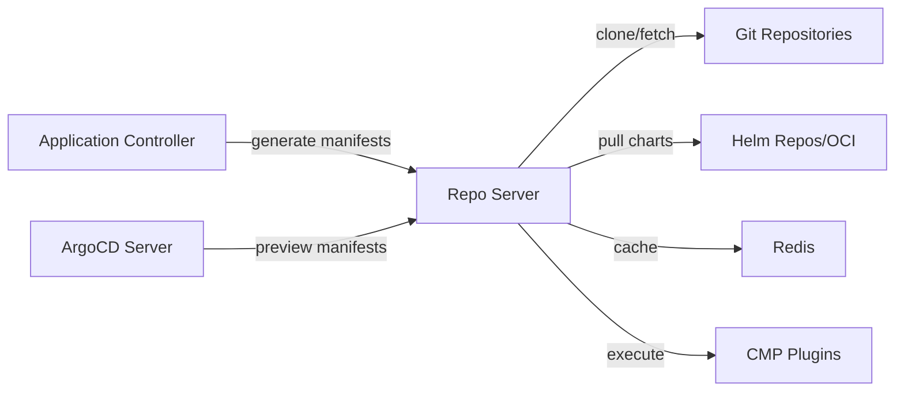

# How to Configure argocd-repo-server Options

Author: [nawazdhandala](https://github.com/nawazdhandala)

Tags: ArgoCD, GitOps, Kubernetes, Repo Server, Performance Tuning

Description: Learn how to configure argocd-repo-server command-line options for Git operations, Helm rendering, parallelism, caching, and custom tooling.

---

The `argocd-repo-server` is responsible for cloning Git repositories, rendering Helm charts, running Kustomize builds, and generating Kubernetes manifests. It is the component that turns your Git source of truth into the actual YAML that ArgoCD compares against the live cluster state. When the repo server is slow or misconfigured, everything else in ArgoCD feels slow too.

This guide covers the essential argocd-repo-server options, performance tuning strategies, and how to configure it for large repositories and custom tools.

## What the Repo Server Does

The repo server handles several critical tasks:

1. **Git clone/fetch** - Downloads repository content
2. **Manifest generation** - Runs Helm template, Kustomize build, or reads plain YAML
3. **Parameter resolution** - Resolves Helm values, Kustomize parameters
4. **Caching** - Caches generated manifests and repository content
5. **Plugin execution** - Runs custom config management plugins



## Setting Repo Server Options

### Using Kustomize

```yaml
patches:
  - target:
      kind: Deployment
      name: argocd-repo-server
    patch: |
      - op: replace
        path: /spec/template/spec/containers/0/command
        value:
          - argocd-repo-server
          - --parallelism-limit=5
          - --logformat=json
          - --loglevel=info
```

### Using Helm

```yaml
repoServer:
  extraArgs:
    - --parallelism-limit=5
    - --logformat=json
```

## Core Processing Options

### --parallelism-limit

The most important tuning parameter. Controls how many manifest generation operations can run concurrently. Default is 0 (unlimited).

```yaml
command:
  - argocd-repo-server
  - --parallelism-limit=5
```

Setting a limit prevents the repo server from being overwhelmed when many applications sync simultaneously.

**Recommended values**:
- Small deployments (under 50 apps): 0 (unlimited) or 5
- Medium deployments (50 to 200 apps): 5 to 10
- Large deployments (over 200 apps): 10 to 20

Without a limit, if 100 applications all need manifest generation at the same time, the repo server will try to process all 100 concurrently. This causes memory spikes and CPU contention.

### --repo-cache-expiration

How long generated manifests are cached. Default is 24h.

```yaml
command:
  - argocd-repo-server
  - --repo-cache-expiration=12h
```

Lower values mean more frequent Git clones and manifest generation. Higher values reduce load but delay detection of changes in non-webhook setups.

## Git Operations

### --git-request-timeout

Timeout for Git operations. Default is 15 seconds.

```yaml
command:
  - argocd-repo-server
  - --git-request-timeout=30
```

Increase this for large repositories or slow network connections to your Git provider.

### --git-retry-max-duration

Maximum duration for retrying failed Git operations. Default is 10 seconds.

```yaml
command:
  - argocd-repo-server
  - --git-retry-max-duration=30s
```

### --git-shallow-clone

Enable shallow cloning to speed up Git operations for large repositories.

```yaml
command:
  - argocd-repo-server
  - --git-shallow-clone
```

This reduces the amount of Git history downloaded, significantly speeding up clone operations for repositories with many commits.

## Helm Configuration

### --helm-manifest-max-extracted-size

Maximum size of extracted Helm chart. Default is 1G.

```yaml
command:
  - argocd-repo-server
  - --helm-manifest-max-extracted-size=2G
```

### --helm-registry-max-index-size

Maximum size for Helm registry index. Default is 1G.

```yaml
command:
  - argocd-repo-server
  - --helm-registry-max-index-size=2G
```

Increase this if you use Helm repositories with many charts.

## Security Options

### --disable-tls

Disables TLS on the repo server's gRPC endpoint. Useful when running within a service mesh.

```yaml
command:
  - argocd-repo-server
  - --disable-tls
```

### --tls-cert-file and --tls-key-file

Custom TLS certificates for the gRPC server.

```yaml
command:
  - argocd-repo-server
  - --tls-cert-file=/tls/tls.crt
  - --tls-key-file=/tls/tls.key
```

## Logging

### --loglevel and --logformat

```yaml
command:
  - argocd-repo-server
  - --loglevel=info
  - --logformat=json
```

## Redis Configuration

### --redis

```yaml
command:
  - argocd-repo-server
  - --redis=argocd-redis-ha-haproxy:6379
```

### --redis-compress

Enable compression for cached data in Redis.

```yaml
command:
  - argocd-repo-server
  - --redis-compress=gzip
```

This can significantly reduce Redis memory usage, especially for large manifests.

## Resource Configuration

The repo server's resource needs depend on how many concurrent operations it handles and the size of your repositories.

```yaml
containers:
  - name: argocd-repo-server
    resources:
      requests:
        cpu: 500m
        memory: 512Mi
      limits:
        cpu: "2"
        memory: 2Gi
```

For large Helm charts or Kustomize builds:

```yaml
resources:
  requests:
    cpu: "1"
    memory: 1Gi
  limits:
    cpu: "4"
    memory: 4Gi
```

## Volume Configuration

The repo server uses temporary storage for cloning repositories. By default, it uses emptyDir volumes.

### Increasing Temp Storage

For large repositories, the default emptyDir may not be enough.

```yaml
volumes:
  - name: tmp
    emptyDir:
      sizeLimit: 10Gi
```

### Using Memory-Backed tmpfs

For better performance with many small repositories:

```yaml
volumes:
  - name: tmp
    emptyDir:
      medium: Memory
      sizeLimit: 2Gi
```

This uses RAM for temporary storage, making Git operations faster. But be careful with the size limit as it counts against the container's memory limit.

## Custom Tools and Plugins

### Config Management Plugins (CMP)

If you use custom config management plugins, they run as sidecar containers alongside the repo server.

```yaml
apiVersion: apps/v1
kind: Deployment
metadata:
  name: argocd-repo-server
  namespace: argocd
spec:
  template:
    spec:
      containers:
        - name: argocd-repo-server
          command:
            - argocd-repo-server
            - --parallelism-limit=5
        # Custom plugin sidecar
        - name: my-plugin
          image: my-registry/my-plugin:latest
          command: ["/var/run/argocd/argocd-cmp-server"]
          volumeMounts:
            - name: var-files
              mountPath: /var/run/argocd
            - name: plugins
              mountPath: /home/argocd/cmp-server/plugins
            - name: cmp-config
              mountPath: /home/argocd/cmp-server/config
      volumes:
        - name: cmp-config
          configMap:
            name: my-plugin-config
```

## Full Production Configuration

```yaml
apiVersion: apps/v1
kind: Deployment
metadata:
  name: argocd-repo-server
  namespace: argocd
spec:
  replicas: 2  # HA with multiple replicas
  template:
    spec:
      containers:
        - name: argocd-repo-server
          image: quay.io/argoproj/argocd:v2.10.0
          command:
            - argocd-repo-server
            # Concurrency control
            - --parallelism-limit=10
            # Git optimization
            - --git-request-timeout=30
            - --git-shallow-clone
            # Caching
            - --repo-cache-expiration=12h
            - --redis-compress=gzip
            # Logging
            - --logformat=json
            - --loglevel=info
          resources:
            requests:
              cpu: 500m
              memory: 1Gi
            limits:
              cpu: "2"
              memory: 4Gi
          volumeMounts:
            - name: tmp
              mountPath: /tmp
      volumes:
        - name: tmp
          emptyDir:
            sizeLimit: 10Gi
```

## Monitoring Repo Server Performance

The repo server exposes metrics on port 8084.

```bash
# Port-forward to the metrics endpoint
kubectl port-forward -n argocd deployment/argocd-repo-server 8084:8084
curl localhost:8084/metrics | grep argocd_git
```

Key metrics:
- `argocd_git_request_total` - Total Git requests
- `argocd_git_request_duration_seconds` - Git operation duration
- `argocd_repo_pending_request_total` - Pending manifest generation requests

### Identifying Bottlenecks

If `argocd_repo_pending_request_total` is consistently high, increase `--parallelism-limit` or add more replicas.

If `argocd_git_request_duration_seconds` is high, check your network connectivity to Git or enable shallow cloning.

## Scaling the Repo Server

### Horizontal Scaling

Simply increase the replica count. The controller distributes requests across available replicas.

```yaml
spec:
  replicas: 3
```

### Vertical Scaling

Increase resources per replica. This is better for large repositories that need more memory per operation.

```yaml
resources:
  requests:
    cpu: "2"
    memory: 4Gi
  limits:
    cpu: "4"
    memory: 8Gi
```

## Common Issues

### Out of Memory During Helm Template

Large Helm charts can cause OOM kills. Increase memory limits.

### Git Clone Timeout

Large repositories with deep history time out. Use `--git-shallow-clone` and increase `--git-request-timeout`.

### Cache Miss Storm

When the cache expires, all applications try to regenerate manifests simultaneously. Use staggered cache expiration or set `--parallelism-limit`.

## Conclusion

The argocd-repo-server is the performance bottleneck in most ArgoCD deployments. The key options to tune are `--parallelism-limit` to prevent overload, `--git-shallow-clone` to speed up cloning, and resource limits to prevent OOM kills. For large deployments, scaling horizontally with multiple replicas is more effective than running a single large instance. Monitor the Git request duration and pending request count metrics to identify when tuning is needed.
