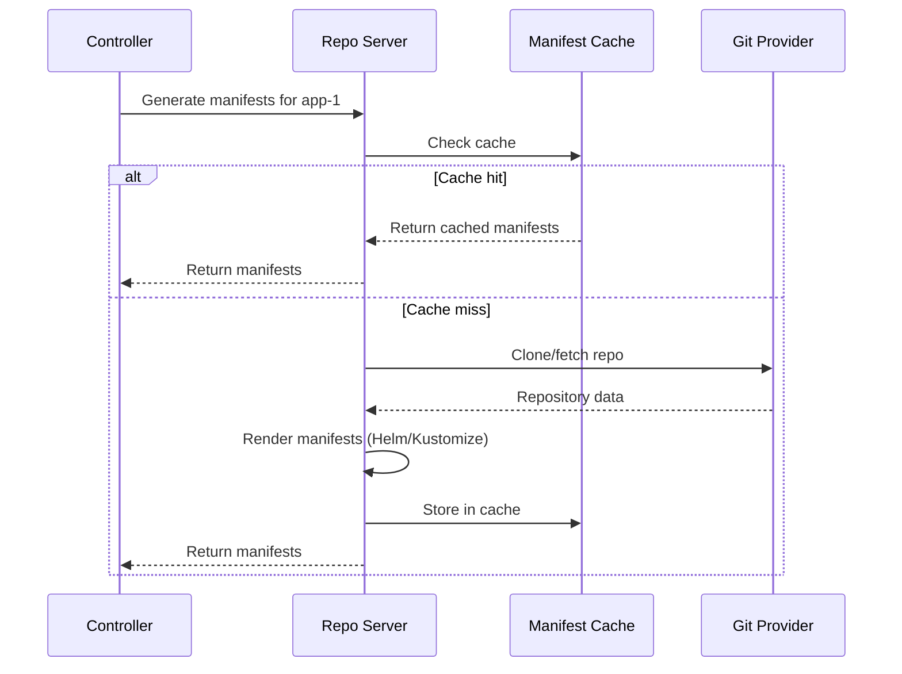

# How to Configure Repo Server Parallelism in ArgoCD

Author: [nawazdhandala](https://github.com/nawazdhandala)

Tags: ArgoCD, GitOps, Kubernetes, Performance, Configuration

Description: Learn how to configure and tune ArgoCD repo server parallelism settings to balance manifest generation throughput with resource consumption.

---

The ArgoCD repo server handles all manifest generation work - cloning Git repos, rendering Helm templates, building Kustomize overlays, and running config management plugins. By default, it processes these requests without a concurrency limit, which can overwhelm the server when many applications reconcile simultaneously. Configuring repo server parallelism gives you control over how many manifest generation operations run at the same time. This guide covers the settings, tuning strategies, and monitoring to get parallelism right.

## Understanding Repo Server Request Flow

When the application controller needs manifests for an application, it sends a request to the repo server:



Without parallelism limits, all incoming requests are processed concurrently. With 200 applications reconciling at once, the repo server tries to run 200 Git operations and manifest generations simultaneously.

## Configuring the Parallelism Limit

The primary setting is `reposerver.parallelism.limit` in the `argocd-cmd-params-cm` ConfigMap:

```yaml
apiVersion: v1
kind: ConfigMap
metadata:
  name: argocd-cmd-params-cm
  namespace: argocd
data:
  # Limit concurrent manifest generation operations
  # Default: 0 (unlimited)
  reposerver.parallelism.limit: "5"
```

When set to 5, the repo server processes at most 5 manifest generation requests simultaneously. Additional requests are queued and processed as slots become available.

Apply and restart:

```bash
kubectl apply -f argocd-cmd-params-cm.yaml
kubectl rollout restart deployment argocd-repo-server -n argocd
```

## Choosing the Right Parallelism Value

The optimal value depends on your repo server's resources and the complexity of your manifest generation:

### Based on CPU Allocation

```text
Recommended parallelism = (Repo server CPU cores) * 2
```

For example:
- 1 CPU: parallelism = 2
- 2 CPUs: parallelism = 4
- 4 CPUs: parallelism = 8

### Based on Memory Allocation

Each concurrent manifest generation holds repository data and rendered manifests in memory. A rough estimate:

```text
Memory per concurrent operation = 100MB to 500MB (depending on repo size)
Recommended parallelism = (Available memory - 500MB baseline) / 300MB
```

For a repo server with 4GB memory limit:
```text
(4096MB - 500MB) / 300MB = ~12
```

### Based on Workload Type

| Workload | Memory per Op | Recommended Parallelism |
|----------|--------------|------------------------|
| Small YAML dirs | 50-100MB | Higher (10-15) |
| Helm charts | 100-200MB | Medium (5-10) |
| Large Kustomize overlays | 200-500MB | Lower (3-5) |
| Config management plugins | Varies | Start at 3, tune up |

## Monitoring the Queue

When parallelism is limited, requests that cannot be served immediately are queued. Monitor the queue to detect if your limit is too restrictive:

```bash
# Check pending request count
kubectl port-forward svc/argocd-repo-server -n argocd 8084:8084 &
curl -s http://localhost:8084/metrics | grep argocd_repo_pending_request_total
```

If `argocd_repo_pending_request_total` is consistently above 10, your parallelism limit might be too low. If it stays near 0, you have headroom to reduce the limit and save resources.

Set up a Prometheus alert:

```yaml
groups:
  - name: argocd-repo-server-queue
    rules:
      - alert: ArgocdRepoServerHighQueueDepth
        expr: argocd_repo_pending_request_total > 20
        for: 10m
        labels:
          severity: warning
        annotations:
          summary: "ArgoCD repo server has {{ $value }} pending requests"
          description: "Consider increasing parallelism limit or scaling repo server replicas"
```

## Parallelism with Multiple Repo Server Replicas

When running multiple repo server replicas, each replica applies the parallelism limit independently:

```yaml
apiVersion: apps/v1
kind: Deployment
metadata:
  name: argocd-repo-server
  namespace: argocd
spec:
  replicas: 3
```

```yaml
# argocd-cmd-params-cm
data:
  reposerver.parallelism.limit: "5"
```

With this configuration, the total cluster-wide parallelism is 3 replicas * 5 = 15 concurrent operations. The controller distributes requests across replicas using gRPC load balancing.

### Sizing for Multiple Replicas

```text
Total parallelism = Replicas * Per-replica limit
Per-replica limit = Desired total parallelism / Replicas
```

If you need 15 total concurrent operations across 3 replicas:
```yaml
data:
  reposerver.parallelism.limit: "5"  # 15 / 3
```

## Separate Parallelism for Different Operations

ArgoCD does not currently support separate parallelism limits for Git operations vs manifest rendering. However, you can achieve similar effects by:

### Using Separate Repo Server Deployments

For organizations with both simple YAML deployments and complex Helm charts:

```yaml
# Repo server for simple manifests (high parallelism)
apiVersion: apps/v1
kind: Deployment
metadata:
  name: argocd-repo-server-simple
spec:
  template:
    spec:
      containers:
        - name: argocd-repo-server
          env:
            - name: ARGOCD_REPO_SERVER_PARALLELISM_LIMIT
              value: "10"
          resources:
            requests:
              cpu: "1"
              memory: "1Gi"
```

## Parallelism and Timeout Interaction

When requests are queued due to parallelism limits, they may time out before being processed. Ensure your timeouts account for queue wait time:

```yaml
# argocd-cmd-params-cm
apiVersion: v1
kind: ConfigMap
metadata:
  name: argocd-cmd-params-cm
  namespace: argocd
data:
  reposerver.parallelism.limit: "5"

  # Increase timeout to account for queue wait time
  # Default is 60 seconds
  controller.repo.server.timeout.seconds: "120"
```

If you see timeout errors in the controller logs:

```bash
# Check for timeout errors
kubectl logs -n argocd deployment/argocd-application-controller | grep -i "timeout\|deadline"
```

Either increase the timeout or increase the parallelism limit.

## Performance Testing Parallelism Settings

Use this approach to find the optimal setting:

```bash
#!/bin/bash
# test-parallelism.sh
# Test different parallelism settings and measure throughput

for LIMIT in 2 5 8 10 15; do
  echo "Testing parallelism limit: $LIMIT"

  # Update the setting
  kubectl patch configmap argocd-cmd-params-cm -n argocd \
    --type merge -p "{\"data\":{\"reposerver.parallelism.limit\":\"$LIMIT\"}}"

  # Restart repo server
  kubectl rollout restart deployment argocd-repo-server -n argocd
  kubectl rollout status deployment argocd-repo-server -n argocd

  # Wait for warm-up
  sleep 60

  # Force refresh all apps to trigger manifest generation
  argocd app list -o name | head -20 | while read app; do
    argocd app get "$app" --hard-refresh &
  done
  wait

  # Measure metrics
  echo "Pending requests:"
  curl -s http://localhost:8084/metrics | grep argocd_repo_pending_request_total

  echo "CPU usage:"
  kubectl top pod -n argocd -l app.kubernetes.io/name=argocd-repo-server

  echo "---"
  sleep 30
done
```

## Common Parallelism Mistakes

### Setting Too Low

```yaml
# Too restrictive for 500 applications
reposerver.parallelism.limit: "1"
```

This creates a massive queue. Applications take minutes to get their manifests generated.

### Setting Too High

```yaml
# Too aggressive for a 2-CPU repo server
reposerver.parallelism.limit: "50"
```

All 50 concurrent operations compete for 2 CPUs, making each one slower than if they ran with less contention.

### Not Adjusting After Scaling

When you add repo server replicas, remember to recalculate per-replica parallelism:

```yaml
# Before: 1 replica, limit=10 (10 total)
# After: 3 replicas, limit=10 (30 total - might be too much)
# Fix: 3 replicas, limit=4 (12 total - similar to before)
```

For comprehensive monitoring of your ArgoCD repo server performance and parallelism tuning, [OneUptime](https://oneuptime.com) provides dashboards that correlate queue depth, CPU usage, and reconciliation latency.

## Key Takeaways

- Set `reposerver.parallelism.limit` to prevent resource contention during reconciliation spikes
- Start with `(CPU cores * 2)` as a baseline and tune from there
- Monitor `argocd_repo_pending_request_total` to detect if the limit is too restrictive
- Account for queue wait time when setting controller timeouts
- With multiple replicas, total parallelism = replicas * per-replica limit
- Test different settings systematically to find the optimal value
- Adjust parallelism when adding or removing repo server replicas
