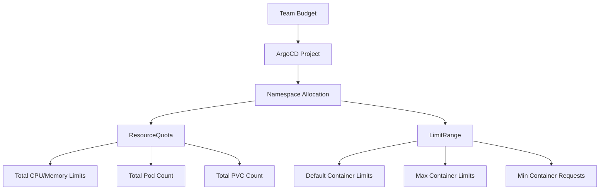

# How to Implement Resource Budgets per Team with ArgoCD

Author: [nawazdhandala](https://github.com/nawazdhandala)

Tags: ArgoCD, GitOps, Kubernetes, Multi-Tenancy, Resource Management

Description: Learn how to allocate and enforce Kubernetes resource budgets per team using ArgoCD projects, ResourceQuotas, and LimitRanges in a multi-tenant cluster.

---

In a multi-tenant Kubernetes cluster, fairness matters. Without resource budgets, one team's runaway memory leak can starve other teams of capacity. Or a team might request far more resources than they need, driving up costs while others cannot schedule their workloads.

ArgoCD's project model combined with Kubernetes ResourceQuotas gives you a complete system for allocating, enforcing, and monitoring resource budgets per team. In this guide, I will show you how to set it up.

## The Resource Budget Architecture

Resource budgets work at multiple levels: ArgoCD projects define the organizational boundary, ResourceQuotas enforce the limits, and LimitRanges set defaults for individual workloads.



## Step 1: Define Team Budgets

Start with an agreement on how much of the cluster each team gets. This is typically based on their application requirements plus some growth buffer.

```yaml
# team-budgets.yaml (documentation file in Git)
# Team Alpha: 3 applications, moderate traffic
#   CPU: 20 cores request, 40 cores limit
#   Memory: 40Gi request, 80Gi limit
#   Pods: 200
#   PVCs: 30

# Team Beta: 5 applications, high traffic
#   CPU: 40 cores request, 80 cores limit
#   Memory: 80Gi request, 160Gi limit
#   Pods: 500
#   PVCs: 50

# Team Gamma: 2 applications, data processing
#   CPU: 30 cores request, 60 cores limit
#   Memory: 120Gi request, 240Gi limit
#   Pods: 100
#   PVCs: 100 (large data volumes)
```

## Step 2: Create ArgoCD Projects per Team

ArgoCD projects provide the organizational boundary. Each team gets a project that defines which repositories, namespaces, and clusters they can access.

```yaml
# team-alpha-project.yaml
apiVersion: argoproj.io/v1alpha1
kind: AppProject
metadata:
  name: team-alpha
  namespace: argocd
spec:
  description: "Team Alpha - Budget: 20 CPU, 40Gi Memory"
  sourceRepos:
    - https://github.com/myorg/team-alpha-*
    - https://github.com/myorg/shared-charts
  destinations:
    # Team Alpha can only deploy to their namespaces
    - namespace: "alpha-*"
      server: https://kubernetes.default.svc
  namespaceResourceWhitelist:
    - group: "apps"
      kind: "Deployment"
    - group: "apps"
      kind: "StatefulSet"
    - group: ""
      kind: "Service"
    - group: ""
      kind: "ConfigMap"
    - group: ""
      kind: "Secret"
    - group: "networking.k8s.io"
      kind: "Ingress"
    - group: ""
      kind: "PersistentVolumeClaim"
  # Block cluster-scoped resources
  clusterResourceWhitelist: []
  roles:
    - name: team-alpha-admin
      description: "Team Alpha administrators"
      policies:
        - p, proj:team-alpha:team-alpha-admin, applications, *, team-alpha/*, allow
      groups:
        - okta-group:team-alpha
```

## Step 3: Deploy ResourceQuotas Through ArgoCD

Deploy ResourceQuotas for each team's namespaces using an ApplicationSet.

```yaml
# team-quotas-appset.yaml
apiVersion: argoproj.io/v1alpha1
kind: ApplicationSet
metadata:
  name: team-resource-quotas
  namespace: argocd
spec:
  generators:
    - list:
        elements:
          - team: alpha
            namespace: alpha-production
            cpuRequest: "10"
            cpuLimit: "20"
            memoryRequest: "20Gi"
            memoryLimit: "40Gi"
            pods: "100"
            pvcs: "15"
          - team: alpha
            namespace: alpha-staging
            cpuRequest: "5"
            cpuLimit: "10"
            memoryRequest: "10Gi"
            memoryLimit: "20Gi"
            pods: "50"
            pvcs: "10"
          - team: beta
            namespace: beta-production
            cpuRequest: "20"
            cpuLimit: "40"
            memoryRequest: "40Gi"
            memoryLimit: "80Gi"
            pods: "250"
            pvcs: "25"
          - team: beta
            namespace: beta-staging
            cpuRequest: "10"
            cpuLimit: "20"
            memoryRequest: "20Gi"
            memoryLimit: "40Gi"
            pods: "100"
            pvcs: "15"
  template:
    metadata:
      name: "quota-{{namespace}}"
    spec:
      project: platform
      source:
        repoURL: https://github.com/myorg/cluster-config.git
        path: resource-quotas
        targetRevision: main
        helm:
          values: |
            team: "{{team}}"
            namespace: "{{namespace}}"
            cpuRequest: "{{cpuRequest}}"
            cpuLimit: "{{cpuLimit}}"
            memoryRequest: "{{memoryRequest}}"
            memoryLimit: "{{memoryLimit}}"
            pods: "{{pods}}"
            pvcs: "{{pvcs}}"
      destination:
        server: https://kubernetes.default.svc
        namespace: "{{namespace}}"
      syncPolicy:
        automated:
          selfHeal: true
```

The Helm template for resource quotas.

```yaml
# resource-quotas/templates/resourcequota.yaml
apiVersion: v1
kind: ResourceQuota
metadata:
  name: {{ .Values.team }}-quota
  namespace: {{ .Values.namespace }}
  labels:
    team: {{ .Values.team }}
    managed-by: argocd
spec:
  hard:
    requests.cpu: {{ .Values.cpuRequest | quote }}
    requests.memory: {{ .Values.memoryRequest | quote }}
    limits.cpu: {{ .Values.cpuLimit | quote }}
    limits.memory: {{ .Values.memoryLimit | quote }}
    pods: {{ .Values.pods | quote }}
    persistentvolumeclaims: {{ .Values.pvcs | quote }}
    services.loadbalancers: "5"
    services.nodeports: "0"
```

## Step 4: Deploy LimitRanges

LimitRanges set per-container defaults and maximums so that individual containers cannot claim disproportionate resources.

```yaml
# resource-quotas/templates/limitrange.yaml
apiVersion: v1
kind: LimitRange
metadata:
  name: {{ .Values.team }}-limits
  namespace: {{ .Values.namespace }}
spec:
  limits:
    - type: Container
      default:
        cpu: "500m"
        memory: "512Mi"
      defaultRequest:
        cpu: "100m"
        memory: "128Mi"
      max:
        cpu: "4"
        memory: "8Gi"
      min:
        cpu: "50m"
        memory: "64Mi"
    - type: PersistentVolumeClaim
      max:
        storage: "100Gi"
      min:
        storage: "1Gi"
```

## Step 5: Monitoring Budget Usage

Deploy monitoring to track how much of their budget each team is using.

```yaml
# budget-monitoring-rules.yaml
apiVersion: monitoring.coreos.com/v1
kind: PrometheusRule
metadata:
  name: resource-budget-alerts
spec:
  groups:
    - name: resource-budgets
      rules:
        - alert: TeamApproachingCPUBudget
          expr: |
            sum(kube_resourcequota{resource="requests.cpu", type="used"}) by (namespace)
            /
            sum(kube_resourcequota{resource="requests.cpu", type="hard"}) by (namespace)
            > 0.8
          for: 10m
          labels:
            severity: warning
          annotations:
            summary: "Namespace {{ $labels.namespace }} is using over 80% of CPU budget"
        - alert: TeamExceededPodBudget
          expr: |
            sum(kube_resourcequota{resource="pods", type="used"}) by (namespace)
            /
            sum(kube_resourcequota{resource="pods", type="hard"}) by (namespace)
            > 0.9
          for: 5m
          labels:
            severity: critical
          annotations:
            summary: "Namespace {{ $labels.namespace }} is using over 90% of pod budget"
```

Create a Grafana dashboard showing budget usage per team.

```bash
# Useful Prometheus queries for the dashboard

# CPU budget usage percentage per namespace
# sum(kube_resourcequota{type="used", resource="requests.cpu"}) by (namespace)
# / sum(kube_resourcequota{type="hard", resource="requests.cpu"}) by (namespace) * 100

# Memory budget usage percentage per namespace
# sum(kube_resourcequota{type="used", resource="requests.memory"}) by (namespace)
# / sum(kube_resourcequota{type="hard", resource="requests.memory"}) by (namespace) * 100
```

## Step 6: Budget Request Workflow

When teams need more resources, implement a Git-based budget request workflow.

```yaml
# Process:
# 1. Team creates a PR modifying their budget in the team-quotas-appset
# 2. Platform team reviews the request
# 3. Platform team checks cluster capacity
# 4. PR is merged if approved
# 5. ArgoCD automatically applies the new quotas
```

This keeps all budget changes in Git with full audit history. No more ad-hoc `kubectl edit` commands that bypass review.

## Handling Budget Overruns

When a team hits their budget limit, new pods cannot be scheduled. ArgoCD will show the application as Degraded because replicas cannot be created.

Configure notifications to alert teams when they approach their limits.

```yaml
# argocd-notifications-cm.yaml
data:
  template.budget-warning: |
    message: |
      Application {{.app.metadata.name}} in namespace {{.app.spec.destination.namespace}}
      is Degraded - possibly due to resource quota limits.
      Check ResourceQuota usage: kubectl describe quota -n {{.app.spec.destination.namespace}}
```

For guidance on setting up ArgoCD multi-tenancy, check our guide on [configuring multi-tenancy in ArgoCD](https://oneuptime.com/blog/post/2026-01-25-multi-tenancy-argocd/view).

## Conclusion

Resource budgets per team in ArgoCD are about combining Kubernetes-native controls (ResourceQuotas and LimitRanges) with ArgoCD's project model and GitOps workflow. The quotas enforce hard limits, LimitRanges provide sensible defaults, ArgoCD projects restrict scope, and the Git repository provides an auditable process for budget changes. Start by measuring current usage per team, set initial budgets with headroom, monitor usage over a few weeks, and then tighten budgets to match actual needs. The goal is fair resource sharing, not restriction for its own sake.
