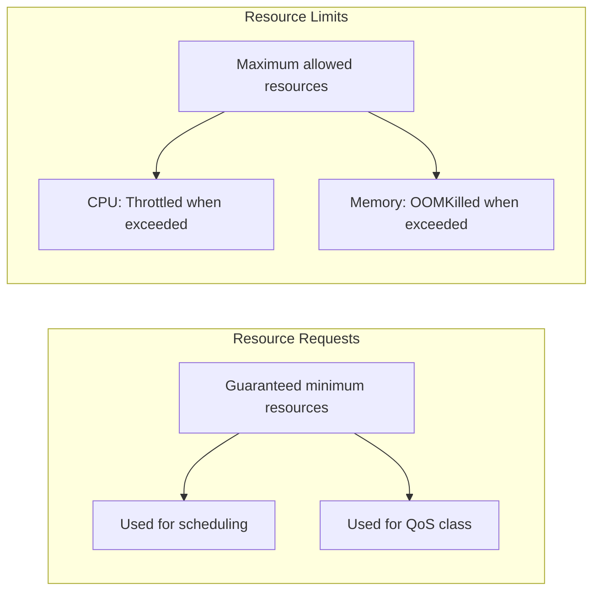

# How to Set Resource Limits for ArgoCD Components

Author: [nawazdhandala](https://github.com/nawazdhandala)

Tags: ArgoCD, GitOps, Kubernetes, Resource Management, Production

Description: Learn how to properly configure CPU and memory requests and limits for every ArgoCD component, with practical sizing guidelines based on deployment scale.

---

Setting proper resource requests and limits for ArgoCD components is critical for both stability and efficiency. Without limits, a single runaway process can consume all node resources and impact other workloads. Without proper requests, Kubernetes cannot schedule pods effectively, leading to resource contention and poor performance. This guide covers every ArgoCD component with specific, tested recommendations.

## Understanding Requests vs Limits



- **Requests**: The minimum resources Kubernetes guarantees. The scheduler uses these to place pods on nodes.
- **Limits**: The maximum resources a container can use. Exceeding CPU limits causes throttling; exceeding memory limits causes OOMKill.

For ArgoCD, setting requests too low causes scheduling on inadequate nodes. Setting limits too low causes OOMKills and CPU throttling. Setting limits too high wastes cluster resources.

## Application Controller Resources

The controller is the most resource-intensive component. It maintains in-memory state for every managed application and resource.

```yaml
controller:
  resources:
    requests:
      cpu: 500m
      memory: 1Gi
    limits:
      cpu: "2"
      memory: 4Gi
```

**CPU considerations**: The controller is CPU-intensive during diff computation and sync operations. If you see high reconciliation times, CPU is likely the bottleneck. Monitor with:

```bash
kubectl top pod -n argocd -l app.kubernetes.io/name=argocd-application-controller --containers
```

**Memory considerations**: Memory usage grows linearly with the number of managed resources. Each Kubernetes resource adds approximately 5-10 KB to the controller's working set. An application with 100 resources adds about 0.5-1 MB.

Sizing formula:

```text
Controller Memory = Base (500MB) + (Number of Resources * 10KB) + Buffer (50%)
```

For 500 applications averaging 20 resources each:

```text
500MB + (10,000 * 10KB) + 50% buffer = 500MB + 100MB + 300MB = 900MB
# Round up to 1Gi request, 4Gi limit for spikes
```

## API Server Resources

The API server is relatively lightweight but needs to handle concurrent users:

```yaml
server:
  resources:
    requests:
      cpu: 100m
      memory: 128Mi
    limits:
      cpu: "1"
      memory: 512Mi
```

**CPU considerations**: CPU spikes during large API responses (listing many applications) and TLS handshakes. Running the API server in insecure mode behind a TLS-terminating load balancer reduces CPU usage by 20-30%.

**Memory considerations**: Each active WebSocket connection (for real-time UI updates) uses approximately 100 KB. Memory also depends on the size of API responses being marshalled.

Sizing by concurrent users:

```text
API Server Memory = Base (128MB) + (Concurrent Users * 5MB) + Buffer (50%)
```

## Repo Server Resources

The repo server has the most variable resource usage because it depends on the size and complexity of your Git repositories and Helm charts:

```yaml
repoServer:
  resources:
    requests:
      cpu: 200m
      memory: 256Mi
    limits:
      cpu: "2"
      memory: 2Gi
```

**CPU considerations**: CPU-intensive during Helm template rendering, especially with complex charts that use many functions and loops. Kustomize builds are generally faster.

**Memory considerations**: Each concurrent manifest generation holds:
- A Git clone of the repository in memory/disk
- The Helm chart and all its dependencies
- The rendered manifest output

A large Helm chart with subcharts can use 500MB or more during rendering.

```text
Repo Server Memory = Base (256MB) + (Parallel Renders * Avg Chart Size) + Buffer (50%)
```

## Redis Resources

Redis resource needs depend on cache size:

```yaml
redis:
  resources:
    requests:
      cpu: 100m
      memory: 128Mi
    limits:
      cpu: 500m
      memory: 512Mi
```

For Redis HA:

```yaml
redis-ha:
  redis:
    resources:
      requests:
        cpu: 200m
        memory: 256Mi
      limits:
        cpu: 500m
        memory: 1Gi
  haproxy:
    resources:
      requests:
        cpu: 100m
        memory: 64Mi
      limits:
        cpu: 250m
        memory: 128Mi
  sentinel:
    resources:
      requests:
        cpu: 50m
        memory: 64Mi
      limits:
        cpu: 100m
        memory: 128Mi
```

## ApplicationSet Controller Resources

The ApplicationSet controller is lightweight unless you have complex generators:

```yaml
applicationSet:
  resources:
    requests:
      cpu: 100m
      memory: 128Mi
    limits:
      cpu: 500m
      memory: 512Mi
```

For deployments with many ApplicationSets using Git generators that scan large repositories, increase memory to 1Gi.

## Notifications Controller Resources

The notifications controller is very lightweight:

```yaml
notifications:
  resources:
    requests:
      cpu: 50m
      memory: 64Mi
    limits:
      cpu: 200m
      memory: 256Mi
```

## Dex Server Resources

If using Dex for SSO:

```yaml
dex:
  resources:
    requests:
      cpu: 50m
      memory: 64Mi
    limits:
      cpu: 200m
      memory: 256Mi
```

## Complete Configuration by Scale

### Small Deployment (up to 50 apps)

```yaml
controller:
  resources:
    requests: { cpu: 250m, memory: 512Mi }
    limits: { cpu: "1", memory: 2Gi }
server:
  replicas: 2
  resources:
    requests: { cpu: 100m, memory: 128Mi }
    limits: { cpu: 500m, memory: 256Mi }
repoServer:
  replicas: 2
  resources:
    requests: { cpu: 200m, memory: 256Mi }
    limits: { cpu: "1", memory: 1Gi }
redis:
  resources:
    requests: { cpu: 100m, memory: 128Mi }
    limits: { cpu: 250m, memory: 256Mi }
applicationSet:
  resources:
    requests: { cpu: 50m, memory: 64Mi }
    limits: { cpu: 250m, memory: 256Mi }
notifications:
  resources:
    requests: { cpu: 50m, memory: 64Mi }
    limits: { cpu: 100m, memory: 128Mi }
```

Total resource requests: ~750m CPU, ~1.2Gi memory

### Medium Deployment (50 to 200 apps)

```yaml
controller:
  resources:
    requests: { cpu: 500m, memory: 1Gi }
    limits: { cpu: "2", memory: 4Gi }
server:
  replicas: 3
  resources:
    requests: { cpu: 200m, memory: 256Mi }
    limits: { cpu: "1", memory: 512Mi }
repoServer:
  replicas: 3
  resources:
    requests: { cpu: 500m, memory: 512Mi }
    limits: { cpu: "2", memory: 2Gi }
redis-ha:
  redis:
    resources:
      requests: { cpu: 200m, memory: 256Mi }
      limits: { cpu: 500m, memory: 512Mi }
applicationSet:
  resources:
    requests: { cpu: 100m, memory: 128Mi }
    limits: { cpu: 500m, memory: 512Mi }
notifications:
  resources:
    requests: { cpu: 50m, memory: 64Mi }
    limits: { cpu: 200m, memory: 256Mi }
```

Total resource requests: ~2.5 CPU, ~3.5Gi memory (across all replicas)

### Large Deployment (200+ apps)

```yaml
controller:
  replicas: 3
  resources:
    requests: { cpu: "1", memory: 2Gi }
    limits: { cpu: "4", memory: 8Gi }
server:
  replicas: 5
  resources:
    requests: { cpu: 500m, memory: 512Mi }
    limits: { cpu: "1", memory: 1Gi }
repoServer:
  replicas: 5
  resources:
    requests: { cpu: "1", memory: 1Gi }
    limits: { cpu: "2", memory: 4Gi }
redis-ha:
  redis:
    resources:
      requests: { cpu: 500m, memory: 512Mi }
      limits: { cpu: "1", memory: 1Gi }
applicationSet:
  replicas: 2
  resources:
    requests: { cpu: 250m, memory: 256Mi }
    limits: { cpu: "1", memory: 1Gi }
notifications:
  resources:
    requests: { cpu: 100m, memory: 128Mi }
    limits: { cpu: 500m, memory: 512Mi }
```

Total resource requests: ~13 CPU, ~19Gi memory (across all replicas)

## Applying Resource Limits

With Helm:

```bash
helm upgrade argocd argo/argo-cd \
  --namespace argocd \
  --values argocd-resources-values.yaml
```

Without Helm, patch individual deployments:

```bash
# Patch controller
kubectl set resources statefulset/argocd-application-controller -n argocd \
  --requests=cpu=500m,memory=1Gi \
  --limits=cpu=2,memory=4Gi

# Patch API server
kubectl set resources deployment/argocd-server -n argocd \
  --requests=cpu=200m,memory=256Mi \
  --limits=cpu=1,memory=512Mi

# Patch repo server
kubectl set resources deployment/argocd-repo-server -n argocd \
  --requests=cpu=500m,memory=512Mi \
  --limits=cpu=2,memory=2Gi
```

## Monitoring Resource Usage

Set up alerts to know when you need to adjust:

```bash
# Check current usage vs limits
kubectl top pods -n argocd --containers

# Check if any pod is being CPU-throttled
kubectl get pod -n argocd -o json | \
  jq '.items[].status.containerStatuses[] |
    {name: .name, ready: .ready, restartCount: .restartCount}'
```

The key is to start with conservative limits and adjust based on actual usage. Never run ArgoCD in production without resource limits - one misbehaving Helm chart or large repository sync can consume all available memory on a node. For ongoing resource monitoring, see our guide on [monitoring ArgoCD component health](https://oneuptime.com/blog/post/2026-02-26-argocd-monitor-component-health/view).
