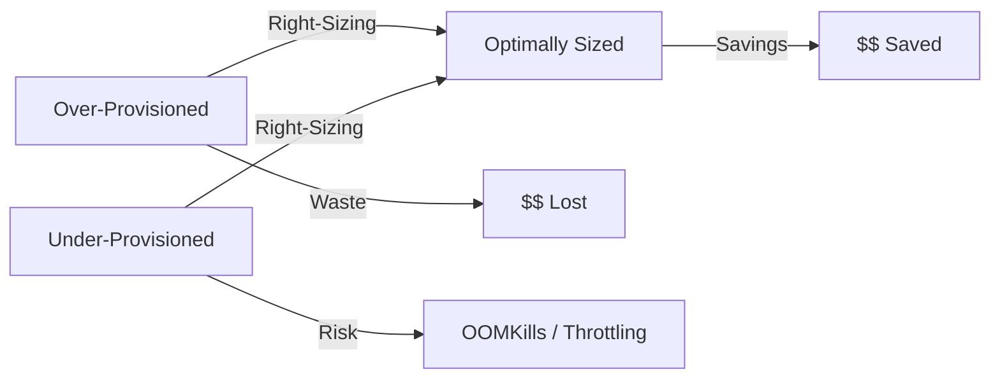

# How to Implement Resource Right-Sizing Policies with ArgoCD

Author: [nawazdhandala](https://github.com/nawazdhandala)

Tags: ArgoCD, GitOps, Kubernetes, FinOps, Resource Optimization

Description: Learn how to implement automated resource right-sizing policies with ArgoCD using VPA recommendations, policy engines, and GitOps workflows.

---

Resource right-sizing is the practice of matching Kubernetes resource requests and limits to actual workload needs. Over-provisioned resources waste money. Under-provisioned resources cause performance problems. ArgoCD's GitOps model provides a structured way to implement right-sizing as a continuous process rather than a one-time exercise. This guide covers implementing right-sizing policies that keep resources aligned with actual usage.

## The Right-Sizing Challenge

Most Kubernetes resources are significantly over-provisioned:

- Developers set generous resource requests "just in case"
- Initial sizing guesses are rarely revisited
- CPU and memory usage fluctuate, but static requests do not
- Teams lack visibility into actual vs requested resources



## Strategy 1: Vertical Pod Autoscaler Recommendations

The Vertical Pod Autoscaler (VPA) monitors actual resource usage and generates recommendations. Use VPA in recommendation-only mode with ArgoCD:

```yaml
# VPA in recommendation mode - does not modify pods
apiVersion: autoscaling.k8s.io/v1
kind: VerticalPodAutoscaler
metadata:
  name: payment-service-vpa
  namespace: payments
spec:
  targetRef:
    apiVersion: apps/v1
    kind: Deployment
    name: payment-service
  # Off mode: only provides recommendations, does not change resources
  updatePolicy:
    updateMode: "Off"
  resourcePolicy:
    containerPolicies:
      - containerName: payment-service
        minAllowed:
          cpu: 50m
          memory: 64Mi
        maxAllowed:
          cpu: "4"
          memory: 8Gi
```

Deploy VPA resources for all ArgoCD applications using an ApplicationSet:

```yaml
# ApplicationSet that creates VPA resources for all apps
apiVersion: argoproj.io/v1alpha1
kind: ApplicationSet
metadata:
  name: vpa-recommendations
  namespace: argocd
spec:
  generators:
    - git:
        repoURL: https://github.com/myorg/platform-config
        revision: main
        files:
          - path: "services/*/config.yaml"
  template:
    metadata:
      name: "vpa-{{name}}"
    spec:
      source:
        repoURL: https://github.com/myorg/platform-config
        targetRevision: main
        path: "vpa-templates"
        kustomize:
          patches:
            - target:
                kind: VerticalPodAutoscaler
              patch: |
                - op: replace
                  path: /metadata/name
                  value: "{{name}}-vpa"
                - op: replace
                  path: /metadata/namespace
                  value: "{{namespace}}"
                - op: replace
                  path: /spec/targetRef/name
                  value: "{{name}}"
      destination:
        server: "{{cluster}}"
        namespace: "{{namespace}}"
```

## Strategy 2: Automated Right-Sizing Pipeline

Build a pipeline that reads VPA recommendations and creates pull requests:

```python
# right_sizing_pipeline.py
# Reads VPA recommendations and creates right-sizing PRs
import subprocess
import json
import os
from pathlib import Path

def get_vpa_recommendations(namespace):
    """Get VPA recommendations for all deployments in a namespace."""
    result = subprocess.run(
        ["kubectl", "get", "vpa", "-n", namespace, "-o", "json"],
        capture_output=True, text=True
    )
    vpas = json.loads(result.stdout)
    recommendations = []

    for vpa in vpas.get("items", []):
        target = vpa["spec"]["targetRef"]["name"]
        status = vpa.get("status", {})
        recommendation = status.get("recommendation", {})

        if not recommendation:
            continue

        for container_rec in recommendation.get("containerRecommendations", []):
            target_rec = container_rec.get("target", {})
            recommendations.append({
                "deployment": target,
                "namespace": namespace,
                "container": container_rec["containerName"],
                "recommended_cpu": target_rec.get("cpu", ""),
                "recommended_memory": target_rec.get("memory", ""),
                "lower_bound_cpu": container_rec.get("lowerBound", {}).get("cpu", ""),
                "upper_bound_cpu": container_rec.get("upperBound", {}).get("cpu", ""),
            })

    return recommendations

def get_current_requests(deployment, namespace):
    """Get current resource requests for a deployment."""
    result = subprocess.run(
        ["kubectl", "get", "deployment", deployment, "-n", namespace, "-o", "json"],
        capture_output=True, text=True
    )
    deploy = json.loads(result.stdout)
    containers = deploy["spec"]["template"]["spec"]["containers"]

    requests = {}
    for container in containers:
        resources = container.get("resources", {}).get("requests", {})
        requests[container["name"]] = {
            "cpu": resources.get("cpu", "not set"),
            "memory": resources.get("memory", "not set")
        }
    return requests

def should_resize(current, recommended, threshold=0.2):
    """Determine if resizing is worthwhile (>20% change)."""
    # Simplified - in production, properly parse resource units
    return True

def create_right_sizing_pr(recommendations):
    """Create a PR with right-sizing changes."""
    changes = []
    for rec in recommendations:
        current = get_current_requests(rec["deployment"], rec["namespace"])
        current_container = current.get(rec["container"], {})

        if should_resize(current_container.get("cpu"), rec["recommended_cpu"]):
            changes.append({
                "deployment": rec["deployment"],
                "container": rec["container"],
                "current_cpu": current_container.get("cpu"),
                "recommended_cpu": rec["recommended_cpu"],
                "current_memory": current_container.get("memory"),
                "recommended_memory": rec["recommended_memory"],
            })

    if changes:
        print(f"Found {len(changes)} right-sizing opportunities")
        for change in changes:
            print(f"  {change['deployment']}/{change['container']}:")
            print(f"    CPU: {change['current_cpu']} -> {change['recommended_cpu']}")
            print(f"    Memory: {change['current_memory']} -> {change['recommended_memory']}")
        # Create Git branch, modify manifests, create PR
        # ... implementation depends on repo structure ...

if __name__ == "__main__":
    namespaces = ["payments", "orders", "notifications"]
    all_recommendations = []
    for ns in namespaces:
        all_recommendations.extend(get_vpa_recommendations(ns))
    create_right_sizing_pr(all_recommendations)
```

Deploy this as a CronJob:

```yaml
# CronJob for automated right-sizing recommendations
apiVersion: batch/v1
kind: CronJob
metadata:
  name: right-sizing-pipeline
  namespace: argocd
spec:
  # Run weekly on Monday mornings
  schedule: "0 8 * * 1"
  jobTemplate:
    spec:
      template:
        spec:
          serviceAccountName: right-sizing-pipeline
          containers:
            - name: pipeline
              image: python:3.11-slim
              command:
                - python
                - /scripts/right_sizing_pipeline.py
              envFrom:
                - secretRef:
                    name: git-credentials
              volumeMounts:
                - name: scripts
                  mountPath: /scripts
          volumes:
            - name: scripts
              configMap:
                name: right-sizing-scripts
          restartPolicy: OnFailure
```

## Strategy 3: Policy-Based Resource Guardrails

Use OPA Gatekeeper to enforce resource sizing policies:

```yaml
# Prevent extremely over-provisioned resources
apiVersion: templates.gatekeeper.sh/v1
kind: ConstraintTemplate
metadata:
  name: k8sresourceratios
spec:
  crd:
    spec:
      names:
        kind: K8sResourceRatios
      validation:
        openAPIV3Schema:
          type: object
          properties:
            maxLimitToRequestRatio:
              type: number
            maxCpuPerReplica:
              type: string
            maxMemoryPerReplica:
              type: string
  targets:
    - target: admission.k8s.gatekeeper.sh
      rego: |
        package k8sresourceratios

        # Deny if limit-to-request ratio is too high
        violation[{"msg": msg}] {
          container := input.review.object.spec.template.spec.containers[_]
          requests_cpu := to_number(trim_suffix(container.resources.requests.cpu, "m"))
          limits_cpu := to_number(trim_suffix(container.resources.limits.cpu, "m"))
          ratio := limits_cpu / requests_cpu
          ratio > input.parameters.maxLimitToRequestRatio
          msg := sprintf(
            "Container %v has CPU limit/request ratio of %.1f, max allowed is %.1f",
            [container.name, ratio, input.parameters.maxLimitToRequestRatio]
          )
        }
---
apiVersion: constraints.gatekeeper.sh/v1beta1
kind: K8sResourceRatios
metadata:
  name: reasonable-resource-ratios
spec:
  match:
    kinds:
      - apiGroups: ["apps"]
        kinds: ["Deployment", "StatefulSet"]
  parameters:
    # Limit should be no more than 3x the request
    maxLimitToRequestRatio: 3.0
    # Max resources per container
    maxCpuPerReplica: "4"
    maxMemoryPerReplica: "8Gi"
```

## Strategy 4: Environment-Specific Sizing

Use ArgoCD overlays to enforce different resource sizes per environment:

```yaml
# base/deployment.yaml - baseline resources
apiVersion: apps/v1
kind: Deployment
metadata:
  name: payment-service
spec:
  replicas: 1
  template:
    spec:
      containers:
        - name: payment-service
          resources:
            requests:
              cpu: 100m
              memory: 128Mi
            limits:
              cpu: 200m
              memory: 256Mi
---
# overlays/development/kustomization.yaml
# Development uses minimal resources
apiVersion: kustomize.config.k8s.io/v1beta1
kind: Kustomization
resources:
  - ../../base
patches:
  - target:
      kind: Deployment
      name: payment-service
    patch: |
      - op: replace
        path: /spec/replicas
        value: 1
      - op: replace
        path: /spec/template/spec/containers/0/resources
        value:
          requests:
            cpu: 50m
            memory: 64Mi
          limits:
            cpu: 100m
            memory: 128Mi
---
# overlays/production/kustomization.yaml
# Production uses right-sized resources based on VPA recommendations
apiVersion: kustomize.config.k8s.io/v1beta1
kind: Kustomization
resources:
  - ../../base
patches:
  - target:
      kind: Deployment
      name: payment-service
    patch: |
      - op: replace
        path: /spec/replicas
        value: 3
      - op: replace
        path: /spec/template/spec/containers/0/resources
        value:
          requests:
            cpu: 250m
            memory: 512Mi
          limits:
            cpu: 500m
            memory: 1Gi
```

## Strategy 5: Right-Sizing Scorecard

Track right-sizing progress across the organization:

```bash
#!/bin/bash
# right-sizing-scorecard.sh
# Generates a scorecard showing resource efficiency per ArgoCD app

echo "Resource Right-Sizing Scorecard"
echo "==============================="
echo ""

# Get all ArgoCD applications
argocd app list -o json | jq -c '.[]' | while read app; do
  APP_NAME=$(echo $app | jq -r '.metadata.name')
  NAMESPACE=$(echo $app | jq -r '.spec.destination.namespace')

  # Skip if VPA is not available
  VPA_STATUS=$(kubectl get vpa "${APP_NAME}-vpa" -n "$NAMESPACE" -o json 2>/dev/null)
  if [ $? -ne 0 ]; then
    continue
  fi

  # Get current requests
  CURRENT_CPU=$(kubectl get deploy "$APP_NAME" -n "$NAMESPACE" \
    -o jsonpath='{.spec.template.spec.containers[0].resources.requests.cpu}' 2>/dev/null)

  # Get VPA recommendation
  REC_CPU=$(echo "$VPA_STATUS" | jq -r '.status.recommendation.containerRecommendations[0].target.cpu // "N/A"')

  echo "$APP_NAME:"
  echo "  Current CPU Request: $CURRENT_CPU"
  echo "  VPA Recommended: $REC_CPU"
  echo ""
done
```

## Strategy 6: Goldilocks for Easy Visualization

Deploy Goldilocks (a VPA dashboard by Fairwinds) through ArgoCD:

```yaml
# Deploy Goldilocks with ArgoCD
apiVersion: argoproj.io/v1alpha1
kind: Application
metadata:
  name: goldilocks
  namespace: argocd
spec:
  source:
    repoURL: https://charts.fairwinds.com/stable
    chart: goldilocks
    targetRevision: 8.0.0
    helm:
      values: |
        dashboard:
          enabled: true
        vpa:
          enabled: true
          updater:
            enabled: false
  destination:
    server: https://kubernetes.default.svc
    namespace: goldilocks
  syncPolicy:
    automated:
      selfHeal: true
    syncOptions:
      - CreateNamespace=true
```

Label namespaces for Goldilocks monitoring:

```bash
# Enable Goldilocks for specific namespaces
kubectl label namespace payments goldilocks.fairwinds.com/enabled=true
kubectl label namespace orders goldilocks.fairwinds.com/enabled=true
```

Goldilocks provides a web UI that shows VPA recommendations with direct YAML you can copy into your manifests.

## Summary

Resource right-sizing with ArgoCD is a continuous process that combines VPA recommendations, policy enforcement, and GitOps workflows. Deploy VPA in recommendation mode, build automated pipelines that create right-sizing PRs, enforce sizing guardrails with OPA Gatekeeper, and use environment-specific overlays to match resources to workload needs. The GitOps model ensures that every resource change is reviewed, tracked, and reversible. For related FinOps topics, see our guides on [tracking deployment costs](https://oneuptime.com/blog/post/2026-02-26-argocd-track-deployment-costs/view) and [using Kubecost with ArgoCD](https://oneuptime.com/blog/post/2026-02-26-argocd-kubecost-integration/view).
