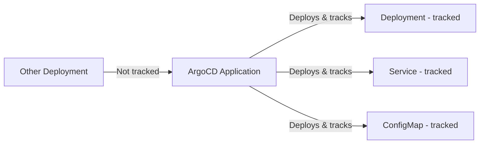

# How to Configure Resource Tracking Method in ArgoCD

Author: [nawazdhandala](https://github.com/nawazdhandala)

Tags: ArgoCD, GitOps, Kubernetes, Configuration

Description: Learn how to configure the resource tracking method in ArgoCD, understand the differences between label, annotation, and annotation+label tracking, and choose the right approach for your environment.

---

Resource tracking is how ArgoCD keeps track of which Kubernetes resources belong to which application. Without proper tracking, ArgoCD cannot determine which resources to include in an application's resource tree, health assessment, or sync operations. Getting the tracking method right is critical, especially in clusters with multiple ArgoCD applications, shared resources, or resources that are modified by operators.

This guide covers the three tracking methods available in ArgoCD, how to configure each one, and when to use which.

## What Is Resource Tracking?

When ArgoCD deploys resources to a cluster, it needs a way to associate those resources back to the application that manages them. This association is called resource tracking. Without it, ArgoCD would have no idea which Deployment, Service, or ConfigMap belongs to which application.

ArgoCD uses metadata on the resources themselves - either labels, annotations, or both - to track ownership. When you view an application in ArgoCD, the resource tree is built by finding all resources in the cluster that carry the tracking metadata for that application.



## The Three Tracking Methods

ArgoCD supports three resource tracking methods:

### 1. Label-Based Tracking (Legacy Default)

Resources are tracked using the `app.kubernetes.io/instance` label. This was the original tracking method and remains the default for backward compatibility.

```yaml
metadata:
  labels:
    app.kubernetes.io/instance: my-argocd-app
```

### 2. Annotation-Based Tracking

Resources are tracked using the `argocd.argoproj.io/tracking-id` annotation. This method avoids conflicts with the standard Kubernetes label.

```yaml
metadata:
  annotations:
    argocd.argoproj.io/tracking-id: "my-argocd-app:apps/Deployment:default/my-deployment"
```

### 3. Annotation+Label Tracking

Resources are tracked using both the annotation (for precise tracking) and the label (for backward compatibility and easy querying).

```yaml
metadata:
  labels:
    app.kubernetes.io/instance: my-argocd-app
  annotations:
    argocd.argoproj.io/tracking-id: "my-argocd-app:apps/Deployment:default/my-deployment"
```

## Configuring the Tracking Method

The tracking method is set in the `argocd-cm` ConfigMap using the `application.resourceTrackingMethod` key:

```yaml
apiVersion: v1
kind: ConfigMap
metadata:
  name: argocd-cm
  namespace: argocd
data:
  # Options: label, annotation, annotation+label
  application.resourceTrackingMethod: annotation+label
```

### Setting via Helm Values

If you install ArgoCD with the community Helm chart:

```yaml
# values.yaml
server:
  config:
    application.resourceTrackingMethod: "annotation+label"
```

### Setting via CLI

```bash
kubectl patch configmap argocd-cm -n argocd \
  --type merge \
  -p '{"data":{"application.resourceTrackingMethod":"annotation+label"}}'
```

## Comparing Tracking Methods

### Label-Based Tracking

**How it works**: ArgoCD sets `app.kubernetes.io/instance: <app-name>` on every resource it manages.

**Pros**:
- Simple and easy to understand
- Easy to query with kubectl: `kubectl get all -l app.kubernetes.io/instance=my-app`
- Compatible with standard Kubernetes tooling

**Cons**:
- The `app.kubernetes.io/instance` label is commonly used by Helm charts, operators, and other tools, causing conflicts
- Only stores the application name, not the full resource identity
- Cannot distinguish between resources with the same name in different groups or namespaces
- If another tool sets this label, ArgoCD may incorrectly claim ownership

```bash
# Conflict example: Helm chart sets the same label
# ArgoCD thinks this resource belongs to its app when it does not
metadata:
  labels:
    app.kubernetes.io/instance: my-app  # Set by Helm
```

### Annotation-Based Tracking

**How it works**: ArgoCD sets `argocd.argoproj.io/tracking-id` with a fully qualified resource identifier.

**Pros**:
- No conflicts with standard labels or Helm conventions
- Stores full resource identity: `<app-name>:<group>/<kind>:<namespace>/<name>`
- More precise - can handle resources with similar names across different groups
- Does not interfere with label selectors used by Services or Deployments

**Cons**:
- Cannot easily query tracked resources with kubectl label selectors
- Some tools that rely on the `app.kubernetes.io/instance` label will not recognize the association

```yaml
# Annotation tracking example
metadata:
  annotations:
    argocd.argoproj.io/tracking-id: "my-app:apps/Deployment:production/api-server"
```

### Annotation+Label Tracking

**How it works**: Sets both the annotation (for precise tracking) and the label (for compatibility).

**Pros**:
- Best of both worlds: precise tracking via annotation, easy querying via label
- Backward compatible with tools expecting the instance label
- Recommended by the ArgoCD team for new installations

**Cons**:
- Adds both a label and an annotation to every resource
- Still has the potential label conflict issue (though ArgoCD uses the annotation for actual tracking decisions)

## Which Method Should You Choose?

| Scenario | Recommended Method |
|----------|-------------------|
| New ArgoCD installation | `annotation+label` |
| Helm charts set `app.kubernetes.io/instance` | `annotation` or `annotation+label` |
| Need kubectl label-based queries | `annotation+label` or `label` |
| Multiple ArgoCD instances on same cluster | `annotation` or `annotation+label` |
| Migration from another GitOps tool | `annotation+label` |
| Minimal metadata footprint needed | `annotation` |

For most production environments, `annotation+label` is the safest choice. It provides precise tracking through annotations while maintaining label compatibility.

## Verifying the Current Tracking Method

Check what tracking method is currently configured:

```bash
# Check the ConfigMap
kubectl get configmap argocd-cm -n argocd -o jsonpath='{.data.application\.resourceTrackingMethod}'

# If empty, the default is "label"
```

Verify how resources are being tracked:

```bash
# Check labels
kubectl get deployment my-deployment -o jsonpath='{.metadata.labels.app\.kubernetes\.io/instance}'

# Check annotations
kubectl get deployment my-deployment -o jsonpath='{.metadata.annotations.argocd\.argoproj\.io/tracking-id}'
```

## Impact of Changing the Tracking Method

Changing the tracking method on a running ArgoCD instance requires careful handling. See [how to migrate between resource tracking methods](https://oneuptime.com/blog/post/2026-02-26-argocd-migrate-resource-tracking/view) for detailed migration steps.

Key considerations:

- Resources tracked with the old method may need to be re-synced
- During transition, ArgoCD might temporarily lose track of some resources
- Applications may show resources as "OutOfSync" until they are re-synced with the new tracking metadata

## Troubleshooting Tracking Issues

If ArgoCD is not showing resources that should be part of an application:

```bash
# Check if the resource has the expected tracking metadata
kubectl get deployment my-deployment -o yaml | grep -A 5 "annotations\|labels"

# Force a hard refresh to re-evaluate tracking
argocd app get my-app --hard-refresh

# Check for tracking conflicts
kubectl get all --all-namespaces -l app.kubernetes.io/instance=my-app
```

For more on tracking, see [how to use label-based resource tracking](https://oneuptime.com/blog/post/2026-02-26-argocd-label-based-resource-tracking/view) and [how to use annotation-based resource tracking](https://oneuptime.com/blog/post/2026-02-26-argocd-annotation-based-resource-tracking/view).
