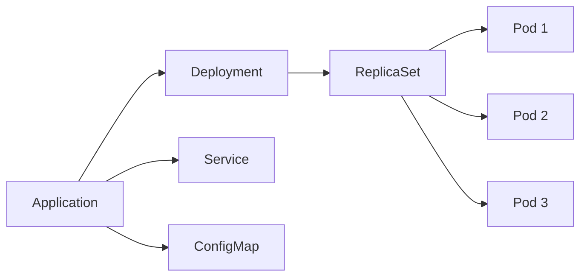
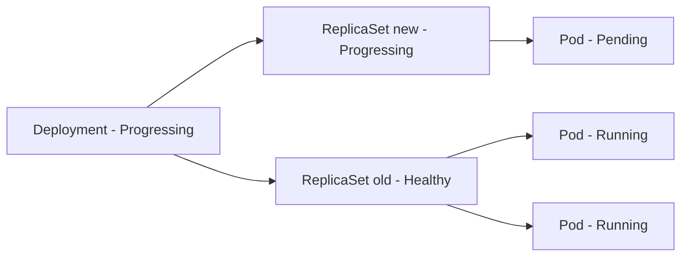

# How to View Application Resource Tree in ArgoCD

Author: [nawazdhandala](https://github.com/nawazdhandala)

Tags: ArgoCD, GitOps, Kubernetes, ArgoCD UI

Description: Deep dive into the ArgoCD resource tree view showing how to visualize, navigate, and troubleshoot Kubernetes resource hierarchies and dependencies.

---

The resource tree is one of the most powerful features of the ArgoCD UI. It visually maps out every Kubernetes resource managed by an application and shows the ownership hierarchy between them. This hierarchical view turns complex deployments into something you can understand at a glance. Let us explore how to read, navigate, and use the resource tree effectively.

## Understanding the Resource Tree Structure

The resource tree displays resources in a left-to-right hierarchy based on Kubernetes owner references. At the top level, you see the resources directly defined in your manifests. Below them, you see the resources that Kubernetes controllers created in response.

For a typical Deployment, the tree looks like:



The tree makes it immediately obvious that:
- The Application manages a Deployment, Service, and ConfigMap
- The Deployment created a ReplicaSet
- The ReplicaSet created three Pods
- All six resources (plus the three child resources) are part of this application

## Accessing the Resource Tree

When you click on any application in the ArgoCD UI, the resource tree is the default view. You can also switch between views using the buttons in the top-right:

- **Tree view** - The default hierarchical view
- **List view** - A flat table of all resources
- **Network view** - Shows networking relationships (Services to Pods)
- **Pods view** - Focused view showing only Pod-level resources

## Reading Resource Node Information

Each node in the tree displays several pieces of information:

### Health Status Icons

- Green heart - Healthy
- Red heart - Degraded
- Yellow heart - Suspended
- Blue spinning icon - Progressing
- Gray question mark - Unknown health
- No icon - Health status not applicable for this resource type

### Sync Status

- Green checkmark - Synced (matches Git)
- Yellow exclamation - OutOfSync (differs from Git)
- No indicator - Resource was created by Kubernetes, not directly managed by ArgoCD

### Resource Details on Each Node

Each tree node shows:
- Resource icon (varies by kind)
- Resource kind abbreviation
- Resource name
- Health and sync status icons
- Creation timestamp (on hover)

## Interacting with Resource Nodes

### Click to Inspect

Clicking a resource node opens a side panel with multiple tabs:

**Summary Tab:**
```
Kind:       Deployment
Name:       web-frontend
Namespace:  my-app
Created:    2026-02-25T14:30:00Z
Health:     Healthy
Sync:       Synced
```

**Manifest Tab:**
Shows the live Kubernetes manifest for this resource, formatted as YAML. This is what kubectl get would return.

**Desired Manifest Tab:**
Shows the manifest as defined in Git. Comparing this with the live manifest reveals any drift.

**Diff Tab:**
A side-by-side comparison highlighting differences between live and desired state. Fields unique to the live state (like `status` fields and auto-generated metadata) are typically shown but can be filtered.

**Events Tab:**
Shows recent Kubernetes events for this resource:
```
LAST SEEN   TYPE      REASON              MESSAGE
2m ago      Normal    ScalingReplicaSet   Scaled up replica set web-abc123 to 3
5m ago      Normal    SuccessfulCreate    Created pod: web-abc123-x7k9l
```

**Logs Tab (for Pods):**
When you click a Pod node (or a resource that owns Pods), you get a logs viewer:
- Select the container if there are multiple containers
- Stream logs in real time
- Filter logs by keyword
- Download logs

### Right-Click Context Menu

Right-clicking a resource node (or clicking the three-dot menu) shows actions:

- **Details** - Open the full resource detail panel
- **Logs** - Jump directly to logs (for Pod-owning resources)
- **Delete** - Remove this specific resource from the cluster
- **Sync** - Sync only this resource

## Filtering and Grouping

The resource tree supports several organizational features:

### Filter by Health Status

Use the health status dropdown to show only resources with specific health states:

```
All | Healthy | Progressing | Degraded | Suspended | Missing | Unknown
```

This is invaluable when debugging. Filter to "Degraded" to immediately see which resources are failing.

### Filter by Sync Status

Similarly, filter by sync status:

```
All | Synced | OutOfSync
```

### Filter by Resource Kind

The kind filter lets you focus on specific resource types:

```
All | Deployment | Service | ConfigMap | Pod | ReplicaSet | ...
```

### Group By Options

You can group the tree by:

- **None** - Default flat tree
- **Kind** - Groups resources by their Kubernetes kind
- **Health** - Groups resources by health status
- **Sync** - Groups resources by sync status

Grouping by health status is particularly useful for large applications:

```
Healthy (15 resources)
  Deployment/web
  Service/web
  ConfigMap/web-config
  ...

Degraded (1 resource)
  Pod/web-abc123-x7k9l

Progressing (2 resources)
  Deployment/worker
  ReplicaSet/worker-def456
```

## Understanding Resource Relationships

The tree view shows different relationship types:

### Owner References

The most common relationship. When a Deployment creates a ReplicaSet, the ReplicaSet has an owner reference pointing to the Deployment. The tree follows these references to build the hierarchy.

### Direct Management

Resources directly defined in your Git manifests appear at the top level of the tree. These are the resources ArgoCD applies during sync.

### Derived Resources

Resources created by Kubernetes controllers (ReplicaSets, Endpoints, EndpointSlices) appear as children. ArgoCD tracks these automatically.

### Network Resources

In the network view, you can see which Pods are targeted by which Services, even though there is no owner reference relationship - the relationship is through label selectors.

## Troubleshooting with the Resource Tree

### Scenario 1: Deployment Stuck in Progressing



The tree immediately shows that the new ReplicaSet has a Pending pod. Click on the Pending pod to see the events - likely an image pull failure or insufficient resources.

### Scenario 2: Application OutOfSync

Filter by Sync Status to "OutOfSync" to see exactly which resources differ from Git. Click each OutOfSync resource to see the diff and understand what changed.

### Scenario 3: CrashLooping Pod

```
Deployment (Degraded) -> ReplicaSet (Degraded) -> Pod (CrashLoopBackOff)
```

The degraded health status propagates up the tree. Click the Pod to view logs and identify the crash cause.

### Scenario 4: Missing Resources

If a resource appears in Git but does not exist in the cluster, it shows as "Missing" in the tree. This usually means:
- The sync has not completed yet
- The namespace does not exist
- RBAC prevents ArgoCD from creating the resource

## Resource Tree for Complex Applications

For applications with many resources (StatefulSets, CronJobs, PVCs, ServiceAccounts, Roles), the tree can get large. Use these strategies to manage complexity:

1. **Use the compact view** - Reduces whitespace and makes more resources visible at once
2. **Collapse healthy branches** - Click on a healthy parent to collapse its children and focus on problem areas
3. **Use the search/filter** - Type a resource name in the filter to highlight it in the tree
4. **Switch to list view** - When you need to sort by kind, health, or sync status rather than viewing hierarchies

## CLI Equivalent

If you prefer the command line, you can get similar information:

```bash
# View the resource tree in text format
argocd app resources my-app

# Get detailed resource info
argocd app resources my-app --kind Deployment --name web

# View the tree with health and sync status
argocd app get my-app
```

The resource tree view is perhaps the single most useful feature for day-to-day ArgoCD operations. It turns the abstract concept of "desired vs live state" into a visual representation that anyone on the team can understand. Once you get comfortable navigating the tree, diagnosing deployment issues becomes significantly faster.
