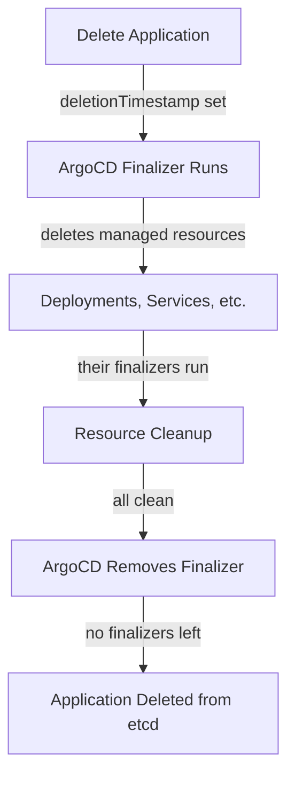

# How to Handle Resources with Finalizers Blocking Deletion in ArgoCD

Author: [nawazdhandala](https://github.com/nawazdhandala)

Tags: ArgoCD, GitOps, Kubernetes, Finalizer, Troubleshooting

Description: Learn how to diagnose and resolve Kubernetes resources stuck in deletion due to finalizers when managing applications with ArgoCD.

---

Finalizers in Kubernetes are pre-delete hooks that prevent a resource from being removed until some cleanup logic runs. When an ArgoCD application or one of its managed resources gets stuck in a "Deleting" state, finalizers are almost always the culprit. This guide covers why finalizers block deletion and how to resolve it safely.

## What Are Finalizers

Finalizers are strings in a resource's `metadata.finalizers` array. When you delete a resource that has finalizers, Kubernetes sets a `deletionTimestamp` on it but does not actually remove it from etcd. The resource stays in a "Terminating" state until a controller removes the finalizer strings, signaling that cleanup is complete.

```yaml
apiVersion: v1
kind: Namespace
metadata:
  name: my-namespace
  finalizers:
    # This finalizer prevents the namespace from being deleted
    # until all resources inside it are cleaned up
    - kubernetes
```

Common finalizers you will encounter include:

- `kubernetes` - on Namespaces, ensures all resources in the namespace are deleted first
- `foregroundDeletion` - Kubernetes garbage collector uses this for cascading deletes
- `resources-finalizer.argocd.argoproj.io` - ArgoCD's own finalizer for cascade deletion
- Custom finalizers from operators like `finalizer.databases.example.com`

## How Finalizers Interact with ArgoCD

ArgoCD adds its own finalizer to Application resources when cascade deletion is configured. This ensures that when you delete an ArgoCD Application, all managed Kubernetes resources are cleaned up first.

```yaml
apiVersion: argoproj.io/v1alpha1
kind: Application
metadata:
  name: my-app
  namespace: argocd
  finalizers:
    # ArgoCD adds this to enable cascade deletion
    - resources-finalizer.argocd.argoproj.io
```



The problem is that this creates a chain of dependencies. If any managed resource has its own finalizer that gets stuck, the entire deletion chain halts.

## Common Stuck Deletion Scenarios

### Scenario 1: ArgoCD Application Stuck Deleting

The Application itself will not delete because its cascade finalizer is waiting for managed resources to be removed, but one of those resources is stuck.

```bash
# Check if the application has a deletionTimestamp
kubectl get application my-app -n argocd -o jsonpath='{.metadata.deletionTimestamp}'

# Check what finalizers are on it
kubectl get application my-app -n argocd -o jsonpath='{.metadata.finalizers}'
```

### Scenario 2: Namespace Stuck Terminating

After deleting an ArgoCD app, the namespace it deployed to gets stuck in Terminating because resources inside it have unresolved finalizers.

```bash
# Find which resources are blocking namespace deletion
kubectl api-resources --verbs=list --namespaced -o name | while read resource; do
  kubectl get "$resource" -n stuck-namespace 2>/dev/null | grep -v "^$" && echo "--- $resource ---"
done
```

### Scenario 3: CRD Resources Stuck Due to Operator Gone

If ArgoCD deployed a CRD and custom resources, then the operator that handles the CRD's finalizer was deleted before the custom resources, those CRs will be stuck forever.

```bash
# Find resources with finalizers that reference a missing controller
kubectl get postgrescluster -n database -o jsonpath='{range .items[*]}{.metadata.name}: {.metadata.finalizers}{"\n"}{end}'
```

## Resolving Stuck Deletions

### Method 1: Remove the ArgoCD Finalizer (Skip Cascade Delete)

If you want to delete the ArgoCD Application without cleaning up managed resources (for example, if you are migrating them to another management tool), remove the ArgoCD finalizer.

```bash
# Remove the ArgoCD finalizer from the application
kubectl patch application my-app -n argocd \
  --type json \
  -p '[{"op": "remove", "path": "/metadata/finalizers/0"}]'
```

A safer approach when there are multiple finalizers is to target the specific one.

```bash
# Remove only the ArgoCD finalizer, leaving others intact
kubectl patch application my-app -n argocd \
  --type merge \
  -p '{"metadata":{"finalizers":null}}'
```

You can also use the ArgoCD CLI to delete without cascade.

```bash
# Delete without cascade - leaves managed resources in place
argocd app delete my-app --cascade=false
```

### Method 2: Remove Finalizers from Stuck Resources

When a managed resource (like a CRD instance) is stuck because its controller is gone, you need to manually remove its finalizer.

```bash
# Remove all finalizers from a stuck custom resource
kubectl patch postgrescluster my-db -n database \
  --type merge \
  -p '{"metadata":{"finalizers":null}}'

# Or remove a specific finalizer
kubectl patch postgrescluster my-db -n database \
  --type json \
  -p '[{"op": "remove", "path": "/metadata/finalizers/0"}]'
```

### Method 3: Fix the Stuck Namespace

For namespaces stuck in Terminating, you may need to use the API directly.

```bash
# Export the namespace, remove the finalizer, and reapply via the API
kubectl get namespace stuck-namespace -o json | \
  jq '.spec.finalizers = []' | \
  kubectl replace --raw "/api/v1/namespaces/stuck-namespace/finalize" -f -
```

### Method 4: Restore the Operator to Let Finalizers Complete

If the finalizer is stuck because the operator that handles it is missing, the cleanest solution is to reinstall the operator temporarily so it can complete the cleanup.

```bash
# Reinstall the operator so it can handle the finalizer
helm install postgres-operator charts/postgres-operator -n operators

# Wait for cleanup to complete
kubectl wait --for=delete postgrescluster/my-db -n database --timeout=120s

# Then remove the operator again if no longer needed
helm uninstall postgres-operator -n operators
```

## Preventing Finalizer Issues

### Strategy 1: Delete in the Correct Order

When decommissioning an application, delete resources in the right order:

1. Delete custom resources first (while their operator is still running)
2. Delete the operators
3. Delete the CRDs
4. Delete the namespace

Use ArgoCD sync waves to encode this order.

```yaml
# Custom resources deleted first (lower wave = earlier)
apiVersion: databases.example.com/v1
kind: PostgresCluster
metadata:
  name: my-db
  annotations:
    argocd.argoproj.io/sync-wave: "-3"

---
# Operator deleted after custom resources
apiVersion: apps/v1
kind: Deployment
metadata:
  name: postgres-operator
  annotations:
    argocd.argoproj.io/sync-wave: "-2"

---
# CRD deleted last
apiVersion: apiextensions.k8s.io/v1
kind: CustomResourceDefinition
metadata:
  name: postgresclusters.databases.example.com
  annotations:
    argocd.argoproj.io/sync-wave: "-1"
```

### Strategy 2: Use the ArgoCD Deletion Finalizer Wisely

Only add the cascade deletion finalizer when you genuinely want managed resources cleaned up. For applications where resources should persist after the Application is deleted, omit it.

```yaml
apiVersion: argoproj.io/v1alpha1
kind: Application
metadata:
  name: shared-infrastructure
  namespace: argocd
  # No finalizers - deleting this Application leaves resources in place
spec:
  project: default
  source:
    repoURL: https://github.com/org/infra.git
    targetRevision: main
    path: shared
  destination:
    server: https://kubernetes.default.svc
    namespace: shared-infra
```

### Strategy 3: Set Timeouts on Deletion

ArgoCD supports a deletion timeout that will force-remove resources if they do not clean up in time.

```bash
# Delete with a timeout - if resources do not clean up in 2 minutes, force delete
argocd app delete my-app --cascade --timeout 120
```

### Strategy 4: Monitor for Stuck Resources

Set up monitoring to catch resources that are stuck in Terminating state.

```bash
# Find all resources with deletionTimestamp but still existing
kubectl get all --all-namespaces -o json | \
  jq -r '.items[] | select(.metadata.deletionTimestamp != null) | "\(.kind)/\(.metadata.name) in \(.metadata.namespace) - stuck since \(.metadata.deletionTimestamp)"'
```

## Debugging Finalizer Chains

When an ArgoCD application deletion is stuck, trace the chain.

```bash
# Step 1: Check the Application's finalizers
kubectl get app my-app -n argocd -o yaml | grep -A5 finalizers

# Step 2: List all resources the app manages
argocd app resources my-app

# Step 3: Find which managed resources are stuck
argocd app resources my-app | while read line; do
  kind=$(echo "$line" | awk '{print $2}')
  name=$(echo "$line" | awk '{print $3}')
  ns=$(echo "$line" | awk '{print $1}')
  ts=$(kubectl get "$kind" "$name" -n "$ns" -o jsonpath='{.metadata.deletionTimestamp}' 2>/dev/null)
  if [ -n "$ts" ]; then
    echo "STUCK: $kind/$name in $ns since $ts"
    kubectl get "$kind" "$name" -n "$ns" -o jsonpath='{.metadata.finalizers}'
    echo ""
  fi
done
```

## Summary

Finalizer-blocked deletions in ArgoCD come down to a simple principle: a finalizer prevents deletion until its controller completes cleanup. When that controller is missing, misconfigured, or overloaded, resources get stuck. The fix depends on the situation - remove the finalizer manually when the controller is gone, reinstall the controller when possible, or delete without cascade when you want to preserve resources. For prevention, always delete resources in dependency order using sync waves, and only use the ArgoCD cascade finalizer when you genuinely need managed resource cleanup.
