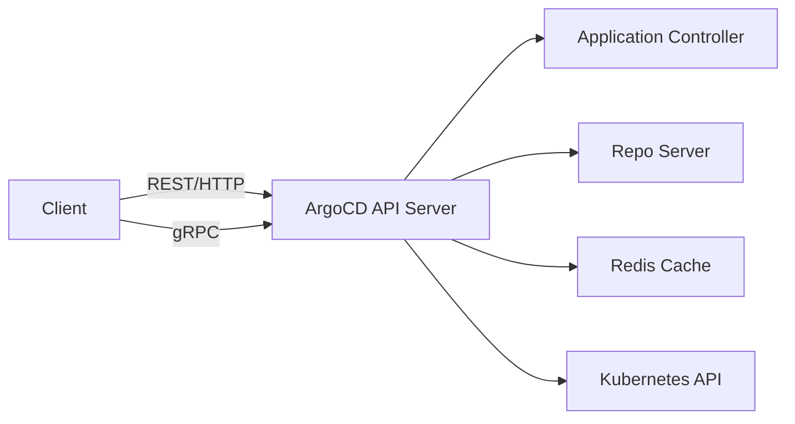

# How to Use ArgoCD REST API for Automation

Author: [nawazdhandala](https://github.com/nawazdhandala)

Tags: ArgoCD, GitOps, Kubernetes, REST API, Automation

Description: Learn how to use the ArgoCD REST API for automating application management, deployments, and operational tasks in your GitOps workflows.

---

ArgoCD ships with a fully-featured REST API that powers both its web UI and CLI. Every action you can perform through the dashboard or the command line is backed by an API endpoint. This makes ArgoCD a natural fit for building custom automation, integrating with external tools, and creating workflows tailored to your organization's needs.

In this guide, we will walk through the ArgoCD REST API and how to use it effectively for automation.

## Understanding the ArgoCD API Architecture

The ArgoCD API server exposes a REST API over HTTP/HTTPS. The API is versioned and follows standard REST conventions. Under the hood, ArgoCD uses gRPC, and the REST API is generated from gRPC service definitions using grpc-gateway. This means you get both a REST interface and a gRPC interface from the same server.

The API server typically runs on port 443 (HTTPS) or 80 (HTTP in insecure mode). All endpoints are prefixed with `/api/v1/`.



## Getting Started: API Base URL

First, determine your ArgoCD API base URL. If you are using port-forward:

```bash
# Port-forward the ArgoCD API server
kubectl port-forward svc/argocd-server -n argocd 8080:443

# Your base URL becomes
# https://localhost:8080/api/v1
```

If ArgoCD is exposed via an ingress:

```bash
# Your base URL is your ingress hostname
# https://argocd.example.com/api/v1
```

## Authentication

Before making any API call, you need an authentication token. You can obtain one using the session endpoint:

```bash
# Get an auth token using username/password
curl -s -k https://localhost:8080/api/v1/session \
  -d '{"username":"admin","password":"your-password"}' | jq .

# Response:
# {
#   "token": "eyJhbGciOiJIUzI1NiIsInR5cCI6IkpXVCJ9..."
# }
```

Store the token for subsequent requests:

```bash
# Store the token in a variable
ARGOCD_TOKEN=$(curl -s -k https://localhost:8080/api/v1/session \
  -d '{"username":"admin","password":"your-password"}' | jq -r '.token')

# Use it in the Authorization header
curl -s -k -H "Authorization: Bearer $ARGOCD_TOKEN" \
  https://localhost:8080/api/v1/applications
```

For service account automation, use a project-scoped JWT token instead of logging in each time:

```bash
# Generate a long-lived token for a project role
argocd proj role create-token my-project ci-role

# Or use the API to generate tokens
curl -s -k -H "Authorization: Bearer $ARGOCD_TOKEN" \
  -X POST https://localhost:8080/api/v1/projects/my-project/roles/ci-role/token
```

## Core API Endpoints

Here is a reference of the most commonly used API endpoints:

### Application Management

```bash
# List all applications
curl -s -k -H "Authorization: Bearer $ARGOCD_TOKEN" \
  https://localhost:8080/api/v1/applications

# Get a specific application
curl -s -k -H "Authorization: Bearer $ARGOCD_TOKEN" \
  https://localhost:8080/api/v1/applications/my-app

# Create an application
curl -s -k -H "Authorization: Bearer $ARGOCD_TOKEN" \
  -X POST https://localhost:8080/api/v1/applications \
  -H "Content-Type: application/json" \
  -d '{
    "metadata": {
      "name": "my-app"
    },
    "spec": {
      "project": "default",
      "source": {
        "repoURL": "https://github.com/org/repo.git",
        "path": "manifests",
        "targetRevision": "main"
      },
      "destination": {
        "server": "https://kubernetes.default.svc",
        "namespace": "my-namespace"
      }
    }
  }'

# Delete an application
curl -s -k -H "Authorization: Bearer $ARGOCD_TOKEN" \
  -X DELETE https://localhost:8080/api/v1/applications/my-app
```

### Sync Operations

```bash
# Trigger a sync
curl -s -k -H "Authorization: Bearer $ARGOCD_TOKEN" \
  -X POST https://localhost:8080/api/v1/applications/my-app/sync \
  -H "Content-Type: application/json" \
  -d '{
    "prune": true,
    "strategy": {
      "apply": {
        "force": false
      }
    }
  }'

# Get sync status
curl -s -k -H "Authorization: Bearer $ARGOCD_TOKEN" \
  https://localhost:8080/api/v1/applications/my-app | jq '.status.sync'
```

### Resource Operations

```bash
# List application resources
curl -s -k -H "Authorization: Bearer $ARGOCD_TOKEN" \
  "https://localhost:8080/api/v1/applications/my-app/resource-tree"

# Get a specific resource
curl -s -k -H "Authorization: Bearer $ARGOCD_TOKEN" \
  "https://localhost:8080/api/v1/applications/my-app/resource?resourceName=my-deploy&version=v1&kind=Deployment&namespace=my-ns&group=apps"
```

## Building a Deployment Automation Script

Here is a practical example of a shell script that automates the entire deploy-and-wait cycle:

```bash
#!/bin/bash
# deploy.sh - Automated deployment using ArgoCD REST API

ARGOCD_SERVER="https://argocd.example.com"
APP_NAME="$1"
REVISION="$2"
TIMEOUT=300  # 5 minutes

# Authenticate
TOKEN=$(curl -s -k "$ARGOCD_SERVER/api/v1/session" \
  -d "{\"username\":\"$ARGOCD_USER\",\"password\":\"$ARGOCD_PASS\"}" \
  | jq -r '.token')

# Update the target revision
curl -s -k -H "Authorization: Bearer $TOKEN" \
  -X PATCH "$ARGOCD_SERVER/api/v1/applications/$APP_NAME" \
  -H "Content-Type: application/json" \
  -d "{\"spec\":{\"source\":{\"targetRevision\":\"$REVISION\"}}}"

# Trigger sync
curl -s -k -H "Authorization: Bearer $TOKEN" \
  -X POST "$ARGOCD_SERVER/api/v1/applications/$APP_NAME/sync" \
  -H "Content-Type: application/json" \
  -d '{"prune": true}'

echo "Sync triggered for $APP_NAME at revision $REVISION"

# Wait for sync to complete
START=$(date +%s)
while true; do
  ELAPSED=$(( $(date +%s) - START ))
  if [ $ELAPSED -gt $TIMEOUT ]; then
    echo "ERROR: Sync timed out after ${TIMEOUT}s"
    exit 1
  fi

  # Check sync and health status
  STATUS=$(curl -s -k -H "Authorization: Bearer $TOKEN" \
    "$ARGOCD_SERVER/api/v1/applications/$APP_NAME" \
    | jq -r '{sync: .status.sync.status, health: .status.health.status}')

  SYNC=$(echo "$STATUS" | jq -r '.sync')
  HEALTH=$(echo "$STATUS" | jq -r '.health')

  echo "Sync: $SYNC | Health: $HEALTH | Elapsed: ${ELAPSED}s"

  if [ "$SYNC" = "Synced" ] && [ "$HEALTH" = "Healthy" ]; then
    echo "Deployment successful!"
    exit 0
  fi

  sleep 5
done
```

## Using the API in Python

For more complex automation, Python is a better choice:

```python
import requests
import time

class ArgoCDClient:
    def __init__(self, server, username, password, verify_ssl=False):
        self.server = server.rstrip('/')
        self.verify = verify_ssl
        self.token = self._authenticate(username, password)

    def _authenticate(self, username, password):
        # Get auth token from the session endpoint
        resp = requests.post(
            f"{self.server}/api/v1/session",
            json={"username": username, "password": password},
            verify=self.verify
        )
        resp.raise_for_status()
        return resp.json()["token"]

    def _headers(self):
        return {"Authorization": f"Bearer {self.token}"}

    def list_applications(self):
        # Fetch all applications
        resp = requests.get(
            f"{self.server}/api/v1/applications",
            headers=self._headers(),
            verify=self.verify
        )
        resp.raise_for_status()
        return resp.json()["items"]

    def sync_application(self, name, prune=True):
        # Trigger a sync operation
        resp = requests.post(
            f"{self.server}/api/v1/applications/{name}/sync",
            headers=self._headers(),
            json={"prune": prune},
            verify=self.verify
        )
        resp.raise_for_status()
        return resp.json()

    def wait_for_sync(self, name, timeout=300):
        # Poll until the app is synced and healthy
        start = time.time()
        while time.time() - start < timeout:
            resp = requests.get(
                f"{self.server}/api/v1/applications/{name}",
                headers=self._headers(),
                verify=self.verify
            )
            app = resp.json()
            sync = app["status"]["sync"]["status"]
            health = app["status"]["health"]["status"]
            if sync == "Synced" and health == "Healthy":
                return True
            time.sleep(5)
        return False

# Usage
client = ArgoCDClient("https://argocd.example.com", "admin", "password")
client.sync_application("my-app")
success = client.wait_for_sync("my-app", timeout=600)
```

## API Pagination

When you have many applications, the API supports pagination:

```bash
# Get first 50 applications
curl -s -k -H "Authorization: Bearer $ARGOCD_TOKEN" \
  "https://localhost:8080/api/v1/applications?limit=50"

# Get applications matching a label selector
curl -s -k -H "Authorization: Bearer $ARGOCD_TOKEN" \
  "https://localhost:8080/api/v1/applications?selector=team%3Dbackend"
```

## Error Handling

The API returns standard HTTP status codes. Always check for errors:

- **401 Unauthorized** - Invalid or expired token
- **403 Forbidden** - Insufficient RBAC permissions
- **404 Not Found** - Application or resource does not exist
- **409 Conflict** - Resource already exists or version conflict

```bash
# Check for errors in response
RESPONSE=$(curl -s -k -w "\n%{http_code}" -H "Authorization: Bearer $ARGOCD_TOKEN" \
  https://localhost:8080/api/v1/applications/nonexistent)

HTTP_CODE=$(echo "$RESPONSE" | tail -1)
BODY=$(echo "$RESPONSE" | head -1)

if [ "$HTTP_CODE" != "200" ]; then
  echo "API Error ($HTTP_CODE): $BODY"
  exit 1
fi
```

## Security Considerations

When using the ArgoCD API for automation, keep these best practices in mind:

1. **Use project-scoped tokens** instead of admin credentials
2. **Set token expiration** for CI/CD tokens
3. **Use RBAC** to limit what API tokens can do
4. **Never store tokens in code** - use environment variables or secret managers
5. **Enable TLS** and verify certificates in production
6. **Set rate limits** to prevent abuse (see our post on [ArgoCD API rate limiting](https://oneuptime.com/blog/post/2026-02-26-argocd-api-rate-limiting/view))

The ArgoCD REST API is the backbone of all ArgoCD automation. Whether you are building CI/CD integrations, custom dashboards, or operational tools, the API gives you programmatic access to everything ArgoCD can do. Start with simple curl commands, graduate to scripts, and eventually build full clients for your specific needs.
