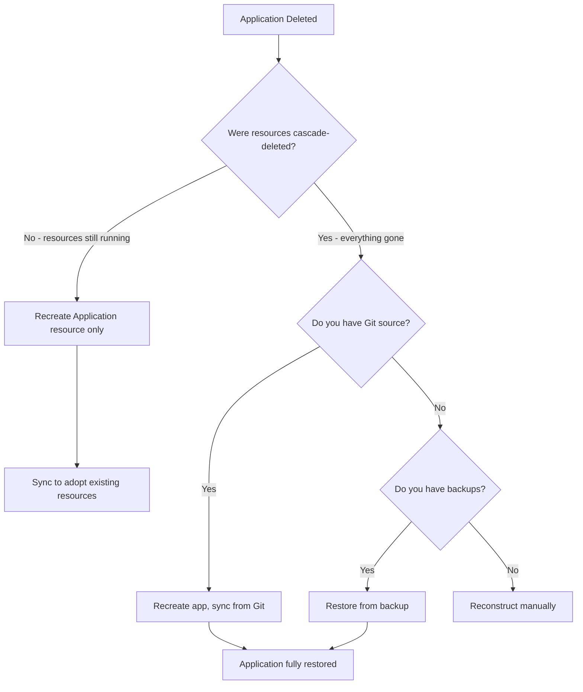

# How to Restore a Deleted ArgoCD Application

Author: [nawazdhandala](https://github.com/nawazdhandala)

Tags: ArgoCD, GitOps, Kubernetes, Disaster Recovery, Application Management

Description: Learn how to restore deleted ArgoCD applications and their resources using Git history, backups, declarative configs, and emergency recovery procedures.

---

Someone deleted your ArgoCD application. Maybe it was intentional and now they want it back. Maybe it was an accident and production is down. Either way, you need to get it restored and running as quickly as possible.

The good news about GitOps is that your desired state lives in Git, so the application definition and resource manifests are recoverable. The challenge is knowing where to find everything and how to reconnect the pieces.

## Recovery scenarios

The recovery approach depends on what was deleted and how:



## Scenario 1: Non-cascade delete (resources still running)

If the application was deleted with `--cascade=false`, all Kubernetes resources are still running. You just need to recreate the Application resource:

```bash
# Option A: If your applications are defined in Git (declarative setup)
# Just re-sync the parent app-of-apps, or manually apply:
kubectl apply -f apps/my-app.yaml

# Option B: Recreate using the CLI
argocd app create my-app \
  --repo https://github.com/myorg/my-app.git \
  --path manifests \
  --dest-server https://kubernetes.default.svc \
  --dest-namespace my-app \
  --project default

# Sync to reconcile with existing resources
argocd app sync my-app
```

After syncing, ArgoCD will detect the existing resources and adopt them. You may see some resources marked as OutOfSync if there were manual changes while the application was unmanaged.

## Scenario 2: Cascade delete (resources gone, Git available)

If resources were cascade-deleted, recreate the application and sync from Git:

```bash
# Recreate the application
argocd app create my-app \
  --repo https://github.com/myorg/my-app.git \
  --path manifests \
  --dest-server https://kubernetes.default.svc \
  --dest-namespace my-app \
  --project default \
  --sync-policy automated

# Or apply the YAML directly
kubectl apply -f - <<EOF
apiVersion: argoproj.io/v1alpha1
kind: Application
metadata:
  name: my-app
  namespace: argocd
  finalizers:
    - resources-finalizer.argocd.argoproj.io
spec:
  project: default
  source:
    repoURL: https://github.com/myorg/my-app.git
    targetRevision: main
    path: manifests
  destination:
    server: https://kubernetes.default.svc
    namespace: my-app
  syncPolicy:
    automated:
      selfHeal: true
      prune: true
    syncOptions:
      - CreateNamespace=true
EOF

# Trigger sync
argocd app sync my-app
```

This will recreate all resources from Git. If your application uses a specific Git revision or tag, make sure to set `targetRevision` correctly:

```bash
# Pin to a specific commit if the latest code is not what was deployed
argocd app set my-app --revision abc123def
argocd app sync my-app
```

## Scenario 3: Recovering the Application manifest from Git history

If the application YAML was also removed from Git (e.g., in a declarative setup), recover it from Git history:

```bash
# Find when the application file was deleted
git log --diff-filter=D --summary -- apps/my-app.yaml

# Recover the file from the commit before deletion
git show HEAD~1:apps/my-app.yaml > my-app-recovered.yaml

# Or from a specific commit
git show abc123:apps/my-app.yaml > my-app-recovered.yaml

# Apply the recovered manifest
kubectl apply -f my-app-recovered.yaml

# Re-add it to Git
git add apps/my-app.yaml
git commit -m "Restore accidentally deleted my-app application"
git push
```

## Scenario 4: Recovering from ArgoCD backup

If you have been taking ArgoCD backups (you should be), restore from the backup:

```bash
# ArgoCD export includes all application definitions
# If you used argocd admin export:
argocd admin export > argocd-backup.yaml

# To restore a specific application from the backup:
# Extract just the application you need
kubectl get -f argocd-backup.yaml -o json | \
  jq '.items[] | select(.kind == "Application" and .metadata.name == "my-app")' | \
  kubectl apply -f -
```

If you use Velero for cluster backups:

```bash
# List available backups
velero backup get

# Restore just the ArgoCD application
velero restore create my-app-restore \
  --from-backup daily-backup-20260225 \
  --include-namespaces argocd \
  --include-resources applications.argoproj.io \
  --selector metadata.name=my-app
```

## Scenario 5: Reconstructing from running resources

If the application was non-cascade deleted and you do not have the Application manifest, reconstruct it from what is running:

```bash
# Examine existing resources to determine the source
kubectl get deployments -n my-app -o yaml | head -30

# Check for ArgoCD tracking annotations
kubectl get deployment my-deployment -n my-app \
  -o jsonpath='{.metadata.annotations.argocd\.argoproj\.io/tracking-id}'

# Check labels for the original application name
kubectl get all -n my-app -o json | \
  jq '.items[].metadata.labels["app.kubernetes.io/instance"]' | sort -u
```

Then recreate the Application pointing to the correct Git source:

```bash
argocd app create my-app \
  --repo https://github.com/myorg/my-app.git \
  --path manifests \
  --dest-server https://kubernetes.default.svc \
  --dest-namespace my-app \
  --project default
```

## Recovering application history

ArgoCD maintains a sync history for each application. When the application is deleted, this history is lost. However, if you have been exporting metrics or logging sync events, you can reconstruct the deployment history:

```bash
# Check ArgoCD server logs for historical sync records
kubectl logs -n argocd deployment/argocd-server --since=168h | \
  grep "my-app" | grep "sync"

# Check Git history for the manifests repo
cd /path/to/manifests-repo
git log --oneline manifests/
```

## Restoring application-specific secrets

If the application used secrets that were cascade-deleted:

```bash
# Check if secrets were managed by External Secrets Operator
kubectl get externalsecret -n my-app
# If so, they will be recreated automatically when the ExternalSecret resource is recreated

# Check if secrets were Sealed Secrets
kubectl get sealedsecret -n my-app
# If SealedSecret manifests are in Git, they will be recreated on sync

# For plain Kubernetes secrets that were in Git (not recommended but common)
# They will be recreated when ArgoCD syncs from Git

# For secrets that were created manually and not in Git
# You need to recreate them manually before the application can work
kubectl create secret generic my-app-secrets -n my-app \
  --from-literal=DB_PASSWORD=<value> \
  --from-literal=API_KEY=<value>
```

## Emergency recovery playbook

For production incidents, here is a step-by-step emergency recovery:

```bash
#!/bin/bash
# Emergency ArgoCD Application Recovery
APP_NAME=$1
NAMESPACE=${2:-$APP_NAME}

echo "=== Emergency Recovery: $APP_NAME ==="

# Step 1: Check if resources are still running
echo "Step 1: Checking for existing resources..."
RESOURCES=$(kubectl get all -n $NAMESPACE 2>/dev/null)
if [ -n "$RESOURCES" ]; then
  echo "Resources found in namespace $NAMESPACE - non-cascade recovery"
  RECOVERY_TYPE="adopt"
else
  echo "No resources found - full recreation needed"
  RECOVERY_TYPE="recreate"
fi

# Step 2: Find the application manifest
echo ""
echo "Step 2: Looking for application manifest..."

# Check Git
if [ -f "apps/$APP_NAME.yaml" ]; then
  echo "Found in current Git: apps/$APP_NAME.yaml"
  MANIFEST="apps/$APP_NAME.yaml"
elif git show HEAD~1:apps/$APP_NAME.yaml 2>/dev/null; then
  echo "Found in Git history"
  git show HEAD~1:apps/$APP_NAME.yaml > /tmp/$APP_NAME-recovered.yaml
  MANIFEST="/tmp/$APP_NAME-recovered.yaml"
else
  echo "Not found in Git - manual recreation needed"
  MANIFEST=""
fi

# Step 3: Recreate the application
echo ""
echo "Step 3: Recreating application..."
if [ -n "$MANIFEST" ]; then
  kubectl apply -f $MANIFEST
else
  echo "Please provide the application manifest or recreate manually"
  echo "argocd app create $APP_NAME --repo <REPO> --path <PATH> --dest-server https://kubernetes.default.svc --dest-namespace $NAMESPACE"
  exit 1
fi

# Step 4: Sync
echo ""
echo "Step 4: Syncing application..."
argocd app sync $APP_NAME

# Step 5: Wait for health
echo ""
echo "Step 5: Waiting for application health..."
argocd app wait $APP_NAME --timeout 300

echo ""
echo "=== Recovery complete ==="
argocd app get $APP_NAME
```

## Preventing future recovery headaches

### Always keep application definitions in Git

```yaml
# Store all application definitions declaratively
# apps/my-app.yaml in your config repo
apiVersion: argoproj.io/v1alpha1
kind: Application
metadata:
  name: my-app
  namespace: argocd
```

### Set up regular ArgoCD backups

```bash
# Cron job to backup ArgoCD state
# Add to your cluster's CronJob resources
apiVersion: batch/v1
kind: CronJob
metadata:
  name: argocd-backup
  namespace: argocd
spec:
  schedule: "0 */6 * * *"  # Every 6 hours
  jobTemplate:
    spec:
      template:
        spec:
          containers:
            - name: backup
              image: argoproj/argocd:v2.13.0
              command:
                - /bin/sh
                - -c
                - |
                  argocd admin export > /backup/argocd-$(date +%Y%m%d-%H%M%S).yaml
              volumeMounts:
                - name: backup
                  mountPath: /backup
          volumes:
            - name: backup
              persistentVolumeClaim:
                claimName: argocd-backup-pvc
          restartPolicy: OnFailure
```

### Use deletion protection for critical applications

See the guide on [preventing accidental application deletion](https://oneuptime.com/blog/post/2026-02-26-argocd-prevent-accidental-deletion/view) for comprehensive protection strategies.

## Summary

Restoring a deleted ArgoCD application depends on whether the managed resources were also deleted (cascade vs non-cascade) and whether you have the Application manifest in Git or backups. The fastest recovery is from a declarative Git setup - just re-apply the manifest and sync. For cascade-deleted resources, ArgoCD will recreate everything from Git. The key takeaway is that recovery is dramatically easier when you store application definitions in Git and maintain regular backups. Invest time in prevention and backup strategies now so that recovery is a routine operation rather than a crisis.
