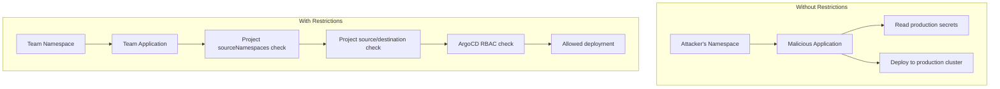

# How to Restrict Application Namespaces in ArgoCD

Author: [nawazdhandala](https://github.com/nawazdhandala)

Tags: ArgoCD, GitOps, Kubernetes, Security, RBAC

Description: Learn how to restrict which namespaces can host ArgoCD Application resources using project source namespaces and RBAC policies for secure multi-tenant setups.

---

When you enable applications in any namespace in ArgoCD, you open up a powerful multi-tenancy capability. But without proper restrictions, any namespace could potentially create Application resources that access unauthorized repositories or deploy to unauthorized clusters. This guide covers the layered security controls you need to lock down application namespace access.

## The Security Concern

Without restrictions, enabling applications in any namespace creates a risk:



ArgoCD provides three layers of restriction: namespace watch configuration, project source namespaces, and RBAC policies.

## Layer 1: Namespace Watch Configuration

The first layer controls which namespaces ArgoCD watches at all. Only explicitly listed namespaces are monitored:

```yaml
# argocd-cmd-params-cm - be explicit, avoid wildcards
apiVersion: v1
kind: ConfigMap
metadata:
  name: argocd-cmd-params-cm
  namespace: argocd
data:
  # Only watch specific, approved namespaces
  application.namespaces: "team-frontend, team-backend, team-data"
```

Do NOT use `*` unless you have additional restrictions in place. If you must use patterns, make them as specific as possible:

```yaml
data:
  # Better than '*' - only matches team namespaces
  application.namespaces: "team-*"
```

## Layer 2: Project Source Namespaces

The `sourceNamespaces` field in AppProject is the most important restriction. It controls which namespaces can create Application resources within a given project:

```yaml
apiVersion: argoproj.io/v1alpha1
kind: AppProject
metadata:
  name: team-frontend
  namespace: argocd
spec:
  # CRITICAL: Only these namespaces can use this project
  sourceNamespaces:
    - team-frontend

  # These restrictions apply to all apps in this project
  sourceRepos:
    - 'https://github.com/myorg/frontend-*'
  destinations:
    - server: https://kubernetes.default.svc
      namespace: frontend-production
    - server: https://kubernetes.default.svc
      namespace: frontend-staging
  clusterResourceWhitelist: []
  namespaceResourceWhitelist:
    - group: 'apps'
      kind: Deployment
    - group: ''
      kind: Service
    - group: ''
      kind: ConfigMap
    - group: 'networking.k8s.io'
      kind: Ingress
```

With this configuration:

- Only Application resources in the `team-frontend` namespace can reference the `team-frontend` project
- Those applications can only pull from `github.com/myorg/frontend-*` repositories
- They can only deploy to `frontend-production` and `frontend-staging` namespaces
- They can only create Deployments, Services, ConfigMaps, and Ingresses

### The Default Project

Pay special attention to the `default` project. By default, it has no restrictions on source namespaces. Lock it down:

```yaml
apiVersion: argoproj.io/v1alpha1
kind: AppProject
metadata:
  name: default
  namespace: argocd
spec:
  # Restrict default project to argocd namespace only
  sourceNamespaces:
    - argocd

  # Restrict what the default project can do
  sourceRepos: []        # No repos allowed
  destinations: []       # No destinations allowed
```

Or if you still use the default project for some applications:

```yaml
spec:
  sourceNamespaces:
    - argocd              # Only allow from argocd namespace
  sourceRepos:
    - 'https://github.com/myorg/infrastructure-*'
  destinations:
    - server: https://kubernetes.default.svc
      namespace: infrastructure
```

## Layer 3: ArgoCD RBAC

ArgoCD's RBAC system adds another restriction layer. Even if a namespace is watched and the project allows it, RBAC can deny access:

```yaml
# argocd-rbac-cm ConfigMap
apiVersion: v1
kind: ConfigMap
metadata:
  name: argocd-rbac-cm
  namespace: argocd
data:
  # Default policy: deny everything
  policy.default: role:none

  policy.csv: |
    # Team frontend can manage their applications
    p, role:team-frontend, applications, *, team-frontend/*, allow
    p, role:team-frontend, logs, get, team-frontend/*, allow

    # Team backend can manage their applications
    p, role:team-backend, applications, *, team-backend/*, allow
    p, role:team-backend, logs, get, team-backend/*, allow

    # Map SSO groups to roles
    g, frontend-developers, role:team-frontend
    g, backend-developers, role:team-backend

    # Admin role for platform team
    p, role:platform-admin, applications, *, */*, allow
    p, role:platform-admin, clusters, *, *, allow
    p, role:platform-admin, repositories, *, *, allow
    p, role:platform-admin, projects, *, *, allow
    g, platform-team, role:platform-admin
```

## Kubernetes RBAC for Application Resources

Complement ArgoCD's RBAC with Kubernetes native RBAC to control who can create Application resources in each namespace:

```yaml
# Role: Can manage ArgoCD Application resources
apiVersion: rbac.authorization.k8s.io/v1
kind: Role
metadata:
  name: argocd-app-manager
  namespace: team-frontend
rules:
  - apiGroups: ['argoproj.io']
    resources: ['applications']
    verbs: ['get', 'list', 'watch', 'create', 'update', 'patch', 'delete']
---
# Bind to team group
apiVersion: rbac.authorization.k8s.io/v1
kind: RoleBinding
metadata:
  name: frontend-app-managers
  namespace: team-frontend
roleRef:
  apiGroup: rbac.authorization.k8s.io
  kind: Role
  name: argocd-app-manager
subjects:
  - kind: Group
    name: frontend-developers
    apiGroup: rbac.authorization.k8s.io
```

For namespaces that should NOT have Application resources, explicitly deny:

```yaml
# NetworkPolicy or RBAC that prevents Application creation in non-team namespaces
apiVersion: rbac.authorization.k8s.io/v1
kind: Role
metadata:
  name: deny-argocd-apps
  namespace: monitoring  # Should not have ArgoCD Application resources
rules:
  - apiGroups: ['argoproj.io']
    resources: ['applications']
    verbs: []  # No permissions
```

## Validation with Admission Controllers

For additional security, use an admission controller to validate Application resources:

```yaml
# OPA Gatekeeper ConstraintTemplate
apiVersion: templates.gatekeeper.sh/v1
kind: ConstraintTemplate
metadata:
  name: argoapplicationrestriction
spec:
  crd:
    spec:
      names:
        kind: ArgoApplicationRestriction
      validation:
        openAPIV3Schema:
          type: object
          properties:
            allowedProjects:
              type: array
              items:
                type: string
  targets:
    - target: admission.k8s.gatekeeper.sh
      rego: |
        package argoapplicationrestriction
        violation[{"msg": msg}] {
          input.review.object.kind == "Application"
          input.review.object.apiVersion == "argoproj.io/v1alpha1"
          project := input.review.object.spec.project
          allowed := input.parameters.allowedProjects
          not project_allowed(project, allowed)
          msg := sprintf("Application in namespace %v cannot use project %v", [input.review.object.metadata.namespace, project])
        }
        project_allowed(project, allowed) {
          allowed[_] == project
        }
---
# Apply constraint to team namespaces
apiVersion: constraints.gatekeeper.sh/v1beta1
kind: ArgoApplicationRestriction
metadata:
  name: restrict-frontend-namespace
spec:
  match:
    namespaces: ["team-frontend"]
    kinds:
      - apiGroups: ["argoproj.io"]
        kinds: ["Application"]
  parameters:
    allowedProjects: ["team-frontend"]
```

## Auditing Namespace Access

Regularly audit which namespaces have Application resources and which projects they reference:

```bash
# List all Application resources across all namespaces
kubectl get applications --all-namespaces \
  -o custom-columns='NAMESPACE:.metadata.namespace,NAME:.metadata.name,PROJECT:.spec.project,DEST:.spec.destination.namespace'

# Find applications referencing unexpected projects
kubectl get applications --all-namespaces -o json | jq -r '
  .items[] |
  select(.metadata.namespace != "argocd") |
  "\(.metadata.namespace)/\(.metadata.name) -> project: \(.spec.project)"
'

# Check project sourceNamespaces configuration
for proj in $(kubectl get appprojects -n argocd -o jsonpath='{.items[*].metadata.name}'); do
  ns=$(kubectl get appproject "$proj" -n argocd -o jsonpath='{.spec.sourceNamespaces}' 2>/dev/null)
  echo "Project $proj: sourceNamespaces=$ns"
done
```

## Complete Security Checklist

When restricting application namespaces, verify each layer:

1. **argocd-cmd-params-cm** - Only lists approved namespaces (no wildcard unless necessary)
2. **AppProject sourceNamespaces** - Each project explicitly lists allowed namespaces
3. **AppProject sourceRepos** - Each project limits which repositories can be used
4. **AppProject destinations** - Each project limits which clusters/namespaces can be deployed to
5. **AppProject resource whitelists** - Each project limits which Kubernetes resource types can be created
6. **ArgoCD RBAC** - Default policy is deny, explicit allow for each team/role
7. **Kubernetes RBAC** - Teams only have Application CRUD in their own namespaces
8. **Default project** - Locked down or sourceNamespaces restricted to argocd only

Missing any one of these layers can create a security gap. Defense in depth is the key principle - assume any single layer might be misconfigured and rely on the others as backup.

For more on enabling applications in any namespace, see our guide on [enabling the feature](https://oneuptime.com/blog/post/2026-02-26-argocd-enable-applications-any-namespace/view). For project configuration details, see [managing projects declaratively](https://oneuptime.com/blog/post/2026-02-26-argocd-manage-projects-declaratively/view).
