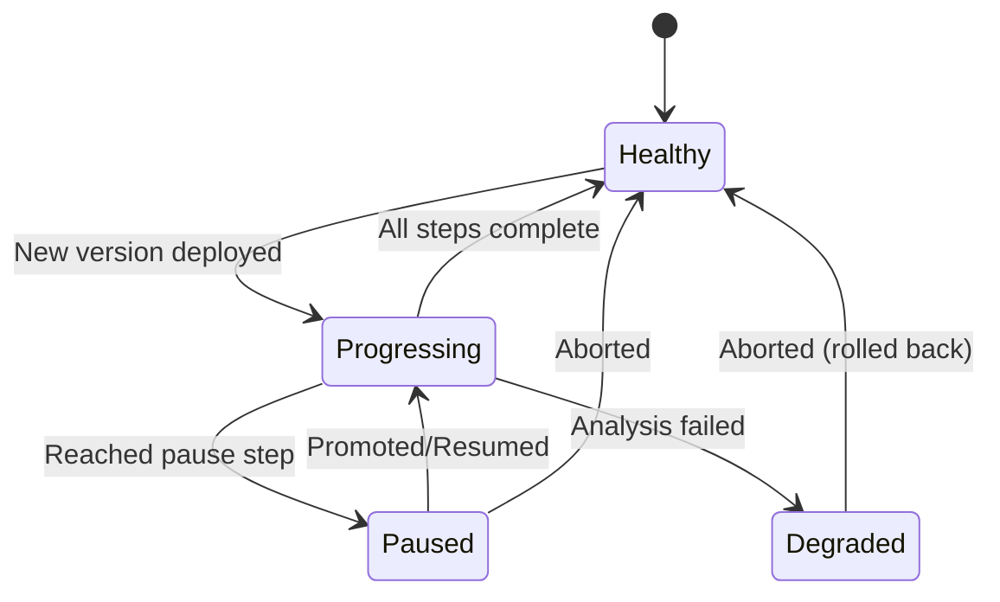

# How to Create Resume and Pause Actions for Argo Rollouts in ArgoCD

Author: [nawazdhandala](https://github.com/nawazdhandala)

Tags: ArgoCD, GitOps, Kubernetes, Argo Rollouts, Progressive Delivery

Description: Learn how to create custom resume, pause, promote, and abort actions for Argo Rollouts in ArgoCD to control progressive delivery workflows directly from the ArgoCD dashboard.

---

Argo Rollouts brings canary deployments and blue-green deployments to Kubernetes, and it integrates tightly with ArgoCD. But managing Rollout lifecycle operations - pausing a canary, promoting to the next step, aborting a bad release - requires either the Argo Rollouts kubectl plugin or the Argo Rollouts dashboard. If your team lives in the ArgoCD UI, they should not have to switch tools for these common operations.

Custom resource actions let you add pause, resume, promote, and abort buttons directly to Argo Rollouts resources in the ArgoCD dashboard. This guide shows you how to build all of them.

## Understanding Argo Rollouts Lifecycle

An Argo Rollout goes through several phases during a progressive delivery:



The key operations are:

- **Pause**: Halt the rollout at the current step
- **Resume/Promote**: Continue to the next step
- **Full Promote**: Skip remaining steps and go to 100%
- **Abort**: Cancel the rollout and revert to the stable version
- **Retry**: Restart a failed rollout

## Complete Rollout Actions Configuration

Here is the full set of actions for Argo Rollouts:

```yaml
apiVersion: v1
kind: ConfigMap
metadata:
  name: argocd-cm
  namespace: argocd
data:
  resource.customizations.actions.argoproj.io_Rollout: |
    discovery.lua: |
      actions = {}

      -- Determine rollout state
      local phase = ""
      local paused = false
      local aborted = false

      if obj.status ~= nil then
        phase = obj.status.phase or ""
        if obj.status.pauseConditions ~= nil and #obj.status.pauseConditions > 0 then
          paused = true
        end
        if obj.status.abort == true then
          aborted = true
        end
      end

      -- Resume: available when rollout is paused
      if paused then
        actions["resume"] = {["disabled"] = false}
        actions["promote-full"] = {["disabled"] = false}
      end

      -- Abort: available when rollout is in progress or paused
      if phase == "Progressing" or paused then
        actions["abort"] = {["disabled"] = false}
      end

      -- Retry: available when rollout is degraded or aborted
      if phase == "Degraded" or aborted then
        actions["retry"] = {["disabled"] = false}
      end

      -- Restart: always available for healthy rollouts
      if phase == "Healthy" or phase == "" then
        actions["restart"] = {["disabled"] = false}
      end

      return actions

    definitions:
      - name: resume
        action.lua: |
          -- Resume a paused rollout (advance to next step)
          -- This works by clearing the pause conditions
          if obj.status ~= nil then
            obj.status.pauseConditions = nil
          end
          return obj

      - name: promote-full
        action.lua: |
          -- Full promotion: skip remaining steps and go to 100%
          if obj.status ~= nil then
            obj.status.pauseConditions = nil
          end
          -- Set the full promotion status
          if obj.metadata.annotations == nil then
            obj.metadata.annotations = {}
          end
          local os = require("os")
          obj.metadata.annotations["rollout.argoproj.io/fullPromote"] = tostring(os.time())
          -- Clear any existing abort status
          if obj.status ~= nil then
            obj.status.abort = false
          end
          return obj

      - name: abort
        action.lua: |
          -- Abort the rollout and revert to stable version
          if obj.status == nil then
            obj.status = {}
          end
          obj.status.abort = true
          return obj

      - name: retry
        action.lua: |
          -- Retry a failed or aborted rollout
          if obj.status ~= nil then
            obj.status.abort = false
            obj.status.pauseConditions = nil
          end
          -- Update template annotation to trigger new rollout
          local os = require("os")
          if obj.spec.template.metadata == nil then
            obj.spec.template.metadata = {}
          end
          if obj.spec.template.metadata.annotations == nil then
            obj.spec.template.metadata.annotations = {}
          end
          obj.spec.template.metadata.annotations["rollout.argoproj.io/retried-at"] = tostring(os.time())
          return obj

      - name: restart
        action.lua: |
          -- Restart all pods (rolling restart)
          local os = require("os")
          if obj.spec.template.metadata == nil then
            obj.spec.template.metadata = {}
          end
          if obj.spec.template.metadata.annotations == nil then
            obj.spec.template.metadata.annotations = {}
          end
          obj.spec.template.metadata.annotations["kubectl.kubernetes.io/restartedAt"] = tostring(os.time())
          return obj
```

## Using the Actions

### Scenario: Managing a Canary Deployment

Let's say you have a canary Rollout that pauses at 20% traffic for manual verification:

```yaml
apiVersion: argoproj.io/v1alpha1
kind: Rollout
metadata:
  name: my-service
spec:
  strategy:
    canary:
      steps:
        - setWeight: 20
        - pause: {}          # Manual gate - waits for promotion
        - setWeight: 50
        - pause: { duration: 300s }
        - setWeight: 80
        - pause: { duration: 300s }
```

When the rollout reaches the first pause step:

1. Open ArgoCD UI and navigate to your application
2. Click on the Rollout resource
3. You will see "resume" and "abort" actions available
4. If the canary looks good, click "resume" to advance to 50%
5. If the canary is bad, click "abort" to roll back

### From the CLI

```bash
# Check the rollout status
argocd app resources my-app --kind Rollout

# Resume a paused rollout
argocd app actions run my-app resume \
  --kind Rollout \
  --resource-name my-service \
  --namespace production

# Abort a bad rollout
argocd app actions run my-app abort \
  --kind Rollout \
  --resource-name my-service \
  --namespace production

# Full promote (skip to 100%)
argocd app actions run my-app promote-full \
  --kind Rollout \
  --resource-name my-service \
  --namespace production

# Retry a failed rollout
argocd app actions run my-app retry \
  --kind Rollout \
  --resource-name my-service \
  --namespace production
```

## Adding Actions for AnalysisRun

If you use Argo Rollouts analysis, you might also want actions on AnalysisRun resources:

```yaml
  resource.customizations.actions.argoproj.io_AnalysisRun: |
    discovery.lua: |
      actions = {}
      if obj.status ~= nil and obj.status.phase == "Running" then
        actions["terminate"] = {["disabled"] = false}
      end
      return actions
    definitions:
      - name: terminate
        action.lua: |
          -- Terminate a running analysis
          if obj.spec.terminate == nil then
            obj.spec.terminate = true
          else
            obj.spec.terminate = true
          end
          return obj
```

## Adding a Health Check for Rollouts

To make the actions work well, you should also have a health check that accurately reports Rollout status:

```yaml
  resource.customizations.health.argoproj.io_Rollout: |
    hs = {}
    if obj.status == nil then
      hs.status = "Progressing"
      hs.message = "Waiting for rollout status"
      return hs
    end

    if obj.status.phase == "Healthy" then
      hs.status = "Healthy"
      hs.message = "Rollout is healthy"
    elseif obj.status.phase == "Paused" then
      -- Paused is a valid state, not degraded
      hs.status = "Suspended"
      if obj.status.pauseConditions ~= nil then
        for i, pc in ipairs(obj.status.pauseConditions) do
          if pc.reason == "BlueGreenPause" then
            hs.message = "Paused: Blue-Green promotion gate"
          elseif pc.reason == "CanaryPauseStep" then
            local weight = obj.status.currentStepIndex or "unknown"
            hs.message = "Paused: Canary at step " .. tostring(weight)
          else
            hs.message = "Paused: " .. tostring(pc.reason)
          end
        end
      else
        hs.message = "Rollout is paused"
      end
    elseif obj.status.phase == "Progressing" then
      hs.status = "Progressing"
      hs.message = "Rollout is progressing"
    elseif obj.status.phase == "Degraded" then
      hs.status = "Degraded"
      hs.message = obj.status.message or "Rollout is degraded"
    else
      hs.status = "Unknown"
      hs.message = "Phase: " .. tostring(obj.status.phase)
    end

    return hs
```

## RBAC for Rollout Actions

Control who can promote, abort, and retry rollouts:

```csv
# Developers can resume paused rollouts
p, role:developer, applications, action/argoproj.io/Rollout/resume, *, allow

# Only ops can abort rollouts
p, role:ops, applications, action/argoproj.io/Rollout/abort, *, allow
p, role:developer, applications, action/argoproj.io/Rollout/abort, *, deny

# Only admins can fully promote (skip analysis)
p, role:admin, applications, action/argoproj.io/Rollout/promote-full, *, allow
p, role:developer, applications, action/argoproj.io/Rollout/promote-full, *, deny
p, role:ops, applications, action/argoproj.io/Rollout/promote-full, *, deny
```

## Notifications on Action Execution

Combine actions with ArgoCD notifications to alert the team when someone promotes or aborts:

```yaml
# In argocd-notifications-cm
trigger.on-rollout-promoted: |
  - when: app.status.operationState.phase == 'Succeeded'
    oncePer: app.status.sync.revision
    send: [rollout-promoted-slack]

template.rollout-promoted-slack: |
  message: |
    :rocket: Rollout for *{{.app.metadata.name}}* has been promoted
    *Revision:* {{.app.status.sync.revision | trunc 7}}
```

These actions bring the full Argo Rollouts workflow into the ArgoCD dashboard. Your team can manage the entire progressive delivery lifecycle without switching between tools. For the general resource actions framework, see [how to configure custom resource actions in ArgoCD](https://oneuptime.com/blog/post/2026-02-26-argocd-custom-resource-actions/view).
