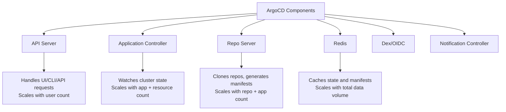

# How to Right-Size ArgoCD Components for Your Workload

Author: [nawazdhandala](https://github.com/nawazdhandala)

Tags: ArgoCD, GitOps, Kubernetes, Capacity Planning, Performance Tuning

Description: Learn how to properly size ArgoCD components based on your application count, cluster count, and sync frequency for optimal performance and cost.

---

ArgoCD's default resource settings are designed for small to medium installations. If you are managing 10 applications, the defaults work fine. If you are managing 1000 applications across 20 clusters, those same defaults will either waste resources or cause performance problems. Right-sizing ArgoCD means matching component resources to your actual workload.

In this guide, I will provide concrete sizing recommendations based on real-world ArgoCD deployments at various scales.

## ArgoCD Component Architecture

Before sizing, understand what each component does and what drives its resource usage.



## Sizing Tiers

Based on deployment experience across different organizations, here are recommended sizing tiers.

### Small (up to 50 applications, 1-2 clusters)

```yaml
# small-installation.yaml
apiVersion: apps/v1
kind: Deployment
metadata:
  name: argocd-server
spec:
  replicas: 1
  template:
    spec:
      containers:
        - name: argocd-server
          resources:
            requests:
              cpu: "100m"
              memory: "128Mi"
            limits:
              cpu: "500m"
              memory: "512Mi"
---
apiVersion: apps/v1
kind: Deployment
metadata:
  name: argocd-application-controller
spec:
  replicas: 1
  template:
    spec:
      containers:
        - name: argocd-application-controller
          resources:
            requests:
              cpu: "250m"
              memory: "256Mi"
            limits:
              cpu: "1"
              memory: "1Gi"
          env:
            - name: ARGOCD_CONTROLLER_REPLICAS
              value: "1"
---
apiVersion: apps/v1
kind: Deployment
metadata:
  name: argocd-repo-server
spec:
  replicas: 1
  template:
    spec:
      containers:
        - name: argocd-repo-server
          resources:
            requests:
              cpu: "100m"
              memory: "128Mi"
            limits:
              cpu: "500m"
              memory: "512Mi"
---
apiVersion: apps/v1
kind: Deployment
metadata:
  name: argocd-redis
spec:
  replicas: 1
  template:
    spec:
      containers:
        - name: redis
          resources:
            requests:
              cpu: "50m"
              memory: "64Mi"
            limits:
              cpu: "200m"
              memory: "128Mi"
```

### Medium (50 to 300 applications, 3-10 clusters)

```yaml
# medium-installation.yaml
apiVersion: apps/v1
kind: Deployment
metadata:
  name: argocd-server
spec:
  replicas: 2
  template:
    spec:
      containers:
        - name: argocd-server
          resources:
            requests:
              cpu: "250m"
              memory: "256Mi"
            limits:
              cpu: "1"
              memory: "1Gi"
---
apiVersion: apps/v1
kind: Deployment
metadata:
  name: argocd-application-controller
spec:
  replicas: 2
  template:
    spec:
      containers:
        - name: argocd-application-controller
          resources:
            requests:
              cpu: "500m"
              memory: "1Gi"
            limits:
              cpu: "2"
              memory: "4Gi"
          env:
            - name: ARGOCD_CONTROLLER_REPLICAS
              value: "2"
---
apiVersion: apps/v1
kind: Deployment
metadata:
  name: argocd-repo-server
spec:
  replicas: 2
  template:
    spec:
      containers:
        - name: argocd-repo-server
          resources:
            requests:
              cpu: "250m"
              memory: "256Mi"
            limits:
              cpu: "1"
              memory: "1Gi"
---
apiVersion: apps/v1
kind: Deployment
metadata:
  name: argocd-redis
spec:
  replicas: 1
  template:
    spec:
      containers:
        - name: redis
          resources:
            requests:
              cpu: "100m"
              memory: "128Mi"
            limits:
              cpu: "500m"
              memory: "512Mi"
```

### Large (300 to 1000+ applications, 10+ clusters)

```yaml
# large-installation.yaml
apiVersion: apps/v1
kind: Deployment
metadata:
  name: argocd-server
spec:
  replicas: 3
  template:
    spec:
      containers:
        - name: argocd-server
          resources:
            requests:
              cpu: "500m"
              memory: "512Mi"
            limits:
              cpu: "2"
              memory: "2Gi"
---
apiVersion: apps/v1
kind: StatefulSet
metadata:
  name: argocd-application-controller
spec:
  replicas: 4
  template:
    spec:
      containers:
        - name: argocd-application-controller
          resources:
            requests:
              cpu: "1"
              memory: "2Gi"
            limits:
              cpu: "4"
              memory: "8Gi"
          env:
            - name: ARGOCD_CONTROLLER_REPLICAS
              value: "4"
---
apiVersion: apps/v1
kind: Deployment
metadata:
  name: argocd-repo-server
spec:
  replicas: 3
  template:
    spec:
      containers:
        - name: argocd-repo-server
          resources:
            requests:
              cpu: "500m"
              memory: "512Mi"
            limits:
              cpu: "2"
              memory: "2Gi"
---
# Use Redis HA for large installations
apiVersion: apps/v1
kind: StatefulSet
metadata:
  name: argocd-redis-ha
spec:
  replicas: 3
  template:
    spec:
      containers:
        - name: redis
          resources:
            requests:
              cpu: "200m"
              memory: "256Mi"
            limits:
              cpu: "1"
              memory: "1Gi"
```

## Key Scaling Factors

### Application Controller Scaling

The controller's resource usage scales with the total number of Kubernetes resources it watches, not just the number of ArgoCD Applications. An application with 5 resources uses far less than one with 500 resources.

```bash
# Check total managed resources
argocd app list -o json | jq '[.[].status.resources | length] | add'
```

Use this formula as a rough guide: for every 1000 managed Kubernetes resources, allocate approximately 500MB of memory and 0.5 CPU cores to the controller.

### Repo Server Scaling

The repo server's usage depends on repository size, manifest generation method (Helm vs Kustomize vs plain YAML), and how frequently manifests are regenerated.

Helm chart rendering is more CPU-intensive than Kustomize or plain YAML. If you use many Helm-based applications, allocate more CPU to the repo server.

```yaml
# Tune repo server for Helm-heavy workloads
data:
  reposerver.parallelism.limit: "3"  # Limit concurrent Helm renders
```

### API Server Scaling

The API server scales with the number of concurrent users. If you have 5 people using the UI occasionally, one replica is fine. If you have CI pipelines constantly hitting the API plus 50 users on the dashboard, you need more.

## Using Vertical Pod Autoscaler

For dynamic sizing, use VPA in recommendation mode to understand actual resource usage.

```yaml
# vpa-argocd.yaml
apiVersion: autoscaling.k8s.io/v1
kind: VerticalPodAutoscaler
metadata:
  name: argocd-controller-vpa
  namespace: argocd
spec:
  targetRef:
    apiVersion: apps/v1
    kind: Deployment
    name: argocd-application-controller
  updatePolicy:
    updateMode: "Off"  # Recommendation only
  resourcePolicy:
    containerPolicies:
      - containerName: argocd-application-controller
        minAllowed:
          cpu: "250m"
          memory: "256Mi"
        maxAllowed:
          cpu: "4"
          memory: "8Gi"
```

After a week of data collection, check the VPA recommendations.

```bash
kubectl get vpa argocd-controller-vpa -n argocd -o json | \
  jq '.status.recommendation.containerRecommendations'
```

## HorizontalPodAutoscaler for API Server

The API server is stateless and scales horizontally well.

```yaml
# hpa-api-server.yaml
apiVersion: autoscaling/v2
kind: HorizontalPodAutoscaler
metadata:
  name: argocd-server-hpa
  namespace: argocd
spec:
  scaleTargetRef:
    apiVersion: apps/v1
    kind: Deployment
    name: argocd-server
  minReplicas: 2
  maxReplicas: 5
  metrics:
    - type: Resource
      resource:
        name: cpu
        target:
          type: Utilization
          averageUtilization: 70
    - type: Resource
      resource:
        name: memory
        target:
          type: Utilization
          averageUtilization: 80
```

## Monitoring for Right-Sizing Decisions

Track these metrics to make informed sizing decisions.

```bash
# Check current resource usage
kubectl top pods -n argocd

# Check controller queue depth (indicates if controller is keeping up)
kubectl exec -n argocd deploy/argocd-application-controller -- \
  curl -s localhost:8082/metrics | grep argocd_app_reconcile

# Check repo server request latency
kubectl exec -n argocd deploy/argocd-repo-server -- \
  curl -s localhost:8084/metrics | grep argocd_git_request_duration
```

High queue depth on the controller means it cannot keep up with reconciliation - add more replicas or increase CPU. High repo server latency means manifest generation is slow - add more replicas or increase CPU.

## Conclusion

Right-sizing ArgoCD is not a one-time exercise. As your application count grows and usage patterns change, revisit your sizing. Start with the tier closest to your current scale, deploy VPA in recommendation mode to collect real usage data, and adjust from there. The key metrics to watch are controller memory usage, controller queue depth, repo server latency, and API server response time. When any of these start degrading, it is time to scale up the affected component.
