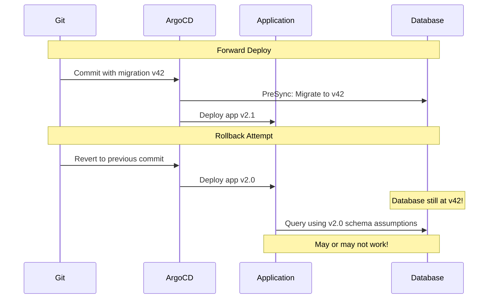
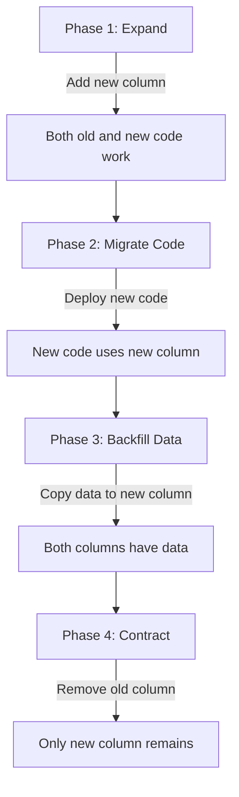

# How to Roll Back Database Migrations with ArgoCD

Author: [nawazdhandala](https://github.com/nawazdhandala)

Tags: ArgoCD, GitOps, Kubernetes, Database, Rollback

Description: Learn how to safely roll back database migrations in ArgoCD deployments, including reversible migration patterns, rollback strategies, and handling backward-compatible schema changes.

---

Rolling back database migrations is one of the hardest problems in deployment automation. Unlike application code, which can be rolled back by deploying the previous container image, database schema changes can be destructive and irreversible. This post covers strategies for handling database rollbacks in ArgoCD-managed deployments.

## The Rollback Challenge

When ArgoCD syncs a previous Git commit (rolling back the application), the database does not automatically revert:



## Strategy 1: Backward-Compatible Migrations

The safest approach is to write migrations that are backward compatible. The old application version should work with the new schema:

### Adding Columns (Safe)

```sql
-- Migration v42: Add a new column with a default
ALTER TABLE users ADD COLUMN display_name VARCHAR(255) DEFAULT '';

-- Old app (v2.0) ignores the new column - works fine
-- New app (v2.1) uses the new column - works fine
```

### Renaming Columns (Unsafe - use expand/contract instead)

```sql
-- BAD: Renaming breaks old code
ALTER TABLE users RENAME COLUMN name TO full_name;

-- GOOD: Expand/contract pattern
-- Migration v42 (expand): Add new column, copy data
ALTER TABLE users ADD COLUMN full_name VARCHAR(255);
UPDATE users SET full_name = name;

-- Migration v43 (contract - deploy later): Remove old column
-- Only after all app instances use full_name
ALTER TABLE users DROP COLUMN name;
```

### Removing Columns (Unsafe - delay removal)

```sql
-- GOOD: Two-phase approach
-- Phase 1 (migration v42): Stop using the column in code first
-- Phase 2 (migration v43, deployed weeks later): Drop the column
ALTER TABLE users DROP COLUMN IF EXISTS deprecated_field;
```

## Strategy 2: Forward-Only Migration with Compensating Changes

Instead of rolling back the migration, push a new migration that reverses the change:

```yaml
# When you need to "rollback" migration v42:
# 1. Create migration v43 that undoes v42
# 2. Commit to Git
# 3. ArgoCD syncs: runs v43 as PreSync, deploys old app version
```

Example migration files:

```sql
-- migrations/042_add_orders_table.up.sql
CREATE TABLE orders (
    id SERIAL PRIMARY KEY,
    user_id INTEGER REFERENCES users(id),
    total DECIMAL(10,2) NOT NULL,
    created_at TIMESTAMPTZ DEFAULT NOW()
);
CREATE INDEX idx_orders_user_id ON orders(user_id);

-- migrations/042_add_orders_table.down.sql (for reference)
DROP TABLE IF EXISTS orders;

-- migrations/043_revert_orders_table.up.sql (the compensating migration)
-- First, backup any data that was created
CREATE TABLE orders_backup AS SELECT * FROM orders;
DROP TABLE orders;
```

In your ArgoCD workflow:

```yaml
# hooks/presync-migrate.yaml
apiVersion: batch/v1
kind: Job
metadata:
  name: schema-migration
  annotations:
    argocd.argoproj.io/hook: PreSync
    argocd.argoproj.io/hook-delete-policy: BeforeHookCreation
spec:
  template:
    spec:
      containers:
        - name: migrate
          image: registry.example.com/myapp:v2.0.1  # Rollback version
          command:
            - /bin/sh
            - -c
            - |
              # This runs migration v43 which reverts v42
              ./migrate up
              echo "Compensating migration applied"
          env:
            - name: DATABASE_URL
              valueFrom:
                secretKeyRef:
                  name: db-credentials
                  key: url
      restartPolicy: Never
```

## Strategy 3: Automated Down Migrations

Some migration tools support "down" migrations. Here is how to use them with ArgoCD:

```yaml
# hooks/rollback-migration.yaml
apiVersion: batch/v1
kind: Job
metadata:
  name: migration-rollback
  annotations:
    argocd.argoproj.io/hook: PreSync
    argocd.argoproj.io/hook-delete-policy: BeforeHookCreation
spec:
  template:
    spec:
      containers:
        - name: rollback
          image: migrate/migrate:latest
          command:
            - /bin/sh
            - -c
            - |
              CURRENT=$(migrate -path /migrations -database "$DATABASE_URL" version 2>&1 | head -1)
              TARGET_VERSION=41  # The version we want to roll back to

              echo "Current version: $CURRENT"
              echo "Target version: $TARGET_VERSION"

              if [ "$CURRENT" -gt "$TARGET_VERSION" ]; then
                echo "Rolling back to version $TARGET_VERSION..."
                STEPS=$((CURRENT - TARGET_VERSION))
                migrate -path /migrations -database "$DATABASE_URL" down $STEPS
                echo "Rollback complete"
              else
                echo "Already at or below target version, no rollback needed"
              fi
          env:
            - name: DATABASE_URL
              valueFrom:
                secretKeyRef:
                  name: db-credentials
                  key: url
          volumeMounts:
            - name: migrations
              mountPath: /migrations
      volumes:
        - name: migrations
          configMap:
            name: migration-files
      restartPolicy: Never
```

## Strategy 4: Point-in-Time Recovery

For critical failures, restore the database to a pre-migration state:

```yaml
# hooks/restore-from-backup.yaml
apiVersion: batch/v1
kind: Job
metadata:
  name: db-restore
  annotations:
    argocd.argoproj.io/hook: PreSync
    argocd.argoproj.io/hook-delete-policy: BeforeHookCreation
    argocd.argoproj.io/sync-wave: "-10"
spec:
  template:
    spec:
      containers:
        - name: restore
          image: postgres:16
          command:
            - /bin/sh
            - -c
            - |
              echo "Restoring database from pre-migration backup..."

              # Find the latest pre-migration backup
              LATEST_BACKUP=$(ls -t /backups/pre-migration-*.sql | head -1)
              echo "Using backup: $LATEST_BACKUP"

              # Drop and recreate the database
              PGPASSWORD=$DB_PASSWORD dropdb -h $DB_HOST -U $DB_USER $DB_NAME --if-exists
              PGPASSWORD=$DB_PASSWORD createdb -h $DB_HOST -U $DB_USER $DB_NAME

              # Restore from backup
              PGPASSWORD=$DB_PASSWORD pg_restore \
                -h $DB_HOST \
                -U $DB_USER \
                -d $DB_NAME \
                --no-owner \
                --no-privileges \
                "$LATEST_BACKUP"

              echo "Database restored successfully"
          env:
            - name: DB_HOST
              value: postgres
            - name: DB_USER
              valueFrom:
                secretKeyRef:
                  name: db-credentials
                  key: username
            - name: DB_PASSWORD
              valueFrom:
                secretKeyRef:
                  name: db-credentials
                  key: password
            - name: DB_NAME
              value: mydb
          volumeMounts:
            - name: backups
              mountPath: /backups
      volumes:
        - name: backups
          persistentVolumeClaim:
            claimName: migration-backups
      restartPolicy: Never
```

## The Expand-Contract Pattern in Detail

This is the gold standard for safe, rollback-friendly migrations:



Each phase is a separate Git commit and ArgoCD sync:

```yaml
# Phase 1: Expand - Add new column (backward compatible)
# migrations/042_expand_add_display_name.up.sql
---
ALTER TABLE users ADD COLUMN IF NOT EXISTS display_name VARCHAR(255);

# Phase 2: Deploy new app code that writes to both columns
# (application code change, no migration)

# Phase 3: Backfill - Copy existing data
# migrations/043_backfill_display_name.up.sql
---
UPDATE users SET display_name = name WHERE display_name IS NULL;
ALTER TABLE users ALTER COLUMN display_name SET NOT NULL;

# Phase 4: Contract - Remove old column (after old code is fully gone)
# migrations/044_contract_remove_name.up.sql
---
ALTER TABLE users DROP COLUMN IF EXISTS name;
```

At any point during phases 1 through 3, you can roll back the application without touching the database. Only phase 4 is irreversible.

## Git-Based Rollback Workflow

```bash
# Standard ArgoCD rollback
# This deploys the previous app version but does NOT revert the database
argocd app rollback my-app

# If you need to also revert the database:
# 1. Create a compensating migration in Git
# 2. Point ArgoCD to the new commit that includes the compensating migration
git revert HEAD  # Revert the app change
# Add compensating migration file
git add migrations/043_revert_changes.up.sql
git commit -m "Rollback: Revert migration v42 due to performance issue"
git push
# ArgoCD syncs automatically
```

## Monitoring Rollback Operations

Track rollback frequency and success rate. Frequent rollbacks may indicate issues with your migration testing process. Use [OneUptime](https://oneuptime.com) to monitor database health during and after rollback operations.

## Summary

Rolling back database migrations with ArgoCD requires planning ahead. The safest strategies are writing backward-compatible migrations using the expand-contract pattern, using compensating migrations instead of down migrations, and taking pre-migration backups for point-in-time recovery. Avoid irreversible schema changes in a single step - always use the multi-phase expand-contract approach. Every rollback strategy should be tested in staging before you need it in production, because the middle of an incident is the worst time to discover your rollback procedure does not work.
