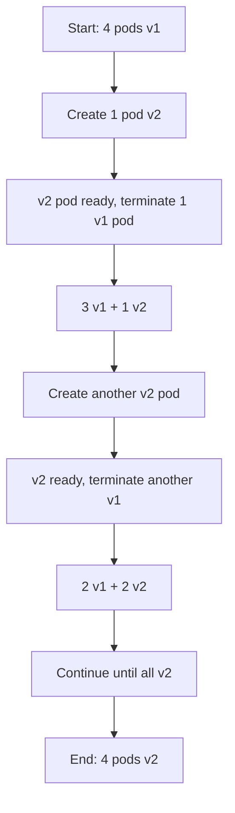

# How to Implement Rolling Updates with ArgoCD

Author: [nawazdhandala](https://github.com/nawazdhandala)

Tags: ArgoCD, GitOps, Kubernetes, Deployment Strategies, Rolling Update

Description: Learn how to configure and optimize rolling updates with ArgoCD using Kubernetes native deployment strategies for zero-downtime releases.

---

Rolling updates are the default deployment strategy in Kubernetes. When you update a Deployment, Kubernetes gradually replaces old pods with new ones, ensuring that your application remains available throughout the process. Combined with ArgoCD's GitOps approach, rolling updates provide a straightforward, reliable way to deploy changes with zero downtime.

Unlike blue-green or canary deployments that require Argo Rollouts, rolling updates work natively with standard Kubernetes Deployments. ArgoCD manages the desired state, and Kubernetes handles the rolling update mechanics.

## How Rolling Updates Work

When a Deployment is updated, Kubernetes:

1. Creates new pods with the updated spec
2. Waits for new pods to pass readiness checks
3. Terminates old pods one (or a few) at a time
4. Repeats until all pods run the new version



## Configuring Rolling Update Parameters

The key parameters that control rolling update behavior are `maxSurge` and `maxUnavailable`:

```yaml
# deployment.yaml
apiVersion: apps/v1
kind: Deployment
metadata:
  name: my-app
  namespace: production
spec:
  replicas: 4
  selector:
    matchLabels:
      app: my-app
  strategy:
    type: RollingUpdate
    rollingUpdate:
      # Maximum number of pods that can be created above the desired count
      # Can be a number or percentage
      maxSurge: 1
      # Maximum number of pods that can be unavailable during the update
      # Can be a number or percentage
      maxUnavailable: 0
  template:
    metadata:
      labels:
        app: my-app
    spec:
      containers:
        - name: my-app
          image: myorg/my-app:1.0.0
          ports:
            - containerPort: 8080
          resources:
            requests:
              memory: "128Mi"
              cpu: "100m"
            limits:
              memory: "256Mi"
              cpu: "200m"
          # Critical: readiness probe ensures traffic only goes to healthy pods
          readinessProbe:
            httpGet:
              path: /health
              port: 8080
            initialDelaySeconds: 5
            periodSeconds: 5
            failureThreshold: 3
          # Liveness probe restarts unhealthy pods
          livenessProbe:
            httpGet:
              path: /health
              port: 8080
            initialDelaySeconds: 15
            periodSeconds: 10
```

Understanding `maxSurge` and `maxUnavailable`:

| Setting | maxSurge=1, maxUnavailable=0 | maxSurge=0, maxUnavailable=1 | maxSurge=25%, maxUnavailable=25% |
|---------|------------------------------|------------------------------|----------------------------------|
| Behavior | Zero downtime, extra capacity needed | No extra capacity, brief reduced capacity | Balanced approach |
| Speed | Slower | Faster | Medium |
| Resource usage | Higher during update | Same as normal | Slightly higher |
| Best for | Production | Non-critical services | Large deployments |

## Setting Up the ArgoCD Application

Create an ArgoCD Application that manages your Deployment:

```yaml
# argocd-application.yaml
apiVersion: argoproj.io/v1alpha1
kind: Application
metadata:
  name: my-app-production
  namespace: argocd
spec:
  project: default
  source:
    repoURL: https://github.com/myorg/my-manifests.git
    targetRevision: main
    path: production/my-app
  destination:
    server: https://kubernetes.default.svc
    namespace: production
  syncPolicy:
    automated:
      prune: true
      selfHeal: true
    syncOptions:
      - CreateNamespace=true
```

Your Git repository structure:

```
production/my-app/
  deployment.yaml
  service.yaml
  configmap.yaml
  hpa.yaml
```

## Triggering a Rolling Update

To trigger a rolling update, change the image tag (or any other spec field) in your Deployment manifest and push to Git:

```yaml
# Update image in deployment.yaml
spec:
  template:
    spec:
      containers:
        - name: my-app
          image: myorg/my-app:2.0.0  # Changed from 1.0.0
```

ArgoCD detects the change, syncs it to the cluster, and Kubernetes begins the rolling update.

## Monitoring Rolling Updates

Track the rolling update progress:

```bash
# Watch the rollout status
kubectl rollout status deployment/my-app -n production

# See the current state of pods
kubectl get pods -n production -l app=my-app -w

# Check deployment conditions
kubectl describe deployment my-app -n production

# View rollout history
kubectl rollout history deployment/my-app -n production
```

In the ArgoCD UI, the application health status will show "Progressing" during the rolling update and switch to "Healthy" once complete.

## Ensuring Zero Downtime

Rolling updates alone do not guarantee zero downtime. You need proper readiness probes, graceful shutdown, and pod disruption budgets:

### Readiness Probes

The readiness probe is the most important piece. Without it, Kubernetes routes traffic to pods before they are ready:

```yaml
readinessProbe:
  httpGet:
    path: /ready
    port: 8080
  initialDelaySeconds: 5
  periodSeconds: 5
  successThreshold: 1
  failureThreshold: 3
```

### Graceful Shutdown

Your application should handle SIGTERM signals and drain connections before exiting:

```yaml
spec:
  template:
    spec:
      # Give the application time to drain connections
      terminationGracePeriodSeconds: 60
      containers:
        - name: my-app
          lifecycle:
            preStop:
              exec:
                # Wait for load balancer to deregister the pod
                command: ["sleep", "10"]
```

### Pod Disruption Budget

Prevent too many pods from being disrupted at once:

```yaml
# pdb.yaml
apiVersion: policy/v1
kind: PodDisruptionBudget
metadata:
  name: my-app-pdb
  namespace: production
spec:
  minAvailable: 75%
  selector:
    matchLabels:
      app: my-app
```

## Rolling Back a Failed Update

If a rolling update goes wrong, you have several options:

```bash
# Option 1: Kubectl rollback (fast, but not GitOps-friendly)
kubectl rollout undo deployment/my-app -n production

# Option 2: GitOps rollback (recommended) - revert the commit in Git
git revert HEAD
git push origin main
# ArgoCD syncs the reverted manifest

# Option 3: ArgoCD rollback to a previous sync
argocd app history my-app-production
argocd app rollback my-app-production <HISTORY_ID>
```

The GitOps approach (Option 2) is recommended because it keeps your Git repository as the single source of truth.

## Rolling Updates with HPA

If you use a Horizontal Pod Autoscaler, rolling updates work seamlessly. The HPA continues to manage replica count while the Deployment handles the rolling update:

```yaml
# hpa.yaml
apiVersion: autoscaling/v2
kind: HorizontalPodAutoscaler
metadata:
  name: my-app-hpa
  namespace: production
spec:
  scaleTargetRef:
    apiVersion: apps/v1
    kind: Deployment
    name: my-app
  minReplicas: 3
  maxReplicas: 10
  metrics:
    - type: Resource
      resource:
        name: cpu
        target:
          type: Utilization
          averageUtilization: 70
```

During a rolling update with HPA, the surge pods count toward the total, so you might temporarily have more pods than `maxReplicas`. This is normal behavior.

## Configuring Rollout Speed

Control how fast the rolling update progresses:

```yaml
strategy:
  rollingUpdate:
    # Fast rollout: update multiple pods at once
    maxSurge: 50%
    maxUnavailable: 25%

# Or for slow, cautious rollout
strategy:
  rollingUpdate:
    maxSurge: 1
    maxUnavailable: 0
```

You can also add a `minReadySeconds` field to slow things down further:

```yaml
spec:
  # Wait 30 seconds after a pod is ready before considering it available
  minReadySeconds: 30
  strategy:
    rollingUpdate:
      maxSurge: 1
      maxUnavailable: 0
```

This gives you a built-in observation window for each new pod before the update continues.

## Summary

Rolling updates with ArgoCD provide zero-downtime deployments using native Kubernetes mechanics. Configure `maxSurge` and `maxUnavailable` to control the update speed, add proper readiness probes and graceful shutdown handling, and use Pod Disruption Budgets for safety. For more advanced deployment strategies with traffic shifting and automated analysis, consider [canary deployments](https://oneuptime.com/blog/post/2026-02-26-argocd-canary-deployments-argo-rollouts/view) or [blue-green deployments](https://oneuptime.com/blog/post/2026-02-26-argocd-blue-green-deployments/view) with Argo Rollouts.
