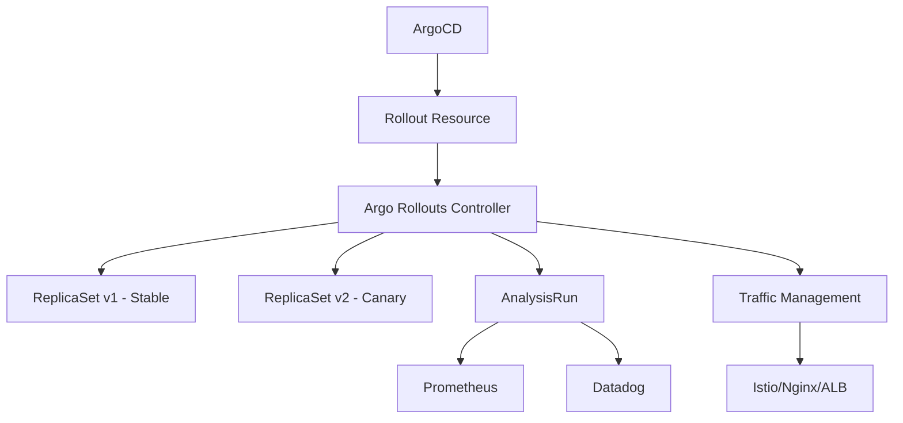
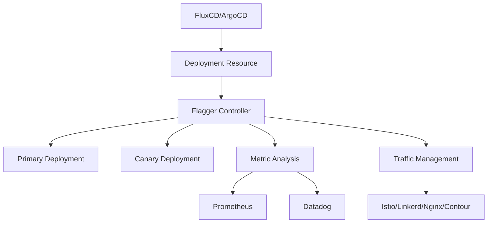

# ArgoCD + Argo Rollouts vs Flagger: Progressive Delivery Showdown

Author: [nawazdhandala](https://github.com/nawazdhandala)

Tags: ArgoCD, GitOps, Kubernetes, Argo Rollouts, flagger

Description: A head-to-head comparison of Argo Rollouts and Flagger for progressive delivery on Kubernetes, covering canary deployments, analysis, and integration patterns.

---

Progressive delivery - the practice of gradually rolling out changes to a subset of users before full deployment - has become essential for safe production releases. On Kubernetes, two tools dominate this space: Argo Rollouts (paired with ArgoCD) and Flagger (typically paired with FluxCD, though it works with any GitOps tool). Both enable canary deployments, blue-green deployments, and automated analysis, but they take different architectural approaches. This comparison helps you choose the right progressive delivery tool for your Kubernetes platform.

## Architecture Overview

### Argo Rollouts

Argo Rollouts replaces the standard Kubernetes Deployment resource with a custom `Rollout` resource. The Rollouts controller manages the progressive delivery process directly.



### Flagger

Flagger works alongside standard Kubernetes Deployments. It watches for changes and creates canary deployments automatically, managing traffic splitting through a service mesh or ingress controller.



**Key architectural difference:** Argo Rollouts replaces the Deployment kind with a Rollout kind. Flagger wraps existing Deployments without changing the resource type. This means Flagger is less invasive to existing workflows but Argo Rollouts gives you more fine-grained control.

## Canary Deployment Comparison

### Argo Rollouts Canary

```yaml
apiVersion: argoproj.io/v1alpha1
kind: Rollout
metadata:
  name: my-app
spec:
  replicas: 10
  strategy:
    canary:
      # Traffic splitting via Istio
      trafficRouting:
        istio:
          virtualServices:
            - name: my-app-vsvc
              routes:
                - primary
          destinationRule:
            name: my-app-destrule
            canarySubsetName: canary
            stableSubsetName: stable
      steps:
        # Step 1: Send 10% traffic to canary
        - setWeight: 10
        # Step 2: Run analysis for 5 minutes
        - analysis:
            templates:
              - templateName: success-rate
            args:
              - name: service-name
                value: my-app
        # Step 3: Increase to 30%
        - setWeight: 30
        - pause: {duration: 300}
        # Step 4: Increase to 60%
        - setWeight: 60
        - analysis:
            templates:
              - templateName: latency-check
        # Step 5: Full rollout
        - setWeight: 100
  selector:
    matchLabels:
      app: my-app
  template:
    metadata:
      labels:
        app: my-app
    spec:
      containers:
        - name: my-app
          image: myregistry/my-app:2.0.0
```

### Flagger Canary

```yaml
apiVersion: flagger.app/v1beta1
kind: Canary
metadata:
  name: my-app
spec:
  targetRef:
    apiVersion: apps/v1
    kind: Deployment
    name: my-app
  service:
    port: 80
    targetPort: 8080
    # Traffic routing via Istio
    trafficPolicy:
      tls:
        mode: ISTIO_MUTUAL
  analysis:
    # Check every 60 seconds
    interval: 60s
    # Max number of failed checks before rollback
    threshold: 5
    # Max traffic percentage
    maxWeight: 60
    # Canary increment step
    stepWeight: 10
    # Prometheus metrics
    metrics:
      - name: request-success-rate
        thresholdRange:
          min: 99
        interval: 60s
      - name: request-duration
        thresholdRange:
          max: 500
        interval: 60s
    # Custom webhooks for integration testing
    webhooks:
      - name: integration-test
        type: pre-rollout
        url: http://test-runner.test/
        timeout: 120s
```

**Comparison:** Argo Rollouts uses explicit steps that you define in order. You have precise control over each phase of the rollout. Flagger uses a declarative analysis spec with automatic step progression. Flagger automatically increases traffic by the `stepWeight` at each `interval` as long as metrics pass.

## Blue-Green Deployment Comparison

### Argo Rollouts Blue-Green

```yaml
apiVersion: argoproj.io/v1alpha1
kind: Rollout
metadata:
  name: my-app
spec:
  replicas: 5
  strategy:
    blueGreen:
      # Reference to the service for production traffic
      activeService: my-app-active
      # Reference to the service for preview traffic
      previewService: my-app-preview
      # Auto-promote after analysis passes
      autoPromotionEnabled: true
      # Run analysis before promoting
      prePromotionAnalysis:
        templates:
          - templateName: smoke-test
        args:
          - name: preview-url
            value: http://my-app-preview.default.svc.cluster.local
      # Scale down delay after promotion
      scaleDownDelaySeconds: 300
```

### Flagger Blue-Green

```yaml
apiVersion: flagger.app/v1beta1
kind: Canary
metadata:
  name: my-app
spec:
  targetRef:
    apiVersion: apps/v1
    kind: Deployment
    name: my-app
  # Blue-green analysis
  analysis:
    interval: 60s
    threshold: 2
    iterations: 10
    # No stepWeight/maxWeight means blue-green
    webhooks:
      - name: smoke-test
        type: pre-rollout
        url: http://test-runner.test/run-smoke
      - name: load-test
        type: rollout
        url: http://loadtester.test/
        metadata:
          cmd: "hey -z 60s -q 10 http://my-app-canary.default.svc.cluster.local"
```

## Analysis and Metrics

### Argo Rollouts AnalysisTemplate

Argo Rollouts has a powerful, standalone analysis system with dedicated CRDs.

```yaml
apiVersion: argoproj.io/v1alpha1
kind: AnalysisTemplate
metadata:
  name: success-rate
spec:
  args:
    - name: service-name
  metrics:
    - name: success-rate
      interval: 60s
      successCondition: result[0] >= 0.99
      failureLimit: 3
      provider:
        prometheus:
          address: http://prometheus.monitoring:9090
          query: |
            sum(rate(http_requests_total{
              service="{{args.service-name}}",
              status=~"2.*"
            }[5m])) /
            sum(rate(http_requests_total{
              service="{{args.service-name}}"
            }[5m]))

    - name: error-rate
      interval: 60s
      successCondition: result[0] <= 0.01
      failureLimit: 3
      provider:
        prometheus:
          address: http://prometheus.monitoring:9090
          query: |
            sum(rate(http_requests_total{
              service="{{args.service-name}}",
              status=~"5.*"
            }[5m])) /
            sum(rate(http_requests_total{
              service="{{args.service-name}}"
            }[5m]))
```

### Flagger MetricTemplate

```yaml
apiVersion: flagger.app/v1beta1
kind: MetricTemplate
metadata:
  name: error-rate
spec:
  provider:
    type: prometheus
    address: http://prometheus.monitoring:9090
  query: |
    100 - sum(rate(http_requests_total{
      kubernetes_namespace="{{ namespace }}",
      kubernetes_pod_name=~"{{ target }}-[0-9a-zA-Z]+(-[0-9a-zA-Z]+)",
      status!~"5.*"
    }[{{ interval }}])) /
    sum(rate(http_requests_total{
      kubernetes_namespace="{{ namespace }}",
      kubernetes_pod_name=~"{{ target }}-[0-9a-zA-Z]+(-[0-9a-zA-Z]+)"
    }[{{ interval }}])) * 100
```

**Key difference:** Argo Rollouts supports more metric providers natively (Prometheus, Datadog, NewRelic, Wavefront, CloudWatch, Graphite, InfluxDB, Kayenta, and web-based metrics). Flagger supports Prometheus, Datadog, CloudWatch, NewRelic, and Graphite, plus custom webhooks for anything else.

## Traffic Management Support

| Traffic Provider | Argo Rollouts | Flagger |
|-----------------|---------------|---------|
| Istio | Yes | Yes |
| Linkerd | Yes | Yes |
| Nginx Ingress | Yes | Yes |
| AWS ALB | Yes | No |
| SMI (Service Mesh Interface) | Yes | Yes |
| Contour | No | Yes |
| Gloo | No | Yes |
| Apache APISIX | Yes | Yes |
| Traefik | Yes | No |

## GitOps Integration

### Argo Rollouts + ArgoCD

The integration between Argo Rollouts and ArgoCD is seamless. ArgoCD natively understands Rollout resources and displays their status in the UI.

```bash
# ArgoCD shows Rollout status
argocd app get my-app
# Shows: Rollout status, canary weight, analysis progress

# The ArgoCD UI renders Rollout-specific views
# including step progress and canary metrics
```

### Flagger + FluxCD

Flagger is commonly used with FluxCD but also works with ArgoCD. With FluxCD, the integration is automatic. With ArgoCD, you need to ensure ArgoCD does not fight Flagger for control of the canary resources.

```yaml
# When using Flagger with ArgoCD, ignore Flagger-managed resources
apiVersion: argoproj.io/v1alpha1
kind: Application
spec:
  ignoreDifferences:
    - group: apps
      kind: Deployment
      jsonPointers:
        - /spec/replicas
```

## Rollback Behavior

**Argo Rollouts:** When analysis fails, the Rollout automatically scales down the canary and reverts traffic to the stable version. The Rollout resource records the failure and can be re-triggered.

**Flagger:** When analysis fails, Flagger routes all traffic back to the primary deployment and scales down the canary. It records the event and sends notifications. Failed canaries can be retried by updating the target deployment again.

## When to Choose Argo Rollouts

- You are already using ArgoCD (tight integration)
- You want step-by-step control over rollout progression
- You need the Rollout resource's advanced features (experiments, header-based routing)
- You use AWS ALB or Traefik for traffic management
- You want a dedicated CRD for progressive delivery

## When to Choose Flagger

- You prefer working with standard Kubernetes Deployments
- You are using FluxCD as your GitOps tool
- You want a less invasive approach (no custom resource types)
- You use Contour or Gloo for traffic management
- You want webhook-based testing integrated into the rollout process

Both tools are mature, production-tested, and actively maintained. Your choice often comes down to your existing GitOps tooling and traffic management setup. For monitoring the health of your progressive delivery pipelines, explore [OneUptime's Kubernetes monitoring](https://oneuptime.com/blog/post/2026-02-26-argocd-vs-fluxcd-comparison/view) capabilities.
