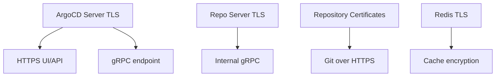

# How to Rotate TLS Certificates in ArgoCD

Author: [nawazdhandala](https://github.com/nawazdhandala)

Tags: ArgoCD, GitOps, Kubernetes, TLS, Security

Description: Learn how to rotate TLS certificates in ArgoCD without downtime, including strategies for both server certificates and repository certificates.

---

TLS certificates expire. It is inevitable. If you are running ArgoCD in production, you need a strategy for rotating certificates before they expire and cause unexpected outages. This guide walks through the complete process of rotating TLS certificates for every ArgoCD component that uses them.

## Why Certificate Rotation Matters

ArgoCD uses TLS in several places. The ArgoCD server exposes an HTTPS endpoint for the UI and API. The repo server communicates with Git repositories over HTTPS. Internal gRPC connections between the API server and the repo server also rely on TLS. When any of these certificates expire, the entire deployment pipeline can grind to a halt.

Certificate rotation is not just about preventing expiry. Security best practices recommend regular rotation to limit the blast radius of a compromised key. Many compliance frameworks like SOC2 and PCI-DSS require periodic certificate rotation.

## Understanding What Needs Rotation

Before diving into the how, let us map out which certificates ArgoCD uses:



Each of these has a different rotation procedure, so we will cover them individually.

## Rotating the ArgoCD Server TLS Certificate

If you manage your own TLS certificate for the ArgoCD server (not using cert-manager), the certificate is stored in a Kubernetes secret. Here is how to rotate it.

First, check the current certificate expiry:

```bash
# Get the current certificate and check its expiry date
kubectl get secret argocd-server-tls -n argocd -o jsonpath='{.data.tls\.crt}' | \
  base64 -d | openssl x509 -noout -dates
```

Generate a new certificate. If you are using your own CA:

```bash
# Generate a new private key
openssl genrsa -out new-server.key 4096

# Create a CSR
openssl req -new -key new-server.key -out new-server.csr \
  -subj "/CN=argocd-server" \
  -addext "subjectAltName=DNS:argocd.example.com,DNS:argocd-server,DNS:argocd-server.argocd.svc"

# Sign with your CA
openssl x509 -req -in new-server.csr -CA ca.crt -CAkey ca.key \
  -CAcreateserial -out new-server.crt -days 365 \
  -extfile <(printf "subjectAltName=DNS:argocd.example.com,DNS:argocd-server,DNS:argocd-server.argocd.svc")
```

Now update the Kubernetes secret:

```bash
# Update the secret with the new certificate and key
kubectl create secret tls argocd-server-tls \
  --cert=new-server.crt \
  --key=new-server.key \
  -n argocd \
  --dry-run=client -o yaml | kubectl apply -f -
```

The ArgoCD server watches for changes to this secret and will automatically pick up the new certificate. However, to be safe, you can restart the server:

```bash
# Restart argocd-server to pick up the new certificate
kubectl rollout restart deployment argocd-server -n argocd
```

## Rotating with cert-manager

If you use cert-manager (which you should), rotation is largely automatic. The Certificate resource defines when renewal happens:

```yaml
apiVersion: cert-manager.io/v1
kind: Certificate
metadata:
  name: argocd-server-tls
  namespace: argocd
spec:
  secretName: argocd-server-tls
  issuerRef:
    name: letsencrypt-prod
    kind: ClusterIssuer
  dnsNames:
    - argocd.example.com
  # Renew 30 days before expiry
  renewBefore: 720h
  duration: 8760h  # 1 year
```

To force an immediate rotation with cert-manager:

```bash
# Delete the certificate secret to trigger re-issuance
kubectl delete secret argocd-server-tls -n argocd

# Or use cmctl to manually trigger renewal
cmctl renew argocd-server-tls -n argocd
```

Verify the renewal:

```bash
# Check the new certificate details
cmctl status certificate argocd-server-tls -n argocd
```

## Rotating Internal gRPC TLS Certificates

ArgoCD components communicate over gRPC. By default, the repo server generates a self-signed TLS certificate on startup that is stored in a Kubernetes secret:

```bash
# Check the repo server TLS certificate
kubectl get secret argocd-repo-server-tls -n argocd -o jsonpath='{.data.tls\.crt}' | \
  base64 -d | openssl x509 -noout -dates -subject
```

To rotate this internal certificate, the simplest approach is to delete the secret and restart the repo server:

```bash
# Delete the auto-generated TLS secret
kubectl delete secret argocd-repo-server-tls -n argocd

# Restart the repo server to regenerate
kubectl rollout restart deployment argocd-repo-server -n argocd
```

The repo server will automatically generate a new self-signed certificate on startup. The API server and application controller will pick up the new certificate through their TLS trust configuration.

If you manage internal certificates with your own CA, update the secret the same way as the server certificate:

```yaml
apiVersion: v1
kind: Secret
metadata:
  name: argocd-repo-server-tls
  namespace: argocd
type: kubernetes.io/tls
data:
  tls.crt: <base64-encoded-new-cert>
  tls.key: <base64-encoded-new-key>
  ca.crt: <base64-encoded-ca-cert>
```

## Rotating Repository HTTPS Certificates

ArgoCD stores custom CA certificates for Git repositories in a ConfigMap. These are used when connecting to self-hosted Git servers with custom certificates:

```bash
# View current repository certificates
kubectl get configmap argocd-tls-certs-cm -n argocd -o yaml
```

To rotate a repository certificate:

```bash
# Update the ConfigMap with the new certificate
kubectl create configmap argocd-tls-certs-cm \
  --from-file=git.example.com=new-git-ca.crt \
  -n argocd \
  --dry-run=client -o yaml | kubectl apply -f -
```

No restart is needed. ArgoCD watches this ConfigMap and picks up changes automatically.

## Automating Rotation with a CronJob

For certificates not managed by cert-manager, you can automate rotation with a Kubernetes CronJob:

```yaml
apiVersion: batch/v1
kind: CronJob
metadata:
  name: argocd-cert-rotation-check
  namespace: argocd
spec:
  schedule: "0 8 * * 1"  # Every Monday at 8 AM
  jobTemplate:
    spec:
      template:
        spec:
          serviceAccountName: argocd-cert-checker
          containers:
            - name: cert-checker
              image: bitnami/kubectl:latest
              command:
                - /bin/bash
                - -c
                - |
                  # Check certificate expiry
                  CERT=$(kubectl get secret argocd-server-tls -n argocd \
                    -o jsonpath='{.data.tls\.crt}' | base64 -d)
                  EXPIRY=$(echo "$CERT" | openssl x509 -noout -enddate | cut -d= -f2)
                  EXPIRY_EPOCH=$(date -d "$EXPIRY" +%s)
                  NOW_EPOCH=$(date +%s)
                  DAYS_LEFT=$(( (EXPIRY_EPOCH - NOW_EPOCH) / 86400 ))

                  if [ "$DAYS_LEFT" -lt 30 ]; then
                    echo "WARNING: ArgoCD TLS certificate expires in $DAYS_LEFT days"
                    # Add your alerting logic here
                  else
                    echo "Certificate OK: $DAYS_LEFT days remaining"
                  fi
          restartPolicy: OnFailure
```

## Zero-Downtime Rotation Strategy

For production environments, follow this sequence to avoid any disruption:

1. Generate the new certificate well before the old one expires
2. If using a load balancer, update the load balancer certificate first
3. Update the Kubernetes secret with the new certificate
4. Perform a rolling restart of ArgoCD components
5. Verify the new certificate is being served
6. Update any clients that pin the old certificate

```bash
# Verify the new certificate is being served
echo | openssl s_client -connect argocd.example.com:443 -servername argocd.example.com 2>/dev/null | \
  openssl x509 -noout -dates -subject
```

## Monitoring Certificate Expiry

Set up monitoring to catch certificates before they expire. If you use Prometheus, the `x509_cert_expiry` exporter works well:

```yaml
apiVersion: monitoring.coreos.com/v1
kind: PrometheusRule
metadata:
  name: argocd-cert-expiry
  namespace: argocd
spec:
  groups:
    - name: argocd-certificates
      rules:
        - alert: ArgoCDCertExpiringSoon
          expr: x509_cert_not_after{secret_name=~"argocd.*"} - time() < 30 * 24 * 3600
          for: 1h
          labels:
            severity: warning
          annotations:
            summary: "ArgoCD certificate expiring within 30 days"
```

## Conclusion

Certificate rotation in ArgoCD does not have to be stressful. The best approach is to use cert-manager for automatic rotation wherever possible. For internal certificates, ArgoCD's auto-generation on restart makes rotation straightforward. For everything else, build automation around certificate checks and renewals so you never get caught off guard by an expiring certificate. Monitor your certificate expiry dates and set up alerts well before they become a problem.

For related security hardening, check out our post on configuring TLS certificates for ArgoCD server.
