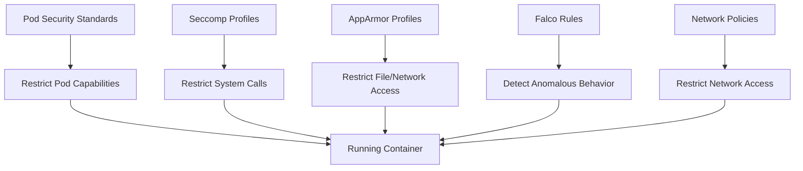

# How to Implement Runtime Security Policies with ArgoCD

Author: [nawazdhandala](https://github.com/nawazdhandala)

Tags: ArgoCD, GitOps, Kubernetes, Runtime Security, Falco

Description: Learn how to implement and manage Kubernetes runtime security policies through ArgoCD, including Falco rules, Pod Security Standards, seccomp profiles, and AppArmor policies.

---

Runtime security policies protect your cluster against threats that scanning and admission control cannot catch - like container escapes, privilege escalation, and unexpected process execution. Managing these policies through ArgoCD ensures they are version-controlled, consistently applied, and automatically enforced across all clusters. This guide covers deploying and managing runtime security tools through ArgoCD.

## Runtime Security Layers

Runtime security operates at multiple layers:



ArgoCD manages the configuration for all these layers.

## Deploying Pod Security Standards

Kubernetes Pod Security Standards (PSS) replace the deprecated PodSecurityPolicies. Manage them through ArgoCD by labeling namespaces:

```yaml
# namespaces/production.yaml
apiVersion: v1
kind: Namespace
metadata:
  name: production
  labels:
    pod-security.kubernetes.io/enforce: restricted
    pod-security.kubernetes.io/enforce-version: latest
    pod-security.kubernetes.io/audit: restricted
    pod-security.kubernetes.io/warn: restricted
```

```yaml
# namespaces/staging.yaml
apiVersion: v1
kind: Namespace
metadata:
  name: staging
  labels:
    pod-security.kubernetes.io/enforce: baseline
    pod-security.kubernetes.io/audit: restricted
    pod-security.kubernetes.io/warn: restricted
```

The `restricted` profile enforces strict security requirements:
- Must run as non-root
- Must drop all capabilities
- Must use read-only root filesystem
- Cannot use host networking or host PID

## Managing Namespace Security with ApplicationSet

Apply security labels consistently across all namespaces:

```yaml
apiVersion: argoproj.io/v1alpha1
kind: Application
metadata:
  name: namespace-security
  namespace: argocd
spec:
  project: security
  source:
    repoURL: https://github.com/your-org/k8s-configs.git
    targetRevision: main
    path: namespaces
  destination:
    server: https://kubernetes.default.svc
  syncPolicy:
    automated:
      selfHeal: true
      prune: false  # Never auto-delete namespaces
```

## Deploying Falco for Runtime Detection

Falco detects anomalous runtime behavior. Deploy it through ArgoCD:

```yaml
# applications/falco.yaml
apiVersion: argoproj.io/v1alpha1
kind: Application
metadata:
  name: falco
  namespace: argocd
spec:
  project: security
  source:
    repoURL: https://falcosecurity.github.io/charts
    chart: falco
    targetRevision: 4.2.0
    helm:
      values: |
        driver:
          kind: ebpf  # Use eBPF instead of kernel module
        falco:
          grpc:
            enabled: true
          grpcOutput:
            enabled: true
          httpOutput:
            enabled: true
            url: http://falcosidekick.security:2801
          rules_file:
            - /etc/falco/falco_rules.yaml
            - /etc/falco/falco_rules.local.yaml
            - /etc/falco/rules.d
        falcosidekick:
          enabled: true
          config:
            slack:
              webhookurl: ""  # Set via secret
            webhook:
              address: "http://alert-handler.security:8080"
        customRules:
          custom-rules.yaml: |-
            # Detect shell spawned in a container
            - rule: Shell Spawned in Container
              desc: A shell was spawned in a running container
              condition: >
                spawned_process and
                container and
                proc.name in (bash, sh, zsh, dash, ksh) and
                not proc.pname in (cron, crond, supervisord)
              output: >
                Shell spawned in container
                (user=%user.name container=%container.name
                shell=%proc.name parent=%proc.pname
                cmdline=%proc.cmdline image=%container.image.repository)
              priority: WARNING
              tags: [container, shell]

            # Detect sensitive file access
            - rule: Read Sensitive File in Container
              desc: Sensitive file opened for reading in container
              condition: >
                open_read and
                container and
                fd.name in (/etc/shadow, /etc/passwd, /etc/sudoers) and
                not proc.name in (login, passwd, su, sudo)
              output: >
                Sensitive file read in container
                (user=%user.name file=%fd.name container=%container.name
                image=%container.image.repository)
              priority: CRITICAL
              tags: [container, filesystem]

            # Detect crypto mining
            - rule: Detect Crypto Mining
              desc: Detect crypto mining processes
              condition: >
                spawned_process and
                container and
                (proc.name in (xmrig, minerd, cpuminer) or
                 proc.cmdline contains "stratum+tcp" or
                 proc.cmdline contains "cryptonight")
              output: >
                Crypto mining detected
                (user=%user.name process=%proc.name
                cmdline=%proc.cmdline container=%container.name)
              priority: CRITICAL
              tags: [container, crypto]
  destination:
    server: https://kubernetes.default.svc
    namespace: security
  syncPolicy:
    automated:
      selfHeal: true
      prune: true
    syncOptions:
      - CreateNamespace=true
```

## Custom Seccomp Profiles

Deploy seccomp profiles that restrict system calls available to containers:

```yaml
# security/seccomp-profiles.yaml
apiVersion: v1
kind: ConfigMap
metadata:
  name: seccomp-profiles
  namespace: kube-system
data:
  restricted.json: |
    {
      "defaultAction": "SCMP_ACT_ERRNO",
      "architectures": ["SCMP_ARCH_X86_64"],
      "syscalls": [
        {
          "names": [
            "accept4", "access", "arch_prctl", "bind", "brk",
            "capget", "capset", "chdir", "clone", "close",
            "connect", "dup", "dup2", "dup3", "epoll_create1",
            "epoll_ctl", "epoll_wait", "execve", "exit",
            "exit_group", "fchmod", "fchown", "fcntl", "fstat",
            "futex", "getdents64", "getegid", "geteuid",
            "getgid", "getpeername", "getpid", "getppid",
            "getsockname", "getsockopt", "getuid", "ioctl",
            "listen", "lseek", "madvise", "mmap", "mprotect",
            "munmap", "nanosleep", "newfstatat", "open",
            "openat", "pipe", "poll", "prctl", "pread64",
            "prlimit64", "read", "readlink", "recvfrom",
            "recvmsg", "rt_sigaction", "rt_sigprocmask",
            "rt_sigreturn", "sched_getaffinity", "sendmsg",
            "sendto", "set_robust_list", "set_tid_address",
            "setgid", "setgroups", "setsockopt", "setuid",
            "sigaltstack", "socket", "stat", "statfs",
            "tgkill", "uname", "unlink", "wait4", "write",
            "writev"
          ],
          "action": "SCMP_ACT_ALLOW"
        }
      ]
    }
```

Reference the seccomp profile in your deployments:

```yaml
apiVersion: apps/v1
kind: Deployment
metadata:
  name: my-app
spec:
  template:
    spec:
      securityContext:
        seccompProfile:
          type: Localhost
          localhostProfile: profiles/restricted.json
      containers:
        - name: app
          image: registry.example.com/myapp:v1.0.0
          securityContext:
            runAsNonRoot: true
            runAsUser: 1000
            readOnlyRootFilesystem: true
            allowPrivilegeEscalation: false
            capabilities:
              drop:
                - ALL
```

## Network Policies as Runtime Security

Manage network policies through ArgoCD to restrict container network access:

```yaml
# network-policies/default-deny.yaml
apiVersion: networking.k8s.io/v1
kind: NetworkPolicy
metadata:
  name: default-deny-all
  namespace: production
spec:
  podSelector: {}
  policyTypes:
    - Ingress
    - Egress
---
# network-policies/allow-app-traffic.yaml
apiVersion: networking.k8s.io/v1
kind: NetworkPolicy
metadata:
  name: allow-app-ingress
  namespace: production
spec:
  podSelector:
    matchLabels:
      app: my-app
  policyTypes:
    - Ingress
    - Egress
  ingress:
    - from:
        - namespaceSelector:
            matchLabels:
              name: ingress-nginx
      ports:
        - protocol: TCP
          port: 8080
  egress:
    - to:
        - namespaceSelector:
            matchLabels:
              name: database
      ports:
        - protocol: TCP
          port: 5432
    - to:  # Allow DNS
        - namespaceSelector: {}
      ports:
        - protocol: UDP
          port: 53
```

## Enforcing Security Context with Kyverno

Create policies that enforce security contexts on all pods:

```yaml
# policies/enforce-security-context.yaml
apiVersion: kyverno.io/v1
kind: ClusterPolicy
metadata:
  name: enforce-security-context
spec:
  validationFailureAction: Enforce
  rules:
    - name: require-drop-all-capabilities
      match:
        any:
          - resources:
              kinds:
                - Pod
              namespaces:
                - production
      validate:
        message: "Containers must drop ALL capabilities"
        pattern:
          spec:
            containers:
              - securityContext:
                  capabilities:
                    drop:
                      - ALL

    - name: require-readonly-rootfs
      match:
        any:
          - resources:
              kinds:
                - Pod
              namespaces:
                - production
      validate:
        message: "Containers must use readOnlyRootFilesystem"
        pattern:
          spec:
            containers:
              - securityContext:
                  readOnlyRootFilesystem: true

    - name: require-non-root
      match:
        any:
          - resources:
              kinds:
                - Pod
              namespaces:
                - production
      validate:
        message: "Containers must run as non-root"
        pattern:
          spec:
            containers:
              - securityContext:
                  runAsNonRoot: true
                  allowPrivilegeEscalation: false
```

## Automated Response to Runtime Threats

Use Falco Sidekick to trigger automated responses:

```yaml
# falco/response-rules.yaml
apiVersion: v1
kind: ConfigMap
metadata:
  name: falcosidekick-config
  namespace: security
data:
  config.yaml: |
    kubernetesPolicyReport:
      enabled: true
      minimumPriority: warning
    webhook:
      address: http://response-handler.security:8080
      minimumPriority: critical
```

The response handler can automatically kill suspicious pods, create incident tickets, or trigger a rescan. Use [OneUptime](https://oneuptime.com) for comprehensive runtime security monitoring and incident management.

## Summary

Implementing runtime security policies with ArgoCD covers Pod Security Standards for baseline restrictions, Falco for runtime threat detection, seccomp profiles for system call filtering, network policies for traffic control, and Kyverno policies for security context enforcement. All of these are managed as Git resources, deployed and maintained by ArgoCD. This approach ensures that security policies are consistently applied across all clusters, changes go through code review, and any drift is automatically corrected by ArgoCD's self-heal mechanism.
