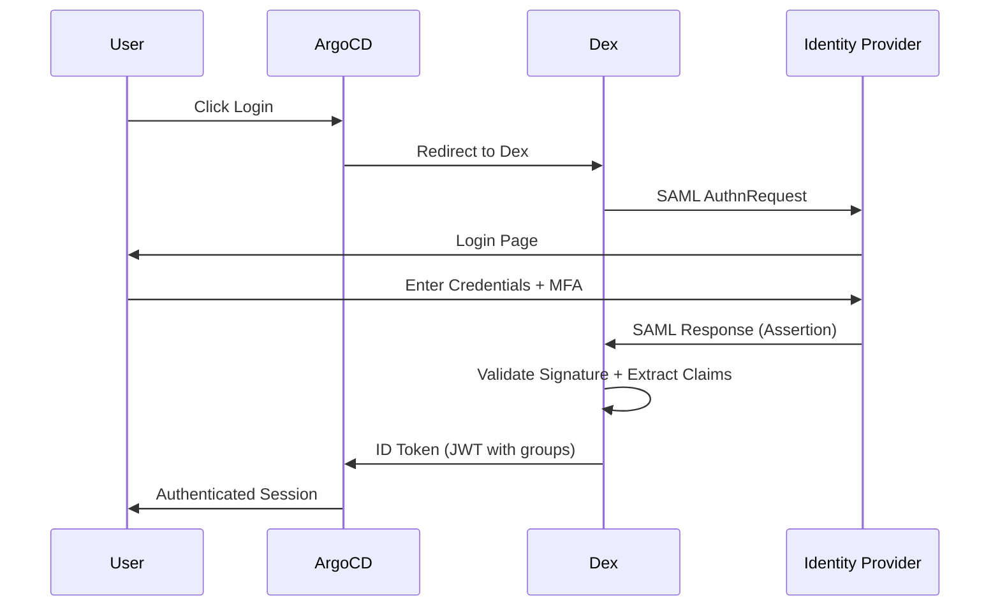

# How to Integrate ArgoCD with SAML 2.0 Providers

Author: [nawazdhandala](https://github.com/nawazdhandala)

Tags: ArgoCD, GitOps, Kubernetes, SAML, SSO

Description: Learn how to integrate ArgoCD with SAML 2.0 identity providers like Okta, Azure AD, and OneLogin for enterprise single sign-on with group-based access control.

---

SAML 2.0 (Security Assertion Markup Language) is the industry-standard protocol for enterprise single sign-on. If your organization uses Okta, Azure AD, PingFederate, OneLogin, or any other SAML 2.0 identity provider, you can integrate it with ArgoCD to give your teams SSO access with group-based role mapping. This eliminates the need for separate ArgoCD credentials and lets you enforce your existing identity policies.

This guide covers configuring ArgoCD's Dex server with SAML 2.0 providers, with concrete examples for the most common identity platforms.

## How SAML Works with ArgoCD

The SAML flow between ArgoCD and your identity provider follows the standard SP-initiated SSO pattern:



Dex acts as the SAML Service Provider (SP), and your identity platform is the Identity Provider (IdP).

## Prerequisites

You will need:
1. The ArgoCD Dex callback URL: `https://argocd.example.com/api/dex/callback`
2. Access to create a SAML application in your IdP
3. The IdP metadata URL or XML file
4. Attribute mappings for email, name, and groups

## General Dex SAML Configuration

Here is the base configuration that works with any SAML 2.0 provider:

```yaml
apiVersion: v1
kind: ConfigMap
metadata:
  name: argocd-cm
  namespace: argocd
data:
  url: https://argocd.example.com

  dex.config: |
    connectors:
    - type: saml
      id: saml
      name: SSO
      config:
        # Option 1: Use IdP metadata URL (preferred)
        ssoURL: https://idp.example.com/saml/sso
        caData: <base64-encoded-idp-signing-cert>

        # Option 2: Use full metadata URL
        # ssoIssuer: https://idp.example.com
        # ssoURL: https://idp.example.com/saml/sso

        # ArgoCD Dex callback URL - this is your ACS URL
        redirectURI: https://argocd.example.com/api/dex/callback

        # Entity ID for ArgoCD as service provider
        entityIssuer: https://argocd.example.com/api/dex/callback

        # Attribute mappings from SAML assertion
        usernameAttr: email
        emailAttr: email
        groupsAttr: groups

        # Allow groups delimiter if IdP sends groups as comma-separated string
        # groupsDelim: ","

        # Name ID policy
        nameIDPolicyFormat: emailAddress
```

## Okta Configuration

### Step 1: Create SAML App in Okta

In the Okta admin console:
1. Go to Applications, then Create App Integration
2. Select SAML 2.0
3. Set Single Sign-On URL to: `https://argocd.example.com/api/dex/callback`
4. Set Audience URI (SP Entity ID) to: `https://argocd.example.com/api/dex/callback`
5. Add attribute statements:
   - `email` mapped to `user.email`
   - `name` mapped to `user.displayName`
6. Add group attribute statement:
   - `groups` with filter "Matches regex" `.*`

### Step 2: Configure Dex for Okta

```yaml
dex.config: |
  connectors:
  - type: saml
    id: okta
    name: Okta
    config:
      ssoURL: https://your-org.okta.com/app/your-app-id/sso/saml
      caData: <base64-okta-signing-certificate>
      redirectURI: https://argocd.example.com/api/dex/callback
      entityIssuer: https://argocd.example.com/api/dex/callback
      usernameAttr: email
      emailAttr: email
      groupsAttr: groups
      nameIDPolicyFormat: emailAddress
```

Get the `caData` from Okta: Go to your SAML app, then Sign On tab, then download the X.509 Certificate. Base64-encode it:

```bash
cat okta-cert.pem | base64 -w0
```

## Azure AD (Entra ID) Configuration

### Step 1: Create Enterprise Application

In the Azure portal:
1. Go to Microsoft Entra ID, then Enterprise Applications, then New Application
2. Create your own application (Non-gallery)
3. Go to Single sign-on, then SAML
4. Set Identifier (Entity ID): `https://argocd.example.com/api/dex/callback`
5. Set Reply URL (ACS URL): `https://argocd.example.com/api/dex/callback`
6. Edit User Attributes and Claims:
   - Add group claim: select "Groups assigned to the application"
   - Set source attribute to "Group ID" or "Cloud-only group display names"

### Step 2: Configure Dex for Azure AD

```yaml
dex.config: |
  connectors:
  - type: saml
    id: azure-ad
    name: Azure AD
    config:
      ssoURL: https://login.microsoftonline.com/<tenant-id>/saml2
      caData: <base64-azure-signing-certificate>
      redirectURI: https://argocd.example.com/api/dex/callback
      entityIssuer: https://argocd.example.com/api/dex/callback
      usernameAttr: http://schemas.xmlsoap.org/ws/2005/05/identity/claims/emailaddress
      emailAttr: http://schemas.xmlsoap.org/ws/2005/05/identity/claims/emailaddress
      groupsAttr: http://schemas.microsoft.com/ws/2008/06/identity/claims/groups
      nameIDPolicyFormat: emailAddress
```

Note that Azure AD uses full namespace URIs for attribute names. This is the most common mistake when configuring Azure AD SAML with Dex.

## OneLogin Configuration

```yaml
dex.config: |
  connectors:
  - type: saml
    id: onelogin
    name: OneLogin
    config:
      ssoURL: https://your-org.onelogin.com/trust/saml2/http-post/sso/<app-id>
      caData: <base64-onelogin-signing-certificate>
      redirectURI: https://argocd.example.com/api/dex/callback
      entityIssuer: https://argocd.example.com/api/dex/callback
      usernameAttr: User.email
      emailAttr: User.email
      groupsAttr: memberOf
      nameIDPolicyFormat: emailAddress
```

## RBAC with SAML Groups

Map SAML groups to ArgoCD roles:

```yaml
apiVersion: v1
kind: ConfigMap
metadata:
  name: argocd-rbac-cm
  namespace: argocd
data:
  policy.default: role:readonly
  scopes: '[groups, email]'

  policy.csv: |
    p, role:admin, applications, *, */*, allow
    p, role:admin, clusters, *, *, allow
    p, role:admin, repositories, *, *, allow
    p, role:admin, projects, *, *, allow

    p, role:deployer, applications, get, */*, allow
    p, role:deployer, applications, sync, */*, allow
    p, role:deployer, applications, list, */*, allow

    # Map IdP groups to ArgoCD roles
    # For Okta/OneLogin (group names)
    g, platform-team, role:admin
    g, developers, role:deployer

    # For Azure AD (group object IDs when using group IDs)
    # g, a1b2c3d4-e5f6-7890-abcd-ef1234567890, role:admin
```

## Troubleshooting SAML Integration

### Check Dex Logs

Enable debug logging to see the full SAML assertion:

```bash
# Set debug log level
kubectl patch configmap argocd-cmd-params-cm -n argocd \
  --type merge \
  -p '{"data": {"dexserver.log.level": "debug"}}'

kubectl rollout restart deployment argocd-dex-server -n argocd

# Watch logs
kubectl logs -f deployment/argocd-dex-server -n argocd
```

### Common Errors

**"Response is not signed"**: Your IdP might not be signing the SAML response. Ensure the IdP is configured to sign both the assertion and the response.

**"Audience mismatch"**: The Entity ID in Dex config must exactly match what is configured in the IdP. Check for trailing slashes.

**"Groups not appearing"**: Verify the groups attribute name. Use the debug logs to see the raw SAML assertion and check what attribute name the IdP actually sends.

### Decode SAML Responses

If you need to inspect what the IdP is sending, capture the SAML response from your browser's network tab (it is base64-encoded in the SAMLResponse POST parameter):

```bash
# Decode a SAML response for inspection
echo "<base64-saml-response>" | base64 -d | xmllint --format -
```

## Security Considerations

1. Always use HTTPS for both ArgoCD and the IdP
2. Validate the SAML response signature using the correct IdP certificate
3. Set a reasonable session timeout in ArgoCD
4. Enable MFA at the IdP level for ArgoCD access
5. Regularly rotate the IdP signing certificate and update `caData`
6. Monitor authentication events with [OneUptime](https://oneuptime.com/blog/post/2026-02-09-argocd-monitoring-prometheus/view) to detect anomalies

## Conclusion

SAML 2.0 integration gives ArgoCD enterprise-grade single sign-on with any major identity provider. The configuration is straightforward through Dex - the main complexity lies in correctly mapping attribute names between what your IdP sends in the SAML assertion and what Dex expects. Always start by checking the raw SAML assertion to understand your IdP's attribute naming, then configure Dex to match. Once set up, your teams get seamless SSO access to ArgoCD with group-based role mapping enforced by your existing identity infrastructure.
