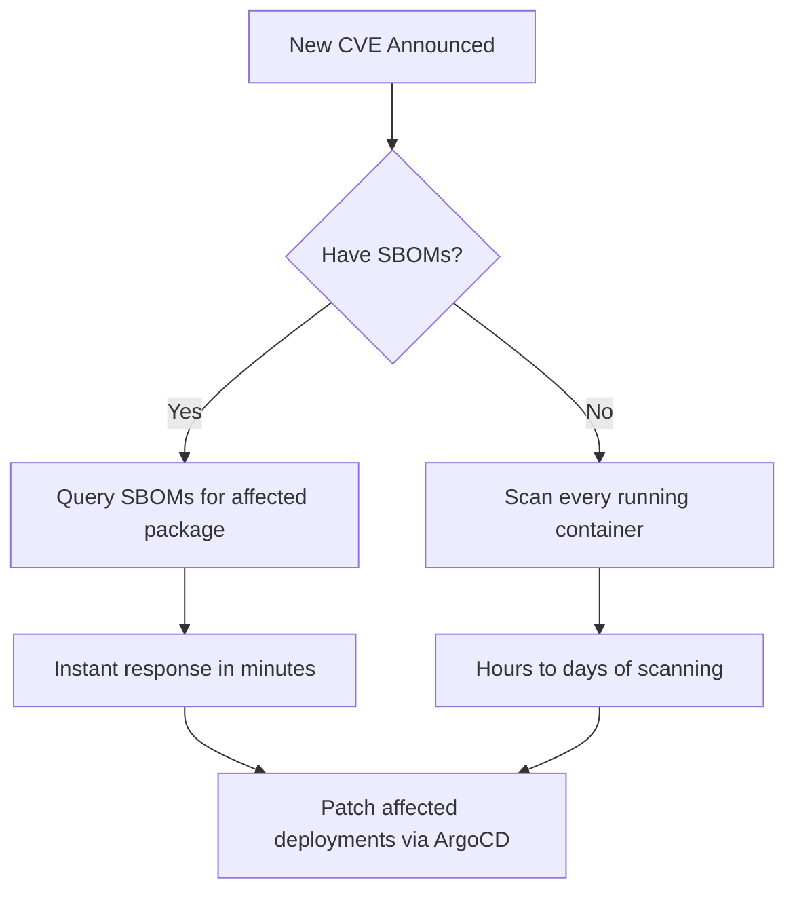

# How to Generate SBOMs for ArgoCD Deployments

Author: [nawazdhandala](https://github.com/nawazdhandala)

Tags: ArgoCD, GitOps, Kubernetes, SBOM, Security

Description: Learn how to generate, attach, and verify Software Bill of Materials (SBOMs) for container images deployed through ArgoCD using Syft, Cosign attestations, and policy enforcement.

---

A Software Bill of Materials (SBOM) is a complete inventory of all components, libraries, and dependencies inside a container image. With increasing regulatory requirements and the need for vulnerability response, generating SBOMs for every deployed image has become essential. This guide covers how to integrate SBOM generation into ArgoCD deployment workflows.

## Why SBOMs Matter for ArgoCD Deployments

When a new vulnerability like Log4Shell is announced, the first question is "are we affected?" Without SBOMs, answering this requires scanning every running container. With SBOMs attached to your images, you can instantly search for affected packages across all deployments.



## SBOM Formats

Two main SBOM formats are used in the container ecosystem:

- **SPDX** - An open standard maintained by the Linux Foundation
- **CycloneDX** - An OWASP standard focused on security use cases

Both are supported by the major tooling. We will use SPDX in this guide, but the patterns work with either format.

## Generating SBOMs in CI

Use Syft to generate SBOMs during your CI pipeline:

```yaml
# .github/workflows/build-with-sbom.yaml
name: Build with SBOM
on:
  push:
    branches: [main]

jobs:
  build:
    runs-on: ubuntu-latest
    permissions:
      id-token: write
      contents: read
    steps:
      - uses: actions/checkout@v4

      - name: Install tools
        run: |
          # Install Syft for SBOM generation
          curl -sSfL https://raw.githubusercontent.com/anchore/syft/main/install.sh | sh -s -- -b /usr/local/bin

          # Install Cosign for signing
          curl -sSfL https://github.com/sigstore/cosign/releases/latest/download/cosign-linux-amd64 -o /usr/local/bin/cosign
          chmod +x /usr/local/bin/cosign

      - name: Build and push image
        run: |
          IMAGE=registry.example.com/myapp:${{ github.sha }}
          docker build -t $IMAGE .
          docker push $IMAGE

      - name: Generate SBOM
        run: |
          IMAGE=registry.example.com/myapp:${{ github.sha }}

          # Generate SPDX SBOM
          syft packages "$IMAGE" \
            --output spdx-json=/tmp/sbom-spdx.json

          # Generate CycloneDX SBOM (alternative)
          syft packages "$IMAGE" \
            --output cyclonedx-json=/tmp/sbom-cyclonedx.json

          echo "SBOM generated with $(jq '.packages | length' /tmp/sbom-spdx.json) packages"

      - name: Attach SBOM as Cosign attestation
        env:
          COSIGN_KEY: ${{ secrets.COSIGN_PRIVATE_KEY }}
          COSIGN_PASSWORD: ${{ secrets.COSIGN_PASSWORD }}
        run: |
          IMAGE=registry.example.com/myapp:${{ github.sha }}

          # Attach SPDX SBOM as attestation
          cosign attest \
            --key env://COSIGN_KEY \
            --predicate /tmp/sbom-spdx.json \
            --type spdx \
            "$IMAGE"

          echo "SBOM attestation attached to image"

      - name: Store SBOM in artifact storage
        run: |
          # Also upload to S3 for long-term storage and querying
          aws s3 cp /tmp/sbom-spdx.json \
            s3://sbom-storage/myapp/${{ github.sha }}/sbom.json
```

## Verifying SBOMs in ArgoCD PreSync

Before deploying, verify that images have valid SBOM attestations:

```yaml
# hooks/verify-sbom.yaml
apiVersion: batch/v1
kind: Job
metadata:
  name: verify-sbom-presync
  annotations:
    argocd.argoproj.io/hook: PreSync
    argocd.argoproj.io/hook-delete-policy: BeforeHookCreation
spec:
  template:
    spec:
      containers:
        - name: verify
          image: bitnami/cosign:latest
          command:
            - /bin/sh
            - -c
            - |
              IMAGES="
              registry.example.com/api:v2.1.0
              registry.example.com/web:v3.0.1
              registry.example.com/worker:v1.4.0
              "

              MISSING_SBOM=""

              for IMAGE in $IMAGES; do
                echo "Checking SBOM attestation for: $IMAGE"

                # Verify SBOM attestation exists and is signed
                if cosign verify-attestation \
                  --key /keys/cosign.pub \
                  --type spdx \
                  "$IMAGE" > /dev/null 2>&1; then
                  echo "  SBOM: Present and verified"

                  # Extract and display SBOM summary
                  SBOM=$(cosign verify-attestation \
                    --key /keys/cosign.pub \
                    --type spdx \
                    "$IMAGE" 2>/dev/null | jq -r '.payload' | base64 -d)

                  PKG_COUNT=$(echo "$SBOM" | jq '.predicate.packages | length')
                  echo "  Packages: $PKG_COUNT"
                else
                  echo "  SBOM: MISSING or UNSIGNED"
                  MISSING_SBOM="$MISSING_SBOM\n  - $IMAGE"
                fi
              done

              if [ -n "$MISSING_SBOM" ]; then
                echo ""
                echo "WARNING: The following images are missing SBOM attestations:"
                echo -e "$MISSING_SBOM"
                # Decide whether to block or warn
                # exit 1  # Uncomment to block deployment
                echo "Proceeding with warning (SBOM not required yet)"
              fi
          volumeMounts:
            - name: cosign-key
              mountPath: /keys
              readOnly: true
      volumes:
        - name: cosign-key
          secret:
            secretName: cosign-pub
      restartPolicy: Never
  backoffLimit: 1
```

## Enforcing SBOM Requirements with Kyverno

Create a policy that requires SBOM attestations for production deployments:

```yaml
# policies/require-sbom.yaml
apiVersion: kyverno.io/v1
kind: ClusterPolicy
metadata:
  name: require-sbom-attestation
  annotations:
    policies.kyverno.io/title: Require SBOM Attestation
    policies.kyverno.io/severity: medium
spec:
  validationFailureAction: Enforce
  rules:
    - name: require-spdx-sbom
      match:
        any:
          - resources:
              kinds:
                - Pod
              namespaces:
                - production
      verifyImages:
        - imageReferences:
            - "registry.example.com/*"
          attestations:
            - type: spdx
              conditions:
                - all:
                    # Verify SBOM has at least one package listed
                    - key: "{{ packages | length(@) }}"
                      operator: GreaterThan
                      value: 0
              attestors:
                - entries:
                    - keys:
                        publicKeys: |
                          -----BEGIN PUBLIC KEY-----
                          your-public-key-here
                          -----END PUBLIC KEY-----
```

## SBOM-Based Vulnerability Checking

Use SBOMs to check for specific vulnerable packages during deployment:

```yaml
# hooks/sbom-vuln-check.yaml
apiVersion: batch/v1
kind: Job
metadata:
  name: sbom-vulnerability-check
  annotations:
    argocd.argoproj.io/hook: PreSync
    argocd.argoproj.io/hook-delete-policy: BeforeHookCreation
spec:
  template:
    spec:
      containers:
        - name: checker
          image: aquasec/trivy:latest
          command:
            - /bin/sh
            - -c
            - |
              apk add --no-cache curl jq

              IMAGE="registry.example.com/myapp:v2.1.0"

              # Download the SBOM from the registry
              cosign verify-attestation \
                --key /keys/cosign.pub \
                --type spdx \
                "$IMAGE" 2>/dev/null | \
                jq -r '.payload' | base64 -d | \
                jq '.predicate' > /tmp/sbom.json

              # Check SBOM against known vulnerable packages
              # This list would typically come from a vulnerability feed
              BLOCKED_PACKAGES="log4j-core:2.14 spring-core:5.3.17"

              for PKG in $BLOCKED_PACKAGES; do
                NAME=$(echo $PKG | cut -d: -f1)
                VERSION=$(echo $PKG | cut -d: -f2)

                FOUND=$(jq -r ".packages[]? | select(.name == \"$NAME\" and .versionInfo == \"$VERSION\") | .name" /tmp/sbom.json)

                if [ -n "$FOUND" ]; then
                  echo "BLOCKED: Image contains known vulnerable package: $NAME:$VERSION"
                  exit 1
                fi
              done

              # Also scan SBOM with Trivy
              trivy sbom /tmp/sbom.json \
                --severity CRITICAL \
                --exit-code 1

              echo "SBOM vulnerability check passed"
          volumeMounts:
            - name: cosign-key
              mountPath: /keys
              readOnly: true
      volumes:
        - name: cosign-key
          secret:
            secretName: cosign-pub
      restartPolicy: Never
  backoffLimit: 1
```

## Storing and Querying SBOMs

Deploy a centralized SBOM storage and query service:

```yaml
# applications/sbom-api.yaml
apiVersion: argoproj.io/v1alpha1
kind: Application
metadata:
  name: dependency-track
  namespace: argocd
spec:
  project: security
  source:
    repoURL: https://github.com/your-org/k8s-configs.git
    targetRevision: main
    path: sbom-management
  destination:
    server: https://kubernetes.default.svc
    namespace: dependency-track
  syncPolicy:
    automated:
      selfHeal: true
```

```yaml
# sbom-management/dependency-track.yaml
apiVersion: apps/v1
kind: Deployment
metadata:
  name: dependency-track
  namespace: dependency-track
spec:
  replicas: 1
  selector:
    matchLabels:
      app: dependency-track
  template:
    metadata:
      labels:
        app: dependency-track
    spec:
      containers:
        - name: api-server
          image: dependencytrack/apiserver:latest
          ports:
            - containerPort: 8080
          env:
            - name: ALPINE_DATABASE_MODE
              value: external
            - name: ALPINE_DATABASE_URL
              value: jdbc:postgresql://postgres:5432/dtrack
          resources:
            requests:
              cpu: 500m
              memory: 4Gi
```

## PostSync SBOM Upload

After a successful deployment, upload SBOMs to your tracking system:

```yaml
# hooks/upload-sbom.yaml
apiVersion: batch/v1
kind: Job
metadata:
  name: upload-sbom
  annotations:
    argocd.argoproj.io/hook: PostSync
    argocd.argoproj.io/hook-delete-policy: HookSucceeded
spec:
  template:
    spec:
      containers:
        - name: uploader
          image: curlimages/curl:latest
          command:
            - /bin/sh
            - -c
            - |
              # Extract SBOM from image attestation
              cosign verify-attestation \
                --key /keys/cosign.pub \
                --type spdx \
                registry.example.com/myapp:v2.1.0 2>/dev/null | \
                jq -r '.payload' | base64 -d | \
                jq '.predicate' > /tmp/sbom.json

              # Upload to Dependency-Track
              curl -X POST \
                "http://dependency-track.dependency-track:8080/api/v1/bom" \
                -H "X-Api-Key: $DT_API_KEY" \
                -H "Content-Type: application/json" \
                -d @/tmp/sbom.json

              echo "SBOM uploaded to Dependency-Track"
          env:
            - name: DT_API_KEY
              valueFrom:
                secretKeyRef:
                  name: dependency-track-api
                  key: api-key
      restartPolicy: Never
```

## Monitoring SBOM Compliance

Track SBOM compliance across all deployments with [OneUptime](https://oneuptime.com) to alert when deployments are missing SBOMs or when new vulnerabilities affect packages listed in your SBOMs.

## Summary

Generating SBOMs for ArgoCD deployments involves three main phases: generation during CI using tools like Syft, attachment to images as signed Cosign attestations, and verification during ArgoCD sync through PreSync hooks and admission policies. By storing SBOMs in a tracking system like Dependency-Track, you can rapidly respond to new vulnerabilities by querying which deployments are affected. The GitOps approach ensures that SBOM requirements are enforced consistently across all environments and that every policy change is tracked in version control.
