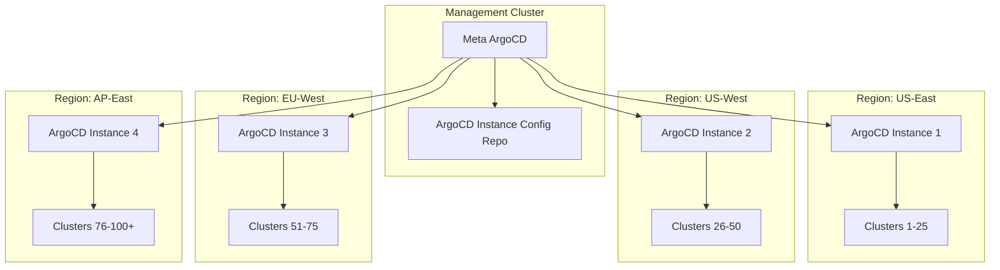

# How to Scale ArgoCD Across 100+ Clusters

Author: [nawazdhandala](https://github.com/nawazdhandala)

Tags: ArgoCD, GitOps, Kubernetes, Scaling, Enterprise

Description: Advanced strategies for scaling ArgoCD to manage over 100 Kubernetes clusters including multi-instance architectures, federated setups, and performance tuning.

---

Scaling ArgoCD to manage over 100 Kubernetes clusters is a fundamentally different challenge than managing 50. At this scale, a single ArgoCD instance - even with aggressive tuning - will eventually hit architectural limits. The reconciliation loop cannot keep up, the repo server falls behind, and operational complexity makes troubleshooting nearly impossible.

This guide covers the architectural patterns and practical configurations needed to run ArgoCD across 100 or more clusters, drawn from real-world experience running ArgoCD at enterprise scale.

## Why a Single Instance Falls Apart at 100+ Clusters

With 100 clusters, even a well-tuned ArgoCD instance struggles with several compounding issues:

- **Memory pressure**: The application controller maintains an in-memory cache of every resource across all clusters. At 100 clusters with thousands of resources each, this easily exceeds 32GB.
- **Reconciliation latency**: Even with 10 controller shards, each shard handles 10 clusters. If each cluster has 50 applications, that is 500 applications per shard reconciling every 3 minutes.
- **Git operations**: The repo server must generate manifests for potentially 5,000 or more applications. Repository cloning and Helm/Kustomize rendering becomes a major bottleneck.
- **Kubernetes API load**: Each cluster connection maintains a watch on multiple resource types. At 100 clusters, that is thousands of concurrent API watches.

## Architecture Pattern: Federated ArgoCD

The proven approach for 100+ clusters is a federated ArgoCD architecture. Instead of one ArgoCD managing everything, you deploy multiple ArgoCD instances, each responsible for a subset of clusters.



A "meta" ArgoCD instance manages the lifecycle of all other ArgoCD instances. Each regional ArgoCD instance manages 20 to 30 clusters. This keeps each instance within comfortable performance bounds.

## Setting Up the Meta ArgoCD Instance

The meta instance is a standard ArgoCD installation that deploys and manages the regional instances:

```yaml
# Application that manages a regional ArgoCD instance
apiVersion: argoproj.io/v1alpha1
kind: Application
metadata:
  name: argocd-us-east
  namespace: argocd
spec:
  project: argocd-management
  source:
    repoURL: https://github.com/org/argocd-fleet-config
    targetRevision: HEAD
    path: instances/us-east
    helm:
      valueFiles:
      - values-us-east.yaml
  destination:
    server: https://management-cluster.example.com
    namespace: argocd-us-east
  syncPolicy:
    automated:
      prune: true
      selfHeal: true
```

The Helm values file for each regional instance configures its cluster assignments:

```yaml
# values-us-east.yaml
controller:
  replicas: 3
  env:
  - name: ARGOCD_CONTROLLER_REPLICAS
    value: "3"
  resources:
    requests:
      cpu: "4"
      memory: "8Gi"
    limits:
      cpu: "8"
      memory: "16Gi"

repoServer:
  replicas: 3
  resources:
    requests:
      cpu: "2"
      memory: "4Gi"

redis:
  resources:
    requests:
      memory: "4Gi"

configs:
  cm:
    cluster.cache.resync.duration: "5m"
    controller.status.processors: "40"
    controller.operation.processors: "20"
```

## Cluster Assignment Strategy

How you assign clusters to ArgoCD instances matters. There are three common strategies:

**Geographic assignment** groups clusters by region. This minimizes network latency between ArgoCD and the clusters it manages.

**Workload-based assignment** groups clusters by workload type. All production clusters are managed by one instance, staging by another. This lets you apply different SLAs to different instances.

**Hash-based assignment** distributes clusters evenly using consistent hashing. This ensures balanced load but may increase cross-region traffic.

```yaml
# Cluster secret with labels for assignment
apiVersion: v1
kind: Secret
metadata:
  name: cluster-prod-us-east-1
  namespace: argocd
  labels:
    argocd.argoproj.io/secret-type: cluster
    region: us-east
    environment: production
    argocd-instance: us-east
type: Opaque
stringData:
  name: prod-us-east-1
  server: https://prod-us-east-1.example.com
  config: |
    {
      "bearerToken": "<token>",
      "tlsClientConfig": {
        "insecure": false,
        "caData": "<ca-data>"
      }
    }
```

## Shared Git Repository Architecture

With multiple ArgoCD instances, your Git repository structure needs to support multi-instance consumption. A monorepo approach works well:

```text
gitops-repo/
  base/
    monitoring/
    logging/
    networking/
  overlays/
    us-east/
      cluster-1/
      cluster-2/
    us-west/
      cluster-3/
      cluster-4/
    eu-west/
      cluster-5/
  instances/
    us-east/
      Chart.yaml
      values-us-east.yaml
    us-west/
      Chart.yaml
      values-us-west.yaml
```

Each ArgoCD instance only watches paths relevant to its clusters. This reduces repo server load since each instance only generates manifests for its assigned clusters.

```yaml
apiVersion: argoproj.io/v1alpha1
kind: ApplicationSet
metadata:
  name: platform-services
  namespace: argocd
spec:
  generators:
  - git:
      repoURL: https://github.com/org/gitops-repo
      revision: HEAD
      directories:
      # Only process clusters assigned to this instance
      - path: 'overlays/us-east/*'
  template:
    metadata:
      name: '{{path.basename}}-platform'
    spec:
      source:
        repoURL: https://github.com/org/gitops-repo
        targetRevision: HEAD
        path: '{{path}}'
      destination:
        server: '{{path.basename}}.example.com'
        namespace: platform
```

## Performance Tuning at 100+ Scale

Even with federation, each instance needs careful tuning. Here are the critical settings:

```yaml
apiVersion: v1
kind: ConfigMap
metadata:
  name: argocd-cmd-params-cm
  namespace: argocd
data:
  # Increase reconciliation timeout for large clusters
  controller.repo.server.timeout.seconds: "300"

  # Enable server-side diff to reduce controller memory
  controller.diff.server.side: "true"

  # Limit concurrent manifest generation
  reposerver.parallelism.limit: "10"

  # Enable repo server request deduplication
  reposerver.enable.git.submodule: "false"
```

Additionally, configure the application controller to skip unnecessary reconciliation:

```yaml
apiVersion: v1
kind: ConfigMap
metadata:
  name: argocd-cm
  namespace: argocd
data:
  # Increase resource exclusion to reduce watched resources
  resource.exclusions: |
    - apiGroups:
      - "events.k8s.io"
      kinds:
      - "Event"
      clusters:
      - "*"
    - apiGroups:
      - ""
      kinds:
      - "Event"
      clusters:
      - "*"
  # Reduce reconciliation frequency for stable apps
  timeout.reconciliation: "300s"
```

## Centralized Monitoring Across All Instances

With multiple ArgoCD instances, you need centralized monitoring. Use Prometheus federation or a tool like Thanos to aggregate metrics from all instances:

```yaml
# ServiceMonitor for each ArgoCD instance
apiVersion: monitoring.coreos.com/v1
kind: ServiceMonitor
metadata:
  name: argocd-metrics
  labels:
    argocd-instance: us-east
spec:
  selector:
    matchLabels:
      app.kubernetes.io/part-of: argocd
  endpoints:
  - port: metrics
    interval: 30s
    metricRelabelings:
    - sourceLabels: [__name__]
      regex: 'argocd_app_info|argocd_app_sync_total|argocd_cluster_api.*'
      action: keep
```

For alerting on sync failures and degraded applications across your entire fleet, you can integrate with [OneUptime monitoring](https://oneuptime.com/blog/post/2026-02-26-argocd-alerts-failed-syncs/view) to get notified before issues cascade.

## Disaster Recovery Planning

At 100+ clusters, your ArgoCD infrastructure itself needs a disaster recovery plan. Key considerations:

1. **Backup ArgoCD state**: Export Application and AppProject resources regularly
2. **Git is your source of truth**: All application definitions should be in Git, not manually created
3. **Instance failover**: If a regional ArgoCD goes down, another instance should be able to take over its clusters
4. **Credential management**: Use external secrets management so cluster credentials are recoverable

```bash
# Export all applications from an ArgoCD instance
argocd app list -o json > backup/applications-$(date +%Y%m%d).json

# Export all projects
argocd proj list -o json > backup/projects-$(date +%Y%m%d).json

# Export cluster connections
kubectl get secrets -n argocd \
  -l argocd.argoproj.io/secret-type=cluster \
  -o yaml > backup/clusters-$(date +%Y%m%d).yaml
```

## Summary

Scaling ArgoCD beyond 100 clusters requires moving from a single-instance to a federated architecture. Deploy a meta ArgoCD instance to manage regional ArgoCD installations, each handling 20 to 30 clusters. Use geographic or workload-based assignment strategies, tune each instance for its specific load, and implement centralized monitoring across the fleet. The federated approach trades some operational complexity for dramatically better performance and fault isolation. If one regional instance has issues, the other 75+ clusters continue operating normally.
