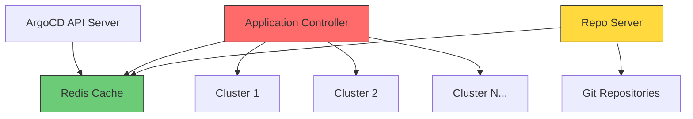
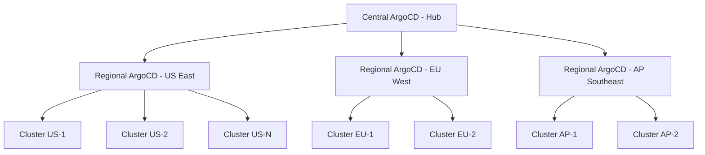

# How to Scale ArgoCD Across 50+ Clusters

Author: [nawazdhandala](https://github.com/nawazdhandala)

Tags: ArgoCD, GitOps, Kubernetes, Scaling, Multi-Cluster

Description: A practical guide to scaling ArgoCD to manage 50 or more Kubernetes clusters with controller sharding, resource optimization, and architectural patterns.

---

Managing a handful of Kubernetes clusters with ArgoCD is straightforward. But once you cross the 50-cluster threshold, things start to break in ways you did not expect. Sync times slow down. The application controller starts consuming excessive memory. API server responses become sluggish. The repo server falls behind on manifest generation.

I have been through this exact scenario at two different organizations, and the lessons were painful but educational. This guide covers the practical steps to scale ArgoCD across 50 or more clusters without rewriting your entire platform.

## Understanding the Bottlenecks

Before optimizing anything, you need to understand where ArgoCD struggles at scale. The three primary bottlenecks are:

1. **Application Controller** - It reconciles every application, comparing desired state to live state. With 50+ clusters, that means thousands of reconciliation loops running concurrently.
2. **Repo Server** - It clones repositories and generates manifests. At scale, the same repository gets cloned dozens of times.
3. **Redis** - It caches application state and serves as the communication layer. Under heavy load, Redis becomes a single point of contention.



## Step 1: Enable Controller Sharding

The single biggest improvement you can make is enabling controller sharding. Instead of one application controller processing all clusters, you split the workload across multiple controller replicas.

Each shard is responsible for a subset of clusters, determined by a consistent hashing algorithm.

```yaml
# argocd-cmd-params-cm ConfigMap
apiVersion: v1
kind: ConfigMap
metadata:
  name: argocd-cmd-params-cm
  namespace: argocd
data:
  # Enable sharding with 3 controller replicas
  controller.sharding.algorithm: "round-robin"
```

Then scale the controller StatefulSet:

```yaml
apiVersion: apps/v1
kind: StatefulSet
metadata:
  name: argocd-application-controller
  namespace: argocd
spec:
  replicas: 3  # Match your shard count
  template:
    spec:
      containers:
      - name: argocd-application-controller
        env:
        - name: ARGOCD_CONTROLLER_REPLICAS
          value: "3"
        resources:
          requests:
            cpu: "2"
            memory: "4Gi"
          limits:
            cpu: "4"
            memory: "8Gi"
```

For 50 clusters, three to five shards works well. The rule of thumb is roughly one shard per 15 to 20 clusters, depending on the number of applications per cluster.

## Step 2: Scale the Repo Server

The repo server is often the silent bottleneck. It handles manifest generation for every application, and at 50+ clusters you likely have hundreds of applications.

```yaml
apiVersion: apps/v1
kind: Deployment
metadata:
  name: argocd-repo-server
  namespace: argocd
spec:
  replicas: 3  # Scale horizontally
  template:
    spec:
      containers:
      - name: argocd-repo-server
        env:
        # Increase parallelism for manifest generation
        - name: ARGOCD_EXEC_TIMEOUT
          value: "180s"
        # Enable repo server parallelism limit
        - name: ARGOCD_REPO_SERVER_PARALLELISM_LIMIT
          value: "20"
        resources:
          requests:
            cpu: "2"
            memory: "2Gi"
          limits:
            cpu: "4"
            memory: "4Gi"
        # Use a persistent volume for the repo cache
        volumeMounts:
        - name: repo-cache
          mountPath: /tmp
      volumes:
      - name: repo-cache
        emptyDir:
          sizeLimit: 10Gi
```

The key settings here are the parallelism limit and giving each replica enough disk space for repository clones.

## Step 3: Optimize Redis

At 50+ clusters, Redis handles an enormous amount of cache traffic. The default single-instance Redis will eventually become a bottleneck.

```yaml
# Use Redis HA mode
apiVersion: apps/v1
kind: Deployment
metadata:
  name: argocd-redis-ha
  namespace: argocd
spec:
  replicas: 3
  template:
    spec:
      containers:
      - name: redis
        image: redis:7.2-alpine
        args:
        - redis-server
        - --maxmemory
        - "2gb"
        - --maxmemory-policy
        - "allkeys-lru"
        - --save
        - ""
        - --appendonly
        - "no"
        resources:
          requests:
            cpu: "1"
            memory: "2Gi"
          limits:
            cpu: "2"
            memory: "3Gi"
```

Disable persistence in Redis since ArgoCD can rebuild its cache from live cluster state. This reduces I/O pressure significantly.

## Step 4: Configure Cluster Connection Pooling

Each cluster connection consumes resources on the controller side. Configure connection settings to prevent exhaustion:

```yaml
apiVersion: v1
kind: ConfigMap
metadata:
  name: argocd-cm
  namespace: argocd
data:
  # Reduce the frequency of cluster cache syncs
  cluster.cache.resync.duration: "3m"
  # Increase timeout for slow clusters
  timeout.reconciliation: "300s"
  # Limit the number of concurrent status processors
  controller.status.processors: "50"
  # Limit concurrent operation processors
  controller.operation.processors: "25"
```

The status and operation processor counts are critical. Too many concurrent processors will overwhelm the controller. For 50 clusters with moderate application counts, 50 status processors and 25 operation processors is a solid starting point.

## Step 5: Use ApplicationSets Instead of Individual Applications

If you are deploying the same application across multiple clusters, stop creating individual Application resources. ApplicationSets with cluster generators reduce the management overhead dramatically.

```yaml
apiVersion: argoproj.io/v1alpha1
kind: ApplicationSet
metadata:
  name: monitoring-stack
  namespace: argocd
spec:
  generators:
  - clusters:
      selector:
        matchLabels:
          environment: production
  template:
    metadata:
      name: 'monitoring-{{name}}'
    spec:
      project: default
      source:
        repoURL: https://github.com/org/monitoring-stack
        targetRevision: HEAD
        path: 'overlays/{{metadata.labels.region}}'
      destination:
        server: '{{server}}'
        namespace: monitoring
      syncPolicy:
        automated:
          prune: true
          selfHeal: true
```

This single resource replaces 50 individual Application manifests and ensures consistent configuration across all clusters.

## Step 6: Implement Resource Quotas for Reconciliation

Not all applications need to be reconciled at the same frequency. Lower-priority applications can have their sync intervals extended:

```yaml
apiVersion: argoproj.io/v1alpha1
kind: Application
metadata:
  name: legacy-reporting
  annotations:
    # Only reconcile every 10 minutes instead of default 3 minutes
    argocd.argoproj.io/refresh: "600"
spec:
  # ... application spec
```

For monitoring your ArgoCD deployment at this scale, consider integrating with [OneUptime](https://oneuptime.com/blog/post/2026-02-26-argocd-alerts-outofsync-applications/view) to get alerts when applications drift out of sync across your cluster fleet.

## Step 7: Network Architecture Considerations

At 50+ clusters, network topology matters. If your clusters span multiple regions, consider deploying ArgoCD instances per region with a hub-and-spoke model:



The central instance manages the regional instances using the app-of-apps pattern, while each regional instance handles local clusters. This reduces cross-region API calls and improves sync latency.

## Step 8: Monitoring at Scale

You need observability into ArgoCD itself when managing this many clusters. Export Prometheus metrics and set up dashboards for:

- Reconciliation queue depth
- Sync duration per application
- Controller memory and CPU usage per shard
- Repo server manifest generation time
- Redis memory utilization

```yaml
apiVersion: monitoring.coreos.com/v1
kind: ServiceMonitor
metadata:
  name: argocd-metrics
  namespace: argocd
spec:
  selector:
    matchLabels:
      app.kubernetes.io/part-of: argocd
  endpoints:
  - port: metrics
    interval: 30s
```

## Summary

Scaling ArgoCD to 50+ clusters is achievable with the right architecture. The key steps are: enable controller sharding to distribute the reconciliation load, scale the repo server for manifest generation throughput, optimize Redis for caching performance, use ApplicationSets for multi-cluster deployments, and consider regional ArgoCD instances for geographically distributed clusters. Start with sharding since it provides the most immediate improvement, then work through the remaining optimizations based on where your specific bottlenecks appear.
