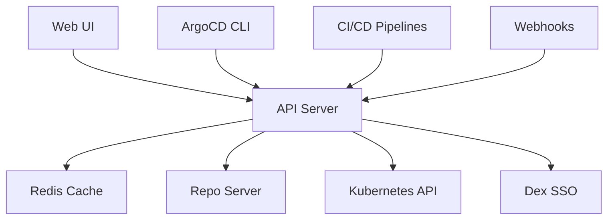

# How to Scale the ArgoCD API Server

Author: [nawazdhandala](https://github.com/nawazdhandala)

Tags: ArgoCD, GitOps, Kubernetes, Scaling, API

Description: Learn how to scale the ArgoCD API server for handling more concurrent users, CLI operations, and API requests without degradation in response times.

---

The ArgoCD API server handles all user-facing interactions: the web UI, CLI commands, webhook triggers, and API calls from CI/CD pipelines. When the API server becomes overloaded, the UI becomes sluggish, CLI commands time out, and automated pipelines fail. Scaling the API server ensures your team can work with ArgoCD without interruption.

## What the API Server Handles

The API server is the gateway to all ArgoCD functionality:

- Serving the web UI (single-page application)
- Processing CLI requests (argocd app sync, argocd app list, etc.)
- Handling gRPC and REST API calls
- Processing webhook notifications from Git providers
- Managing SSO authentication via Dex
- Streaming application events and logs



Unlike the application controller, the API server is fully stateless. This makes it one of the easiest ArgoCD components to scale horizontally.

## When to Scale the API Server

Watch for these symptoms:

```bash
# Check API server response times
kubectl logs deployment/argocd-server -n argocd | \
  grep -i "slow\|timeout\|deadline"

# Check resource usage
kubectl top pods -n argocd -l app.kubernetes.io/name=argocd-server

# Test API response time
time argocd app list

# Check for HTTP errors
kubectl logs deployment/argocd-server -n argocd | \
  grep "HTTP" | grep -E "50[0-9]"
```

Common scaling triggers:
- More than 20 concurrent UI users
- CI/CD pipelines making frequent API calls
- Webhook-heavy workloads (many Git pushes triggering syncs)
- Slow UI page loads (especially the application list page)
- API timeout errors in CLI or pipeline logs

## Horizontal Scaling

Scale the API server by increasing replicas:

```bash
# Simple scaling
kubectl scale deployment argocd-server -n argocd --replicas=5
```

For a production-ready Helm configuration:

```yaml
# argocd-values.yaml
server:
  replicas: 5

  autoscaling:
    enabled: true
    minReplicas: 3
    maxReplicas: 10
    targetCPUUtilizationPercentage: 60
    targetMemoryUtilizationPercentage: 70
    behavior:
      scaleUp:
        stabilizationWindowSeconds: 60
        policies:
          - type: Pods
            value: 2
            periodSeconds: 60
      scaleDown:
        stabilizationWindowSeconds: 300
        policies:
          - type: Pods
            value: 1
            periodSeconds: 120

  resources:
    requests:
      cpu: 200m
      memory: 256Mi
    limits:
      cpu: "1"
      memory: 512Mi

  # Spread across nodes
  affinity:
    podAntiAffinity:
      preferredDuringSchedulingIgnoredDuringExecution:
        - weight: 100
          podAffinityTerm:
            labelSelector:
              matchLabels:
                app.kubernetes.io/name: argocd-server
            topologyKey: kubernetes.io/hostname

  # PodDisruptionBudget
  pdb:
    enabled: true
    minAvailable: 2
```

Apply:

```bash
helm upgrade argocd argo/argo-cd \
  --namespace argocd \
  --values argocd-values.yaml
```

## Load Balancing Configuration

With multiple API server replicas, you need proper load balancing. The Kubernetes Service handles this automatically, but ingress configuration matters:

### Nginx Ingress

```yaml
apiVersion: networking.k8s.io/v1
kind: Ingress
metadata:
  name: argocd-server
  namespace: argocd
  annotations:
    nginx.ingress.kubernetes.io/backend-protocol: "HTTPS"
    nginx.ingress.kubernetes.io/ssl-passthrough: "true"
    # Enable gRPC support for CLI
    nginx.ingress.kubernetes.io/backend-protocol: "GRPCS"
    # Rate limiting per client
    nginx.ingress.kubernetes.io/limit-rps: "50"
    nginx.ingress.kubernetes.io/limit-burst-multiplier: "5"
    # Connection timeouts
    nginx.ingress.kubernetes.io/proxy-connect-timeout: "30"
    nginx.ingress.kubernetes.io/proxy-read-timeout: "600"
    nginx.ingress.kubernetes.io/proxy-send-timeout: "600"
spec:
  ingressClassName: nginx
  rules:
    - host: argocd.example.com
      http:
        paths:
          - path: /
            pathType: Prefix
            backend:
              service:
                name: argocd-server
                port:
                  number: 443
  tls:
    - hosts:
        - argocd.example.com
      secretName: argocd-tls
```

### AWS ALB Ingress

```yaml
apiVersion: networking.k8s.io/v1
kind: Ingress
metadata:
  name: argocd-server
  namespace: argocd
  annotations:
    kubernetes.io/ingress.class: alb
    alb.ingress.kubernetes.io/scheme: internal
    alb.ingress.kubernetes.io/target-type: ip
    alb.ingress.kubernetes.io/backend-protocol: HTTPS
    alb.ingress.kubernetes.io/healthcheck-path: /healthz
    alb.ingress.kubernetes.io/healthcheck-protocol: HTTPS
    # Enable stickiness for UI sessions
    alb.ingress.kubernetes.io/target-group-attributes: stickiness.enabled=true,stickiness.lb_cookie.duration_seconds=3600
spec:
  rules:
    - host: argocd.example.com
      http:
        paths:
          - path: /
            pathType: Prefix
            backend:
              service:
                name: argocd-server
                port:
                  number: 443
```

## Session Affinity for the UI

The ArgoCD web UI maintains WebSocket connections for real-time updates. While the API server is stateless, session affinity improves the UI experience by routing a user's requests to the same pod:

```yaml
apiVersion: v1
kind: Service
metadata:
  name: argocd-server
  namespace: argocd
spec:
  sessionAffinity: ClientIP
  sessionAffinityConfig:
    clientIP:
      timeoutSeconds: 3600
  selector:
    app.kubernetes.io/name: argocd-server
  ports:
    - name: https
      port: 443
      targetPort: 8080
```

Note that session affinity is a preference, not a requirement. The UI still works without it, but users may experience brief reconnections when their requests hit a different pod.

## Health Check Configuration

Configure proper health checks so the load balancer routes traffic only to healthy pods:

```yaml
server:
  livenessProbe:
    httpGet:
      path: /healthz
      port: 8080
      scheme: HTTPS
    initialDelaySeconds: 10
    periodSeconds: 10
    timeoutSeconds: 5
    failureThreshold: 3
  readinessProbe:
    httpGet:
      path: /healthz
      port: 8080
      scheme: HTTPS
    initialDelaySeconds: 5
    periodSeconds: 5
    timeoutSeconds: 3
    failureThreshold: 3
```

## Rate Limiting API Requests

To protect the API server from abuse, configure rate limiting:

```yaml
apiVersion: v1
kind: ConfigMap
metadata:
  name: argocd-cmd-params-cm
  namespace: argocd
data:
  # Limit concurrent API requests
  server.x.frame.options: "sameorigin"

  # Configure gRPC max concurrent streams
  server.grpc.max.send.msg.size: "104857600"
```

For external rate limiting with Nginx:

```yaml
# Nginx ConfigMap for rate limiting
apiVersion: v1
kind: ConfigMap
metadata:
  name: nginx-configuration
  namespace: ingress-nginx
data:
  # Global rate limit
  limit-rate: "50"
  limit-rate-after: "100"
```

## Optimizing API Server Performance

### Enable gzip Compression

Reduce bandwidth for UI and API responses:

```yaml
apiVersion: v1
kind: ConfigMap
metadata:
  name: argocd-cmd-params-cm
  namespace: argocd
data:
  server.enable.gzip: "true"
```

### Tune Server Parameters

```yaml
apiVersion: v1
kind: ConfigMap
metadata:
  name: argocd-cmd-params-cm
  namespace: argocd
data:
  # Static assets cache
  server.staticassets: "/shared/app"

  # Disable TLS on the server (terminate at ingress)
  server.insecure: "true"

  # Root path for reverse proxy
  server.rootpath: ""
```

Running the API server in insecure mode (without TLS) and terminating TLS at the ingress controller can reduce CPU usage by 20-30% on each API server pod.

## Monitoring API Server Metrics

```bash
# Check API server metrics
kubectl exec -n argocd deployment/argocd-server -- \
  curl -s localhost:8083/metrics | grep -E "argocd_api|grpc"
```

Key metrics:

- `grpc_server_handled_total` - Total gRPC requests by method and status
- `grpc_server_handling_seconds` - Request duration
- `argocd_app_info` - Application information served by the API
- `process_resident_memory_bytes` - Memory usage per pod

Create alerts:

```yaml
groups:
  - name: argocd-api-server
    rules:
      - alert: ArgocdApiServerHighErrorRate
        expr: |
          sum(rate(grpc_server_handled_total{grpc_code!="OK",namespace="argocd"}[5m]))
          /
          sum(rate(grpc_server_handled_total{namespace="argocd"}[5m]))
          > 0.05
        for: 10m
        labels:
          severity: warning
        annotations:
          summary: "ArgoCD API server error rate above 5%"

      - alert: ArgocdApiServerHighLatency
        expr: |
          histogram_quantile(0.95,
            rate(grpc_server_handling_seconds_bucket{namespace="argocd"}[5m])
          ) > 5
        for: 10m
        labels:
          severity: warning
        annotations:
          summary: "ArgoCD API server p95 latency above 5 seconds"
```

## Scaling Recommendations by Team Size

| Team Size | Concurrent Users | Recommended Replicas | Resources per Pod |
|---|---|---|---|
| 1 to 5 | 1 to 5 | 2 | 200m CPU, 256Mi RAM |
| 5 to 20 | 5 to 15 | 3 | 500m CPU, 512Mi RAM |
| 20 to 50 | 15 to 40 | 5 | 500m CPU, 512Mi RAM |
| 50+ | 40+ | 5 to 10 with autoscaling | 1 CPU, 1Gi RAM |

The API server is the easiest ArgoCD component to scale because it is completely stateless. Start with 3 replicas for production, enable autoscaling, and monitor response times. For a complete monitoring setup, see our guide on [monitoring ArgoCD component health](https://oneuptime.com/blog/post/2026-02-26-argocd-monitor-component-health/view).
