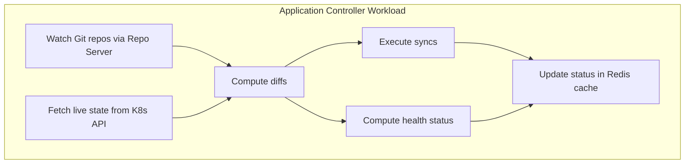

# How to Scale the ArgoCD Application Controller

Author: [nawazdhandala](https://github.com/nawazdhandala)

Tags: ArgoCD, GitOps, Kubernetes, Scaling, Performance

Description: Learn how to scale the ArgoCD application controller horizontally with sharding and vertically with resource tuning for managing hundreds or thousands of applications.

---

The ArgoCD application controller is the most resource-intensive component in the system. It continuously reconciles the desired state in Git with the live state in Kubernetes clusters. As you add more applications, the controller becomes the bottleneck. Scaling it properly is critical for maintaining responsive sync operations and accurate health status.

## Understanding the Controller's Role

The application controller does the heavy lifting in ArgoCD:

1. Polls Git repositories for changes (through the repo server)
2. Compares rendered manifests against live cluster state
3. Detects drift between desired and actual state
4. Executes sync operations when triggered
5. Reports health status for all managed resources

Each of these tasks consumes CPU and memory proportional to the number of applications and resources managed.



## Vertical Scaling: Increasing Resources

Before horizontal scaling, try vertical scaling. Many controller performance issues stem from insufficient memory or CPU:

```yaml
# Patch the controller deployment with more resources
apiVersion: apps/v1
kind: StatefulSet
metadata:
  name: argocd-application-controller
  namespace: argocd
spec:
  template:
    spec:
      containers:
        - name: argocd-application-controller
          resources:
            requests:
              cpu: "1"
              memory: 2Gi
            limits:
              cpu: "4"
              memory: 8Gi
```

Apply the change:

```bash
kubectl patch statefulset argocd-application-controller -n argocd \
  --type merge \
  -p '{"spec":{"template":{"spec":{"containers":[{"name":"argocd-application-controller","resources":{"requests":{"cpu":"1","memory":"2Gi"},"limits":{"cpu":"4","memory":"8Gi"}}}]}}}}'
```

Resource guidelines based on application count:

| Applications | CPU Request | Memory Request | CPU Limit | Memory Limit |
|---|---|---|---|---|
| 1 to 50 | 250m | 512Mi | 1 | 2Gi |
| 50 to 200 | 500m | 1Gi | 2 | 4Gi |
| 200 to 500 | 1 | 2Gi | 4 | 8Gi |
| 500 to 1000 | 2 | 4Gi | 4 | 12Gi |
| 1000+ | Use horizontal scaling | | | |

## Horizontal Scaling with Sharding

When a single controller instance cannot handle the load, you need to shard the workload across multiple controller replicas. Each shard manages a subset of clusters or applications.

### Enable Sharding by Cluster

The most common sharding strategy assigns clusters to different controller shards:

```yaml
# argocd-cmd-params-cm ConfigMap
apiVersion: v1
kind: ConfigMap
metadata:
  name: argocd-cmd-params-cm
  namespace: argocd
data:
  # Number of controller shards
  controller.sharding.algorithm: "round-robin"
```

Then scale the controller StatefulSet:

```bash
# Scale to 3 controller replicas
kubectl scale statefulset argocd-application-controller -n argocd --replicas=3
```

Set the environment variable so each controller knows the total shard count:

```yaml
apiVersion: apps/v1
kind: StatefulSet
metadata:
  name: argocd-application-controller
  namespace: argocd
spec:
  replicas: 3
  template:
    spec:
      containers:
        - name: argocd-application-controller
          env:
            - name: ARGOCD_CONTROLLER_REPLICAS
              value: "3"
```

Each controller replica automatically picks up its shard based on its ordinal index (0, 1, 2).

### Sharding Algorithm Options

ArgoCD supports different sharding algorithms:

```yaml
apiVersion: v1
kind: ConfigMap
metadata:
  name: argocd-cmd-params-cm
  namespace: argocd
data:
  # Round-robin: distributes clusters evenly across shards
  controller.sharding.algorithm: "round-robin"

  # Legacy: hash-based distribution (default in older versions)
  # controller.sharding.algorithm: "legacy"
```

You can also explicitly assign clusters to specific shards:

```yaml
# Annotate the cluster secret to assign it to a specific shard
apiVersion: v1
kind: Secret
metadata:
  name: production-cluster
  namespace: argocd
  labels:
    argocd.argoproj.io/secret-type: cluster
  annotations:
    # Assign to shard 0
    argocd.argoproj.io/shard: "0"
stringData:
  server: "https://production-api:6443"
  name: "production"
  config: |
    {"bearerToken": "..."}
```

### Verify Shard Assignment

Check which clusters are assigned to which shards:

```bash
# Check controller logs for shard assignments
kubectl logs statefulset/argocd-application-controller -n argocd \
  --all-containers | grep "shard"

# Each controller log should show something like:
# "Processing clusters for shard 0"
# "Cluster production assigned to shard 0"
```

## Tuning Controller Parameters

Beyond scaling, tuning the controller's operational parameters significantly impacts performance:

```yaml
apiVersion: v1
kind: ConfigMap
metadata:
  name: argocd-cmd-params-cm
  namespace: argocd
data:
  # Number of application state processors (parallel reconciliation)
  controller.status.processors: "50"

  # Number of operation processors (parallel sync operations)
  controller.operation.processors: "25"

  # Reconciliation timeout
  controller.self.heal.timeout.seconds: "5"

  # Repo server timeout (increase for large repos)
  controller.repo.server.timeout.seconds: "180"

  # Kubernetes client QPS and burst
  controller.k8s.client.config.qps: "50"
  controller.k8s.client.config.burst: "100"
```

Explanation of key parameters:

- **status.processors**: How many applications are reconciled in parallel. Increase for faster status updates, but this increases CPU and API server load.
- **operation.processors**: How many sync operations run in parallel. Increase for faster bulk syncs.
- **k8s.client.config.qps**: Rate limit for Kubernetes API calls. Higher values mean faster reconciliation but more API server pressure.

## Dynamic Cluster Distribution

ArgoCD 2.8+ supports dynamic cluster distribution, which automatically rebalances clusters across controller shards when replicas scale up or down:

```yaml
apiVersion: v1
kind: ConfigMap
metadata:
  name: argocd-cmd-params-cm
  namespace: argocd
data:
  # Enable dynamic cluster distribution
  controller.dynamic.cluster.distribution.enabled: "true"
```

With this enabled, you can use Horizontal Pod Autoscaler (HPA) on the controller:

```yaml
apiVersion: autoscaling/v2
kind: HorizontalPodAutoscaler
metadata:
  name: argocd-application-controller
  namespace: argocd
spec:
  scaleTargetRef:
    apiVersion: apps/v1
    kind: StatefulSet
    name: argocd-application-controller
  minReplicas: 2
  maxReplicas: 5
  metrics:
    - type: Resource
      resource:
        name: cpu
        target:
          type: Utilization
          averageUtilization: 70
    - type: Resource
      resource:
        name: memory
        target:
          type: Utilization
          averageUtilization: 80
```

## Monitoring Controller Performance

Set up monitoring to know when scaling is needed:

```bash
# Key Prometheus metrics to watch
# argocd_app_reconcile_count - total reconciliations
# argocd_app_reconcile_bucket - reconciliation duration histogram
# argocd_app_sync_total - total sync operations
# argocd_cluster_api_resource_actions_total - K8s API calls
# argocd_cluster_api_resources_total - monitored resources count

# Check current reconciliation queue length
kubectl exec -n argocd statefulset/argocd-application-controller -- \
  curl -s localhost:8082/metrics | grep argocd_app_reconcile
```

Signs that you need to scale the controller:

- Reconciliation times exceeding 30 seconds regularly
- Application status updates taking minutes instead of seconds
- Controller memory usage consistently above 80% of limits
- Frequent OOMKilled restarts
- Growing sync operation queue

## Example: Scaling from 100 to 500 Applications

Here is a practical scaling scenario:

```bash
# Step 1: Check current performance
kubectl top pod -n argocd -l app.kubernetes.io/name=argocd-application-controller

# Step 2: Increase resources first (vertical scaling)
kubectl patch statefulset argocd-application-controller -n argocd \
  --type merge -p '{
    "spec": {
      "template": {
        "spec": {
          "containers": [{
            "name": "argocd-application-controller",
            "resources": {
              "requests": {"cpu": "1", "memory": "2Gi"},
              "limits": {"cpu": "4", "memory": "8Gi"}
            }
          }]
        }
      }
    }
  }'

# Step 3: If still struggling, add horizontal sharding
kubectl scale statefulset argocd-application-controller -n argocd --replicas=3

# Step 4: Set the replica count environment variable
kubectl set env statefulset/argocd-application-controller -n argocd \
  ARGOCD_CONTROLLER_REPLICAS=3

# Step 5: Tune processing parameters
kubectl patch configmap argocd-cmd-params-cm -n argocd --type merge -p '{
  "data": {
    "controller.status.processors": "50",
    "controller.operation.processors": "25"
  }
}'

# Step 6: Restart to pick up all changes
kubectl rollout restart statefulset/argocd-application-controller -n argocd
```

Scaling the application controller is the most impactful optimization you can make for large ArgoCD deployments. Start with vertical scaling, move to horizontal sharding when a single instance is no longer sufficient, and use dynamic cluster distribution for automatic rebalancing. For comprehensive monitoring of your scaled controller, see our guide on [monitoring ArgoCD component health](https://oneuptime.com/blog/post/2026-02-26-argocd-monitor-component-health/view).
