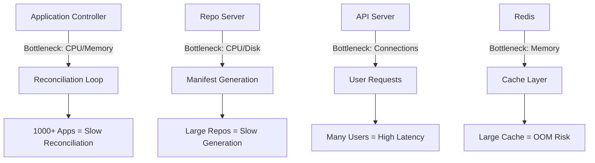
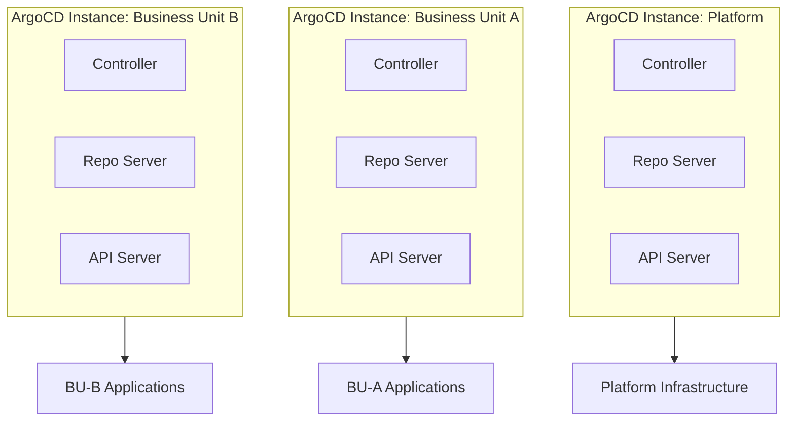

# How to Scale ArgoCD for Enterprise Multi-Tenancy

Author: [nawazdhandala](https://github.com/nawazdhandala)

Tags: ArgoCD, GitOps, Kubernetes, Enterprise, Scalability

Description: Learn how to scale ArgoCD for enterprise multi-tenancy with hundreds of teams and thousands of applications using sharding, resource optimization, and architectural patterns.

---

Running ArgoCD for 5 teams with 20 applications is straightforward. Running it for 200 teams with 5,000 applications is a completely different challenge. The controller runs out of memory. The repo server cannot keep up with manifest generation. The API server becomes sluggish. Teams start complaining that syncs take forever.

Scaling ArgoCD for enterprise multi-tenancy requires architectural decisions about sharding, resource allocation, instance topology, and operational practices. This guide covers what you need to know to run ArgoCD at scale.

## Understanding the Bottlenecks

Before scaling, understand where the bottlenecks occur.



| Component | Primary Bottleneck | Scaling Strategy |
|-----------|-------------------|-----------------|
| Application Controller | CPU and memory | Sharding, resource tuning |
| Repo Server | CPU and disk I/O | Horizontal scaling, caching |
| API Server | Connection count | Horizontal scaling |
| Redis | Memory | External Redis, sentinel |

## Controller Sharding

The application controller is the most resource-intensive component. At scale, a single controller cannot reconcile all applications fast enough. Sharding distributes applications across multiple controller instances.

### Static Sharding

Assign applications to specific shards based on cluster:

```yaml
apiVersion: apps/v1
kind: Deployment
metadata:
  name: argocd-application-controller
  namespace: argocd
spec:
  replicas: 3  # 3 controller shards
  template:
    spec:
      containers:
        - name: argocd-application-controller
          env:
            - name: ARGOCD_CONTROLLER_REPLICAS
              value: "3"
```

ArgoCD uses consistent hashing to assign clusters to shards. Each controller instance only reconciles applications in its assigned clusters.

### Dynamic Cluster Distribution

ArgoCD 2.8+ supports dynamic cluster distribution, which automatically balances clusters across controller shards:

```yaml
apiVersion: v1
kind: ConfigMap
metadata:
  name: argocd-cmd-params-cm
  namespace: argocd
data:
  controller.dynamic.cluster.distribution.enabled: "true"
```

This is the recommended approach for enterprises because it handles shard rebalancing automatically when controllers are added or removed.

## Scaling the Repo Server

The repo server clones Git repositories and generates manifests. With hundreds of repos, it becomes a bottleneck.

```yaml
apiVersion: apps/v1
kind: Deployment
metadata:
  name: argocd-repo-server
  namespace: argocd
spec:
  replicas: 5  # Scale horizontally
  template:
    spec:
      containers:
        - name: argocd-repo-server
          resources:
            requests:
              cpu: "1"
              memory: 2Gi
            limits:
              cpu: "4"
              memory: 8Gi
          env:
            # Increase parallelism for manifest generation
            - name: ARGOCD_EXEC_TIMEOUT
              value: "180s"
            # Configure repo server parallelism
            - name: ARGOCD_REPO_SERVER_PARALLELISM_LIMIT
              value: "10"
          volumeMounts:
            # Use fast storage for Git clone operations
            - name: tmp
              mountPath: /tmp
      volumes:
        - name: tmp
          emptyDir:
            sizeLimit: 10Gi
```

### Repo Server Caching

Enable aggressive caching to reduce Git operations:

```yaml
apiVersion: v1
kind: ConfigMap
metadata:
  name: argocd-cmd-params-cm
  namespace: argocd
data:
  # Cache manifests for longer
  reposerver.repo.cache.expiration: 1h
  # Cache Helm indexes
  reposerver.helm.cache.max.entries: "1000"
```

## Scaling the API Server

The API server handles UI requests, CLI commands, and webhook calls. Scale it horizontally behind a load balancer:

```yaml
apiVersion: apps/v1
kind: Deployment
metadata:
  name: argocd-server
  namespace: argocd
spec:
  replicas: 3
  template:
    spec:
      containers:
        - name: argocd-server
          resources:
            requests:
              cpu: 500m
              memory: 512Mi
            limits:
              cpu: 2
              memory: 2Gi
```

## External Redis for HA

The default embedded Redis does not scale for enterprise use. Switch to an external Redis cluster:

```yaml
apiVersion: v1
kind: ConfigMap
metadata:
  name: argocd-cmd-params-cm
  namespace: argocd
data:
  redis.server: redis-ha.argocd.svc:6379
```

Deploy Redis with high availability:

```yaml
apiVersion: argoproj.io/v1alpha1
kind: Application
metadata:
  name: argocd-redis-ha
  namespace: argocd
spec:
  project: platform
  source:
    repoURL: https://charts.bitnami.com/bitnami
    chart: redis
    targetRevision: 18.x.x
    helm:
      values: |
        architecture: replication
        replica:
          replicaCount: 3
        sentinel:
          enabled: true
        resources:
          requests:
            memory: 1Gi
          limits:
            memory: 4Gi
  destination:
    namespace: argocd
```

## Resource Tuning for Large Scale

At enterprise scale, the default resource allocations are too small. Here are recommended starting points for different scales:

### 500 Applications, 50 Teams

```yaml
# Controller
resources:
  requests:
    cpu: "2"
    memory: 4Gi
  limits:
    cpu: "4"
    memory: 8Gi
env:
  - name: ARGOCD_CONTROLLER_REPLICAS
    value: "2"
  - name: ARGOCD_CONTROLLER_STATUS_PROCESSORS
    value: "50"
  - name: ARGOCD_CONTROLLER_OPERATION_PROCESSORS
    value: "25"
```

### 2000 Applications, 200 Teams

```yaml
# Controller (3 shards)
resources:
  requests:
    cpu: "4"
    memory: 8Gi
  limits:
    cpu: "8"
    memory: 16Gi
env:
  - name: ARGOCD_CONTROLLER_REPLICAS
    value: "3"
  - name: ARGOCD_CONTROLLER_STATUS_PROCESSORS
    value: "100"
  - name: ARGOCD_CONTROLLER_OPERATION_PROCESSORS
    value: "50"

# Repo Server (5 replicas)
resources:
  requests:
    cpu: "2"
    memory: 4Gi
  limits:
    cpu: "4"
    memory: 8Gi
```

### 5000+ Applications

At this scale, consider multiple ArgoCD instances instead of a single large one.

## Multi-Instance Architecture

For the largest enterprises, running multiple ArgoCD instances provides better isolation and independent scaling per organizational unit.



Each instance manages a subset of the organization:

```yaml
# Instance per business unit using ArgoCD Helm chart
apiVersion: argoproj.io/v1alpha1
kind: Application
metadata:
  name: argocd-bu-a
  namespace: argocd
spec:
  project: platform
  source:
    repoURL: https://argoproj.github.io/argo-helm
    chart: argo-cd
    targetRevision: 6.x.x
    helm:
      values: |
        nameOverride: argocd-bu-a
        controller:
          replicas: 2
          resources:
            requests:
              cpu: 2
              memory: 4Gi
        server:
          replicas: 2
          ingress:
            enabled: true
            hosts:
              - argocd-bu-a.internal.example.com
  destination:
    namespace: argocd-bu-a
```

## Optimizing Reconciliation

Reduce reconciliation load by tuning intervals and using webhooks:

```yaml
apiVersion: v1
kind: ConfigMap
metadata:
  name: argocd-cm
  namespace: argocd
data:
  # Increase reconciliation timeout for large deployments
  timeout.reconciliation: 300s
  # Reduce polling frequency - rely on webhooks instead
  timeout.reconciliation.jitter: 60s
```

Configure Git webhooks for all repositories to trigger immediate reconciliation instead of polling:

```yaml
apiVersion: v1
kind: ConfigMap
metadata:
  name: argocd-cm
  namespace: argocd
data:
  # Webhook configuration
  webhook.github.secret: $webhook.github.secret
```

## Monitoring at Scale

At enterprise scale, monitoring ArgoCD itself becomes critical:

```yaml
# Key metrics to alert on
groups:
  - name: argocd-scale-alerts
    rules:
      - alert: ControllerReconciliationSlow
        expr: |
          histogram_quantile(0.99, rate(argocd_app_reconcile_bucket[10m])) > 300
        labels:
          severity: warning
        annotations:
          summary: "Controller reconciliation p99 exceeds 5 minutes"

      - alert: RepoServerQueueBacklog
        expr: |
          argocd_repo_pending_request_total > 50
        labels:
          severity: warning
        annotations:
          summary: "Repo server has more than 50 pending requests"

      - alert: ControllerMemoryHigh
        expr: |
          container_memory_working_set_bytes{container="argocd-application-controller"}
          / container_spec_memory_limit_bytes{container="argocd-application-controller"} > 0.85
        labels:
          severity: critical
        annotations:
          summary: "Controller memory usage above 85%"
```

## Tenant Onboarding Automation

At enterprise scale, manual tenant onboarding does not work. Automate it:

```yaml
# ApplicationSet that creates everything for new tenants
apiVersion: argoproj.io/v1alpha1
kind: ApplicationSet
metadata:
  name: tenant-onboarding
  namespace: argocd
spec:
  generators:
    - git:
        repoURL: https://github.com/myorg/tenant-registry.git
        revision: main
        files:
          - path: "tenants/*/tenant.json"
  template:
    metadata:
      name: "tenant-{{tenant.name}}"
    spec:
      project: platform
      source:
        repoURL: https://github.com/myorg/tenant-bootstrap.git
        path: "template"
        targetRevision: main
        kustomize:
          namePrefix: "{{tenant.name}}-"
          commonLabels:
            tenant: "{{tenant.name}}"
            cost-center: "{{tenant.costCenter}}"
      destination:
        server: https://kubernetes.default.svc
```

New tenant onboarding becomes a single JSON file in a pull request:

```json
{
  "tenant": {
    "name": "team-delta",
    "costCenter": "eng-delta-001",
    "tier": "standard",
    "contactEmail": "team-delta@example.com"
  }
}
```

Scaling ArgoCD for enterprise multi-tenancy is an evolving process. Start with the obvious optimizations - resource tuning and repo server scaling. Move to sharding when reconciliation slows down. Consider multiple instances when organizational boundaries make it logical. And throughout, monitor the system closely so you know when the next scaling step is needed.
