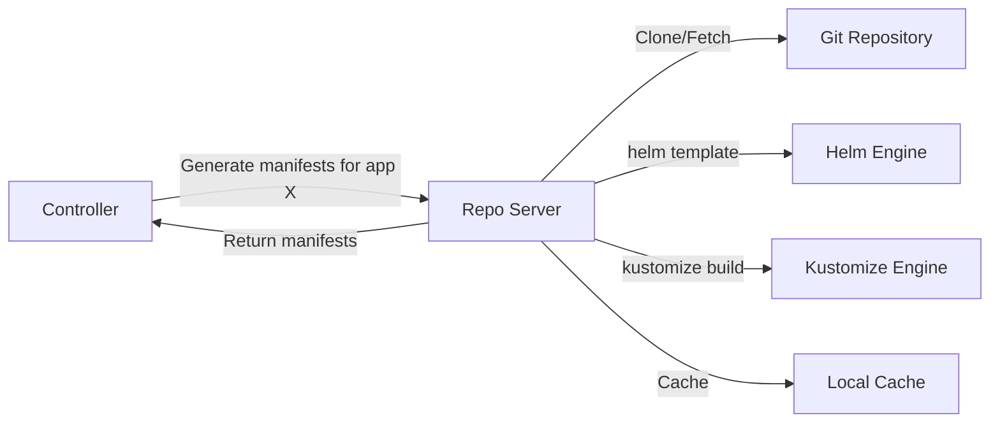
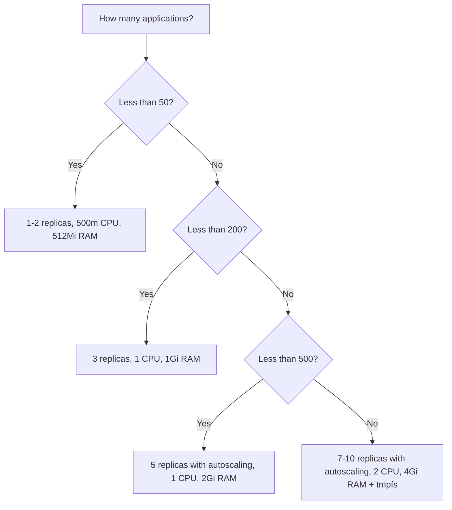

# How to Scale the ArgoCD Repo Server

Author: [nawazdhandala](https://github.com/nawazdhandala)

Tags: ArgoCD, GitOps, Kubernetes, Scaling, Performance

Description: Learn how to scale the ArgoCD repo server for faster manifest generation, covering horizontal scaling, caching optimization, and resource tuning for large deployments.

---

The ArgoCD repo server is responsible for cloning Git repositories, rendering manifests from Helm charts, Kustomize overlays, and plain YAML, and returning the final manifests to the application controller. When the repo server becomes a bottleneck, applications take longer to sync, status updates lag, and you may see timeout errors across the board. Scaling the repo server properly ensures your GitOps pipeline remains responsive.

## What the Repo Server Does

Every time ArgoCD needs to compare desired state with live state, it asks the repo server to generate manifests. This involves:

1. Cloning or fetching the latest commit from the Git repository
2. Running the appropriate rendering tool (Helm template, Kustomize build, or plain copy)
3. Returning the rendered YAML manifests to the controller
4. Caching results for repeated requests



The repo server is stateless and CPU/memory intensive during manifest generation. It is also the component most affected by large repositories and complex Helm charts.

## Signs You Need to Scale the Repo Server

Watch for these symptoms:

```bash
# Check repo server logs for timeout or resource issues
kubectl logs deployment/argocd-repo-server -n argocd | \
  grep -i "timeout\|error\|oom\|deadline"

# Check resource usage
kubectl top pods -n argocd -l app.kubernetes.io/name=argocd-repo-server

# Check if applications are showing manifest generation errors
argocd app list | grep -i "error\|unknown"
```

Common symptoms:
- `rpc error: code = DeadlineExceeded desc = context deadline exceeded` in controller logs
- Applications stuck in "ComparisonError" status
- Slow UI rendering when viewing application manifests
- Repo server pods restarting due to OOMKilled

## Horizontal Scaling

The repo server is stateless, so horizontal scaling is straightforward. Simply increase the replica count:

```bash
# Scale to 5 replicas
kubectl scale deployment argocd-repo-server -n argocd --replicas=5
```

For a more robust configuration using Helm:

```yaml
# argocd-values.yaml
repoServer:
  replicas: 5

  # Enable autoscaling
  autoscaling:
    enabled: true
    minReplicas: 3
    maxReplicas: 10
    targetCPUUtilizationPercentage: 70
    targetMemoryUtilizationPercentage: 80

  # Spread across nodes
  affinity:
    podAntiAffinity:
      preferredDuringSchedulingIgnoredDuringExecution:
        - weight: 100
          podAffinityTerm:
            labelSelector:
              matchLabels:
                app.kubernetes.io/name: argocd-repo-server
            topologyKey: kubernetes.io/hostname

  # PodDisruptionBudget
  pdb:
    enabled: true
    minAvailable: 2

  resources:
    requests:
      cpu: 500m
      memory: 512Mi
    limits:
      cpu: "2"
      memory: 2Gi
```

Apply with Helm:

```bash
helm upgrade argocd argo/argo-cd \
  --namespace argocd \
  --values argocd-values.yaml
```

## Vertical Scaling and Resource Tuning

Some workloads benefit more from larger instances than more instances. If your repo server handles large Helm charts with many dependencies, a single rendering can consume significant memory:

```yaml
repoServer:
  resources:
    requests:
      cpu: "1"
      memory: 1Gi
    limits:
      cpu: "4"
      memory: 4Gi
```

Resource recommendations by workload type:

| Workload Type | CPU Request | Memory Request | Notes |
|---|---|---|---|
| Small plain YAML repos | 200m | 256Mi | Minimal rendering overhead |
| Medium Helm charts | 500m | 512Mi | Template rendering is CPU-intensive |
| Large Helm charts with deps | 1 | 1Gi | Dependency resolution uses memory |
| Complex Kustomize overlays | 500m | 512Mi | Multiple base fetching |
| Repos with CMP plugins | 1 | 1Gi | Plugin execution adds overhead |

## Optimize the Manifest Cache

The repo server caches rendered manifests to avoid redundant work. Tuning the cache improves performance significantly:

```yaml
apiVersion: v1
kind: ConfigMap
metadata:
  name: argocd-cmd-params-cm
  namespace: argocd
data:
  # Repo server cache expiration (default 24h)
  reposerver.repo.cache.expiration: "24h"

  # Parallelism limit - max concurrent manifest generations
  reposerver.parallelism.limit: "10"

  # Git request timeout
  reposerver.git.request.timeout: "60s"

  # Enable git submodule support if needed
  reposerver.enable.git.submodule: "false"
```

## Optimize Git Operations

Git clone and fetch operations are often the repo server's biggest bottleneck. Optimize them:

```yaml
apiVersion: v1
kind: ConfigMap
metadata:
  name: argocd-cmd-params-cm
  namespace: argocd
data:
  # Use shallow clones to reduce clone time
  reposerver.git.shallow.clone: "true"

  # Disable git LFS if not needed (saves bandwidth)
  reposerver.git.lfs.enabled: "false"
```

For large repositories, consider using the `--depth 1` shallow clone approach. This dramatically reduces clone times:

```bash
# Compare clone times
# Full clone of a large repo: 45 seconds, 2GB
# Shallow clone: 3 seconds, 50MB
```

## Use tmpfs for Faster I/O

The repo server writes cloned repos and rendered manifests to disk. Using tmpfs (RAM-backed filesystem) speeds this up significantly:

```yaml
repoServer:
  volumes:
    - name: tmp
      emptyDir:
        medium: Memory
        sizeLimit: 2Gi
  volumeMounts:
    - name: tmp
      mountPath: /tmp
```

Or with the full deployment patch:

```yaml
apiVersion: apps/v1
kind: Deployment
metadata:
  name: argocd-repo-server
  namespace: argocd
spec:
  template:
    spec:
      volumes:
        - name: tmp
          emptyDir:
            medium: Memory
            sizeLimit: 2Gi
        - name: helm-cache
          emptyDir:
            medium: Memory
            sizeLimit: 1Gi
      containers:
        - name: argocd-repo-server
          volumeMounts:
            - name: tmp
              mountPath: /tmp
            - name: helm-cache
              mountPath: /helm-working-dir
```

## Configure Connection Pool

The controller connects to repo server instances through gRPC. Configure the connection pool for optimal load distribution:

```yaml
apiVersion: v1
kind: ConfigMap
metadata:
  name: argocd-cmd-params-cm
  namespace: argocd
data:
  # Max number of concurrent Git operations per repo server
  reposerver.parallelism.limit: "10"

  # Timeout for repo server requests from the controller
  controller.repo.server.timeout.seconds: "180"
```

## Monitor Repo Server Performance

Track these Prometheus metrics to understand repo server health:

```bash
# Check repo server metrics
kubectl exec -n argocd deployment/argocd-repo-server -- \
  curl -s localhost:8084/metrics | grep -E "argocd_git|argocd_repo"
```

Key metrics to monitor:

- `argocd_git_request_total` - Total Git operations (fetch, ls-remote)
- `argocd_git_request_duration_seconds` - How long Git operations take
- `argocd_repo_pending_request_total` - Queued manifest generation requests
- `process_resident_memory_bytes` - Actual memory usage

Set up alerts:

```yaml
# Prometheus alert rules
groups:
  - name: argocd-repo-server
    rules:
      - alert: ArgocdRepoServerHighLatency
        expr: histogram_quantile(0.95, argocd_git_request_duration_seconds_bucket) > 30
        for: 10m
        labels:
          severity: warning
        annotations:
          summary: "ArgoCD repo server Git operations taking too long"

      - alert: ArgocdRepoServerHighPendingRequests
        expr: argocd_repo_pending_request_total > 20
        for: 5m
        labels:
          severity: warning
        annotations:
          summary: "ArgoCD repo server has high pending request queue"
```

## Scaling Strategy for Different Deployment Sizes



## Troubleshooting Common Repo Server Issues

**Manifest generation timeout**: Increase `controller.repo.server.timeout.seconds` and add more replicas. Check if a specific large repo is causing the bottleneck.

**OOMKilled restarts**: Increase memory limits. Large Helm charts with many subcharts can consume several GB during template rendering.

**Slow Git operations**: Enable shallow clones, check network latency to Git servers, and ensure DNS resolution is fast. Consider using a Git mirror closer to the ArgoCD cluster.

**Plugin timeout**: Config management plugins have their own timeout. Increase it in the plugin configuration if your custom rendering takes longer than expected.

Scaling the repo server is usually the second optimization after the application controller. Because it is stateless, horizontal scaling is straightforward and effective. Combined with caching and Git optimizations, a well-tuned repo server keeps your GitOps pipeline responsive even at scale. For monitoring your scaled deployment, check out our guide on [monitoring ArgoCD component health](https://oneuptime.com/blog/post/2026-02-26-argocd-monitor-component-health/view).
