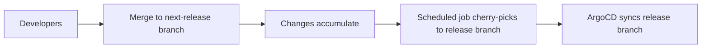

# How to Implement Schedule-Based Deployments

Author: [nawazdhandala](https://github.com/nawazdhandala)

Tags: ArgoCD, GitOps, Kubernetes, Scheduling, Deployment Strategy

Description: Learn how to implement schedule-based deployments with ArgoCD using sync windows, CronJobs, and automated promotion pipelines that deploy at predetermined times.

---

Not every deployment should happen the moment code merges. Some organizations need deployments during maintenance windows, business-hours-only releases, or scheduled batch deployments at specific times. ArgoCD supports schedule-based deployments through sync windows, external CronJob triggers, and pipeline orchestration. This guide covers the patterns for time-controlled GitOps deployments.

## Why Schedule Deployments

There are legitimate reasons to schedule deployments:

- **Maintenance windows**: Deploy during low-traffic periods to minimize impact
- **Change management compliance**: Regulations require deployments during approved windows
- **Coordinated releases**: Multiple services need to deploy together at a specific time
- **Market-driven timing**: Feature launches tied to marketing campaigns or events
- **Regional considerations**: Deploy during off-peak hours for each region

## Pattern 1: ArgoCD Sync Windows

Sync windows are the built-in ArgoCD mechanism for controlling when syncs can happen:

```yaml
apiVersion: argoproj.io/v1alpha1
kind: AppProject
metadata:
  name: production
  namespace: argocd
spec:
  description: Production environment with restricted deploy windows
  sourceRepos:
  - '*'
  destinations:
  - namespace: '*'
    server: https://kubernetes.default.svc

  syncWindows:
  # Allow automated syncs during Tuesday and Thursday maintenance windows
  - kind: allow
    schedule: "0 2 * * 2,4"  # 2 AM on Tue and Thu
    duration: 2h
    applications:
    - "*"
    clusters:
    - "*"

  # Deny all automated syncs outside maintenance windows
  - kind: deny
    schedule: "0 0 * * *"  # Every day at midnight
    duration: 24h
    applications:
    - "*"
    clusters:
    - "*"

  # Always allow manual syncs (for emergencies)
  - kind: allow
    schedule: "0 0 * * *"
    duration: 24h
    manualSync: true
    applications:
    - "*"
```

With this configuration:
- Automated syncs only run between 2:00 AM and 4:00 AM on Tuesdays and Thursdays
- Merges at other times queue up and deploy during the next window
- Manual syncs (emergency deployments) are always allowed

### Per-Application Sync Windows

Apply sync windows to specific applications:

```yaml
syncWindows:
# Critical services: weekday business hours only
- kind: allow
  schedule: "0 9 * * 1-5"
  duration: 9h  # 9 AM to 6 PM
  applications:
  - "payment-service"
  - "auth-service"
  - "order-service"

# Non-critical services: anytime during business days
- kind: allow
  schedule: "0 0 * * 1-5"
  duration: 24h
  applications:
  - "docs-site"
  - "internal-tools"

# Batch processing: weekend overnight
- kind: allow
  schedule: "0 22 * * 5"  # Friday 10 PM
  duration: 48h  # Through Sunday 10 PM
  applications:
  - "batch-*"
  - "etl-*"
```

## Pattern 2: CronJob-Based Deployment Triggers

For more control over deployment timing, use Kubernetes CronJobs to trigger ArgoCD syncs:

```yaml
apiVersion: batch/v1
kind: CronJob
metadata:
  name: scheduled-production-deploy
  namespace: argocd
spec:
  # Deploy every Tuesday at 3 AM UTC
  schedule: "0 3 * * 2"
  concurrencyPolicy: Forbid
  jobTemplate:
    spec:
      template:
        spec:
          serviceAccountName: argocd-deploy-trigger
          containers:
          - name: sync-trigger
            image: argoproj/argocd:v2.13.0
            command:
            - /bin/sh
            - -c
            - |
              # Login to ArgoCD
              argocd login argocd-server.argocd.svc.cluster.local:443 \
                --grpc-web \
                --insecure \
                --auth-token "$ARGOCD_TOKEN"

              # Sync production applications
              for app in myapp-production api-production web-production; do
                echo "Syncing ${app}..."
                argocd app sync ${app} \
                  --grpc-web \
                  --prune \
                  --timeout 300

                # Wait for health
                argocd app wait ${app} \
                  --grpc-web \
                  --health \
                  --timeout 600

                echo "${app} is healthy"
              done

              echo "All applications synced successfully"
            env:
            - name: ARGOCD_TOKEN
              valueFrom:
                secretKeyRef:
                  name: argocd-deploy-token
                  key: token
          restartPolicy: OnFailure
```

Create the service account and token:

```bash
# Create ArgoCD account for scheduled deployments
kubectl patch configmap argocd-cm -n argocd \
  --type merge \
  -p '{"data": {"accounts.scheduler": "apiKey"}}'

# Grant sync permissions
kubectl patch configmap argocd-rbac-cm -n argocd \
  --type merge \
  -p '{"data": {"policy.csv": "p, role:scheduler, applications, sync, */*, allow\np, role:scheduler, applications, get, */*, allow\ng, scheduler, role:scheduler"}}'

# Generate token
argocd account generate-token --account scheduler
```

## Pattern 3: Pre-Stage and Deploy

Merge changes anytime, but deploy them at a scheduled time. This uses a two-branch strategy:



```yaml
# CronJob that promotes accumulated changes
apiVersion: batch/v1
kind: CronJob
metadata:
  name: release-promotion
  namespace: ci
spec:
  schedule: "0 3 * * 2"  # Tuesday 3 AM
  jobTemplate:
    spec:
      template:
        spec:
          containers:
          - name: promote
            image: alpine/git:latest
            command:
            - /bin/sh
            - -c
            - |
              # Clone the config repo
              git clone https://${GIT_TOKEN}@github.com/org/config-repo.git /repo
              cd /repo

              # Merge next-release into release branch
              git checkout release
              git merge origin/next-release --no-ff \
                -m "Scheduled release: $(date +%Y-%m-%d)"
              git push origin release

              echo "Release promoted at $(date)"
            env:
            - name: GIT_TOKEN
              valueFrom:
                secretKeyRef:
                  name: git-credentials
                  key: token
          restartPolicy: OnFailure
```

The ArgoCD application watches the `release` branch:

```yaml
apiVersion: argoproj.io/v1alpha1
kind: Application
metadata:
  name: myapp-production
spec:
  source:
    repoURL: https://github.com/org/config-repo.git
    targetRevision: release  # Only deploys when release branch updates
    path: environments/production
  syncPolicy:
    automated:
      prune: true
      selfHeal: true
```

## Pattern 4: Time-Zone Aware Regional Deployments

Deploy to different regions during their respective low-traffic hours:

```yaml
# Region-specific CronJobs
apiVersion: batch/v1
kind: CronJob
metadata:
  name: deploy-us-east
spec:
  schedule: "0 4 * * 2"  # 4 AM UTC (11 PM EST Monday)
  jobTemplate:
    spec:
      template:
        spec:
          containers:
          - name: deploy
            image: argoproj/argocd:v2.13.0
            command: ["/bin/sh", "-c"]
            args:
            - |
              argocd login argocd-server:443 --grpc-web --insecure --auth-token "$TOKEN"
              argocd app sync myapp-us-east --grpc-web --prune
              argocd app wait myapp-us-east --grpc-web --health --timeout 600
            env:
            - name: TOKEN
              valueFrom:
                secretKeyRef:
                  name: argocd-deploy-token
                  key: token
---
apiVersion: batch/v1
kind: CronJob
metadata:
  name: deploy-eu-west
spec:
  schedule: "0 2 * * 2"  # 2 AM UTC (2 AM GMT)
  jobTemplate:
    spec:
      template:
        spec:
          containers:
          - name: deploy
            image: argoproj/argocd:v2.13.0
            command: ["/bin/sh", "-c"]
            args:
            - |
              argocd login argocd-server:443 --grpc-web --insecure --auth-token "$TOKEN"
              argocd app sync myapp-eu-west --grpc-web --prune
              argocd app wait myapp-eu-west --grpc-web --health --timeout 600
            env:
            - name: TOKEN
              valueFrom:
                secretKeyRef:
                  name: argocd-deploy-token
                  key: token
---
apiVersion: batch/v1
kind: CronJob
metadata:
  name: deploy-ap-southeast
spec:
  schedule: "0 17 * * 1"  # 5 PM UTC (1 AM SGT Tuesday)
  jobTemplate:
    spec:
      template:
        spec:
          containers:
          - name: deploy
            image: argoproj/argocd:v2.13.0
            command: ["/bin/sh", "-c"]
            args:
            - |
              argocd login argocd-server:443 --grpc-web --insecure --auth-token "$TOKEN"
              argocd app sync myapp-ap-southeast --grpc-web --prune
              argocd app wait myapp-ap-southeast --grpc-web --health --timeout 600
            env:
            - name: TOKEN
              valueFrom:
                secretKeyRef:
                  name: argocd-deploy-token
                  key: token
```

## Monitoring Scheduled Deployments

Track whether scheduled deployments are running on time and succeeding:

```yaml
apiVersion: monitoring.coreos.com/v1
kind: PrometheusRule
metadata:
  name: scheduled-deploy-monitoring
spec:
  groups:
  - name: scheduled-deployments
    rules:
    - alert: ScheduledDeploymentMissed
      expr: |
        time() - kube_cronjob_status_last_schedule_time{cronjob=~".*deploy.*"} > 604800
      for: 1h
      labels:
        severity: warning
      annotations:
        summary: "Scheduled deployment {{ $labels.cronjob }} has not run in over a week"

    - alert: ScheduledDeploymentFailed
      expr: |
        kube_job_status_failed{job_name=~".*deploy.*"} > 0
      for: 5m
      labels:
        severity: critical
      annotations:
        summary: "Scheduled deployment job {{ $labels.job_name }} failed"
```

Integrate with OneUptime for alerting when scheduled deployments fail or miss their windows.

## Conclusion

Schedule-based deployments with ArgoCD balance the speed of GitOps automation with the control that regulated environments and complex operational requirements demand. Sync windows provide the simplest approach for controlling when ArgoCD can auto-sync. CronJob triggers give you precise control over deployment timing and ordering. The pre-stage pattern lets teams merge freely while deploying on a schedule. And regional CronJobs handle the complexity of deploying across time zones. Choose the pattern that matches your organization's change management requirements, and remember that manual sync should always be available as an emergency override regardless of the schedule.
