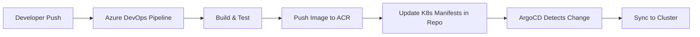

# How to Use SCM Provider Generator for Azure DevOps in ArgoCD ApplicationSets

Author: [nawazdhandala](https://github.com/nawazdhandala)

Tags: ArgoCD, GitOps, Kubernetes, ApplicationSet, Azure DevOps

Description: Learn how to configure the ArgoCD ApplicationSet SCM provider generator for Azure DevOps to automatically discover repositories and create applications from your Azure DevOps organization.

---

The SCM provider generator for Azure DevOps lets ArgoCD automatically discover Git repositories within your Azure DevOps projects and create ArgoCD Applications for each one. If your organization uses Azure DevOps for source control, this generator eliminates the manual work of registering each repository with ArgoCD. New repositories that match your filters get deployed automatically.

## Prerequisites

Before configuring the Azure DevOps SCM provider generator, you need:

- An Azure DevOps organization and project
- A personal access token (PAT) with Code (Read) scope
- ArgoCD v2.6 or later (Azure DevOps SCM provider support was added in v2.6)

### Creating a Personal Access Token

1. Go to Azure DevOps > User Settings > Personal access tokens
2. Click "New Token"
3. Set the scope to **Code (Read)** at minimum
4. Set an appropriate expiration (consider token rotation)
5. Copy the token

Store the token in a Kubernetes secret:

```bash
kubectl create secret generic azure-devops-token \
  -n argocd \
  --from-literal=token=your-personal-access-token
```

## Basic Azure DevOps Configuration

```yaml
apiVersion: argoproj.io/v1alpha1
kind: ApplicationSet
metadata:
  name: azure-devops-apps
  namespace: argocd
spec:
  generators:
    - scmProvider:
        azureDevOps:
          # Your Azure DevOps organization name
          organization: my-org
          # The team project name
          teamProject: platform-services
          # Authentication
          accessTokenRef:
            secretName: azure-devops-token
            key: token
          # Optional: use a specific API URL (for Azure DevOps Server)
          # api: https://dev.azure.com
          allBranches: false
  template:
    metadata:
      name: '{{repository}}'
    spec:
      project: default
      source:
        repoURL: '{{url}}'
        targetRevision: '{{branch}}'
        path: 'deploy/k8s'
      destination:
        server: https://kubernetes.default.svc
        namespace: '{{repository}}'
```

## Available Parameters

The Azure DevOps SCM provider generator produces these parameters for each discovered repository:

| Parameter | Description | Example |
|-----------|-------------|---------|
| `repository` | Repository name | `api-gateway` |
| `organization` | Organization/project | `my-org/platform-services` |
| `url` | Clone URL (HTTPS) | `https://dev.azure.com/my-org/platform-services/_git/api-gateway` |
| `branch` | Default branch | `main` |
| `sha` | HEAD commit SHA | `abc1234...` |

## Filtering Repositories

### Filter by Repository Name

```yaml
  generators:
    - scmProvider:
        azureDevOps:
          organization: my-org
          teamProject: platform-services
          accessTokenRef:
            secretName: azure-devops-token
            key: token
        filters:
          # Only repos matching the pattern
          - repositoryMatch: "^svc-.*"
```

### Filter by Branch

```yaml
        filters:
          - branchMatch: "main"
```

### Filter by Labels

Azure DevOps repos do not have labels/topics like GitHub or GitLab, so label filtering is not available. Use repository name patterns instead.

### Combining Filters

```yaml
        filters:
          # Match repos starting with 'svc-' that have a 'main' branch
          - repositoryMatch: "^svc-.*"
            branchMatch: "main"
          # OR match repos starting with 'infra-'
          - repositoryMatch: "^infra-.*"
            branchMatch: "main"
```

## Multi-Project Discovery

Azure DevOps organizes repositories within team projects. To scan multiple projects, use multiple generators:

```yaml
apiVersion: argoproj.io/v1alpha1
kind: ApplicationSet
metadata:
  name: all-azure-devops-apps
  namespace: argocd
spec:
  generators:
    # Backend services project
    - scmProvider:
        azureDevOps:
          organization: my-org
          teamProject: backend-services
          accessTokenRef:
            secretName: azure-devops-token
            key: token
        filters:
          - repositoryMatch: ".*"
    # Frontend services project
    - scmProvider:
        azureDevOps:
          organization: my-org
          teamProject: frontend-services
          accessTokenRef:
            secretName: azure-devops-token
            key: token
        filters:
          - repositoryMatch: ".*"
  template:
    metadata:
      # Include project name to avoid collisions
      name: '{{organization}}-{{repository}}'
      labels:
        source: azure-devops
    spec:
      project: default
      source:
        repoURL: '{{url}}'
        targetRevision: '{{branch}}'
        path: 'deploy/'
      destination:
        server: https://kubernetes.default.svc
        namespace: '{{repository}}'
```

## Azure DevOps Server (On-Premises)

For Azure DevOps Server (previously TFS), set the custom API URL:

```yaml
  generators:
    - scmProvider:
        azureDevOps:
          organization: DefaultCollection
          teamProject: MyProject
          api: https://tfs.company.com/
          accessTokenRef:
            secretName: azure-devops-token
            key: token
```

Note that Azure DevOps Server uses "collections" where the organization name in the config maps to the collection name. The default collection is usually named `DefaultCollection`.

### Handling TLS for On-Premises Instances

If your Azure DevOps Server uses self-signed certificates:

```bash
# Add CA certificate to ArgoCD
kubectl create configmap argocd-tls-certs-cm \
  -n argocd \
  --from-file=tfs.company.com=/path/to/ca-cert.pem
```

## Setting Up Repository Credentials

The generated Applications need credentials to clone from Azure DevOps. Configure a credential template:

```yaml
apiVersion: v1
kind: Secret
metadata:
  name: azure-devops-repo-creds
  namespace: argocd
  labels:
    argocd.argoproj.io/secret-type: repo-creds
type: Opaque
stringData:
  type: git
  url: https://dev.azure.com/my-org/
  username: argocd
  password: your-personal-access-token
```

This credential template matches all repositories under your Azure DevOps organization, so every generated Application can clone its repository.

For Azure DevOps Server:

```yaml
apiVersion: v1
kind: Secret
metadata:
  name: azure-devops-server-repo-creds
  namespace: argocd
  labels:
    argocd.argoproj.io/secret-type: repo-creds
type: Opaque
stringData:
  type: git
  url: https://tfs.company.com/DefaultCollection/
  username: argocd-service
  password: your-access-token
```

## Complete Production Example

Here is a production-ready setup for Azure DevOps:

```yaml
apiVersion: argoproj.io/v1alpha1
kind: ApplicationSet
metadata:
  name: platform-microservices
  namespace: argocd
spec:
  generators:
    - scmProvider:
        azureDevOps:
          organization: contoso
          teamProject: microservices
          accessTokenRef:
            secretName: azure-devops-token
            key: token
          allBranches: false
        filters:
          - repositoryMatch: "^svc-.*"
            branchMatch: "main"
  template:
    metadata:
      name: '{{repository}}'
      labels:
        managed-by: applicationset
        team-project: microservices
      annotations:
        notifications.argoproj.io/subscribe.on-sync-failed.slack: platform-alerts
        notifications.argoproj.io/subscribe.on-deployed.slack: deployments
    spec:
      project: microservices
      source:
        repoURL: '{{url}}'
        targetRevision: '{{branch}}'
        path: 'deploy/k8s'
      destination:
        server: https://kubernetes.default.svc
        namespace: '{{repository}}'
      syncPolicy:
        automated:
          prune: true
          selfHeal: true
        syncOptions:
          - CreateNamespace=true
          - PruneLast=true
```

## Integrating with Azure DevOps Pipelines

A common pattern is using Azure DevOps Pipelines for CI (build and test) while ArgoCD handles CD (deployment). The flow looks like this:



The SCM provider generator ensures that new microservice repositories automatically get ArgoCD deployment without any manual configuration.

## Handling PAT Expiration

Azure DevOps personal access tokens expire. Set up a process to rotate them:

```bash
# Create a script to update the token
#!/bin/bash
NEW_TOKEN="$1"

kubectl create secret generic azure-devops-token \
  -n argocd \
  --from-literal=token="$NEW_TOKEN" \
  --dry-run=client -o yaml | kubectl apply -f -

# Also update repo credentials
kubectl create secret generic azure-devops-repo-creds \
  -n argocd \
  --from-literal=type=git \
  --from-literal=url=https://dev.azure.com/my-org/ \
  --from-literal=username=argocd \
  --from-literal=password="$NEW_TOKEN" \
  --dry-run=client -o yaml | kubectl apply -f -

echo "Token rotated successfully"
```

Consider using Azure Managed Identity or Service Principal authentication for longer-lived credentials in production environments.

## Debugging Azure DevOps SCM Provider Issues

```bash
# Check ApplicationSet controller logs
kubectl logs -n argocd -l app.kubernetes.io/component=applicationset-controller | \
  grep -i "azure\|devops\|scm\|error"

# Test Azure DevOps API connectivity
PAT=$(kubectl get secret azure-devops-token -n argocd -o jsonpath='{.data.token}' | base64 -d)
curl -u ":$PAT" \
  "https://dev.azure.com/my-org/platform-services/_apis/git/repositories?api-version=7.0"

# Verify the token works
curl -u ":$PAT" \
  "https://dev.azure.com/my-org/_apis/projects?api-version=7.0"
```

Common issues:
- **Token missing Code scope**: The PAT needs at least Code (Read) permission
- **Wrong organization or project name**: Double-check the exact names from the Azure DevOps URL
- **Token expired**: PATs have expiration dates. Check if the token is still valid
- **URL format**: Azure DevOps Cloud uses `dev.azure.com`, older accounts might use `visualstudio.com`
- **Azure DevOps Server version**: Older TFS versions may not support all API endpoints

The Azure DevOps SCM provider generator bridges the gap between Azure DevOps source control and Kubernetes deployment through ArgoCD. For other SCM providers, see the [GitLab SCM provider generator](https://oneuptime.com/blog/post/2026-02-26-argocd-scm-provider-generator-gitlab/view) and the [Bitbucket SCM provider generator](https://oneuptime.com/blog/post/2026-02-26-argocd-scm-provider-generator-bitbucket/view).
