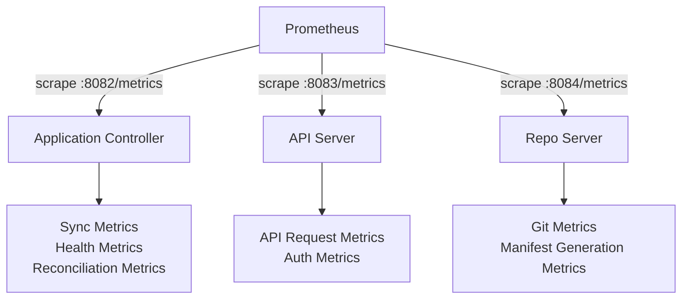

# How to Scrape ArgoCD Metrics with Prometheus

Author: [nawazdhandala](https://github.com/nawazdhandala)

Tags: ArgoCD, GitOps, Kubernetes, Prometheus, Monitoring

Description: Learn how to configure Prometheus to scrape ArgoCD metrics using static configs, service discovery, and ServiceMonitors for complete GitOps observability.

---

After ArgoCD exposes its Prometheus metrics endpoints, you need to configure Prometheus to actually collect those metrics. The scraping configuration depends on how your Prometheus is deployed - whether you use a standalone Prometheus instance, the Prometheus Operator, or a managed Prometheus service like Amazon Managed Prometheus or Google Cloud Monitoring.

This guide covers every common Prometheus deployment pattern and how to configure each one to scrape ArgoCD metrics.

## Understanding What Gets Scraped

ArgoCD exposes metrics from three components. Each provides different categories of metrics:

**Application Controller (port 8082):**
- Application sync status and health
- Reconciliation duration and queue depth
- Cluster connection status
- Resource counts per application

**API Server (port 8083):**
- HTTP request counts and latencies
- gRPC request metrics
- Authentication failures

**Repo Server (port 8084):**
- Git request duration and status
- Manifest generation time
- Cache hit rates



## Method 1: Static Scrape Configuration

For standalone Prometheus installations using a configuration file, add static scrape jobs:

```yaml
# prometheus.yml
scrape_configs:
  # ArgoCD Application Controller
  - job_name: 'argocd-application-controller'
    metrics_path: /metrics
    static_configs:
      - targets:
        - argocd-application-controller-metrics.argocd.svc.cluster.local:8082
    relabel_configs:
      - source_labels: [__address__]
        target_label: instance
        replacement: argocd-application-controller

  # ArgoCD API Server
  - job_name: 'argocd-server'
    metrics_path: /metrics
    static_configs:
      - targets:
        - argocd-server-metrics.argocd.svc.cluster.local:8083
    relabel_configs:
      - source_labels: [__address__]
        target_label: instance
        replacement: argocd-server

  # ArgoCD Repo Server
  - job_name: 'argocd-repo-server'
    metrics_path: /metrics
    static_configs:
      - targets:
        - argocd-repo-server-metrics.argocd.svc.cluster.local:8084
    relabel_configs:
      - source_labels: [__address__]
        target_label: instance
        replacement: argocd-repo-server
```

If your Prometheus runs in a ConfigMap-based deployment:

```bash
# Apply the updated Prometheus config
kubectl create configmap prometheus-config \
  --from-file=prometheus.yml \
  -n monitoring \
  --dry-run=client -o yaml | kubectl apply -f -

# Reload Prometheus (if hot-reload is enabled)
curl -X POST http://prometheus:9090/-/reload
```

## Method 2: Kubernetes Service Discovery

Instead of static targets, use Prometheus's Kubernetes service discovery to automatically find ArgoCD services:

```yaml
# prometheus.yml
scrape_configs:
  - job_name: 'argocd'
    kubernetes_sd_configs:
      - role: service
        namespaces:
          names:
            - argocd
    relabel_configs:
      # Only scrape services with the prometheus.io/scrape annotation
      - source_labels: [__meta_kubernetes_service_annotation_prometheus_io_scrape]
        action: keep
        regex: true
      # Use the annotated port
      - source_labels: [__meta_kubernetes_service_annotation_prometheus_io_port]
        action: replace
        target_label: __address__
        regex: (.+)
        replacement: $1
      # Use the annotated path
      - source_labels: [__meta_kubernetes_service_annotation_prometheus_io_path]
        action: replace
        target_label: __metrics_path__
        regex: (.+)
      # Add component label
      - source_labels: [__meta_kubernetes_service_label_app_kubernetes_io_component]
        action: replace
        target_label: component
      # Add service name label
      - source_labels: [__meta_kubernetes_service_name]
        action: replace
        target_label: service
```

For this to work, your ArgoCD services need the appropriate annotations. If you followed our guide on [exposing ArgoCD Prometheus metrics](https://oneuptime.com/blog/post/2026-02-26-argocd-expose-prometheus-metrics/view), the services already have these annotations.

## Method 3: ServiceMonitor with Prometheus Operator

The Prometheus Operator provides a Kubernetes-native way to configure scrape targets using ServiceMonitor CRDs:

```yaml
apiVersion: monitoring.coreos.com/v1
kind: ServiceMonitor
metadata:
  name: argocd-metrics
  namespace: monitoring
  labels:
    release: kube-prometheus-stack
spec:
  namespaceSelector:
    matchNames:
      - argocd
  selector:
    matchExpressions:
      - key: app.kubernetes.io/part-of
        operator: In
        values:
          - argocd
  endpoints:
  - port: metrics
    interval: 30s
    scrapeTimeout: 10s
    path: /metrics
    honorLabels: true
    metricRelabelings:
    # Drop high-cardinality metrics if needed
    - sourceLabels: [__name__]
      regex: 'go_.*'
      action: drop
```

Verify the ServiceMonitor is being picked up by Prometheus:

```bash
# Check Prometheus targets
kubectl port-forward -n monitoring svc/prometheus-operated 9090:9090 &
curl -s localhost:9090/api/v1/targets | jq '.data.activeTargets[] | select(.labels.job | contains("argocd"))'
```

## Method 4: PodMonitor for Direct Pod Scraping

If your ArgoCD services do not have dedicated metrics services, use PodMonitor to scrape pods directly:

```yaml
apiVersion: monitoring.coreos.com/v1
kind: PodMonitor
metadata:
  name: argocd-controller
  namespace: argocd
  labels:
    release: kube-prometheus-stack
spec:
  selector:
    matchLabels:
      app.kubernetes.io/name: argocd-application-controller
  podMetricsEndpoints:
  - port: metrics
    interval: 30s
    path: /metrics
---
apiVersion: monitoring.coreos.com/v1
kind: PodMonitor
metadata:
  name: argocd-server
  namespace: argocd
  labels:
    release: kube-prometheus-stack
spec:
  selector:
    matchLabels:
      app.kubernetes.io/name: argocd-server
  podMetricsEndpoints:
  - port: metrics
    interval: 30s
    path: /metrics
---
apiVersion: monitoring.coreos.com/v1
kind: PodMonitor
metadata:
  name: argocd-repo-server
  namespace: argocd
  labels:
    release: kube-prometheus-stack
spec:
  selector:
    matchLabels:
      app.kubernetes.io/name: argocd-repo-server
  podMetricsEndpoints:
  - port: metrics
    interval: 30s
    path: /metrics
```

## Configuring Scrape Interval

The scrape interval determines how frequently Prometheus collects metrics. For ArgoCD, a 30-second interval is a good default:

```yaml
endpoints:
- port: metrics
  interval: 30s
  scrapeTimeout: 10s
```

**Shorter intervals (10-15s):**
- More granular data for debugging
- Higher storage and CPU cost
- Better for real-time dashboards

**Longer intervals (60-120s):**
- Lower resource usage
- May miss short-lived events
- Better for high-scale installations with many applications

## Metric Relabeling

Use relabeling to reduce cardinality and add useful labels:

```yaml
endpoints:
- port: metrics
  interval: 30s
  metricRelabelings:
  # Add a cluster label to distinguish multi-cluster setups
  - targetLabel: cluster
    replacement: production
    action: replace

  # Drop Go runtime metrics to save storage
  - sourceLabels: [__name__]
    regex: 'go_(gc|memstats|threads|goroutines).*'
    action: drop

  # Drop high-cardinality process metrics
  - sourceLabels: [__name__]
    regex: 'process_(cpu|open_fds|max_fds|resident_memory|virtual_memory).*'
    action: drop
```

## Verifying Metrics Collection

After configuring scraping, verify that metrics are being collected:

```bash
# Check Prometheus targets for ArgoCD
curl -s "http://prometheus:9090/api/v1/targets" | \
  jq '.data.activeTargets[] | select(.labels.job | contains("argocd")) | {job: .labels.job, health: .health, lastScrape: .lastScrape}'

# Query for a basic ArgoCD metric
curl -s "http://prometheus:9090/api/v1/query?query=argocd_app_info" | jq '.data.result | length'

# Check for scrape errors
curl -s "http://prometheus:9090/api/v1/targets" | \
  jq '.data.activeTargets[] | select(.labels.job | contains("argocd")) | select(.health != "up")'
```

## Troubleshooting Scrape Failures

**Target shows as "down" in Prometheus:**

```bash
# Verify the metrics endpoint is accessible
kubectl exec -n monitoring deployment/prometheus -- \
  wget -qO- http://argocd-application-controller-metrics.argocd.svc:8082/metrics | head -5
```

**ServiceMonitor not appearing in Prometheus targets:**

```bash
# Check if the ServiceMonitor labels match Prometheus's selector
kubectl get prometheus -n monitoring -o jsonpath='{.items[0].spec.serviceMonitorSelector.matchLabels}'

# Verify the ServiceMonitor has the correct labels
kubectl get servicemonitor -n argocd -o yaml | grep -A2 labels
```

**Metrics exist but some are missing:**

Some metrics only appear after specific events occur. For example, `argocd_app_sync_total` only appears after at least one sync operation. Trigger a manual sync and check again:

```bash
argocd app sync my-app
```

## Recording Rules for Common Queries

Once scraping is working, add recording rules to pre-compute expensive queries:

```yaml
apiVersion: monitoring.coreos.com/v1
kind: PrometheusRule
metadata:
  name: argocd-recording-rules
  namespace: monitoring
  labels:
    release: kube-prometheus-stack
spec:
  groups:
  - name: argocd.recording
    interval: 30s
    rules:
    - record: argocd:app_sync_failure_rate:5m
      expr: |
        rate(argocd_app_sync_total{phase="Failed"}[5m])
        / on() rate(argocd_app_sync_total[5m])

    - record: argocd:git_request_latency_p99:5m
      expr: |
        histogram_quantile(0.99,
          rate(argocd_git_request_duration_seconds_bucket[5m])
        )

    - record: argocd:reconciliation_latency_p95:5m
      expr: |
        histogram_quantile(0.95,
          rate(argocd_app_reconcile_duration_seconds_bucket[5m])
        )
```

These recording rules make dashboard queries faster and ensure consistent metric calculations across different dashboards and alerts.

Scraping ArgoCD metrics with Prometheus is the essential first step for GitOps observability. Once you have reliable metrics collection in place, you can build dashboards, create alerts, and start tracking deployment performance over time.
